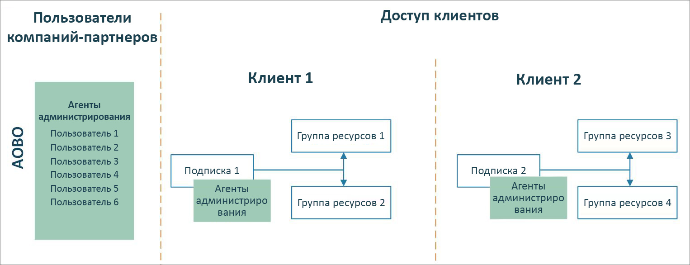
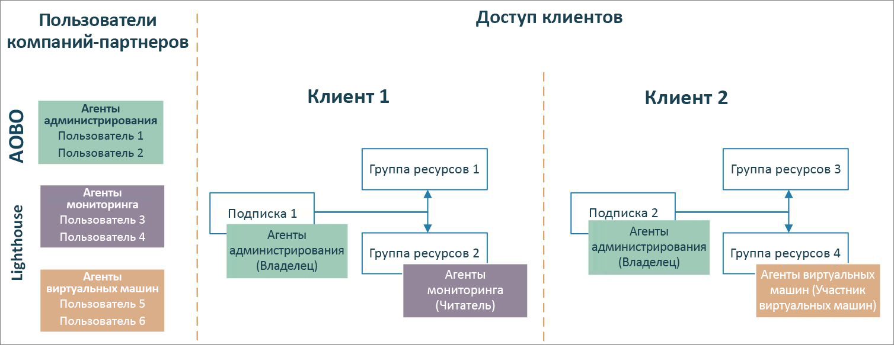

# Azure Lighthouse и программа поставщиков облачных решений

Если вы имеете статус [CSP (поставщика облачных решений)](/partner-center/csp-overview), вам доступны подписки Azure, созданные для клиентов в программе CSP, с помощью функции [Администрирование от имени (AOBO)](https://channel9.msdn.com/Series/cspdev/Module-11-Admin-On-Behalf-Of-AOBO). Это позволяет непосредственно обслуживать и настраивать подписки клиентов, а также управлять ими.

С помощью [Azure лигхсаусе](../overview.md)можно использовать делегированное управление ресурсами Azure вместе с Аобо. Это помогает улучшить безопасность и не допускать излишние попытки доступа с помощью более детализированных разрешений для пользователей. Кроме того, повышается эффективность и масштабируемость, так как пользователи могут работать с несколькими клиентскими подписками, используя одно имя входа в клиенте.

> [!TIP]
> Чтобы защитить ресурсы клиентов, обязательно ознакомьтесь с [рекомендациями по обеспечению безопасности](recommended-security-practices.md) и [требованиями к безопасности партнеров](/partner-center/partner-security-requirements).

## Администрирование от имени (AOBO)

С AOBO любой пользователь с ролью [агента администратора](/partner-center/permissions-overview#manage-commercial-transactions-in-partner-center-azure-ad-and-csp-roles) в своем арендаторе будет иметь доступ AOBO к подпискам Azure, которые создаются с помощью программы CSP. Пользователи, которым нужен доступ к подпискам клиентов, должны быть членами этой группы. AOBO не позволяет гибко создавать отдельные группы, которые работают с разными клиентами, или разрешать разные роли для групп или пользователей.

## Делегированное управление ресурсами Azure

С помощью Azure Лигхсаусе можно назначить разные группы различным клиентам или ролям, как показано на следующей схеме. Так как у пользователей будет соответствующий уровень доступа благодаря делегированному управлению ресурсами Azure, можно будет сократить число пользователей с ролью агента-администратора (т. е. имеющих полный доступ AOBO). Это поможет повысить безопасность, предоставляя только необходимый уровень доступа к ресурсам клиента. Кроме того, это повышает гибкость управления несколькими клиентами в соответствующем масштабе.

При адаптации подписки, созданной с помощью программы CSP, следует выполнить действия, описанные в статье подключение [подписки к Azure лигхсаусе](../how-to/onboard-customer.md). Любой пользователь, имеющий роль агента администратора в своем арендаторе, может выполнить это подключение.

> [!TIP]
> [Предложения управляемых служб](managed-services-offers.md) с частными планами не поддерживаются с подписками, установленными через торгового посредника программы поставщика облачных решений (CSP). Вы можете подключить эти подписки к Azure Лигхсаусе с [помощью шаблонов Azure Resource Manager](../how-to/onboard-customer.md).

> [!NOTE]
> Страница [ **Мои клиенты** в портал Azure](../how-to/view-manage-customers.md) теперь содержит раздел **поставщик облачных решений (Предварительная версия)** , который отображает сведения о выставлении счетов и ресурсы для клиентов CSP, которые [подписали клиентское соглашение Майкрософт (MCA)](/partner-center/confirm-customer-agreement) и находятся [в плане Azure](/partner-center/azure-plan-get-started). Чтобы узнать больше, ознакомьтесь с разделом [Начало работы с учетной записью выставления счетов Соглашения с партнером Майкрософт](../../cost-management-billing/understand/mpa-overview.md).
>
> Клиенты CSP могут появиться в этом разделе независимо от того, были ли они подключены к Azure Лигхсаусе. Если они есть, они также будут отображаться в разделе " **Клиенты** ", как описано в статье [Просмотр клиентов и делегированные ресурсы и управление ими](../how-to/view-manage-customers.md). Аналогичным образом, клиент CSP не должен отображаться в разделе " **поставщик облачных решений" (Предварительная версия)** на **странице "Мои клиенты** ", чтобы вы могли подключить их к Azure лигхсаусе.

## Дальнейшие действия

- Узнайте больше об [интерфейсах управления для различных клиентов](cross-tenant-management-experience.md).
- Узнайте, как подключить [подписку к Azure лигхсаусе](../how-to/onboard-customer.md).
- Узнайте больше о [программе для поставщиков облачных решений](/partner-center/csp-overview).
