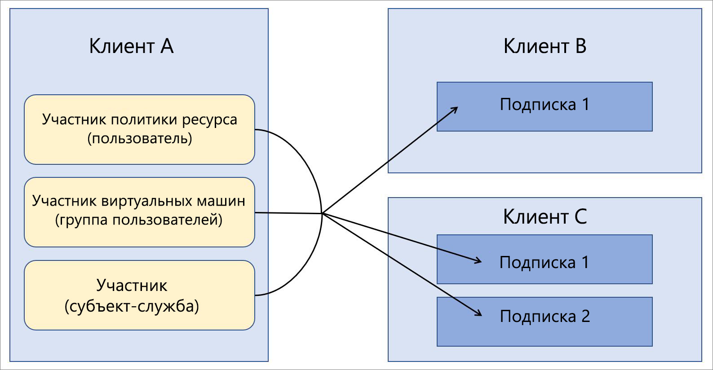

# Использование Azure Lighthouse в корпоративных сценариях

Наиболее распространенный сценарий для [Azure Lighthouse](../overview.md) — это поставщик услуг, который управляет ресурсами в клиентах Azure Active Directory (Azure AD) для своих клиентов. Но возможности Azure Lighthouse можно использовать еще и для упрощения управления в сценариях работы предприятия, которое использует несколько клиентов Azure AD.

## Один или несколько клиентов

Для большинства организаций проще управлять одним клиентом Azure AD. Собрав все ресурсы в одном клиенте, можно организовать централизацию задач управления для определенных пользователей, групп пользователей или субъектов-служб в пределах клиента. Мы рекомендуем использовать в организации один клиент всегда, когда это возможно.

Но существуют ситуации, когда организации потребуется поддерживать несколько клиентов Azure AD. Иногда это временная ситуация, например если при приобретении компании требуется некоторое время на реализацию долгосрочной стратегии консолидации клиентов. А иногда организации нужно постоянно поддерживать несколько клиентов, например для полностью независимых дочерних компаний, в силу географических ограничений или юридических требований и т. п. В случаях, когда требуется архитектура с несколькими клиентами, можно использовать делегированное управление ресурсами Azure для централизации и упрощения операций управления. Подписки из нескольких клиентов можно подключить для [делегированного управления ресурсами Azure](azure-delegated-resource-management.md), что позволит назначенным пользователям в управляющем клиенте выполнять [функции управления между клиентами](cross-tenant-management-experience.md) в централизованном и масштабируемом режиме.

## Архитектура управления клиентами

При централизации операций управления между клиентами необходимо определить, какой клиент будет включать пользователей, выполняющих операции управления для других клиентов. Иными словами, нужно выбрать один клиент для управления другими клиентами.

For example, say your organization has a single tenant that we’ll call *Tenant A*. Your organization then acquires two additional tenants, *Tenant B* and *Tenant C*, and you have business reasons that require you to maintain them as separate tenants.

Но для всех клиентов эта организация намерена использовать одинаковые определения политик, методы резервного копирования и процессы безопасности. Поскольку у нее уже есть пользователи (а также группы пользователей и субъекты-службы), которые отвечают за выполнение задач управления в Tenant A, можно подключить все подписки из Tenant B и Tenant C так, чтобы аналогичные операции для них выполняли те же пользователи в Tenant A.

## Вопросы безопасности и доступа

В большинстве корпоративных сценариев есть смысл делегировать полное управление подпиской группе управления ресурсами Azure, но у вас есть возможность делегировать только определенные группы ресурсов в подписке.

В любом случае [при выборе пользователей, которые будут иметь доступ к ресурсам, соблюдайте принцип минимальных привилегий](recommended-security-practices.md#assign-permissions-to-groups-using-the-principle-of-least-privilege). Это позволит гарантировать, что пользователи получат только те разрешения, которые необходимы для выполнения их задач, и снизит вероятность случайных ошибок.

Azure Lighthouse и делегированное управление ресурсами Azure только предоставляют логические связи между управляющим и управляемым клиентами, но не перемещают данные или ресурсы физически. Кроме того, доступ всегда происходит в одном направлении, от управляющего к управляемым клиентам.  Пользователи и группы в управляющем клиенте будут по-прежнему использовать многофакторную проверку подлинности при выполнении операций управления для ресурсов управляемого клиента.

Предприятия с внутренним или внешним управлением и ограничительными условиями для соответствия требованиям могут использовать [журналы действий Azure](https://docs.microsoft.com/azure/azure-monitor/platform/activity-logs-overview) для соблюдения требований к прозрачности. Когда для корпоративных клиентов будут установлены отношения управляющего и управляемого, пользователи в каждом из них смогут отслеживать действия, выполняемые пользователями из другого клиента, через журнал операций.

## Рекомендации по процессу подключения

Подписки (или группы ресурсов в подписках) можно подключить к решениям делегированного управления ресурсами Azure, развертывая шаблоны Azure Resource Manager или используя частные или общедоступные предложения управляемых служб, опубликованные в Azure Marketplace.

Так как корпоративные пользователи обычно получают прямой доступ к корпоративным клиентам, и предложения по управлению не нужно продавать и рекламировать, обычно намного проще и быстрее напрямую развертывать шаблоны Azure Resource Manager. В [руководстве по подключению](../how-to/onboard-customer.md) мы используем термины "поставщик услуг" и "клиенты", но внутри предприятий можно использовать те же процессы.

Подключение клиентов в организации может осуществляться путем [публикации управляемых служб в Azure Marketplace](../how-to/publish-managed-services-offers.md), если вам так удобнее. Чтобы обеспечить доступность предложения только для допустимых клиентов, обозначьте все такие планы как частные. Частный план позволяет указать идентификаторы подписок для каждого подключаемого клиента, и никто другой не сможет получить ваше предложение.

## Заметки по терминологии

Для управления между клиентами в рамках предприятия все указания поставщиков услуг в документации по Azure Lighthouse можно применять к корпоративной службе управления, то есть к тому клиенту, в который входят пользователи с правами управления ресурсами в других клиентах через механизм делегированного управления ресурсами Azure. Аналогичным образом, все указания клиентов можно применять к тем клиентам, которые делегируют ресурсы для управления пользователями из управляющего клиента.

Например, в описанном выше примере Tenant A будет считаться клиентом поставщика услуг (управляющий клиент), а Tenant B и Tenant C — пользовательскими клиентами.

В этом примере пользователи из Tenant A, имеющие соответствующие разрешения, могут [просматривать делегированные ресурсы и управлять ими](../how-to/view-manage-customers.md) на странице **Мои клиенты** портала Azure. Аналогичным образом, пользователи из Tenant B и Tenant C, имеющие соответствующие разрешения, могут [просматривать делегированные в Tenant A ресурсы и управлять ими](../how-to/view-manage-service-providers.md) на странице **Поставщики услуг** портала Azure.

## Дальнейшие действия

- Узнайте больше об [интерфейсах управления для различных клиентов](cross-tenant-management-experience.md).
- Ознакомьтесь со сведениями о [делегированном управлении ресурсами Azure](azure-delegated-resource-management.md).