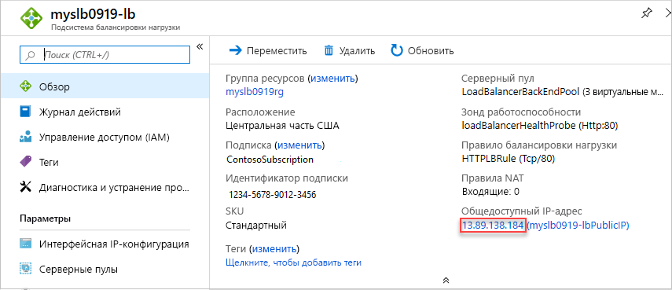

# <a name="quickstart-create-a-load-balancer-to-load-balance-vms-by-using-an-arm-template"></a>Краткое руководство. Создание Load Balancer для распределения нагрузки между виртуальными машинами с помощью шаблона ARM

Балансировка нагрузки обеспечивает более высокий уровень доступности и масштабирования за счет распределения входящих запросов между несколькими виртуальными машинами. В этом кратком руководстве показано, как развернуть шаблон Azure Resource Manager (шаблон ARM), который создает подсистему балансировки нагрузки (цен. категория "Стандартный") для распределения нагрузки между виртуальными машинами. При использовании шаблона ARM выполняется меньшее количество действий по сравнению с другими методами развертывания.

[!INCLUDE [About Azure Resource Manager](../../includes/resource-manager-quickstart-introduction.md)]

Если среда соответствует предварительным требованиям и вы знакомы с использованием шаблонов ARM, нажмите кнопку **Развертывание в Azure**. Шаблон откроется на портале Azure.

[](https://portal.azure.com/#create/Microsoft.Template/uri/https%3A%2F%2Fraw.githubusercontent.com%2FAzure%2Fazure-quickstart-templates%2Fmaster%2F101-load-balancer-standard-create%2Fazuredeploy.json)

## <a name="prerequisites"></a>Предварительные требования

Если у вас еще нет подписки Azure, [создайте бесплатную учетную запись](https://azure.microsoft.com/free/?WT.mc_id=A261C142F), прежде чем начинать работу.

## <a name="review-the-template"></a>Изучение шаблона

Шаблон, используемый в этом кратком руководстве, взят из [шаблонов быстрого запуска Azure](https://azure.microsoft.com/resources/templates/101-load-balancer-standard-create/).

Load Balancer и общедоступные IP-адреса SKU должны совпадать. Вместе с Load Balancer (цен. категория "Стандартный") необходимо также создать стандартный общедоступный IP-адрес, настроенный в качестве интерфейсного для Load Balancer (цен. категория "Стандартный"). Для создания Load Balancer (цен. категория "Базовый"), используйте [этот шаблон](https://azure.microsoft.com/resources/templates/201-2-vms-loadbalancer-natrules/). Для производственных рабочих нагрузок компания Майкрософт рекомендует использовать номера SKU цен. категории "Стандартный".

:::code language="json" source="~/quickstart-templates/101-load-balancer-standard-create/azuredeploy.json":::

В шаблоне определено несколько ресурсов Azure:

- [**Microsoft.Network/loadBalancers**](/azure/templates/microsoft.network/loadbalancers);
- [**Microsoft.Network/publicIPAddresses**](/azure/templates/microsoft.network/publicipaddresses) (для подсистемы балансировки нагрузки и каждой из трех виртуальных машин);
- [**Microsoft.Network/networkSecurityGroups;** ](/azure/templates/microsoft.network/networksecuritygroups)
- [**Microsoft.Network/virtualNetworks**](/azure/templates/microsoft.network/virtualnetworks);
- [**Microsoft.Compute/virutalMachines**](/azure/templates/microsoft.compute/virtualmachines) (три из них);
- [**Microsoft.Network/networkInterfaces**](/azure/templates/microsoft.network/networkinterfaces) (три из них);
- [**Microsoft.Compute/virtualMachine/extensions**](/azure/templates/microsoft.compute/virtualmachines/extensions) (три из них; используется для настройки IIS и веб-страниц).

Чтобы найти дополнительные связанные шаблоны Azure Load Balancer, перейдите на страницу [Шаблоны быстрого запуска Azure](https://azure.microsoft.com/resources/templates/?resourceType=Microsoft.Network&pageNumber=1&sort=Popular).

## <a name="deploy-the-template"></a>Развертывание шаблона

1. Выберите **Попробовать** в следующем блоке кода, чтобы открыть Azure Cloud Shell, и следуйте отображающимся инструкциям, чтобы войти в Azure.

   ```azurepowershell-interactive
   $projectName = Read-Host -Prompt "Enter a project name with 12 or less letters or numbers that is used to generate Azure resource names"
   $location = Read-Host -Prompt "Enter the location (i.e. centralus)"
   $adminUserName = Read-Host -Prompt "Enter the virtual machine administrator account name"
   $adminPassword = Read-Host -Prompt "Enter the virtual machine administrator password" -AsSecureString

   $resourceGroupName = "${projectName}rg"
   $templateUri = "https://raw.githubusercontent.com/Azure/azure-quickstart-templates/master/101-load-balancer-standard-create/azuredeploy.json"

   New-AzResourceGroup -Name $resourceGroupName -Location $location
   New-AzResourceGroupDeployment -ResourceGroupName $resourceGroupName -TemplateUri $templateUri -projectName $projectName -location $location -adminUsername $adminUsername -adminPassword $adminPassword

   Write-Host "Press [ENTER] to continue."
   ```

   Подождите, пока появится запрос из консоли.

1. Выберите **Копировать** из предыдущего блока кода, чтобы скопировать сценарий PowerShell.

1. Щелкните правой кнопкой в области консоли оболочки и выберите **Вставить**.

1. Введите значения.

   При развертывании шаблона создается три зоны доступности. Зоны доступности поддерживаются только в [определенных регионах](../availability-zones/az-overview.md). Используйте один из поддерживаемых регионов. Если у вас есть сомнения, введите **centralus**.

   Имя группы ресурсов — это имя проекта с добавлением **rg**. Имя группы ресурсов потребуется в следующем разделе.

Развертывание шаблона занимает около 10 минут. По завершении выходные данные должны быть следующего вида:


Для развертывания шаблона используется Azure PowerShell. В дополнение к Azure PowerShell можно также использовать портал Azure, Azure CLI и REST API. Дополнительные сведения о других методах развертывания см. в статье о [развертывании с использованием шаблонов](../azure-resource-manager/templates/deploy-portal.md).

## <a name="review-deployed-resources"></a>Просмотр развернутых ресурсов

1. Войдите на [портал Azure](https://portal.azure.com).

1. В области слева выберите **Группы ресурсов**.

1. Выберите группу ресурсов, созданную при работе с предыдущим разделом. Имя группы ресурсов по умолчанию — это имя проекта с добавлением **rg**.

1. Выберите подсистему балансировки нагрузки. Имя по умолчанию — это имя проекта с добавлением **-lb**.

1. Скопируйте только часть общедоступного IP-адреса и вставьте его в адресную строку браузера.

   

    В браузере отобразится страница по умолчанию веб-сервера службы IIS.

   

Чтобы увидеть, как Load Balancer распределяет трафик между тремя виртуальными машинами, можно принудительно обновить веб-браузер на клиентском компьютере.

## <a name="clean-up-resources"></a>Очистка ресурсов

Ставшие ненужными группу ресурсов, подсистему балансировки нагрузки и все связанные ресурсы можно удалить. Для этого на портале Azure выберите группу ресурсов, содержащую Load Balancer, и щелкните **Удалить группу ресурсов**.

## <a name="next-steps"></a>Дальнейшие действия

Из этого краткого руководства вы узнали, как создать систему Load Balancer (цен. категория "Стандартный"), подключить к ней виртуальные машины, настроить правило трафика Load Balancer, выполнить пробу работоспособности, а также протестировать Load Balancer.

Чтобы узнать больше об Azure Load Balancer, ознакомьтесь с соответствующими учебниками.

> [!div class="nextstepaction"]
> [Руководства по Azure Load Balancer](tutorial-load-balancer-standard-public-zone-redundant-portal.md)
