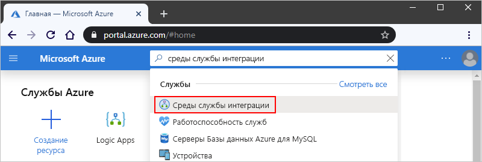
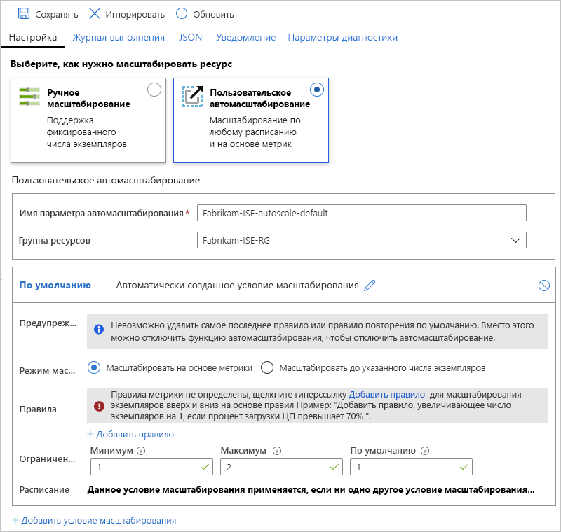

# Управление средой интеграционных служб (ISE) в приложениях логики Azure

В этой статье показано, как выполнять задачи управления для [среды интеграционных служб (ISE),](../logic-apps/connect-virtual-network-vnet-isolated-environment-overview.md)например:

* Управление ресурсами, такими как логические приложения, соединения, учетные записи интеграции и разъемы в ISE.
* Проверьте работоспособность вашей сети ISE.
* Добавление емкости, перезагрузка ISE или удаление ISE, следуйте за шагами в этой теме. Чтобы добавить эти артефакты в ISE, [см. Добавление артефактов в среду службы интеграции.](../logic-apps/add-artifacts-integration-service-environment-ise.md)

## Просмотр ISE

1. Войдите на [портал Azure](https://portal.azure.com).

1. В поле поиска портала введите "среды интеграционных сервисов", а затем выберите **среды службы интеграции.**

   

1. Из списка результатов выберите среду службы интеграции.

   

1. Продолжить в следующих разделах, чтобы найти логические приложения, соединения, разъемы или учетные записи интеграции в ISE.

## Проверка работоспособности сети

В меню ISE, в **настройках,** выберите **здоровье сети.** Эта панель показывает состояние работоспособности для подсетей и исходящих зависимостей от других служб.

## Управление логическими приложениями

Вы можете просматривать и управлять логическими приложениями, которые находятся в вашем ISE.

1. В меню ISE, под **настройками,** выберите **приложения Логика.**

   

1. Чтобы удалить логические приложения, которые вам больше не нужны в вашем ISE, выберите эти логические приложения, а затем выберите **Удалить**. Чтобы подтвердить, что вы хотите удалить, выберите **Да**.

## Управление подключением API

Вы можете просматривать и управлять соединениями, созданными логическими приложениями, работающими в ВАШЕМ ISE.

1. В меню ISE в **настройках**выберите **подключения API.**

   

1. Чтобы удалить соединения, которые вам больше не нужны в ISE, выберите эти соединения, а затем выберите **Удалить**. Чтобы подтвердить, что вы хотите удалить, выберите **Да**.

## Управление разъемами ISE

Вы можете просматривать и управлять разъемами API, развернутыми в ISE.

1. В меню ISE, под **настройками,** выберите **управляемые разъемы.**

   

1. Чтобы удалить разъемы, которые не нужны в ISE, выберите эти разъемы, а затем выберите **Удалить**. Чтобы подтвердить, что вы хотите удалить, выберите **Да**.

## Управление пользовательскими разъемами

Вы можете просматривать и управлять пользовательскими разъемами, развернутыми на ISE.

1. В меню ISE, под **настройками,** выберите **пользовательские разъемы.**

   

1. Чтобы удалить пользовательские разъемы, которые вам больше не нужны в ISE, выберите эти разъемы, а затем выберите **Удалить.** Чтобы подтвердить, что вы хотите удалить, выберите **Да**.

## Управление учетными записями интеграции

1. В меню ISE в **настройках**выберите **учетные записи интеграции.**

   

1. Чтобы удалить учетные записи интеграции из ISE, когда это больше не нужно, выберите эти учетные записи интеграции, а затем выберите **Удалить**.

## Добавьте емкость ISE.

Базовый блок Premium ISE имеет фиксированную емкость, так что если вам нужно больше пропускной способности, вы можете добавить больше единиц масштаба, либо во время создания или после. Разработчик SKU не включает возможность добавления единиц масштаба.

1. На [портале Azure](https://portal.azure.com)перейдите на ISE.

1. Для просмотра показателей использования и производительности для вашего ISE в меню ISE выберите **Обзор.**

   

1. В **настройках**выберите **Масштабирование.** На панели **настройки** выберите из этих параметров:

   * [**Ручная шкала**](#manual-scale): Масштабирование в зависимости от количества единиц обработки, которые вы хотите использовать.
   * [**Пользовательский автомасштаб:**](#custom-autoscale)Масштаб на основе метрик производительности, выбрав из различных критериев и указав пороговые условия для соответствия этим критериям.

   

### Ручное масштабирование

1. После выбора **шкалы ручного**управления для **дополнительной емкости**выберите количество единиц масштабирования, которые вы хотите использовать.

   

1. Когда все будет готово, нажмите кнопку **Сохранить**.

### Пользовательские автомасштабы

1. После выбора **автоматической шкалы**пользовательских масштабов для **настройки Autoscale**— укажите имя для настройки и опционально, выберите группу ресурсов Azure, в которой находится параметр.

   

1. Для состояния **по умолчанию** выберите **шкалу на основе метрики** или **шкалу для конкретного количества экземпляров.**

   * Если вы выбираете пример на основе, введите номер для обрабатывающих единиц, который является значением от 0 до 10.

   * Если вы выбираете метрику, выполните следующие действия:

     1. В разделе **Правила** выберите **Правило**.

     1. На панели **правил шкалы** настройте критерии и действия, которые необходимо предпринять при срабатывании правила.

     1. Для **ограничений экземпляра**укажите следующие значения:

        * **Минимум**: Минимальное количество обрабатывающих единиц для использования
        * **Максимальное**: Максимальное количество обрабатывающих единиц для использования
        * **По умолчанию**: Если какие-либо проблемы возникают при чтении метрик ресурсов, а текущая емкость ниже емкости по умолчанию, автоматическое масштабирование масштабируется до количества обрабатывающих единиц по умолчанию. Однако, если текущая емкость превышает емкость по умолчанию, автомасштабирование не масштабируется.

1. Чтобы добавить другое условие, выберите **Условие масштабирования Добавить.**

1. Когда вы закончите настройки автомасштабирования, сохраните изменения.

## Перезагрузка ISE

Если вы измените настройки DNS-сервера или DNS-сервера, необходимо перезапустить ISE, чтобы ISE мог получить эти изменения. Перезапуск Premium SKU ISE не приводит к простою из-за избыточности и компонентов, которые перезапускают по одному во время переработки. Тем не менее, разработчик SKU ISE испытывает время простоя, поскольку не существует избыточности. Для получения дополнительной [ISE SKUs](../logic-apps/connect-virtual-network-vnet-isolated-environment-overview.md#ise-level)информации см.

1. На [портале Azure](https://portal.azure.com)перейдите на ISE.

1. В меню ISE выберите **Обзор**. На панели инструментов Обзор, **перезагрузка**.

   

## Удалите ISE.

Перед удалением ISE, который вам больше не нужен, или группы ресурсов Azure, содержащей ISE, убедитесь, что у вас нет политик или блокировок в группе ресурсов Azure, которая содержит эти ресурсы или в виртуальной сети Azure, поскольку эти элементы могут блокировать удаление.

После удаления ISE, возможно, вам придется ждать до 9 часов, прежде чем пытаться удалить виртуальную сеть или подсети Azure.

## Дальнейшие действия

* [Добавление ресурсов в среды служб интеграции](../logic-apps/add-artifacts-integration-service-environment-ise.md)