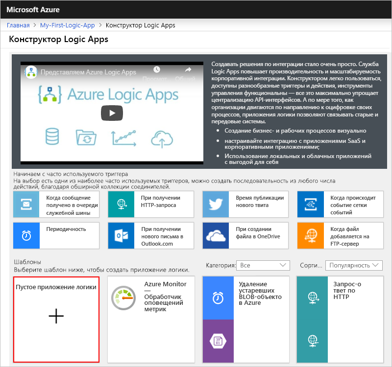
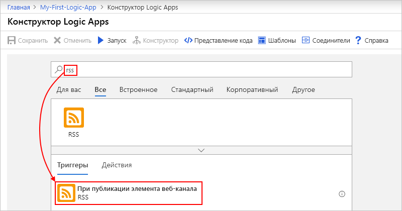
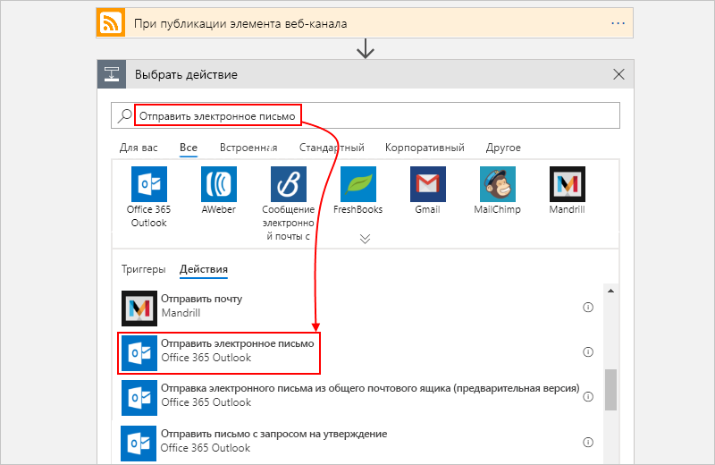
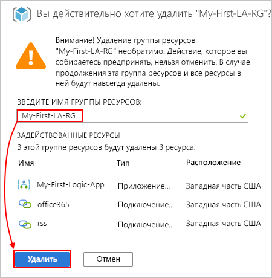

# Краткое руководство. Создание первого рабочего процесса с помощью Azure Logic Apps — портал Azure

В этом кратком руководстве рассматриваются основные принципы создания первого рабочего процесса с помощью [Azure Logic Apps](../logic-apps/logic-apps-overview.md), например создание пустого приложения логики, добавление триггера и действия и последующее тестирование приложения логики. Здесь рассказывается о том, как создать приложение логики, которое регулярно проверяет RSS-канал веб-сайта на наличие новых элементов. Если они есть, приложение логики отправляет сообщение электронной почты для каждого из них. По завершении приложение логики будет выглядеть как этот высокоуровневый рабочий процесс:

Для выполнения данного сценария необходима учетная запись электронной почты в службе, поддерживаемой Logic Apps, например Office 365 Outlook, Outlook.com или Gmail. Сведения о других поддерживаемых службах электронной почты см. в [приведенном здесь списке соединителей](https://docs.microsoft.com/connectors/). В этом примере приложение логики использует Office 365 Outlook. Если вы используете другую службу электронной почты, действия в целом будут теми же, но пользовательский интерфейс может немного отличаться.

Кроме того, если у вас еще нет подписки Azure, [подпишитесь для получения бесплатной учетной записи Azure](https://azure.microsoft.com/free/).

## Вход на портал Azure

Войдите на [портал Azure](https://portal.azure.com) с помощью учетных данных учетной записи Azure.

## Создание приложения логики

1. На домашней странице Azure найдите с помощью поля поиска и выберите **Logic Apps**.

   

1. На странице **Logic Apps** нажмите **Добавить**.

   

1. В области **Приложение логики** предоставьте сведения о приложении логики, как показано ниже. Когда все будет готово, выберите **Создать**.

   

   | Свойство | Значение | Описание |
   |----------|-------|-------------|
   | **имя**; | <*logic-app-name*> | Имя приложения логики, которое может содержать только буквы, цифры, дефисы (`-`), символы подчеркивания (`_`), круглые скобки (`(`, `)`) и точки (`.`). В этом примере используется имя My-First-Logic-App. |
   | **Подписка** | <*Azure-subscription-name*> | Имя подписки Azure. |
   | **Группа ресурсов** | <*имя_группы_ресурсов_Azure*> | Имя [группы ресурсов Azure](../azure-resource-manager/management/overview.md), используемой для упорядочения связанных ресурсов. В этом примере используется имя My-First-LA-RG. |
   | **Расположение** | <*Azure-region*> | Регион для хранения данных приложения логики. В этом примере используется регион "Западная часть США". |
   | **Служба Log Analytics** | Выкл. | Сохраните параметр **Выкл.** для журнала ведения диагностики. |
   ||||

1. После развертывания приложения в Azure на панели инструментов Azure выберите **Уведомления** > **Перейти к ресурсу** для развернутого приложения логики.

   

   Вы также можете найти и выбрать приложение логики, введя его имя в поле поиска.

   Открывается конструктор Logic Apps и отображается страница с вводным видео и часто используемыми триггерами. В разделе **Шаблоны** выберите **Пустое приложение логики**.

   

Затем добавьте [триггер](../logic-apps/logic-apps-overview.md#logic-app-concepts), который срабатывает при появлении нового элемента RSS-канала. Каждое приложение логики должно запускаться по триггеру, который активируется, когда происходит определенное событие или если выполняются заданные условия. При каждом срабатывании триггера обработчик Azure Logic Apps создает экземпляр приложения логики, запускающий и выполняющий рабочий процесс.

## Добавление триггера RSS

1. В **конструкторе приложений логики** под полем поиска выберите **Все**.

1. В поле поиска введите `rss`, чтобы найти соединитель RSS. В списке триггеров выберите **При публикации элемента веб-канала**.

   

1. Предоставьте сведения для триггера, как показано и описано далее:

   

   | Свойство | Значение | Описание |
   |----------|-------|-------------|
   | **URL-адрес RSS-канала** | `http://feeds.reuters.com/reuters/topNews` | Ссылка для RSS-канала, который вы хотите отслеживать |
   | **Интервал** | 1 | Количество интервалов ожидания между проверками. |
   | **Частота** | Минута | Единица измерения времени для каждого интервала между проверками  |
   ||||

   Совместно интервал и частота определяют расписание для триггера приложения логики. Это приложение логики проверяет веб-канал каждую минуту.

1. Чтобы свернуть сведения о триггере, щелкните внутри заголовка окна триггера.

   

1. Сохраните приложение логики. На панели инструментов конструктора щелкните **Сохранить**.

Теперь приложение логики активно, но оно только проверяет RSS-канал. Итак, добавим действие, отвечающее при срабатывании триггера.

## Добавление действия "отправить сообщение"

Теперь добавьте [действие](../logic-apps/logic-apps-overview.md#logic-app-concepts), которое отправляет сообщение электронной почты, когда в RSS-канале появляется новый элемент.

1. В разделе триггера **При публикации элемента веб-канала** выберите **Новый шаг**.

   

1. В разделе **Выберите действие** под полем поиска выберите **Все**.

1. В поле поиска введите `send an email`, чтобы найти соединители, которые предлагают это действие. В списке действий выберите "Отправить электронное письмо" для службы электронной почты, которую вы хотите использовать. В этом примере используется соединитель Office 365 Outlook, в котором предусмотрено действие **Отправить электронное письмо**.

   

   Чтобы отфильтровать список действий для определенного приложения или службы, можно сначала выбрать это приложение или службу.

   * Для рабочих или учебных учетных записей Azure выберите Office 365 Outlook.
   * Для личных учетных записей Майкрософт выберите Outlook.com.

1. Если выбранный соединитель электронной почты запрашивает аутентификацию удостоверения, выполните этот шаг сейчас, чтобы создать подключение между приложением логики и службой электронной почты.

   > [!NOTE]
   > В этом конкретном примере предполагается, что вы вручную выполните аутентификацию удостоверения. Однако соединители, требующие аутентификации, поддерживают различные ее типы. Кроме того, вы можете настроить способ, которым требуется выполнять аутентификацию. Например, при использовании шаблонов Azure Resource Manager для развертывания можно параметризовать и улучшить защиту входных данных, если их требуется часто или легко изменять, например сведения о соединении. Дополнительные сведения см. в следующих статьях:
   >
   > * [Параметры шаблона для развертывания](../logic-apps/logic-apps-azure-resource-manager-templates-overview.md#template-parameters)
   > * [Авторизация подключений OAuth](../logic-apps/logic-apps-deploy-azure-resource-manager-templates.md#authorize-oauth-connections)
   > * [Аутентификация для доступа на основе управляемых удостоверений](../logic-apps/create-managed-service-identity.md)
   > * [Аутентификация для подключения при развертывании приложения логики](../logic-apps/logic-apps-azure-resource-manager-templates-overview.md#authenticate-connections)

1. В действии **Send an email** (Отправить сообщение электронной почты) укажите данные, которые нужно добавить в электронное письмо.

   1. В поле **Кому** введите адрес электронной почты получателя. Для тестировании можно использовать свой адрес.

      Пока проигнорируйте появившийся список **Add dynamic content** (Добавить динамическое содержимое). Если щелкнуть внутри некоторых текстовых полей, появится список доступных параметров из предыдущего шага, которые можно включить в качестве входных данных в рабочем процессе.

   1. В поле **Тема** введите следующий текст с пробелом: `New RSS item: `.

      

   1. В списке **Добавить динамическое содержимое** выберите **Название канала**, чтобы включить его в заголовок RSS-элемента.

      

      В конечном итоге тема сообщения будет выглядеть примерно так:

      

      Если в конструкторе появляется цикл "For each", выберите маркер, содержащий массив, например маркер **categories-Item**. Для этих типов маркеров конструктор автоматически добавляет цикл к действию, которое ссылается на конкретный маркер. Таким образом приложение логики будет выполнять это действие для каждого элемента массива. Чтобы удалить цикл, нажмите кнопку с **многоточием** ( **...** ) на панели заголовка цикла, а затем выберите **Удалить**.

   1. В поле **Тело** введите текст и выберите необходимые маркеры для тела сообщения электронной почты. Чтобы добавить пустые строки в поле редактирования, нажмите Shift + ВВОД.

      

      | Свойство | Описание |
      |----------|-------------|
      | **Название веб-канала** | Заголовок элемента |
      | **Веб-канал опубликован** | Время и дата публикации элемента |
      | **Ссылка основного веб-канала** | URL-адрес для элемента |
      |||

1. Сохраните приложение логики.

Затем проверьте приложение логики.

## Запуск приложения логики

Чтобы вручную запустить приложение логики, на панели инструментов конструктора щелкните **Запустить**. Или дождитесь, пока приложение логики проверит веб-канал RSS по указанному расписанию (каждую минуту). Если в RSS-канале есть новые элементы, приложение логики отправляет сообщение электронной почты для каждого нового элемента. В противном случае приложение логики ожидает до следующего интервала перед повторной проверкой. Если сообщения электронной почты не приходят, проверьте папку нежелательной почты.

Например, ниже приведен образец сообщения электронной почты, которое отправляет это приложение логики.

Технически, когда триггер проверяет RSS-канал и находит новые элементы, он срабатывает, и подсистема Azure Logic Apps создает для приложения логики экземпляр рабочего процесса, в котором выполняются действия. Если триггер не находит новые элементы, он не срабатывает и "пропускает" создание экземпляра рабочего процесса.

Поздравляем, вы успешно создали и запустили свое первое приложение логики с помощью портала Azure.

## Очистка ресурсов

Если этот образец больше не нужен, удалите группу ресурсов, содержащую приложение логики и связанные ресурсы.

1. В главном меню Azure перейдите на вкладку **Группы ресурсов** и выберите группу ресурсов для приложения логики. На вкладке **Обзор** выберите **Удалить группу ресурсов**.

   

1. Когда отобразится панель подтверждения, введите имя группы ресурсов и выберите **Удалить**.

   

> [!NOTE]
> При удалении приложения логики новые экземпляры запуска не создаются. Всех выполняющиеся и ожидающие выполнения запуски будут отменены. При наличии тысяч операций запуска отмена может занять значительное время.

## Дальнейшие действия

В этом кратком руководстве вы создали свое первое приложение логики, которое проверяет наличие обновлений RSS на основе заданного расписания (каждую минуту) и выполняет действие (отправляет электронные сообщения) при наличии обновлений. Для получения дополнительных сведений продолжите роботу с указанным ниже руководством по созданию более сложных рабочих процессов, которые выполняются по расписанию.

> [!div class="nextstepaction"]
> [Проверка загрузки дорог при помощи приложения логики на основе планировщика](../logic-apps/tutorial-build-schedule-recurring-logic-app-workflow.md)
