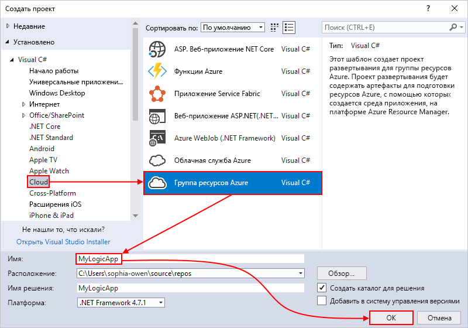
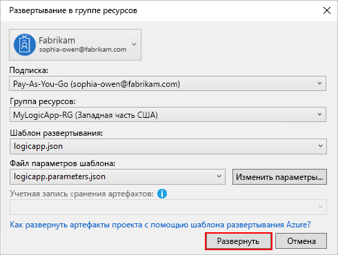
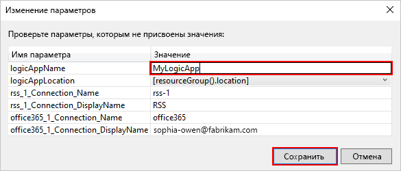
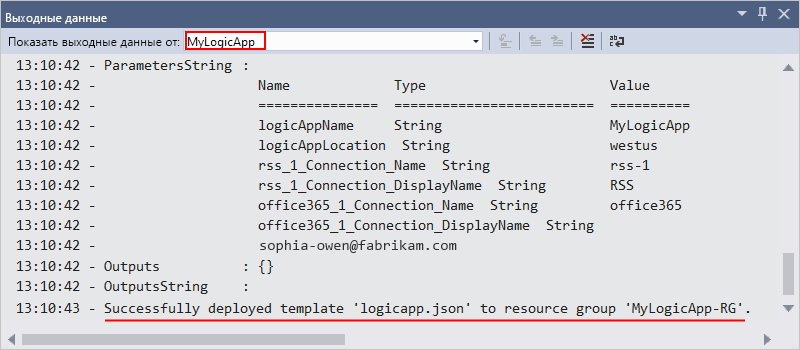

# Краткое руководство. Создание автоматизированных задач, операций и рабочих процессов с помощью Azure Logic Apps в Visual Studio

С помощью [Azure Logic Apps](../logic-apps/logic-apps-overview.md) и Visual Studio можно создавать рабочие процессы, которые автоматизируют задачи и процессы для интеграции приложений, данных, систем и служб в предприятиях и организациях. В кратком руководстве показано, как разрабатывать и создавать эти рабочие процессы путем создания приложений логики в Visual Studio и их развертывания в Azure в облаке. Хотя эти задачи можно выполнять на портале Azure, Visual Studio позволяет добавлять приложения логики в систему управления версиями, публиковать различные версии и создавать шаблоны Azure Resource Manager для различных сред развертывания.

Если вы не знакомы с Azure Logic Apps и хотите ознакомиться с основными понятиями, см. [руководство по созданию приложения логики на портале Azure](../logic-apps/quickstart-create-first-logic-app-workflow.md). Конструктор приложений логики на портале Azure и в Visual Studio работает аналогичным образом.

Здесь создается то же приложение логики, что и в кратком руководстве портала Azure, но с помощью Visual Studio. Это приложение логики отслеживает RSS-канал веб-сайта и отправляет сообщения электронной почты для каждого нового элемента, опубликованного на сайте. По завершении приложение логики будет выглядеть как этот высокоуровневый рабочий процесс:

Прежде чем начать, убедитесь в наличии следующих необходимых при работе с этим руководством элементов:

* Если у вас еще нет подписки Azure, <a href="https://azure.microsoft.com/free/" target="_blank">зарегистрируйтесь для получения бесплатной учетной записи Azure</a>.

* Скачайте и установите эти средства, если вы еще этого не сделали:

  * <a href="https://aka.ms/download-visual-studio" target="_blank">Visual Studio 2019, 2017 или 2015 — выпуски Community или выше</a>. 
  В этом кратком руководстве используется бесплатная версия Visual Studio Community 2017.

    > [!IMPORTANT]
    > При установке Visual Studio 2019 или 2017 обязательно выберите рабочую нагрузку **разработки Azure**.
    > Если используется Visual Studio 2019, Cloud Explorer может открыть конструктор приложений логики на портале Azure. Открытие встроенного конструктора приложений логики пока не поддерживается.

  * <a href="https://azure.microsoft.com/downloads/" target="_blank">Пакет Microsoft Azure SDK для .NET (2.9.1 или более поздней версии)</a>. Дополнительные сведения о <a href="https://docs.microsoft.com/dotnet/azure/dotnet-tools?view=azure-dotnet">пакете Azure SDK для .NET</a>.

  * <a href="https://github.com/Azure/azure-powershell#installation" target="_blank">Azure PowerShell</a>

  * Средства Azure Logic Apps для необходимой версии Visual Studio:

    * <a href="https://aka.ms/download-azure-logic-apps-tools-visual-studio-2019" target="_blank">Visual Studio 2019</a>
    
    * <a href="https://aka.ms/download-azure-logic-apps-tools-visual-studio-2017" target="_blank">Visual Studio 2017</a>
    
    * <a href="https://aka.ms/download-azure-logic-apps-tools-visual-studio-2015" target="_blank">Visual Studio 2015</a>
  
    Вы можете скачать и установить средства Azure Logic Apps напрямую из Visual Studio Marketplace или узнать, <a href="https://docs.microsoft.com/visualstudio/ide/finding-and-using-visual-studio-extensions" target="_blank">как установить это расширение из Visual Studio</a>. 
    После завершения установки перезагрузите Visual Studio.

* Доступ к Интернету при использовании встроенного конструктора приложений логики

  Конструктору требуется подключение к Интернету, чтобы создать ресурсы в Azure и считать свойства и данные из соединителей в приложении логики. 
  Например, если вы используете соединитель Dynamics CRM Online, конструктор проверяет экземпляр CRM и получает информацию для отображения доступных свойств по умолчанию и пользовательских свойств.

* Учетная запись, поддерживаемая Logic Apps, например Office 365 Outlook, Outlook.com или Gmail. Сведения о дополнительных поставщиках см. в <a href="https://docs.microsoft.com/connectors/" target="_blank">списке соединителей</a>. Это приложение логики использует Office 365 Outlook. Если вы используете другой поставщик, общие шаги те же, но пользовательский интерфейс может немного отличаться.

## Создание проекта группы ресурсов Azure

Чтобы начать работу, создайте [проект группа ресурсов Azure](../azure-resource-manager/vs-azure-tools-resource-groups-deployment-projects-create-deploy.md). Узнайте больше о [группах ресурсов Azure и ресурсах](../azure-resource-manager/resource-group-overview.md).

1. Запустите Visual Studio и войдите в учетную запись Azure.

1. В меню **Файл** выберите **Создать** > **Проект**. (Или нажмите клавиши Ctrl+Shift+N.)

   

1. В разделе **Установленные** выберите **Visual C#** или **Visual Basic**. Выберите **Облако** > **Группа ресурсов Azure**. Назовите свой проект, например:

   

   > [!NOTE]
   > Если не существует категория **Cloud** или проект **Группа ресурсов Azure**, убедитесь, что у вас установлен пакет Azure SDK для Visual Studio.

   Если вы используете Visual Studio 2019, сделайте следующее:

   1. В поле **Создать проект** выберите шаблон проекта **Группа ресурсов Azure** для языка C# или Visual Basic, а затем нажмите кнопку **Далее**.

   1. Укажите имя группы ресурсов Azure, которую вы хотите использовать, и другие сведения о проекте. Когда все будет готово, выберите **Создать**.

1. В списке шаблонов выберите **Приложение логики**.

   

   После того, как в Visual Studio будет создан проект, в обозревателе решений откроется ваше решение.

   

   В решении файл **LogicApp.json** — это не только хранилище определения для приложения логики, но и шаблон Azure Resource Manager, который можно настроить для развертывания.

## Создание пустого приложения логики

Создав проект группы ресурсов Azure, создайте и настройте приложение логики, начиная с **шаблона пустого приложения логики**.

1. В обозревателе решений откройте контекстное меню для файла **LogicApp.json**. 
   Выберите действие **Открыть в конструкторе приложений логики**. (Или нажмите клавиши Ctrl+L.)

   

1. В поле **Подписка** выберите подписку Azure, которую вы хотите использовать. 
   В поле **Группа ресурсов** выберите **Создать новый...**. При этом будет создана группа ресурсов Azure.

   

   Visual Studio требуется подписка Azure и группа ресурсов для создания и развертывания ресурсов, связанных с приложением логики и подключениями.

   | Параметр | Пример значения | ОПИСАНИЕ |
   | ------- | ------------- | ----------- |
   | Список профилей пользователя | Contoso   jamalhartnett@contoso.com | По умолчанию это учетная запись, используемая для входа |
   | **Подписка** | Оплата по мере использования   (jamalhartnett@contoso.com) | Имя подписки Azure и связанной учетной записи |
   | **Группа ресурсов** | MyLogicApp-RG   (Западная часть США) | Группа ресурсов Azure и расположение для хранения и развертывания ресурсов приложения логики |
   | **Местоположение.** | MyLogicApp-RG2   (Западная часть США) | Другое расположение, если вы не хотите использовать расположение группы ресурсов |
   ||||

1. Открывается конструктор Logic Apps и отображается страница с вводным видео и часто используемыми триггерами. 
   Прокрутите видео и триггеры. В разделе **Шаблоны** выберите **Пустое приложение логики**.

   

## Рабочий процесс сборки приложения логики

Затем добавьте [триггер](../logic-apps/logic-apps-overview.md#logic-app-concepts), который срабатывает при появлении нового элемента RSS-канала. Каждое приложение логики должно начинаться с триггера, который срабатывает при удовлетворении определенных критериев. При каждой активации триггера обработчик Logic Apps создает экземпляр приложения логики для выполнения рабочего процесса.

1. В конструкторе приложений логики введите "rss" в поле поиска. Выберите триггер **При публикации элемента веб-канала**.

   

   Триггер теперь будет отображаться в конструкторе:

   

1. Чтобы завершить создание приложения логики, следуйте рабочему процессу в [кратком руководстве на портале Azure](../logic-apps/quickstart-create-first-logic-app-workflow.md#add-rss-trigger), а затем вернитесь к этой статье.

   По завершении приложение логики может выглядеть следующим образом:

   

1. Чтобы сохранить приложение логики, сохраните решение Visual Studio. (Или нажмите клавиши Ctrl + S.)

Теперь, прежде чем протестировать приложение логики, разверните его в Azure.

## Развертывание приложения логики в Azure

Перед запуском приложения логики разверните приложение из Visual Studio в Azure за несколько шагов.

1. В обозревателе решений в контекстном меню проекта выберите **Развернуть** > **Создать**. Если отобразится запрос на вход в учетную запись Azure, выполните его.

   

1. Для этого развертывания сохраните подписку, группу ресурсов и другие настройки по умолчанию для Azure. Когда вы будете готовы, выберите **Развернуть**.

   

1. Если появится диалоговое окно **Изменение параметров**, укажите имя ресурса приложения логики для использования в развертывании, а затем сохраните свои параметры, например:

   

   При запуске развертывания его состояние отобразится в окне **Выходные данные** Visual Studio. 
   Если состояние не отображается, откройте список **Показать вывод из** и выберите свою группу ресурсов Azure.

   

   Если выбранные соединители требуют ввода данных, может открыться окно PowerShell в фоновом режиме с запросом на ввод необходимых паролей или секретных ключей. После ввода этих сведений развертывание продолжится.

   

   После развертывания приложение логики будет работать в реальном времени на портале Azure и проверять RSS-канал в зависимости от заданного расписания (каждую минуту). 
   Если в RSS-канале есть новые элементы, приложение логики отправляет сообщение электронной почты для каждого нового элемента. 
   В противном случае приложение логики ожидает до следующего интервала перед повторной проверкой.

   Например, ниже приведены примеры электронных писем, которые отправляет это приложение логики. 
   Если сообщения электронной почты не приходят, проверьте папку нежелательной почты.

   

   Технически, когда триггер проверяет веб-канал RSS и находит новые элементы, он срабатывает, и подсистема Logic Apps создает для приложения логики экземпляр рабочего процесса, в котором выполняются действия.
   Если триггер не находит новые элементы, он не срабатывает и "пропускает" создание экземпляра рабочего процесса.

Итак, вы успешно создали и развернули приложение логики с помощью Visual Studio! Чтобы управлять приложением логики и просматривать его журнал выполнения, ознакомьтесь со статьей [Manage logic apps with Visual Studio](../logic-apps/manage-logic-apps-with-visual-studio.md) (Управление приложениями логики в Visual Studio).

## Очистка ресурсов

Удалите ненужную группу ресурсов, содержащую приложение логики и связанные ресурсы.

1. Войдите на <a href="https://portal.azure.com" target="_blank">портал Azure</a> с учетной записью, использованной для создания приложения логики.

1. В главном меню Azure выберите **Группы ресурсов**.
Выберите группу ресурсов для своего приложения логики, а затем — **Обзор**.

1. На вкладке **Обзор** выберите поле **Удалить группу ресурсов**. Введите имя группы ресурсов для подтверждения и нажмите кнопку **Удалить**.

   

1. Удалите решение Visual Studio со своего локального компьютера.

## Получение поддержки

* Если у вас возникли вопросы, то посетите <a href="https://social.msdn.microsoft.com/Forums/en-US/home?forum=azurelogicapps" target="_blank">форум Azure Logic Apps</a>.
* Отправить идею по поводу возможности или проголосовать за нее вы можете на <a href="https://aka.ms/logicapps-wish" target="_blank">сайте отзывов пользователей Logic Apps</a>.

## Дополнительная информация

В этой статье вы создавали, развертывали и выполняли свое приложение логики с помощью Visual Studio. Дополнительные сведения о выполнении расширенного развертывания для приложений логики и управлении им c помощью Visual Studio см. в этих статьях:

> [!div class="nextstepaction"]
> * [Управление приложениями логики в Visual Studio](../logic-apps/manage-logic-apps-with-visual-studio.md)
> * [Создание шаблонов развертывания приложения логики с помощью Visual Studio](../logic-apps/logic-apps-create-deploy-template.md)
