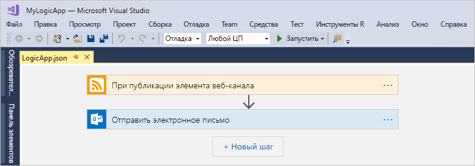
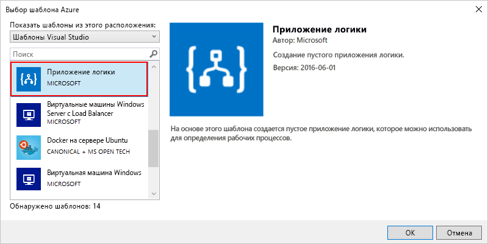
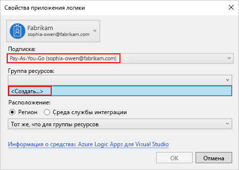
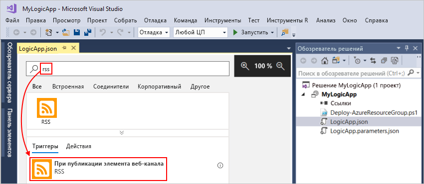
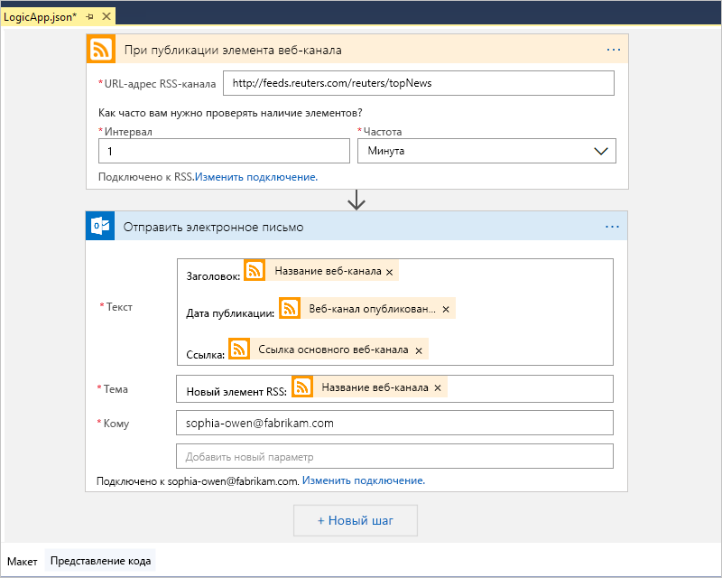
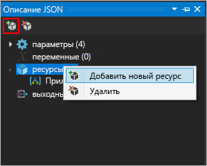
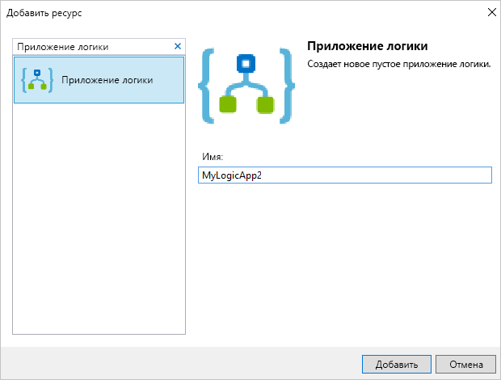
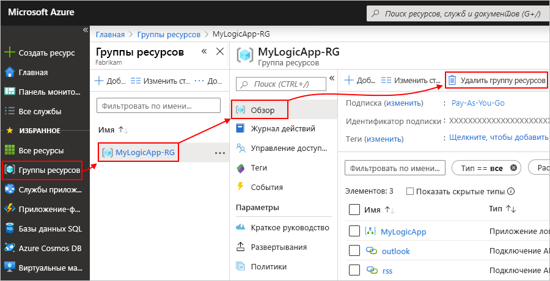

# Краткое руководство. Автоматизация задач, операций и рабочих процессов с помощью Azure Logic Apps и Visual Studio

С помощью [Azure Logic Apps](../logic-apps/logic-apps-overview.md) и Visual Studio можно создавать рабочие процессы, которые автоматизируют задачи и процессы для интеграции приложений, данных, систем и служб в предприятиях и организациях. В этом кратком руководстве показано, как разрабатывать и создавать такие рабочие процессы, создавая приложения логики в Visual Studio и развертывая их в Azure. Хотя эти задачи можно выполнять на портале Azure, Visual Studio позволяет добавлять приложения логики в систему управления версиями, публиковать различные версии и создавать шаблоны Azure Resource Manager для различных сред развертывания.

Если вы не работали с Azure Logic Apps и хотите ознакомиться с основными понятиями, см. [руководство по созданию приложения логики на портале Azure](../logic-apps/quickstart-create-first-logic-app-workflow.md). Конструктор приложений логики на портале Azure и в Visual Studio работает аналогичным образом.

В этом кратком руководстве с помощью Visual Studio создается то же приложение логики, что и с помощью портала Azure. Это приложение логики отслеживает RSS-канал веб-сайта и отправляет сообщения электронной почты с появлением каждого нового элемента в веб-канале. По завершении приложение логики будет выглядеть как этот высокоуровневый рабочий процесс:

## Предварительные требования

* Подписка Azure. Если у вас еще нет подписки Azure, [зарегистрируйтесь для получения бесплатной учетной записи Azure](https://azure.microsoft.com/free/).

* Скачайте и установите эти средства, если вы еще этого не сделали:

  * [Visual Studio 2019, 2017 или 2015 — выпуски Community или выше](https://aka.ms/download-visual-studio). 
  В этом кратком руководстве используется Visual Studio Community 2017.

    > [!IMPORTANT]
    > При установке Visual Studio 2019 или 2017 обязательно выберите рабочую нагрузку **разработки Azure**.

  * [Пакет Microsoft Azure SDK для .NET (2.9.1 или более поздней версии)](https://azure.microsoft.com/downloads/). 
  Дополнительные сведения о [пакете Azure SDK для .NET](https://docs.microsoft.com/dotnet/azure/dotnet-tools?view=azure-dotnet).

  * [Azure PowerShell](https://github.com/Azure/azure-powershell#installation)

  * Средства Azure Logic Apps для необходимой версии Visual Studio:

    * [Visual Studio 2019](https://aka.ms/download-azure-logic-apps-tools-visual-studio-2019)

    * [Visual Studio 2017](https://aka.ms/download-azure-logic-apps-tools-visual-studio-2017)

    * [Visual Studio 2015](https://aka.ms/download-azure-logic-apps-tools-visual-studio-2015)
  
    Вы можете скачать и установить средства Azure Logic Apps напрямую из Visual Studio Marketplace или узнать, [как установить это расширение из Visual Studio](https://docs.microsoft.com/visualstudio/ide/finding-and-using-visual-studio-extensions). 
    После завершения установки перезагрузите Visual Studio.

* Чтобы упростить работу с разными средами Azure, такими как Azure для государственных организаций, вы можете установить и использовать расширение [средства переключения сред Azure](https://marketplace.visualstudio.com/items?itemName=SteveMichelotti.AzureEnvironmentSelector). См. сведения о [расширении средства переключения сред Azure (Visual Studio)](https://devblogs.microsoft.com/azuregov/introducing-the-azure-environment-selector-visual-studio-extension/).

* Доступ к Интернету при использовании встроенного конструктора приложений логики

  Конструктору требуется подключение к Интернету, чтобы создать ресурсы в Azure и считать свойства и данные из соединителей в приложении логики. 
  Например, если вы используете соединитель Dynamics CRM Online, конструктор проверяет экземпляр CRM и получает информацию для отображения свойств по умолчанию и пользовательских свойств.

* Учетная запись, поддерживаемая Logic Apps, например Office 365 Outlook, Outlook.com или Gmail. Сведения о дополнительных поставщиках см. в [списке соединителей](https://docs.microsoft.com/connectors/). В этом примере используется Office 365 Outlook. Если вы используете другой поставщик, общие шаги те же, но пользовательский интерфейс может немного отличаться.

## Создание проекта группы ресурсов Azure

Чтобы начать работу, создайте [проект группа ресурсов Azure](../azure-resource-manager/vs-azure-tools-resource-groups-deployment-projects-create-deploy.md). Узнайте больше о [группах ресурсов Azure и ресурсах](../azure-resource-manager/resource-group-overview.md).

1. Запустите Visual Studio. Войдите в систему с использованием учетной записи Azure.

1. В меню **Файл** выберите **Создать** > **Проект**. (Или нажмите клавиши Ctrl+Shift+N.)

   

1. В разделе **Установленные** выберите **Visual C#** или **Visual Basic**. Выберите **Облако** > **Группа ресурсов Azure**. Назовите свой проект, например:

   

   > [!NOTE]
   > Имена групп ресурсов могут содержать только буквы, цифры, точки (`.`), символы подчеркивания (`_`), дефисы (`-`) и круглые скобки (`(`, `)`), но не могут *оканчиваться* точками (`.`).
   >
   > Если категория **Cloud** или проект **Группа ресурсов Azure** не отображаются, убедитесь, что у вас установлен пакет Azure SDK для Visual Studio.

   Если вы используете Visual Studio 2019, сделайте следующее:

   1. В поле **Создать проект** выберите проект **Группа ресурсов Azure** для языка C# или Visual Basic. Щелкните **Далее**.

   1. Укажите имя группы ресурсов Azure, которую вы хотите использовать, и другие сведения о проекте. Выберите **Создать**.

1. В списке шаблонов выберите **Приложение логики**. Нажмите кнопку **ОК**.

   

   После того, как в Visual Studio будет создан проект, в обозревателе решений откроется ваше решение. 
   В решении файл **LogicApp.json** не только хранит определение приложения логики, но также является шаблоном Azure Resource Manager, который можно использовать для развертывания.

   

## Создание пустого приложения логики

Создав проект группы ресурсов Azure, создайте приложение логики на основе шаблона **Пустое приложение логики**.

1. В обозревателе решений откройте контекстное меню для файла **LogicApp.json**. Выберите действие **Открыть в конструкторе приложений логики**. (Или нажмите клавиши Ctrl+L.)

   

   > [!TIP]
   > Если у вас нет этой команды в Visual Studio 2019, убедитесь, что установлены последние обновления для Visual Studio.

   Visual Studio требуется подписка Azure и группа ресурсов для создания и развертывания ресурсов, связанных с приложением логики и подключениями.

1. **Подписка** — выберите подписку Azure. **Группа ресурсов** — выберите **Создать новую**, чтобы создать группу ресурсов Azure.

   

   | Параметр | Пример значения | ОПИСАНИЕ |
   | ------- | ------------- | ----------- |
   | Список профилей пользователя | Contoso   jamalhartnett@contoso.com | По умолчанию это учетная запись, используемая для входа |
   | **подписка** | Оплата по мере использования   (jamalhartnett@contoso.com) | Имя подписки Azure и связанной учетной записи |
   | **Группа ресурсов** | MyLogicApp-RG   (Западная часть США) | Группа ресурсов Azure и расположение для хранения и развертывания ресурсов приложения логики |
   | **Местоположение.** | MyLogicApp-RG2   (Западная часть США) | Другое расположение, если вы не хотите использовать расположение группы ресурсов |
   ||||

1. Откроется конструктор Logic Apps и отобразится страница с вводным видео и часто используемыми триггерами. Прокрутите вниз раздел с видео и триггерами до раздела **Шаблоны** и выберите **Пустое приложение логики**.

   

## Рабочий процесс сборки приложения логики

Затем добавьте [триггер](../logic-apps/logic-apps-overview.md#logic-app-concepts) RSS, который срабатывает при появлении нового элемента веб-канала. Каждое приложение логики начинается с триггера, который срабатывает при удовлетворении определенных критериев. При каждой активации триггера обработчик Logic Apps создает экземпляр приложения логики для выполнения рабочего процесса.

1. В конструкторе приложений логики под полем поиска выберите **Все**.
В поле поиска введите rss. В списке триггеров выберите триггер: **При публикации элемента веб-канала — RSS**.

   

1. Когда триггер появится в конструкторе, завершите создание приложения логики, следуя инструкциям из [краткого руководства по порталу Azure](../logic-apps/quickstart-create-first-logic-app-workflow.md#add-rss-trigger), а затем вернитесь к этой статье. По завершении приложение логики может выглядеть следующим образом:

   

1. Сохраните решение Visual Studio. (Или нажмите клавиши Ctrl + S.)

## Развертывание приложения логики в Azure

Перед запуском и тестированием приложения логики разверните приложение из Visual Studio в Azure.

1. В обозревателе решений в контекстном меню проекта выберите **Развернуть** > **Создать**. Если отобразится запрос на вход в учетную запись Azure, выполните его.

   

1. Для этого развертывания сохраните подписку, группу ресурсов и другие настройки Azure по умолчанию. Выберите **Развернуть**.

   

1. Если появится поле **Изменить параметры**, введите имя ресурса для приложения логики. Сохраните параметры.

   

   При запуске развертывания его состояние отобразится в окне **Выходные данные** Visual Studio. Если состояние не отображается, откройте список **Показать вывод из** и выберите свою группу ресурсов Azure.

   

   Если подключенные соединители требуют ввода данных, может открыться окно PowerShell в фоновом режиме с запросом на ввод необходимых паролей или секретных ключей. После ввода этих сведений развертывание продолжится.

   

   После развертывания приложение логики будет работать в реальном времени на портале Azure согласно заданному расписанию (каждую минуту). Триггер срабатывает при обнаружении новых элементов веб-канала, создавая экземпляр рабочего процесса, который выполняет действия приложения логики. Приложение логики отправляет сообщение электронной почты при появлении каждого нового элемента. Если же триггер не обнаруживает новые элементы, он не срабатывает и не создает экземпляр рабочего процесса. В свою очередь, приложение логики ожидает наступления следующего интервала перед повторной проверкой.

   Ниже приведены примеры электронных писем, которые отправляет это приложение логики. 
   Если сообщения электронной почты не приходят, проверьте папку нежелательной почты.

   

Итак, вы успешно создали и развернули приложение логики с помощью Visual Studio. Чтобы управлять приложением логики и просматривать его журнал выполнения, ознакомьтесь со статьей [Manage logic apps with Visual Studio](../logic-apps/manage-logic-apps-with-visual-studio.md) (Управление приложениями логики в Visual Studio).

## Добавление нового приложения логики

Если у вас уже есть проект группы ресурсов Azure, вы можете добавить в него новое пустое приложение логики в окне "Структура JSON".

1. В обозревателе решений откройте файл `<logic-app-name>.json`.

1. В меню **Вид** выберите **Другие окна** > **Структура JSON**.

1. Чтобы добавить ресурс в файл шаблона, нажмите **Добавить ресурс** в верхней части окна "Структура JSON". Также можно щелкнуть правой кнопкой мыши **ресурсы** в окне "Структура JSON", а затем выбрать пункт **Добавить новый ресурс**.

   

1. В диалоговом окне **Добавление ресурса** найдите и выберите **Приложение логики**. Присвойте имя приложению логики и выберите **Добавить**.

   

## Очистка ресурсов

Завершив работу с приложением логики, удалите группу ресурсов, содержащую приложение логики и связанные ресурсы.

1. Войдите на [портал Azure](https://portal.azure.com) с учетной записью, использованной для создания приложения логики.

1. В главном меню Azure выберите **Группы ресурсов**.
Выберите группу ресурсов приложения логики и щелкните **Обзор**.

1. На вкладке **Обзор** выберите поле **Удалить группу ресурсов**. Введите имя группы ресурсов для подтверждения и нажмите кнопку **Удалить**.

   

1. Удалите решение Visual Studio со своего локального компьютера.

## Дополнительная информация

В этой статье вы создавали, развертывали и выполняли свое приложение логики с помощью Visual Studio. См. дополнительные сведения о выполнении расширенного развертывания для приложений логики и управлении им c помощью Visual Studio:

> [!div class="nextstepaction"]
> * [Управление приложениями логики в Visual Studio](../logic-apps/manage-logic-apps-with-visual-studio.md)
