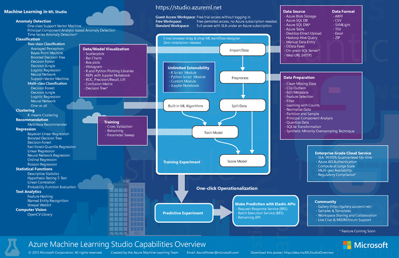

# Возможности Студии машинного обучения (классической)

**ПРИМЕНИМО К:**  Студия машинного обучения (классическая версия) [Машинное обучение Azure](../overview-what-is-machine-learning-studio.md#ml-studio-classic-vs-azure-machine-learning-studio)

[!INCLUDE [Designer notice](../../../includes/designer-notice.md)]

Студия машинного обучения (классическая версия) — это инструмент, поддерживающий функцию перетаскивания объектов и предназначенный для создания, тестирования и развертывания моделей машинного обучения. Студия (классическая) публикует модели как веб-службы, которые затем можно использовать в пользовательских приложениях и средствах бизнес-аналитики (например, в Excel).

## Интерактивная рабочая область Студии (классической)

Для разработки модели прогнозной аналитики обычно используются данные из одного или нескольких источников. Для получения набора результатов эти данные преобразовываются и анализируются с помощью различных операций и статистических функций. Такая разработка модели — это итеративный процесс. Путем изменения разных функций и их параметров выполняется сведение результатов, пока не будет получена подготовленная и эффективная модель.

Студия машинного обучения (классическая) предоставляет интерактивную визуальную рабочую область, упрощающую создание, тестирование и выполнение итераций модели прогнозной аналитики. Вы перетаскиваете **_наборы данных_* _ и _*_модули_*_ анализа на интерактивный холст и связываете их вместе, чтобы создать _*_эксперимент_*_, который затем выполняется в Студии машинного обучения (классической). Для выполнения итераций в макете модели следует отредактировать эксперимент, при необходимости сохранить копию и выполнить его снова. Когда вы будете готовы, _*_обучающий эксперимент_*_ можно преобразовать в _*_прогнозный_*_, а затем опубликовать его как _*_веб-службу_*_, чтобы модель стала доступна другим пользователям.

Никакое программирование не требуется. Выполните визуальное соединение наборов данных и модулей, чтобы создать модель прогнозной аналитики.

## Скачивание обзорной схемы Студии машинного обучения (классической)
Получите общее представление о возможностях Студии машинного обучения Microsoft (классической), скачав ее _ *обзорную схему**. Чтобы держать схему под рукой, распечатайте ее в формате 11 x 17 дюймов (27,94 x 43,18 см).

**Скачайте схему здесь: [Обзор возможностей Студии машинного обучения Microsoft (классической)](https://download.microsoft.com/download/C/4/6/C4606116-522F-428A-BE04-B6D3213E9E52/ml_studio_overview_v1.1.pdf)** 
.

## Компоненты эксперимента Студии (классической)
Эксперимент состоит из наборов данных, предоставляющих данные для модулей аналитики, которые соединяются вместе для создания модели прогнозной аналитики. В частности, правильный эксперимент имеет следующие характеристики.

* У эксперимента по крайней мере один набор данных и один модуль.
* Наборы данных могут быть связаны только с модулями.
* Модули могут быть связаны либо с наборами данных, либо с другими модулями.
* Все входные порты для модулей должны иметь связь с потоком данных.
* Все необходимые параметры для каждого модуля должны быть установлены.

Эксперимент можно создать с нуля или на основе существующего эксперимента в качестве шаблона. Дополнительные сведения см. в статье [Использование примеров экспериментов для создания новых экспериментов машинного обучения](sample-experiments.md).

Пример создания эксперимента см. в статье [Краткое руководство. Создание первого эксперимента по обработке и анализу данных в Студии машинного обучения (классической)](create-experiment.md).

Подробное пошаговое руководство по созданию решения прогнозной аналитики см. в статье [Руководство 1. Прогнозирование кредитного риска — Студия машинного обучения (классическая)](tutorial-part1-credit-risk.md).

### Наборы данных
Набор данных — это данные, отправленные в Студию машинного обучения (классическую) для использования в процессе моделирования. В Студию машинного обучения (классическую) включено несколько наборов данных, чтобы с ними можно было экспериментировать. Кроме того, можно отправлять дополнительные наборы данных по мере необходимости. Ниже приведены некоторые примеры включенных наборов данных.

* **Данные MPG для разных автомобилей** — данные по пробегу в милях на галлон топлива для автомобилей в зависимости от числа цилиндров, мощности в лошадиных силах и т. п.
* **Данные по раку молочной железы** — данные по диагностике рака молочной железы.
* **Данные по лесным пожарам** — объемы лесных пожаров на северо-востоке Португалии.

При построении эксперимента можно выбрать один из наборов данных из списка, расположенного на холсте слева.

Список примеров наборов данных, включенных в состав Студии машинного обучения (классической), см. в статье [Использование примеров наборов данных в Студии машинного обучения (классической)](use-sample-datasets.md).

### Модули
Модуль — это алгоритм, который можно выполнять с данными. В Студии машинного обучения (классической) имеется ряд модулей, начиная с функций ввода данных для процессов обучения, оценки и проверки. Ниже приведены примеры включенных модулей.

* [Преобразование в ARFF][convert-to-arff] — преобразует упорядоченный набор данных .NET в формат ARFF.
* [Вычисление элементарной статистики][elementary-statistics] — выполняет элементарные статистические вычисления, такие как получение математического ожидания, среднеквадратичного отклонения и др.
* [Линейная регрессия][linear-regression] — создает интерактивный линейно-регрессионный анализ на основе градиентного спуска.
* [Модель оценки][score-model] — выполняет оценку обученной модели классификации или регрессии.

При создании эксперимента можно выбрать один из модулей из списка, расположенного на холсте слева.

Модуль может иметь ряд параметров, которые можно использовать для настройки внутренних алгоритмов модуля. При выборе модуля на холсте его параметры отображаются на панели **Свойства** в правой части холста. Подстройка модели осуществляется изменением параметров в этой области.

Разобраться в огромной библиотеке доступных алгоритмов машинного обучения вам поможет статья [Выбор алгоритмов Студии машинного обучения (классической)](../how-to-select-algorithms.md).

## Развертывание веб-службы прогнозной аналитики
После подготовки модели прогнозной аналитики можно развернуть ее как веб-службу непосредственно из Студии машинного обучения (классической). Дополнительные сведения о том, как это сделать, см. в статье [Deploy an Azure Machine Learning Studio (classic) web service](deploy-a-machine-learning-web-service.md) (Развертывание веб-службы Студии машинного обучения Azure (классической)).

## Дальнейшие действия
Сведения о базовых принципах прогнозной аналитики и машинного обучения см. в статье [Руководство. Создание первого эксперимента по обработке и анализу данных в студии машинного обучения Azure](create-experiment.md) и [Создание экспериментов Студии машинного обучения на основе рабочих примеров из Коллекции решений ИИ Azure](sample-experiments.md).

<!-- Module References -->
[convert-to-arff]: /azure/machine-learning/studio-module-reference/convert-to-arff
[elementary-statistics]: /azure/machine-learning/studio-module-reference/compute-elementary-statistics
[linear-regression]: /azure/machine-learning/studio-module-reference/linear-regression
[score-model]: /azure/machine-learning/studio-module-reference/score-model