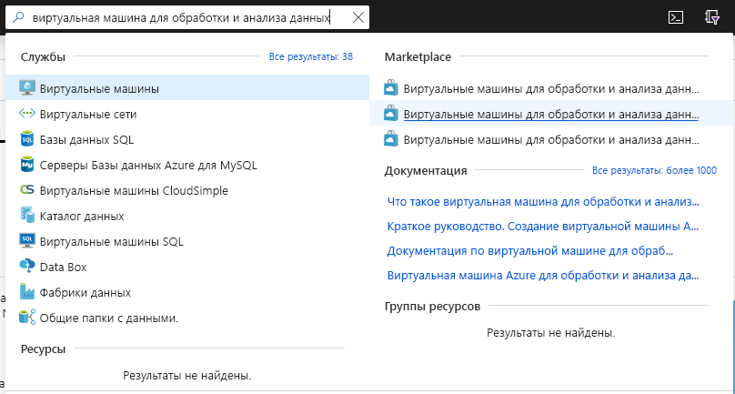
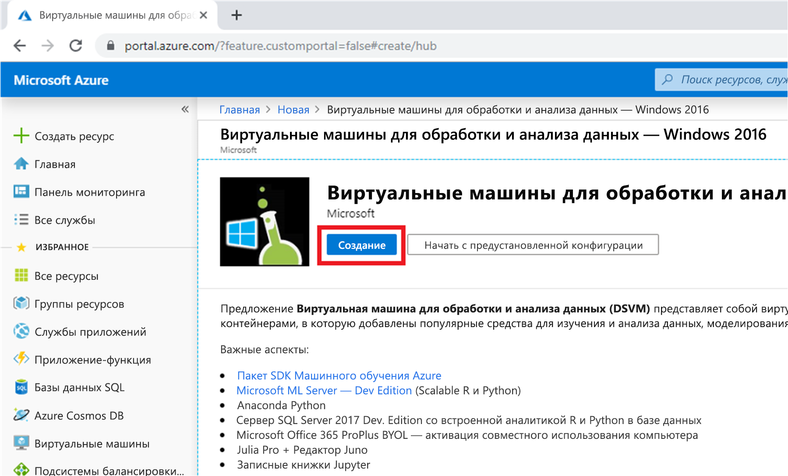
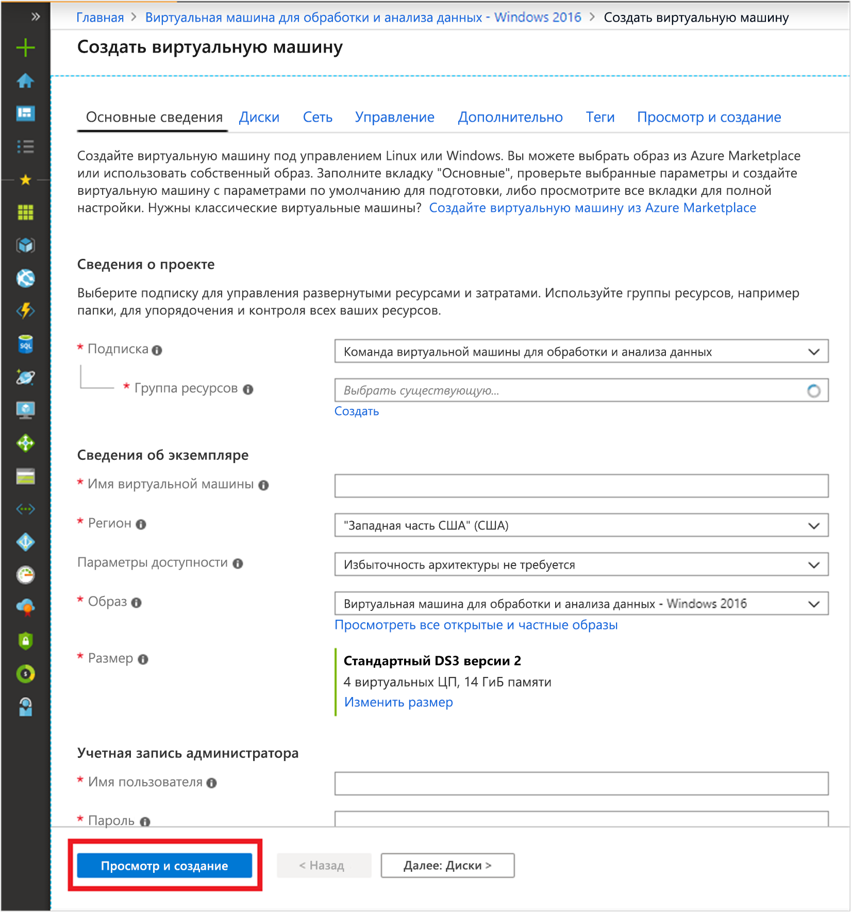

# Краткое руководство. Настройка виртуальной машины для обработки и анализа данных для Windows

Начните работу с виртуальной машиной Windows для обработки и анализа данных.

## Предварительные требования

Чтобы создать виртуальную машину Windows для обработки и анализа данных, вам потребуется подписка Azure. [Воспользуйтесь бесплатной пробной версией Azure](https://azure.com/free).
Обратите внимание, что бесплатные учетные записи Azure не поддерживают номера SKU виртуальных машин с поддержкой GPU.

## Создание виртуальной машины DSVM

Чтобы создать экземпляр виртуальной машины DSVM, сделайте следующее:

1. Войдите на [портал Azure](https://portal.azure.com). Если вы еще не вошли в свою учетную запись Azure, появится запрос на вход.
1. Найдите список виртуальных машин, введя команду "Виртуальная машина для обработки и анализа данных", и выберите "Виртуальная машина для обработки и анализа данных для Windows 2016."

    

1. В нижней части страницы нажмите кнопку **Создать**.

    

1. Вы будете перенаправлены в колонку "Создание виртуальной машины".
   

1. Заполните во вкладке **Основные сведения** следующие сведения:
      * **Подписка**: При наличии нескольких подписок выберите ту, в которой будет создана виртуальная машина и для которой будут выставляться счета. Вам необходимо иметь права на создание ресурсов для этой подписки.
      * **Группа ресурсов.** Создайте новую группу или используйте существующую.
      * **Имя виртуальной машины**. Введите имя виртуальной машины. Так оно будет отображаться на портале Azure.
      * **Расположение.** Выберите наиболее подходящий центр обработки данных. Чтобы ускорить доступ к сети, выбирайте центр обработки данных, в котором размещена большая часть ваших данных, или который ближе всего вашему физическому расположению. Дополнительные сведения о [Регионах Azure](https://azure.microsoft.com/global-infrastructure/regions/).
      * **Образ**. Оставьте значение по умолчанию.
      * **Размер**: Это поле должно автоматически заполняться размером, подходящим для общих рабочих нагрузок. Дополнительные сведения см. в разделе [Размеры виртуальных машин Windows в Azure](../../virtual-machines/windows/sizes.md).
      * **Имя пользователя**. Введите имя пользователя для учетной записи администратора. Это имя пользователя, которое будет использоваться для входа в виртуальную машину. Оно не должно совпадать с именем пользователя Azure.
      * **Пароль**. Введите пароль, который будет использоваться для входа в виртуальную машину.    
1. Выберите **Review + create** (Просмотреть и создать).
1. **Просмотреть и создать**
   * Убедитесь, что все сведения введены правильно. 
   * Нажмите кнопку **Создать**.

> [!NOTE]
> * Вы не оплачиваете лицензии на программное обеспечение, которое предварительно загружено на виртуальную машину. Вы оплачиваете вычислительную стоимость за размер сервера, выбранного на шаге **Размер**.
> * Подготовка занимает 10-20 минут. Состояние виртуальной машины отображается на портале Azure.

## Доступ к виртуальной машине DSVM

После создания и подготовки виртуальной машины, выполните перечисленные шаги, чтобы [подключиться к виртуальной машине на основе Azure](../../marketplace/cloud-partner-portal/virtual-machine/cpp-connect-vm.md). Используйте учетные данные администратора, настроенные на шаге создания виртуальной машины **Основные сведения**. 

Теперь все готово к использованию установленных и настроенных на виртуальной машине средств. Ко многим средствам можно получить доступ через значки на рабочем столе и элементы в меню **Пуск**.

Вы также можете подключить DSVM к службе "Записные книжки Azure", чтобы запускать записные книжки Jupyter на виртуальной машине и обходить ограничения уровня служб "Бесплатный". Дополнительные сведения см. в статье [Manage and configure Azure Notebooks projects](../../notebooks/configure-manage-azure-notebooks-projects.md#manage-and-configure-projects) (Управление и настройка проектов Записных книжек Azure).

## Дополнительная информация

* Изучите средства в DSVM, открыв меню **Пуск**.
* Дополнительные сведения о службе "Машинное обучение Azure" см. в [этой статье](../service/overview-what-is-azure-ml.md) и [руководствах](../index.yml).
* В проводнике перейдите к C:\Program Files\Microsoft\ML Server\R_SERVER\library\RevoScaleR\demoScripts, в котором размещены примеры использования библиотеки RevoScaleR в R, поддерживающей анализ данных на корпоративном уровне. 
* Ознакомьтесь со статьей [10 задач, которые можно выполнить на виртуальной машине для обработки и анализа данных](https://aka.ms/dsvmtenthings).
* Изучите систематический подход к созданию комплексных аналитических решений с помощью [группового процесса обработки и анализа данных](../team-data-science-process/index.yml).
* В [коллекции решений ИИ Azure](https://gallery.cortanaintelligence.com) можно найти примеры для машинного обучения и анализа данных, в которых используется служба "Машинное обучение Azure" и связанные с ней службы данных Azure. Мы также добавили значок на рабочий стол и элемент в меню **Пуск** для этой коллекции на виртуальной машине.
* Обратитесь к соответствующей [справочной документации](./reference-windows-vm.md) для этой виртуальной машины.

