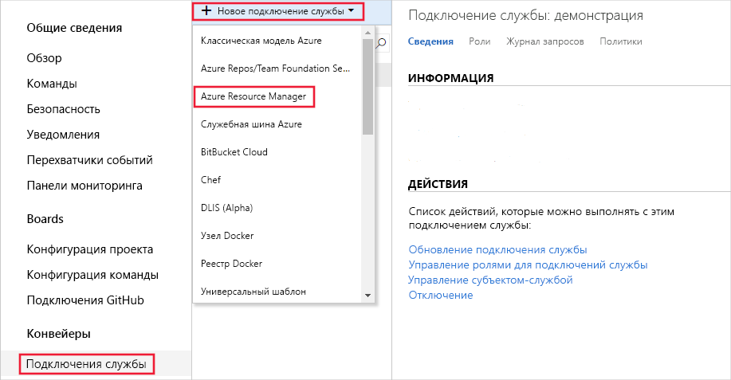
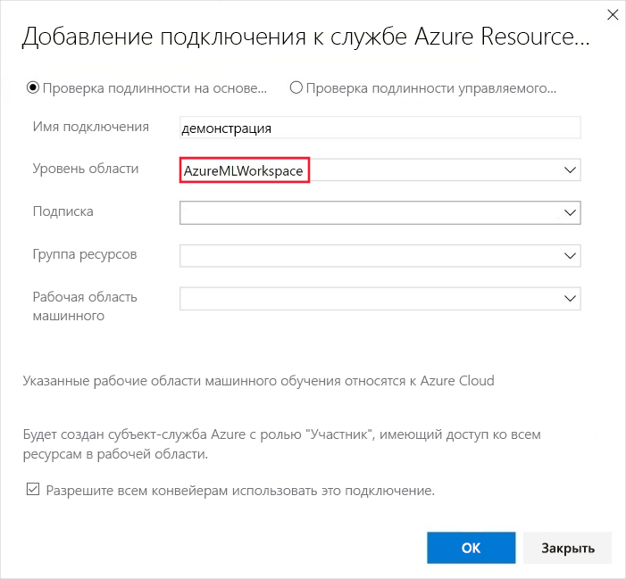
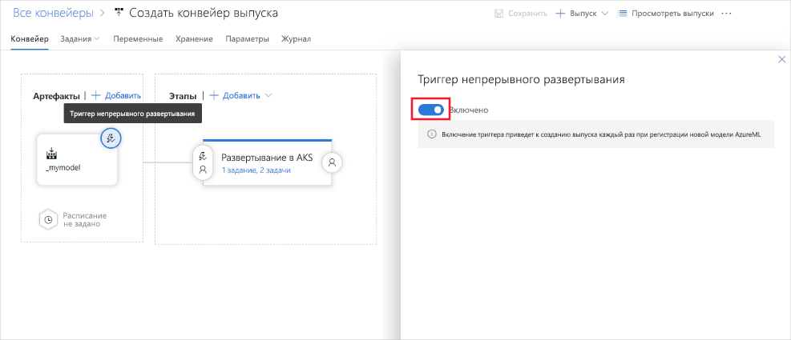

# Непрерывное развертывание моделей

В этой статье показано, как использовать непрерывное развертывание в Azure DevOps для автоматической проверки новых версий зарегистрированных моделей и отправки этих новых моделей в рабочую среду.

## Предварительные требования

В этой статье предполагается, что вы уже зарегистрировали модель в рабочей области Машинное обучение Azure. В [этом учебнике](how-to-train-scikit-learn.md) приведен пример обучения и регистрации модели scikit-учиться.

## Непрерывное развертывание моделей

Вы можете непрерывно развертывать модели с помощью расширения Машинное обучение для [Azure DevOps](https://azure.microsoft.com/services/devops/). Вы можете использовать расширение Машинное обучение для Azure DevOps, чтобы активировать конвейер развертывания при регистрации новой модели машинного обучения в Машинное обучение Azure рабочей области.

1. Подпишитесь на [Azure pipelines](/azure/devops/pipelines/get-started/pipelines-sign-up?view=azure-devops), что обеспечивает непрерывную интеграцию и доставку приложения на любую платформу или облако. (Обратите внимание, что Azure Pipelines не так же, как [машинное обучение конвейеры](concept-ml-pipelines.md#compare)).

1. [Создайте проект Azure DevOps.](/azure/devops/organizations/projects/create-project?view=azure-devops)

1. Установите [расширение машинное обучение для Azure pipelines](https://marketplace.visualstudio.com/items?itemName=ms-air-aiagility.vss-services-azureml&targetId=6756afbe-7032-4a36-9cb6-2771710cadc2&utm_source=vstsproduct&utm_medium=ExtHubManageList).

1. Используйте подключения к службам, чтобы настроить подключение субъекта-службы к рабочей области Машинное обучение Azure, чтобы получить доступ к артефактам. Последовательно выберите пункты Параметры проекта, **подключения к службе** и **Azure Resource Manager** :

    

1. В списке **область уровня области** выберите **азуремлворкспаце** и введите остальные значения:

    

1. Чтобы непрерывно развернуть модель машинного обучения с помощью Azure Pipelines, в разделе конвейеры выберите **выпуск**. Добавьте новый артефакт, а затем выберите артефакт **модели AzureML** и созданное ранее подключение службы. Выберите модель и версию для активации развертывания:

    

1. Включите триггер модели для артефакта модели. При включении триггера каждый раз, когда указанная версия (то есть самая последняя версия) в этой модели регистрируется в рабочей области, инициируется конвейер выпуска Azure DevOps.

    

## Дальнейшие действия

Дополнительные примеры непрерывного развертывания для моделей машинного обучения см. в приведенных ниже проектах на сайте GitHub.

* [Microsoft/MLOps](https://github.com/Microsoft/MLOps)
* [Microsoft/MLOpsPython](https://github.com/microsoft/MLOpsPython)