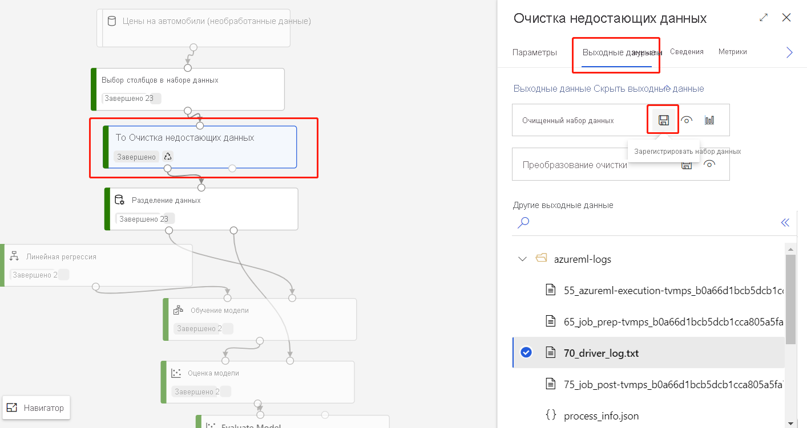

# Импортируйте данные в конструктор машинного обучения Azure (предварительный просмотр)

В этой статье вы узнаете, как импортировать собственные данные в конструкторе для создания пользовательских решений. Существует два способа импорта данных в конструктор: 

* **Наборы данных машинного обучения Azure** - Регистрируйте [наборы данных](concept-data.md#datasets) в Azure Machine Learning, чтобы включить расширенные функции, которые помогут управлять данными.
* **Модуль данных импорта** - Используйте модуль [данных импорта](algorithm-module-reference/import-data.md) для прямого доступа к данным из онлайновых источников данных.

## Используйте наборы данных машинного обучения Azure

Мы рекомендуем использовать [наборы данных](concept-data.md#datasets) для импорта данных в проектировщик. При регистрации набора данных можно в полной мере воспользоваться расширенными функциями данных, такими как [версия и отслеживание](how-to-version-track-datasets.md) и [мониторинг данных.](how-to-monitor-datasets.md)

### Регистрация набора данных

Вы можете зарегистрировать существующие наборы данных [программно с SDK](how-to-create-register-datasets.md#use-the-sdk) или [визуально в студии Машинного обучения Azure.](how-to-create-register-datasets.md#use-the-ui)

Вы также можете зарегистрировать выход для любого дизайнерского модуля в качестве набора данных.

1. Выберите модуль, который выводит данные, которые вы хотите зарегистрировать.

1. В панели свойств выберите**набор данных Регистра** **выходов.** > 

    

### Использование набора данных

Ваши зарегистрированные наборы данных можно найти в палитре модуля, в **наборах данных My Datasets.** > **My Datasets** Чтобы использовать набор данных, перетащите и перебросьте его на холст конвейера. Затем подключите выходной порт набора данных к другим модулям в палитре.

> [!NOTE]
> В настоящее время конструктор поддерживает только [наборы табликовых данных.](how-to-create-register-datasets.md#dataset-types) Если вы хотите использовать [наборы файлов,](how-to-create-register-datasets.md#dataset-types)используйте SDK Для машинного обучения Azure, доступный для Python и R.

## Данные об импорте с помощью модуля данных импорта

Хотя мы рекомендуем использовать наборы данных для импорта данных, вы также можете использовать модуль [данных импорта.](algorithm-module-reference/import-data.md) Модуль данных импорта пропускает регистрацию набора данных в Azure Machine Learning и импортирует данные непосредственно из [хранилища данных](concept-data.md#datastores) или URL HTTP.

Подробную информацию о том, как использовать модуль данных импорта, можно на [странице ссылки на импортные данные.](algorithm-module-reference/import-data.md)

> [!NOTE]
> Если в наборе данных слишком много столбцов, вы можете столкнуться со следующей ошибкой: "Проверка не удалась из-за ограничения размера". Чтобы избежать этого, [зарегистрируйте набор данных в интерфейсе Datasets.](how-to-create-register-datasets.md#use-the-ui)

## Поддерживаемые источники

В этом разделе перечислены источники данных, поддерживаемые конструктором. Данные поступают в конструктор либо из хранилища данных, либо из [таблисного набора данных.](how-to-create-register-datasets.md#dataset-types)

### Источники хранилища данных
Список поддерживаемых источников хранилища данных смотрите [в службах хранения данных Azure.](how-to-access-data.md#supported-data-storage-service-types)

### Табулярные источники набора данных

Дизайнер поддерживает таблетные наборы данных, созданные из следующих источников:
 * Файлы с разделителями
 * файлы JSON;
 * файлы Parquet;
 * SQL-запросы

## Типы данных

Дизайнер внутренне распознает следующие типы данных:

* Строка
* Целое число
* Decimal
* Логическое
* Дата

Конструктор использует внутренний тип данных для передачи данных между модулями. Можно явно преобразовать данные в формат таблицы данных с помощью модуля [Convert to Dataset.](algorithm-module-reference/convert-to-dataset.md) Любой модуль, принимающий форматы, отличные от внутреннего формата, преобразует данные молча, прежде чем передавать их в следующий модуль.

## Ограничения в данных

Модули в конструкторе ограничены размером вычислительной цели. Для больших наборов данных следует использовать более крупный вычислительный ресурс Azure Machine Learning. Для получения дополнительной информации о вычислениях машинного обучения Azure [см.](concept-compute-target.md#azure-machine-learning-compute-managed)

## Дальнейшие действия

Узнайте основы дизайнера с [учебником: Предсказать цену автомобиля с дизайнером](tutorial-designer-automobile-price-train-score.md).
