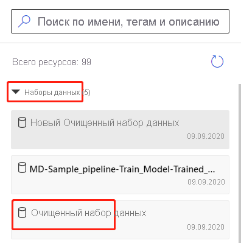

# Импорт данных в конструктор Машинное обучение Azure (Предварительная версия)

Из этой статьи вы узнаете, как импортировать собственные данные в конструктор, чтобы создавать пользовательские решения. Импортировать данные в конструктор можно двумя способами. 

* **Наборы данных Машинного обучения Azure**. Зарегистрируйте [наборы данных](concept-data.md#datasets) в Машинном обучении Azure, чтобы включить дополнительные функции, помогающие управлять данными.
* **Модуль импорта данных**. Используйте модуль [импорта данных](algorithm-module-reference/import-data.md) для прямого доступа к данным из подключенных источников данных.

[!INCLUDE [machine-learning-missing-ui](../../includes/machine-learning-missing-ui.md)]

## Использование наборов данных Машинного обучения Azure

Чтобы импортировать данные в конструктор, рекомендуется использовать [наборы данных](concept-data.md#datasets). Зарегистрировав набор данных, можно воспользоваться всеми преимуществами расширенных функций обработки данных, такими как [управление версиями и отслеживание](how-to-version-track-datasets.md) и [мониторинг данных](how-to-monitor-datasets.md).

### Регистрация набора данных

Имеющиеся наборы данных можно зарегистрировать [программно с помощью пакета SDK](how-to-create-register-datasets.md#use-the-sdk) или [вручную в Студии машинного обучения Azure](how-to-create-register-datasets.md#use-the-ui).

Можно также зарегистрировать в качестве набора данных выходные данные любого модуля конструктора.

1. Выберите модуль, выводящий данные, которые необходимо зарегистрировать.

1. В области "Свойства" выберите **Выходные данные** > **Регистрация набора данных**.

    

### Использование набора данных

Зарегистрированные наборы данных можно найти на палитре модулей в разделе **Наборы данных** > **Мои наборы данных**. Чтобы использовать набор данных, перетащите его на холст конвейера. Затем подключите порт вывода набора данных к другим модулям на палитре.

> [!NOTE]
> В настоящее время конструктор поддерживает обработку только [табличных наборов данных](how-to-create-register-datasets.md#dataset-types). Если вы хотите использовать [файловые наборы данных](how-to-create-register-datasets.md#dataset-types), воспользуйтесь соответствующим пакетом SDK для Машинного обучения Azure. Эти пакеты доступны для Python и R.

## Импорт данных с помощью модуля импорта данных

Хотя мы рекомендуем использовать для импорта наборы данных, можно также использовать модуль [импорта данных](algorithm-module-reference/import-data.md). Модуль импорта данных пропускает регистрацию набора данных в Машинном обучении Azure и импортирует данные непосредственно из [хранилища данных](concept-data.md#datastores) или URL-адреса HTTP.

Подробные сведения об использовании модуля импорта данных см. на странице [справочных материалов по импорту данных](algorithm-module-reference/import-data.md).

> [!NOTE]
> Если набор данных содержит слишком много столбцов, может возникнуть следующая ошибка: "Сбой проверки из-за ограничения размера". Чтобы избежать этой ошибки, [зарегистрируйте набор данных в интерфейсе наборов данных](how-to-create-register-datasets.md#use-the-ui).

## Поддерживаемые источники

В этом разделе перечислены источники данных, поддерживаемые конструктором. Конструктор принимает данные из хранилища данных либо из [табличного набора данных](how-to-create-register-datasets.md#dataset-types).

### Источники хранилища данных
Список поддерживаемых источников хранилища данных см. в разделе [Доступ к данным в службах хранилища Azure](how-to-access-data.md#supported-data-storage-service-types).

### Источники табличных наборов данных

Конструктор поддерживает табличные наборы данных, созданные на основе следующих источников:
 * файлы с разделителями;
 * файлы JSON;
 * файлы Parquet;
 * SQL-запросы

## Типы данных

Конструктор распознает следующие типы данных:

* Строка
* Целое число
* Decimal
* Логическое
* Дата

Для передачи данных между модулями конструктор использует внутренний тип данных. Данные можно явно преобразовать в формат таблицы данных с использованием модуля [преобразования в набор данных](algorithm-module-reference/convert-to-dataset.md). Любые модули, которые принимают форматы, отличные от внутреннего формата, перед передачей данных в следующий модуль автоматически преобразуют данные.

## Ограничения данных

Модули в конструкторе ограничены размером целевого объекта вычислений. Для больших наборов данных следует использовать больший ресурс Машинного обучения Azure. Дополнительные сведения о вычислениях в Машинном обучении Azure см. в разделе [Что такое целевые вычисления в Машинном обучении Azure?](concept-compute-target.md#azure-machine-learning-compute-managed)

## Доступ к данным в виртуальной сети

Если Рабочая область находится в виртуальной сети, необходимо выполнить дополнительные действия по настройке для визуализации данных в конструкторе. Дополнительные сведения о том, как использовать хранилища и наборы данных в виртуальной сети, см. в статье [Сетевая изоляция во время обучения & вывода с частными виртуальными сетями](how-to-enable-virtual-network.md#machine-learning-studio).

## Дальнейшие действия

Изучите основы работы с конструктором: [Учебник. Прогнозирование цен на автомобили с помощью конструктора](tutorial-designer-automobile-price-train-score.md).
