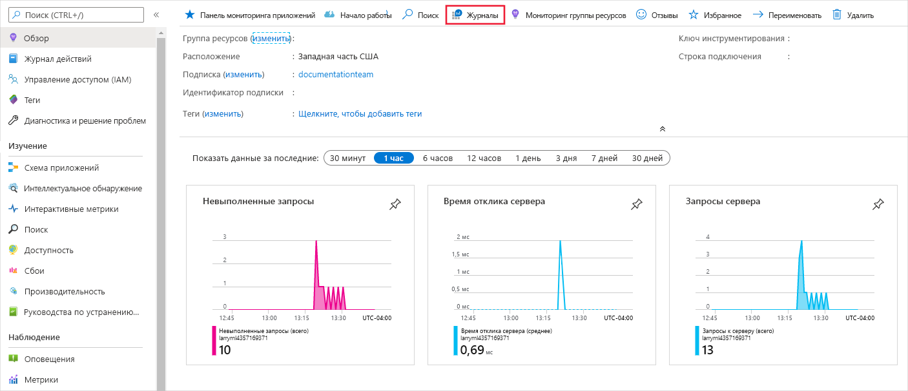

# <a name="monitor-and-collect-data-from-ml-web-service-endpoints"></a>Мониторинг и сбор данных с конечных точек веб-сервиса ML
[!INCLUDE [applies-to-skus](../../includes/aml-applies-to-basic-enterprise-sku.md)]

В этой статье вы узнаете, как собирать данные с и контролировать модели, развернутые в конечных точках веб-службы в Azure Kubernetes Service (AKS) или Azure Container Instances (ACI), позволяя Azure Application Insights использовать 
* [Лазурное машинное обучение Python SDK](#python)
* [Студия машинного обучения Azure](#studio) вhttps://ml.azure.com

В дополнение к сбору выходных данных и ответов конечных точек, вы можете контролировать:

* Частоты запросов, времени отклика и частоты сбоев.
* Частоты зависимостей, времени отклика и частоты сбоев.
* Исключения

[Узнайте больше об исследованиях приложений Azure](../azure-monitor/app/app-insights-overview.md). 


## <a name="prerequisites"></a>Предварительные требования

* Если у вас еще нет подписки Azure, создайте бесплатную учетную запись, прежде чем начинать работу. Попробуйте [бесплатную или платную версию машинного обучения Azure](https://aka.ms/AMLFree) сегодня

* Должны быть установлены рабочая область машинного обучения Azure, локальный каталог со скриптами и пакет SDK машинного обучения Azure для Python. Чтобы узнать, как получить [How to configure a development environment](how-to-configure-environment.md) эти предпосылки, см.

* Обученная модель машинного обучения для развертывания в службе Azure Kubernetes (AKS) или в экземпляре контейнера Azure (ACI). Если у вас его нет, [см.](tutorial-train-models-with-aml.md)

## <a name="web-service-metadata-and-response-data"></a>Метаданные web-службы и данные ответов

>[!Important]
> Azure Application Insights регистрирует только полезные нагрузки до 64kb. Если этот предел достигнут, то регистрируются только самые последние выходы модели. 

Метаданные и ответ на службу, соответствующие метаданным веб-сервиса и прогнозам модели, регистрируются в azure `"model_data_collection"`Application Insights под сообщением. Вы можете запросить Azure Application Insights непосредственно для доступа к этим данным или настроить [непрерывный экспорт](https://docs.microsoft.com/azure/azure-monitor/app/export-telemetry) на учетную запись хранения для более длительного хранения или дальнейшей обработки. Данные модели могут быть использованы в Машинном обучении Azure для настройки маркировки, переподготовки, объяснимости, анализа данных или другого использования. 

<a name="python"></a>

## <a name="use-python-sdk-to-configure"></a>Используйте Python SDK для настройки 

### <a name="update-a-deployed-service"></a>Обновление развернутой службы

1. Найдите службу в рабочей области. Значение — `ws` это название рабочего пространства

    ```python
    from azureml.core.webservice import Webservice
    aks_service= Webservice(ws, "my-service-name")
    ```
2. Обновите службу и включите исследования приложений Azure

    ```python
    aks_service.update(enable_app_insights=True)
    ```

### <a name="log-custom-traces-in-your-service"></a>Трассировка пользовательских журналов в службе

Если требуется вести журнал пользовательских трассировок, выполните инструкции из руководства по стандартному процессу развертывания для AKS или ACI, представленные в документе [Deploy models with the Azure Machine Learning service](how-to-deploy-and-where.md) (Развертывание моделей с помощью Службы машинного обучения Azure). Затем выполните следующие действия:

1. Обновление скорингового файла путем добавления печатных заявлений
    
    ```python
    print ("model initialized" + time.strftime("%H:%M:%S"))
    ```

2. Обновление конфигурации службы
    
    ```python
    config = Webservice.deploy_configuration(enable_app_insights=True)
    ```

3. Создайте образ и разверните его в [AKS или ACI](how-to-deploy-and-where.md).

### <a name="disable-tracking-in-python"></a>Отключение наблюдения в Python

Чтобы отключить Azure Application Insights, используйте следующий код:

```python 
## replace <service_name> with the name of the web service
<service_name>.update(enable_app_insights=False)
```

<a name="studio"></a>

## <a name="use-azure-machine-learning-studio-to-configure"></a>Используйте студию машинного обучения Azure для настройки

Вы также можете включить Azure Application Insights из студии машинного обучения Azure, когда вы будете готовы развернуть модель с помощью этих шагов.

1. Войти на рабочее место по адресуhttps://ml.azure.com/
1. Перейдите к **моделям** и выберите, какую модель вы хотите развернуть
1. Выберите **«Развертывание»**
1. Заполнить форму **модели развертываем**
1. Расширить **расширенное** меню

    
1. Выберите **диагностику и сбор данных для получения приложений и приложений**

    
## <a name="evaluate-data"></a>Данные оценки
Данные службы хранятся в учетной записи Azure Application Insights в той же группе ресурсов, что и Azure Machine Learning.
Чтобы их просмотреть:

1. Перейдите в рабочее пространство Azure Machine Learning на [портале Azure](https://ms.portal.azure.com/) и нажмите на ссылку Application Insights

    [](././media/how-to-enable-app-insights/AppInsightsLoc.png#lightbox)

1. Выберите вкладку **«Обзор»,** чтобы увидеть базовый набор метрик для службы

   [](././media/how-to-enable-app-insights/overview.png#lightbox)

1. Чтобы изучить метаданные и ответы веб-службы, выберите таблицу **запросов** в разделе **Журналы (Аналитика)** и выберите **Run** для просмотра запросов

   [](././media/how-to-enable-app-insights/model-data-trace.png#lightbox)


3. Чтобы заглянуть в пользовательские следы, выберите **Analytics**
4. В разделе схемы выберите **Трассировки**. Затем выберите **Запуск**, чтобы выполнить запрос. Данные должны отображаться в формате таблицы и должны отображаться на пользовательских вызовах в файле скоринга

   [](././media/how-to-enable-app-insights/logs.png#lightbox)

Подробнее о том, как использовать azure Application Insights, можно узнать: [Что такое анализ приложений?.](../azure-monitor/app/app-insights-overview.md)

## <a name="export-data-for-further-processing-and-longer-retention"></a>Экспортные данные для дальнейшей обработки и более длительного хранения

>[!Important]
> Azure Application Insights поддерживает экспорт только для хранения каблов. Дополнительные ограничения этой экспортной возможности перечислены в [телеметрии Экспорта от App Insights](https://docs.microsoft.com/azure/azure-monitor/app/export-telemetry#continuous-export-advanced-storage-configuration).

Для отправки сообщений в поддерживаемую учетную запись хранилища можно использовать [непрерывный экспорт](https://docs.microsoft.com/azure/azure-monitor/app/export-telemetry) Azure Application Insights, где можно установить более длительное удержание. Сообщения `"model_data_collection"` хранятся в формате JSON и могут быть легко разогнаны для извлечения данных модели. 

Для преобразования данных по мере необходимости можно использовать фабрику данных Azure, провода Azure ML или другие инструменты обработки данных. При преобразовании данных можно зарегистрировать их в рабочем пространстве Azure Machine Learning в качестве набора данных. Для этого см. [Как создать и зарегистрировать наборы данных.](how-to-create-register-datasets.md)

   [](././media/how-to-enable-app-insights/continuous-export-setup.png)


## <a name="example-notebook"></a>Пример записной книжки

Ноутбук [enable-app-insights-in-production-service.ipynb](https://github.com/Azure/MachineLearningNotebooks/blob/master/how-to-use-azureml/deployment/enable-app-insights-in-production-service/enable-app-insights-in-production-service.ipynb) демонстрирует концепции в этой статье. 
 
[!INCLUDE [aml-clone-in-azure-notebook](../../includes/aml-clone-for-examples.md)]

## <a name="next-steps"></a>Дальнейшие действия

* Узнайте, как развернуть модель в [кластере службы Azure Kubernetes](https://docs.microsoft.com/azure/machine-learning/how-to-deploy-azure-kubernetes-service) или [как развернуть модель в контейнерных инстанциях Azure](https://docs.microsoft.com/azure/machine-learning/how-to-deploy-azure-container-instance) для развертывания моделей в конечных точках веб-службы, а также включить Azure Application Insights в использование сбора данных и мониторинга конечных точек
* [См. MLOps: Управление, развертывание и мониторинг моделей с помощью Azure Machine Learning,](https://docs.microsoft.com/azure/machine-learning/concept-model-management-and-deployment) чтобы узнать больше о использовании данных, собранных с моделей в производстве. Такие данные могут помочь постоянно улучшать процесс машинного обучения
