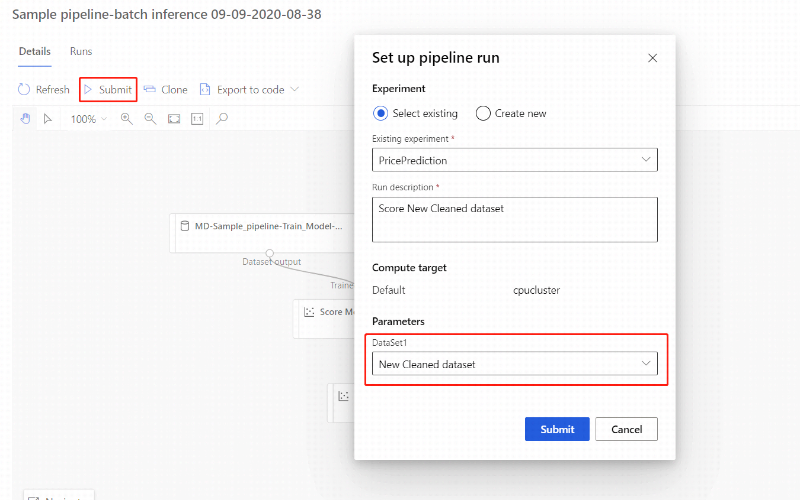

# Выполнение пакетных прогнозов с помощью конструктора Машинного обучения Azure (предварительная версия)
[!INCLUDE [applies-to-skus](../../includes/aml-applies-to-enterprise-sku.md)]

В этой статье вы узнаете, как использовать конструктор для создания конвейера прогнозирования пакетов. Прогнозирование пакетов позволяет непрерывно набирать большие наборы данных по требованию с помощью веб-службы, которая может быть запущена из любой библиотеки HTTP.

В этом способе, вы научитесь делать следующие задачи:

> [!div class="checklist"]
> * Создание и публикация конвейера выводов пакетов
> * Потребляйте конечную точку конвейера
> * Управление конечными версиями

Чтобы узнать, как настроить пакетные скоринговые [how-to](how-to-run-batch-predictions.md)службы с помощью SDK, см.

## Предварительные требования

Это как-предполагая, что у вас уже есть учебный конвейер. Для руководствоваться введением в дизайнер, полная [часть одного из дизайнеручебник .](tutorial-designer-automobile-price-train-score.md) 

## Создание конвейера пакетного вывода

Ваш конвейер обучения должен быть запущен по крайней мере один раз, чтобы иметь возможность создать вывод трубопровода.

1. Перейдите на вкладку **Designer** в рабочем пространстве.

1. Выберите конвейер обучения, который обучает модель, которую вы хотите использовать для прогнозирования.

1. **Отправить** конвейер.

    

Теперь, когда конвейер обучения запущен, можно создать пакетный конвейер выводов.

1. Далее в **рубрике Отправить,** выберите новый конвейер выводов для **выпадения.**

1. Выберите **конвейер выводов пакета.**

    
    
Результатом является конвейер пакетного вывода по умолчанию. 

### Добавление параметра конвейера

Для создания прогнозов на новых данных можно либо вручную подключить другой набор данных в этом представлении проекта конвейера, либо создать параметр для набора данных. Параметры позволяют изменить поведение процесса выводов партии во время выполнения.

В этом разделе создается параметр набора данных для определения другого набора данных для прогнозирования.

1. Выберите модуль набора данных.

1. Справа от холста появится панель. В нижней части панели выберите **Установить в качестве параметра трубопровода.**
   
    Введите имя для параметра или примите значение по умолчанию.

## Опубликовать конвейер выводов партии

Теперь вы готовы развернуть вывод трубопровода. Это развернет конвейер и сделает его доступным для других.

1. Нажмите кнопку **Опубликовать**.

1. В диалоге, который появляется, расширить падение вниз для **PipelineEndpoint**, и выберите **Новый PipelineEndpoint**.

1. Предоставьте имя конечной точки и дополнительное описание.

    В нижней части диалога можно увидеть параметр, настроенный с значением по умолчанию идентификатора набора данных, используемого во время обучения.

1. Нажмите кнопку **Опубликовать**.

## Потребляйте конечную точку

Теперь у вас есть опубликованный конвейер с параметром набора данных. Конвейер будет использовать обученную модель, созданную в учебном конвейере, для оценки набора данных, который вы предоставляете в качестве параметра.

### Отправить запуск конвейера 

В этом разделе вы наберете ручной запуск конвейера и измените параметр конвейера для оценки новых данных. 

1. После завершения развертывания перейдите в раздел **Endpoints.**

1. Выберите **конечные точки трубопровода.**

1. Выберите имя созданной конечной точки.

1. Выберите **опубликованные конвейеры**.

    На этом экране показаны все опубликованные конвейеры, опубликованные в соответствии с этой конечной точкой.

1. Выберите опубликованный конвейер.

    Страница сведения о конвейере показывает подробную историю выполнения и информацию о строке соединения для конвейера. 
    
1. Выберите **отправку** для создания ручного запуска конвейера.

    
    
1. Измените параметр для использования другого набора данных.
    
1. Выберите **Отправку** для запуска конвейера.

### Используйте конечную точку REST

Вы можете найти информацию о том, как использовать конечные точки конвейера и опубликованные трубопроводы в разделе **Endpoints.**

Конечную точку REST в конечной точке конвейера можно найти в панели обзора выполнения. Вызывая конечную точку, вы потребляете ее опубликованный конвейер по умолчанию.

Можно также использовать опубликованный конвейер на странице **опубликованных конвейеров.** Выберите опубликованный конвейер и найдите его конечную точку REST. 

Чтобы сделать вызов REST, вам понадобится заголовок аутентификации типа OAuth 2.0. Дополнительные сведения о настройке аутентификации в рабочей области и выполнении параметризованного вызова REST см. в следующем [разделе руководства](tutorial-pipeline-batch-scoring-classification.md#publish-and-run-from-a-rest-endpoint).

## Версии конечных точек

Конструктор присваивает версию каждому последующему конвейеру, который вы публикуете, в конечную точку. Можно указать версию конвейера, которую требуется выполнить в качестве параметра в вызове REST. Если вы не укажете номер версии, конструктор будет использовать конвейер по умолчанию.

При публикации конвейера можно сделать его новым конвейером по умолчанию для этой конечной точки.

Можно также установить новый конвейер по умолчанию во вкладке **«Опубликовано конвейеров»** конечной точки.

## Дальнейшие действия

Следуйте [учебник](tutorial-designer-automobile-price-train-score.md) удувать для обучения и развертывания модели регрессии.
''