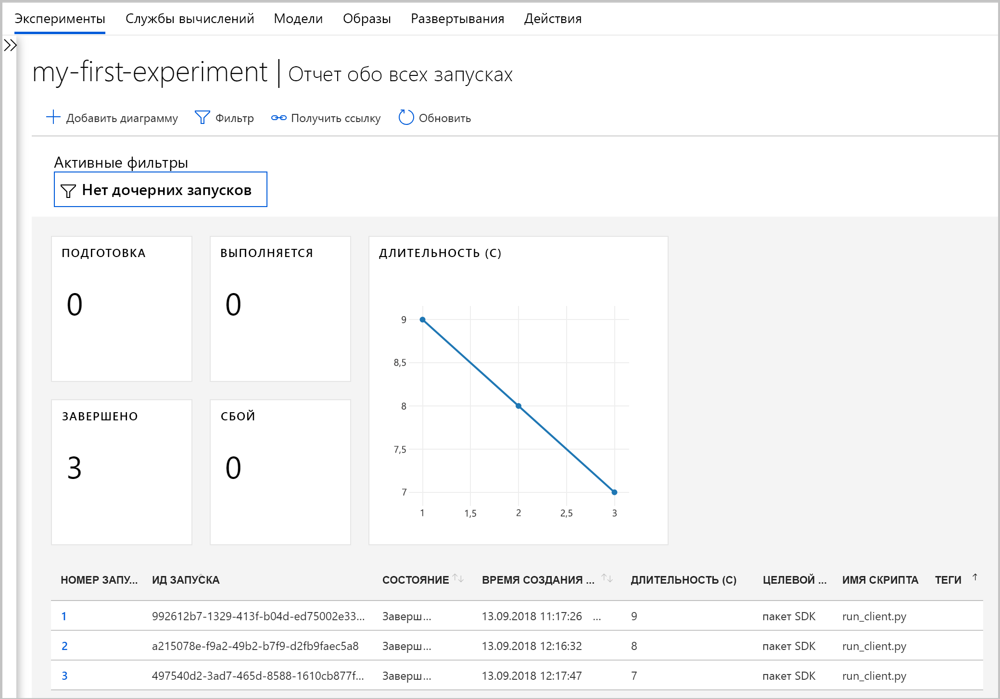

# <a name="what-happened-to-azure-machine-learning-workbench"></a>Что случилось с Azure Machine Learning Workbench?

Приложение Azure Machine Learning Workbench и некоторые другие ранние функции устарели и были заменены в выпуске за **сентябрь 2018 г.** в рамках процесса улучшения [архитектуры](concept-azure-machine-learning-architecture.md).

Этот выпуск содержит множество существенных обновлений, внесенных с учетом отзывов клиентов для улучшения удобства работы. Изменения не коснулись основных функций службы, начиная от запуска эксперимента и кончая развертыванием модели. Но теперь в вашем распоряжении надежные пакеты <a href="https://docs.microsoft.com/python/api/overview/azure/ml/intro?view=azure-ml-py" target="_blank">Python SDK</a>, R SDK и [интерфейс командной строки Azure](reference-azure-machine-learning-cli.md) для выполнения задач и конвейеров машинного обучения.

Большинство артефактов, которые были созданы в предыдущей версии Машинного обучения Azure, хранятся в вашем локальном или облачном хранилище. Эти артефакты не исчезнут.

В этой статье рассказывается, что было изменено и как эти изменения повлияют на уже существующие применения службы Azure Machine Learning Workbench и ее API.

>[!Warning]
>Эта статья не предназначена для пользователей студии машинного обучения Azure. Она предназначена для пользователей Машинного обучения Azure, которые установили приложение Workbench (предварительная версия) и (или) у которых есть учетные записи для экспериментирования и управления моделями.


## <a name="what-changed"></a>Что изменилось?

Последний выпуск Машинного обучения Azure включает следующие возможности:
+ [Упрощенная модель ресурсов Azure](concept-azure-machine-learning-architecture.md).
+ [Новый пользовательский интерфейс портала](how-to-track-experiments.md) для управления экспериментами и целевыми объектами вычислений.
+ Новый, более полный <a href="https://docs.microsoft.com/python/api/overview/azure/ml/intro?view=azure-ml-py" target="_blank">пакет SDK</a>для Python.
+ Обновленное и дополненное [расширение интерфейса командной строки Azure](reference-azure-machine-learning-cli.md) для машинного обучения

Переработанная [архитектура](concept-azure-machine-learning-architecture.md) для упрощения использования. Вместо нескольких ресурсов Azure и учетных записей требуется только [рабочая область машинного обучения Azure](concept-workspace.md). Новые рабочие области можно быстро создать на [портале Azure](how-to-manage-workspace.md). Рабочая область позволяет нескольким пользователя хранить целевые объекты вычислений для обучения и развертывания, экспериментов с моделями, образов Docker, развернутых моделей и т. д.

Текущий выпуск предоставляет обновленные и улучшенные клиенты для работы с интерфейсом командной строки и пакетом SDK, но само классическое приложение Workbench является устаревшим. На панели мониторинга рабочей области [студии машинного обучения Azure](how-to-monitor-view-training-logs.md#view-the-experiment-in-the-web-portal) можно управлять экспериментами. Используйте панель мониторинга, чтобы просматривать историю эксперимента, управлять целевыми объектами вычислений, подключенными к рабочей области, управлять моделями и образами Docker и даже развертывать веб-службы.

<a name="timeline"></a>

## <a name="support-timeline"></a>Сроки поддержки

9 января 2019. Поддержка Машинное обучение Workbench, учетных записей Экспериментирование в Машинном обучении Azure и Управление моделями, а также связанных с ними пакетов SDK и CLI завершена.

Все новейшие возможности доступны при использовании нового <a href="https://docs.microsoft.com/python/api/overview/azure/ml/intro?view=azure-ml-py" target="_blank">пакета SDK</a>, [интерфейса командной строки](reference-azure-machine-learning-cli.md) и [портала](how-to-manage-workspace.md).

## <a name="what-about-run-histories"></a>Что будет с журналами выполнения?

Старые журналы выполнения становятся недоступными. Вы можете просмотреть ваши запуски в последней версии.

Теперь журналы выполнения называются **экспериментами**. Вы можете собрать эксперименты модели и исследовать их, используя пакет SDK, интерфейс командной строки или студию машинного обучения Azure.

Панель мониторинга для рабочей области на портале поддерживается только в браузерах Microsoft Edge, Chrome и Firefox.

[](./media/overview-what-happened-to-workbench/image001.png#lightbox)

Начните обучать свои модели и отслеживать журналы выполнения, используя новый интерфейс командной строки и новый пакет SDK. Чтобы узнать, как это сделать, см. руководство по[обучению моделей с помощью Машинного обучения Azure](tutorial-train-models-with-aml.md).

## <a name="will-projects-persist"></a>Сохранятся ли проекты?

Никакой код и никакие наработки не будут потеряны. В более ранней версии проекты являются объектами облака с локальным каталогом. В последней версии локальные каталоги связываются с рабочей областью Машинного обучения Azure с помощью локального файла конфигурации. См. [схему последней архитектуры](concept-azure-machine-learning-architecture.md).

Большая часть содержимого проекта уже находится на локальном компьютере. Это означает, что для подключения к рабочей области осталось создать в этом каталоге файл конфигурации добавить в код ссылку для подключения к рабочей области. Чтобы продолжить использовать локальный каталог, содержащий файлы и скрипты, укажите имя каталога в команде Python ["experiment.submit"](https://docs.microsoft.com/python/api/azureml-core/azureml.core.experiment.experiment?view=azure-ml-py&preserve-view=true) или с помощью команды интерфейса командной строки `az ml project attach`.  Пример:
```python
run = exp.submit(source_directory=script_folder,
                 script='train.py', run_config=run_config_system_managed)
```

[Создайте рабочую область](how-to-manage-workspace.md), чтобы приступить к работе.

## <a name="what-about-my-registered-models-and-images"></a>Что будет с уже зарегистрированными моделями и образами?

Если нужно продолжить использование моделей, уже зарегистрированных в старом реестре моделей, их необходимо перенести в новую рабочую область. Чтобы перенести модели, скачайте их и повторно зарегистрируйте в новой рабочей области.

Образы, созданные в старом реестре образов, нельзя перенести напрямую в новую рабочую область. В большинстве случаев модели можно развернуть без создания образа. При необходимости можно создать образ для модели в новой рабочей области. Дополнительные сведения см. в разделе [MLOps: Администрирование, развертывание и мониторинг моделей с помощью службы "Машинное обучение Azure"](concept-model-management-and-deployment.md).

## <a name="what-about-deployed-web-services"></a>Что случится с развернутыми веб-службами?

По завершении поддержки старой версии интерфейса командной строки вы больше не сможете повторить развертывание моделей или управлять веб-службами, которые изначально были развернуты с помощью вашей учетной записи Управления моделями. Но эти веб-службы продолжат работать, пока будет поддерживаться служба контейнеров Azure (ACS).

В последней версии модели развертываются как веб-службы в экземпляры контейнеров Azure (ACI) или в кластеры службы Azure Kubernetes (AKS). Можно также выполнить развертывание в FPGA и Azure IoT Edge.

Дополнительные сведения содержатся в следующих статьях:
+ [Развертывание моделей с помощью Службы машинного обучения Azure](how-to-deploy-and-where.md)
+ [Учебник. Развертывание моделей с помощью Машинное обучение Azure](tutorial-deploy-models-with-aml.md)

## <a name="next-steps"></a>Дальнейшие действия

Узнайте об [актуальной архитектуре Машинного обучения Azure](concept-azure-machine-learning-architecture.md).

См. сведения о [Машинном обучении Azure](overview-what-is-azure-ml.md).

Создайте свой первый эксперимент предпочитаемым способом.
  + [Использование записных книжек Python](tutorial-1st-experiment-sdk-setup.md)
  + [Использование R Markdown](tutorial-1st-r-experiment.md) 
  + [Использование автоматического машинного обучения](tutorial-designer-automobile-price-train-score.md) 
  + [Использование возможностей перетаскивания конструктора](tutorial-first-experiment-automated-ml.md) 
  + [Использование расширения машинного обучения для интерфейса командной строки](tutorial-train-deploy-model-cli.md)
