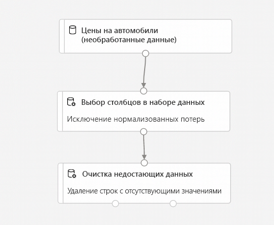
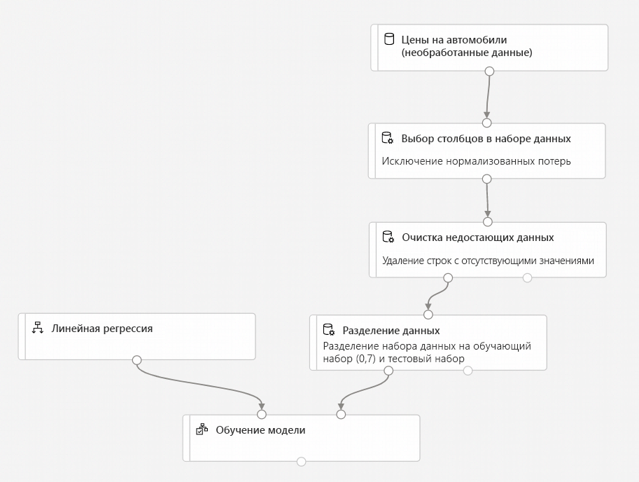
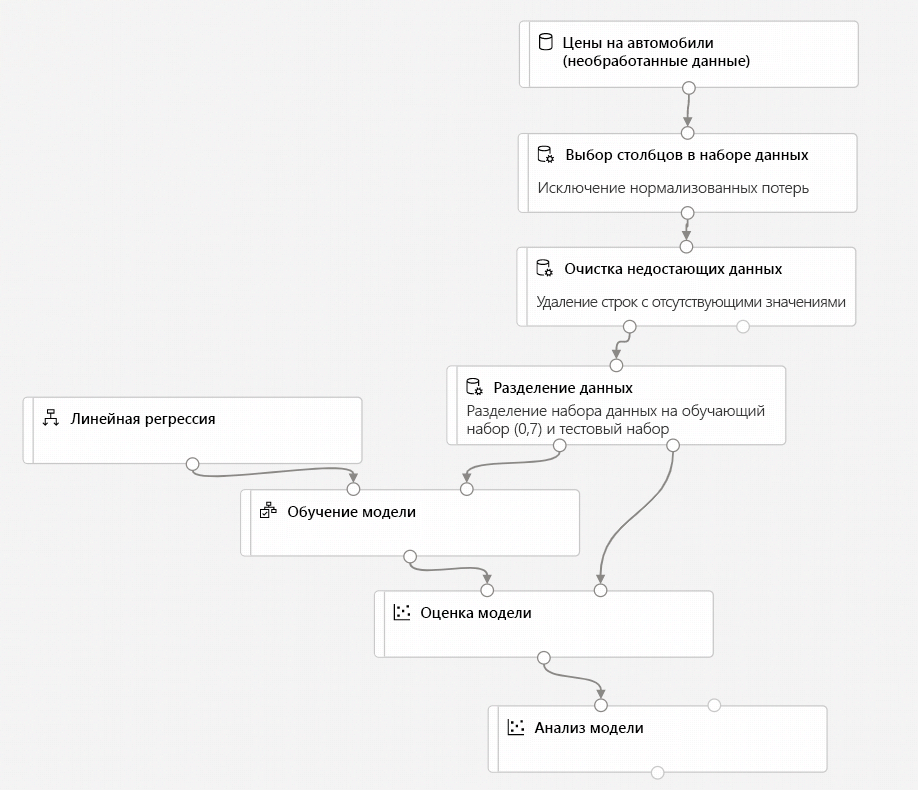
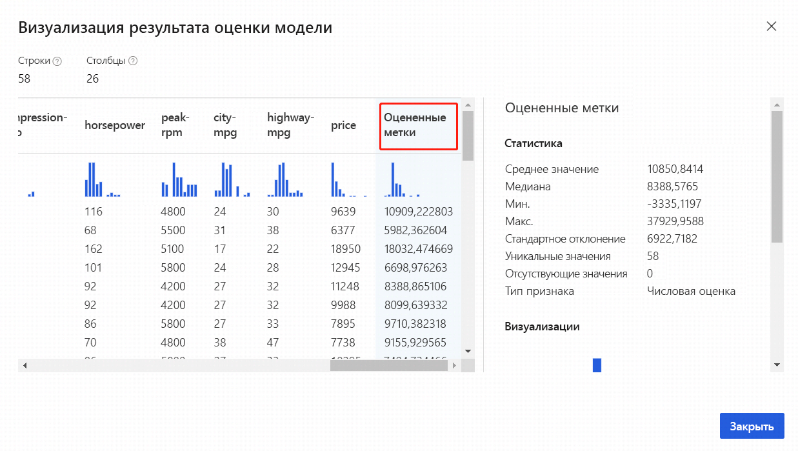

# Руководство по прогнозированию цен на автомобили с помощью конструктора (предварительная версия)
[!INCLUDE [applies-to-skus](../../includes/aml-applies-to-enterprise-sku.md)]

Из этого руководства, состоящего из двух частей, вы узнаете, как использовать конструктор Машинного обучения Azure для обучения и развертывания модели машинного обучения для прогнозирования цены любого автомобиля. Конструктор — это средство перетаскивания, которое позволяет создавать модели машинного обучения без единой строки кода.

В первой части учебника вы узнаете, как:

> [!div class="checklist"]
> * создать конвейер;
> * импортировать данные;
> * подготовить данные;
> * обучить модель машинного обучения;
> * оценить модель машинного обучения.

Во [второй части](tutorial-designer-automobile-price-deploy.md) этого учебника вы узнаете, как развернуть модель в виде конечной точки вывода в реальном времени и прогнозировать цену любого автомобиля, исходя из отправленных технических характеристик. 

> [!NOTE]
>Готовая версия этого руководства доступна в качестве примера конвейера.
>
>Вы можете найти ее в конструкторе в рабочей области. В разделе **Новый конвейер** выберите **Sample 1 - Regression: Automobile Price Prediction (Basic)** (Пример 1. Регрессия. Прогнозирование цен на автомобили (простой вариант)).

## Создание конвейера

Конвейеры Машинного обучения Azure объединяют несколько этапов машинного обучения и обработки данных в одном ресурсе. Конвейеры позволяют организовывать, администрировать и повторно использовать сложные рабочие процессы машинного обучения с несколькими проектами и пользователями.

Чтобы создать конвейер Машинного обучения Azure, вам потребуется рабочая область Машинного обучения Azure. В этом разделе вы узнаете, как создать оба этих ресурса.

### Создание рабочей области

Чтобы использовать конструктор, сначала требуется рабочая область Машинного обучения Azure. Рабочая область — это ресурс верхнего уровня для Машинного обучения Azure, который обеспечивает централизованное расположение для работы со всеми артефактами, созданными в Машинном обучении Azure.

Если у вас есть рабочая область Машинного обучения Azure с выпуском Enterprise, [перейдите к следующему разделу](#create-the-pipeline).

[!INCLUDE [aml-create-portal](../../includes/aml-create-in-portal-enterprise.md)]

### Создание конвейера

1. Войдите на сайт <a href="https://ml.azure.com?tabs=jre" target="_blank">ml.azure.com</a> и выберите рабочую область, с которой хотите работать.

1. Выберите **Конструктор**.

    

1. Щелкните **Easy-to-use prebuilt modules** (Удобные готовые модули).

1. В верхней части холста выберите имя конвейера по умолчанию **Pipeline-Created-on**. Переименуйте его на *Automobile price prediction*. Имя не обязано быть уникальным.

## Установка целевого объекта вычислений по умолчанию

Конвейер выполняется с целевым объектом вычислений, который является вычислительным ресурсом, подключенным к вашей рабочей области. После создания целевого объекта вычислений его можно повторно использовать при последующих запусках.

Для всего конвейера можно задать **Целевой объект вычислений по умолчанию**, что позволит каждому модулю использовать один и тот же целевой объект вычислений по умолчанию. Однако, целевые объекты вычислений можно задать конкретно для каждого модуля.

1. Рядом с именем конвейера выберите значок **Шестеренки**  в верхней части холста, чтобы открыть область **Параметры**.

1. В области **Параметры** справа от холста щелкните **Выберите целевой объект вычислений**.

    Если у вас уже есть доступный целевой объект вычислений, его можно выбрать для запуска этого конвейера.

    > [!NOTE]
    > Конструктор может выполнять обучающие эксперименты только с целевыми объектами вычислительной среды и вычислительных операций Машинного обучения Azure. Другие целевые объекты вычислений не отображаются.

1. Укажите имя вычислительного ресурса.

1. Щелкните **Сохранить**.

    > [!NOTE]
    > Создание вычислительного ресурса занимает порядка пяти минут. После создания ресурса его можно повторно использовать, экономя время при последующих запусках.
    >
    > Для экономии затрат во время простоя вычислительный ресурс автомасштабируется до нуля узлов. При повторном его использовании после простоя, возможно, придется снова ждать около пяти минут, пока выполняется масштабирование ресурса.

## Импорт данных

В этом конструкторе есть несколько примеров наборов данных, с которыми можно поэкспериментировать. Для этого урока используйте **Automobile price data (Raw)** (Данные о ценах на автомобили (необработанные)). 

1. Слева на холсте конвейера расположена палитра наборов данных и модулей. Щелкните **Наборы данных**, а затем выберите раздел **Примеры**, чтобы просмотреть доступные примеры наборов данных.

1. Выберите набор данных **Automobile price data (raw)** (Данные о ценах на автомобили (необработанные)) и перетащите его на холст.

   

### Визуализация данных

Вы можете визуализировать данные, чтобы изучить набор данных, который вы будете использовать.

1. Щелкните модуль **Automobile price data (Raw)** (Данные о ценах на автомобили (необработанные)).

1. В области сведений о модуле справа от холста щелкните **Выходные данные и журнал**.

1. Выберите значок графика, чтобы открыть визуализацию данных.

    

1. Щелкните любой столбец в окне данных, чтобы просмотреть сведения о нем.

    Каждая строка представляет один автомобиль, а переменные, обозначающие их характеристики, представлены в виде столбцов. В этом наборе данных содержится 205 строк и 26 столбцов.

## Подготовка данных

Обычно требуется предварительная обработка набора данных перед его анализом. Возможно, вы заметили некоторые пропущенные значения при проверке набора данных. Чтобы модель смогла правильно проанализировать данные, необходимо очистить эти недостающие значения.

### Удаление столбца

При обучении модели необходимо что-то сделать с отсутствующими данными. В нашем примере в столбце **normalized-losses** (Нормированные потери) не хватает многих значений. Поэтому исключите весь этот столбец из модели.

1. В палитре модулей слева от холста разверните раздел **Преобразование данных** и найдите модуль **Select Columns in Dataset** (Выбор столбцов в наборе данных).

1. Перетащите модуль **Select Columns in Dataset** (Выбор столбцов в наборе данных) на холст. Поместите модуль под его набором данных.

1. Соедините набор данных **Automobile price data (Raw)** (Данные о ценах на автомобили (необработанные)) с модулем **Select Columns in Dataset** (Выбор столбцов в наборе данных). Выполните действие перетаскивания из порта вывода набора данных, который представляет собой маленький круг в нижней части набора данных на холсте, до порта входа **Select Columns in Dataset** (Выбор столбцов в наборе данных), который имеет форму маленького круга в верхней части модуля.

    > [!TIP]
    > Присоединяя выходной порт одного модуля ко входному порту другого, вы создаете поток данных через конвейер.
    >

    

1. Выберите модуль **Select Columns in Dataset** (Выбор столбцов в наборе данных).

1. В области "Сведения о модуле" справа от холста щелкните **Изменить столбец**.

1. Разверните раскрывающийся список **Имена столбцов** рядом с пунктом **Включить**и выберите **Все столбцы**.

1. Щелкните **+** , чтобы добавить новое правило.

1. В раскрывающемся списке выберите **Исключить** и щелкните **Имена столбцов**.
    
1. Введите *normalized-losses* (Нормализованные потери) в текстовое поле.

1. Нажмите кнопку **Сохранить** внизу справа, чтобы закрыть средство выбора столбцов.

    

1. Выберите модуль **Select Columns in Dataset** (Выбор столбцов в наборе данных). 

1. В области "Сведения о модуле" справа от холста выберите текстовое поле **Комментарий** и введите *Exclude normalized losses* (Исключить нормализованные потери).

    На графике будут показаны комментарии, которые помогут организовать конвейер.

### Очистка недостающих данных

В наборе данных после удаления столбца **normalized-losses** по-прежнему отсутствует много значений. Вы можете устранить их, применив модуль **Clean Missing Data** (Удаление недостающих данных).

> [!TIP]
> Удаление недостающих значений из входных данных — необходимое условие для использования большинства модулей в конструкторе.

1. В палитре модулей слева от холста разверните раздел **Преобразование данных** и найдите модуль **Clean Missing Data** (Очистка недостающих данных).

1. Перетащите модуль **очистки недостающих данных** на холст конвейера. Соедините его с модулем **выбора столбцов в наборе данных**. 

1. Выберите модуль **Clean Missing Data** (Очистка недостающих данных).

1. В области "Сведения о модуле" справа от холста щелкните **Изменить столбец**.

1. В открывшемся окне **Columns to be cleaned** (Столбцы для очистки) разверните раскрывающееся меню рядом с параметром **Включить**. Выберите **Все столбцы**.

1. Нажмите кнопку **Сохранить**.

1. В области "Сведения о модуле" справа от холста выберите **Remove entire row** (Удалить всю строку) в **Cleaning mode** (Режим очистки).

1. В области "Сведения о модуле" справа от холста выберите текстовое поле **Комментарий** и введите *Удалить недостающие строки значений*. 

    Теперь конвейер должен выглядеть примерно так:
    
    

## Обучение модели машинного обучения.

Теперь, когда у вас есть модули для обработки данных, можно настроить обучающие модули.

Вам нужно предсказать цену, которая является числом, поэтому используйте алгоритм регрессии. В этом примере используется модель линейной регрессии.

### Разделение данных

Разделение данных — это обычная задача в машинном обучении. Данные будут разделены на два отдельных набора. Один набор данных будет использоваться для обучения модели, а другой — для проверки ее работы.

1. В палитре модулей разверните раздел **Преобразование данных** и найдите модуль **Split Data** (Разделение данных).

1. Перетащите модуль **Split Data** (Разделение данных) на холст конвейера.

1. Присоедините левый порт модуля **Clean Missing Data** (Очистка недостающих данных) к модулю **Split Data** (Разделение данных).

    > [!IMPORTANT]
    > Убедитесь, что левый выходной порт модуля **Clean Missing Data** (Очистка недостающих данных) подключается к модулю **Split Data** (Разделение данных). Левый порт содержит очищенные данные. Правый порт содержит остальные данные.

1. Выберите модуль **Split Data** (Разделение данных).

1. В области "Сведения о модуле" справа от холста, установите для параметра **Fraction of rows in the first output dataset** (Доля строк в первом выходном наборе данных) значение 0,7.

    Таким образом, мы применим 70 % данных для обучения модели и 30 % для тестирования. 70-процентный набор данных будет доступен по левому порту вывода. Остальные данные будут доступны через правый порт вывода.

1. В области "Сведения о модуле" справа от холста выберите текстовое поле **Комментарий** и введите *Разделение данных на набор для обучения (0,7) и набор для тестирования (0,3)* .

### Обучение модели

Обучите модель, передав ей набор данных цен. Алгоритм конструирует модель, объясняющую связь между признаками и ценами, представленными в данных обучения.

1. В палитре модуля разверните узел **Machine Learning Algorithms** (Алгоритмы машинного обучения).
    
    После этого отобразится несколько категорий модулей, которые можно использовать для инициализации алгоритмов обучения.

1. Выберите модуль **Регрессия** > **Линейная регрессия** и перетащите его на холст конвейера.

1. Подключите выход модуля **Линейная регрессия** к левому входу модуля **Обучение модели**.

1. В палитре модулей разверните раздел **Module training** (Модуль обучения) и перетащите модуль **Обучение модели** на холст.

1. Выберите модуль **Обучение модели** и перетащите его на холст конвейера.

1. Подключите выход данных для обучения (левый порт) модуля **разделения данных** к правому входу модуля **обучения модели**.
    
    > [!IMPORTANT]
    > Убедитесь, что левый выходной порт модуля **разделения данных** подключается к модулю **обучения модели**. Левый порт содержит набор для обучения. Правый порт содержит набор для проверки.

    

1. Выберите модуль **Train Model** (Обучение модели).

1. В области "Сведения о модуле" справа от холста щелкните селектор **Изменить столбец**.

1. В диалоговом окне **Label column** (Столбец метки) разверните раскрывающееся меню и выберите **Имена столбцов**. 

1. В текстовом поле введите *price* (цена), чтобы указать значение, которое будет прогнозировать модель.

    >[!IMPORTANT]
    > Убедитесь, что вы ввели именно имя столбца. Не пишите **price** (цена) прописными буквами. 

    Теперь конвейер будет выглядеть следующим образом:

    

### Добавление модуля "Score Model" (Оценка модели)

Когда вы обучите модель, использовав 70 % данных, ее можно будет применить для оценки оставшихся 30 % данных и проверить, насколько хорошо она работает.

1. Введите *score model* в поле поиска, чтобы найти модуль **Score Model** (Оценка модели). Перетащите модуль на холст конвейера. 

1. Соедините выход модуля **Train Model** (Обучение модели) с левым входным портом модуля **Score Model** (Оценка модели). Соедините выход тестовых данных (правый порт) модуля **Split Data** (Разделение данных) с правым входным портом **Score Model** (Оценка модели).

### Добавление модуля "Evaluate Model" (Анализ модели)

Используйте модуль **Evaluate Model** (Анализ модели), чтобы узнать, насколько хорошо модель оценивает проверочный набор данных.

1. Введите *evaluate* в поле поиска, чтобы найти модуль **Evaluate Model** (Итоговая оценка модели). Перетащите модуль на холст конвейера. 

1. Присоедините выход модуля **Score Model** (Оценка модели) к левому входному порту модуля **Evaluate Model** (Анализ модели). 

    Готовый вариант конвейера должен выглядеть примерно так:

    

## Отправка конвейера

Теперь, когда конвейер полностью настроен, можно выполнить прогон конвейера, чтобы обучить модель машинного обучения. Вы можете запустить допустимое выполнение конвейера в любой момент, чтобы просматривать изменения в конвейере во время разработки.

1. В верхней части холста выберите **Отправить**.

1. В диалоговом окне **Set up pipeline run** (Настройка выполнения конвейера) выберите **Создать новый**.

    > [!NOTE]
    > Эксперименты группы аналогичных конвейеров выполняются вместе. Если вы запускаете конвейер несколько раз, то можете выбрать один и тот же эксперимент для последовательных запусков.

    1. Введите описательное имя в поле **Имя нового эксперимента**.

    1. Нажмите кнопку **Submit** (Отправить).
    
    Состояние выполнения можно просмотреть в правой верхней части холста.
    
    При первом запуске для завершения работы конвейера может потребоваться 20 минут. В параметрах вычислений по умолчанию минимальный размер узла равен 0. Это означает, что конструктор должен выделить ресурсы после простоя. Последующие выполнения конвейера займут меньше времени, так как ресурсы вычислений уже будут выделены. Кроме того, конструктор использует кэшированные результаты для каждого модуля, чтобы повысить эффективность.

### Просмотр оцененных меток

Когда выполнение конвейера завершится, вы сможете просмотреть результаты. Сначала просмотрите прогнозы, созданные моделью регрессии.

1. Выберите модуль **Score Model** (Оценка модели), чтобы просмотреть выходные данные.

1. В области сведений о модуле справа от холста выберите **Выходные данные и журнал** > значок диаграммы  для просмотра результатов.

    Здесь можно просмотреть прогнозируемые цены и фактические цены из тестовых данных.

    

### Анализ моделей

Используйте модуль **Evaluate Model** (Анализ модели), чтобы на тестовом наборе данных проверить, насколько хорошо работает обученная модель.

1. Выберите модуль **Evaluate Model** (Итоговая оценка модели), чтобы просмотреть выходные данные.

1. В области сведений о модуле справа от холста выберите **Выходные данные и журнал** > значок диаграммы  для просмотра результатов.

Для вашей модели будет выведена следующая статистика.

* **Средняя абсолютная погрешность**. Среднее значение абсолютной погрешности. Погрешность — это разница между спрогнозированным и фактическим значением.
* **Среднеквадратичное отклонение**. Квадратный корень из среднего значения возведенных в квадрат арифметических отклонений спрогнозированных значений тестового набора данных.
* **Относительное арифметическое отклонение**. Среднее арифметическое отклонение по отношению к абсолютной разнице между фактическими значениями и средним арифметическим всех фактических значений.
* **Относительное среднеквадратичное отклонение**. Среднее арифметическое среднеквадратичных отклонений по отношению к абсолютной разнице между фактическими значениями и средним арифметическим всех фактических значений.
* **Коэффициент смешанной корреляции** (R в квадрате). Статистический показатель, который оценивает соответствие модели данным.

Чем меньше значение каждой погрешности, тем лучше. Меньшее значение указывает на то, что прогноз ближе к фактическим значениям. Что касается показателя коэффициента смешанной корреляции, чем ближе его значение к единице (1,0), тем точнее прогноз.

## Очистка ресурсов

Пропустите этот раздел, если хотите продолжить со 2 части руководства по [развертыванию модели машинного обучения с помощью конструктора (предварительная версия)](tutorial-designer-automobile-price-deploy.md).

[!INCLUDE [aml-ui-cleanup](../../includes/aml-ui-cleanup.md)]

## Дальнейшие действия

Из второй части вы узнаете, как развернуть готовую модель в конечной точке для прогнозирования в реальном времени.

> [!div class="nextstepaction"]
> [Tutorial: Deploy a machine learning model with the visual interface](tutorial-designer-automobile-price-deploy.md) (Руководство. Развертывание модели машинного обучения с помощью графического интерфейса)
