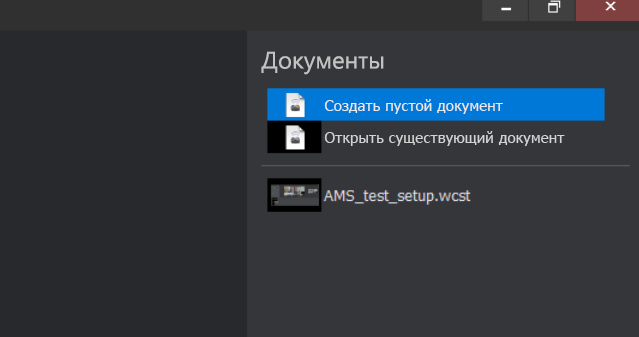
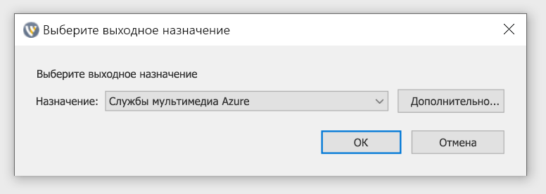
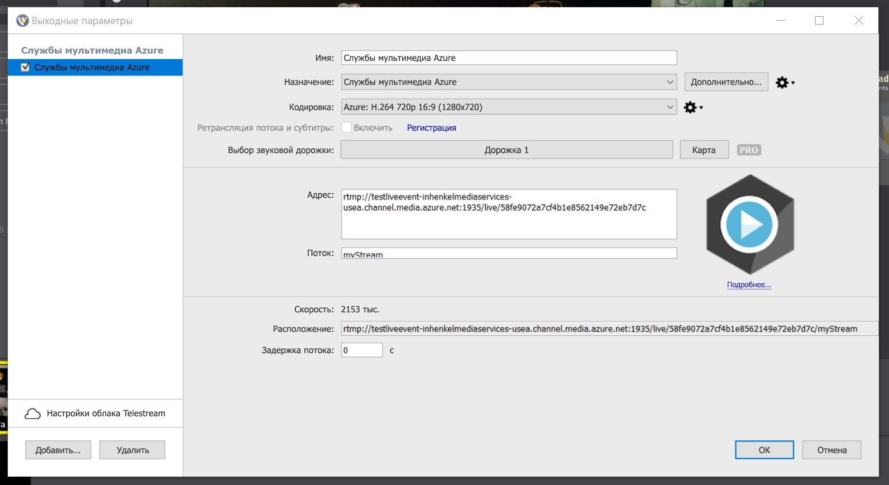
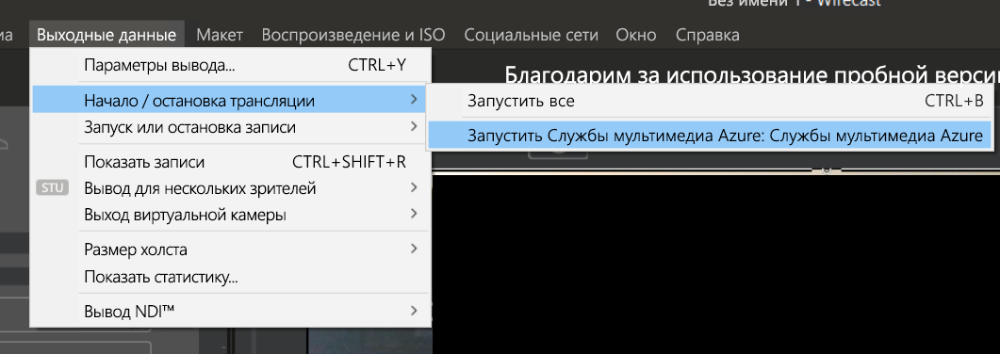

# Создание потоковой трансляции в Службах мультимедиа Azure с помощью портала и Wirecast

В этом руководстве по началу работы предполагается, что у вас есть подписка Azure и создана учетная запись Служб мультимедиа Azure.

Если у вас еще нет подписки Azure, создайте [бесплатную](https://azure.microsoft.com/free/) учетную запись Azure, прежде чем начинать работу.

## Войдите на портал Azure.

Откройте свой веб-браузер и перейдите на [портал Microsoft Azure](https://portal.azure.com/). Введите свои учетные данные для входа на портал. Панель мониторинга службы является представлением по умолчанию.

В этом кратком руководстве мы рассмотрим следующее:

- настройка локального кодировщика с бесплатной пробной версией Telestream Wirecast;
- настройка потоковой трансляции;
- настройка вывода потоковой трансляции;
- запуск конечной точки потоковой передачи по умолчанию.
- Просмотр потоковой трансляции и вывод по запросу с помощью Проигрывателя мультимедиа Azure

Для простоты мы будем использовать предустановку кодирования для Служб мультимедиа Azure в Wirecast, сквозную облачную кодировку и RTMP.

## Настройка локального кодировщика с помощью Wirecast

1. Скачайте и установите Wirecast для своей операционной системы по адресу https://www.telestream.net.
1. Запустите приложение и используйте предпочтительный адрес электронной почты для регистрации продукта.  Оставьте приложение открытым.
1. Вы получите сообщение электронной почты с просьбой подтвердить адрес электронной почты, после чего запустится бесплатная пробная версия приложения.
1. Рекомендация. Просмотрите видеоучебник на экране открытия приложения.

## Настройка потоковой трансляции Azure Media Services

1. Перейдя к учетной записи Служб мультимедиа Azure на портале, выберите **Потоковая трансляция** из списка Служб мультимедиа. 
 
1. Щелкните **Добавить трансляцию**, чтобы создать событие потоковой трансляции. 
 
1. Введите имя нового события, например *TestLiveEvent* в поле **Имя** трансляции. 
 
1. Введите необязательное описание события в поле **Описание**.
1. Выберите переключатель **Сквозной режим — без кодирования в облаке**. 

1. Выберите переключатель **RTMP**.
1. Чтобы избежать тарификации за трансляцию до того, как она будет готова, убедитесь, что для параметра "Начать прямую трансляцию" не выбран переключатель **Нет**.  (Тарификация начнется после запуска трансляции.)  
1. Нажмите кнопку **Просмотр и создание**, чтобы проверить параметры.
1. Нажмите кнопку **Создать**, чтобы создать трансляцию. Затем вы вернетесь к представлению списка трансляций.
1. Щелкните **ссылку на только что созданную трансляцию**. Обратите внимание, что событие остановлено.
1. Не закрывайте эту страницу в браузере.  Мы вернемся к ней позже.

## Настройка прямой трансляции с помощью Wirecast Studio

1. Если у вас еще открыто приложение Wirecast, в главном меню выберите **Create Empty Document** (Создать пустой документ), а затем щелкните **Continue** (Продолжить).

1. Наведите указатель мыши на первый слой в области Wirecast layers (Слои Wirecast).  Щелкните появившийся значок **Add** (Добавить) и выберите входные видеоданные, которые требуется транслировать.  Откроется диалоговое окно Master Layer 1 (Главный слой 1). 

1. Выберите в меню **Video capture** (Запись видео), а затем выберите камеру, которую нужно использовать. Если выбрать камеру, в области предварительного просмотра появится передаваемое камерой изображение.

1. Наведите указатель мыши на второй слой в области Wirecast layers (Слои Wirecast). Щелкните появившийся значок **Add** (Добавить) и выберите входные аудиоданные, которые требуется транслировать.  Откроется диалоговое окно Master Layer 2 (Главный слой 2).
1. Выберите в меню **Audio capture** (Запись звука), а затем выберите аудиовход, который нужно использовать.

1. В главном меню выберите **Output settings** (Параметры вывода).  Появится диалоговое окно Output (Вывод).
1. Из раскрывающегося списка средств вывода выберите **Azure Media Services** (Службы мультимедиа Microsoft Azure).  При выборе в качестве средства вывода Служб мультимедиа Azure *большинство* параметров вывода заполнятся автоматически. 

1. В следующем разделе мы вернемся к Службам мультимедиа Azure в браузере, чтобы скопировать *входной URL-адрес* и вставить его в раздел параметров вывода.

### Копирование и вставка входного URL-адреса

1. Вернитесь на страницу Служб мультимедиа Azure на портале и щелкните **Начало**, чтобы запустить прямую трансляцию. (С этого момента начинается тарификация.) 

2. Щелкните переключатель **Безопасно/Небезопасно**, чтобы перевести его в положение **Небезопасно**.  При этом вместо RTMPS будет выбран протокол RTMP.
3. Скопируйте **входной URL-адрес** код в буфер обмена.

4. Перейдите в приложение Wirecast и вставьте **входной URL-адрес** в поле **Address** (Адрес) в параметрах вывода. 

5. Нажмите кнопку **ОК**.

## Настройка выводов

В этой части рассказывается о том, как настроить выводы и обеспечить возможность сохранения записи прямой трансляции.  

> [!NOTE]
> Чтобы выполнить потоковую передачу этих выходных данных, должна быть запущена конечная точка потоковой передачи.  Подробные сведения см. ниже в разделе "Запуск конечной точки потоковой передачи".

1. Щелкните ссылку **Create Outputs** (Создать выводы) под средством просмотра выводимого видео.
1. При необходимости измените имя вывода в поле **Name** (Имя) на понятное пользователю, чтобы его можно было легко найти позже.

1. Остальные поля пока оставьте без изменений.
1. Нажмите кнопку **Next** (Далее) и добавьте указатель потоковой передачи.
1. При необходимости измените имя указателя на более понятное.

1. Все остальное на этом экране оставьте пока без изменений.
1. Нажмите кнопку **Создать**.

## Запуск трансляции

1. В Wirecast в главном меню выберите **Output > Start / Stop broadcasting > Start Azure Media Services: Azure Media Services** (Вывод > Начало/окончание трансляции > Запуск Служб мультимедиа Azure: Службы мультимедиа Azure).  При отправке потока для трансляции в видеопроигрывателе трансляций Wirecast на странице трансляции в Службах мультимедиа Azure отображается активное окно.

   

1. Нажмите кнопку **Go** (Перейти) в окне предварительного просмотра, чтобы начать транслировать видео и звук, выбранные для слоев Wirecast.

   

   > [!TIP]
   > Если произойдет ошибка, попробуйте перезагрузить проигрыватель, щелкнув ссылку Reload player (Перезагрузить проигрыватель) над проигрывателем.

## Запуск конечной точки потоковой передачи

1. Убедитесь, что конечная точка потоковой передачи запущена. Для этого в списке служб мультимедиа выберите **Streaming endpoints** (Конечные точки потоковой передачи). Откроется страница конечных точек потоковой передачи. 

1. Если состояние конечной точки потоковой передачи по умолчанию — Stopped (Остановлена), щелкните конечную точку потоковой передачи **по умолчанию**. Откроется страница для этой конечной точки.
1. Нажмите **Запуск**.  Будет запущена конечная точка потоковой передачи. 

## Воспроизведение транслируемых данных с помощью Проигрывателя мультимедиа Azure

1. Скопируйте **URL-адрес потоковой передачи** под видеопроигрывателем для вывода.
1. В веб-браузере откройте демонстрационную страницу Проигрывателя мультимедиа Azure https://ampdemo.azureedge.net/azuremediaplayer.html
1. Вставьте **URL-адрес потоковой передачи** в поле URL-адреса Проигрыватель мультимедиа Azure.
1. Нажмите внизу кнопку **Update Player** (Обновить проигрыватель).
1. Щелкните значок **воспроизведения** на видео, чтобы смотреть прямую трансляцию.

## Остановка трансляции

После трансляции необходимого содержимого остановите вещание.

1. В Wirecast нажмите кнопку **broadcast** (транслировать).  Вещание из Wirecast будет остановлено.
1. На портале нажмите **Остановить**. Вы получите предупреждающее сообщение о том, что прямая трансляция остановлена, а выведенное видео станет теперь активом по запросу.
1. Щелкните **Остановить** в предупреждающем сообщении. Кроме того, в Проигрыватель мультимедиа Azure также будет отображаться сообщение об ошибке, так как прямая трансляция больше недоступна.

## Воспроизведение выведенного видео по запросу с помощью Проигрывателя мультимедиа Azure

Созданное вами видео теперь доступно для потокового воспроизведения по запросу при условии, что конечная точка потоковой передачи запущена.

1. Перейдите к списку служб мультимедиа и выберите **Assets** (Активы).
1. Найдите выведенную трансляцию, созданную ранее, и щелкните **ссылку на актив**. Откроется страница вывода актива.
1. Скопируйте **URL-адрес потоковой передачи** под видеопроигрывателем для ресурса.
1. Вернитесь в Проигрыватель мультимедиа Azure в браузере и вставьте **URL-адрес потоковой передачи** в поле URL-адреса Проигрывателя мультимедиа Azure.
1. Щелкните **Update Player** (Обновить проигрыватель).
1. Щелкните значок **воспроизведения** на видео, чтобы просмотреть актив по запросу.

## Очистка ресурсов

> [!IMPORTANT]
> Остановите службы! После выполнения действий, описанных в этом кратком руководстве, необходимо остановить трансляцию и конечную точку потоковой передачи. Если этого не сделать, за все проработанное ими время будет взиматься плата. Сведения о том, как остановить трансляцию, см. в разделе "Остановка трансляции" (шаги 2 и 3).

### Остановка конечной точки потоковой передачи

1. В списке служб мультимедиа выберите **Streaming endpoints** (Конечные точки потоковой передачи).
2. Щелкните запущенную ранее конечную точку потоковой передачи **по умолчанию**. Откроется страница конечной точки.
3. Нажмите **Stop** (Остановить).  Конечная точка потоковой передачи будет остановлена.

> [!TIP]
> Если вы не хотите хранить активы этой трансляции, не забудьте их удалить, чтобы избежать выставления счетов за хранение.

## Дальнейшие действия
> [!div class="nextstepaction"]
> [Следующая статья цикла](./live-events-outputs-concept.md)
