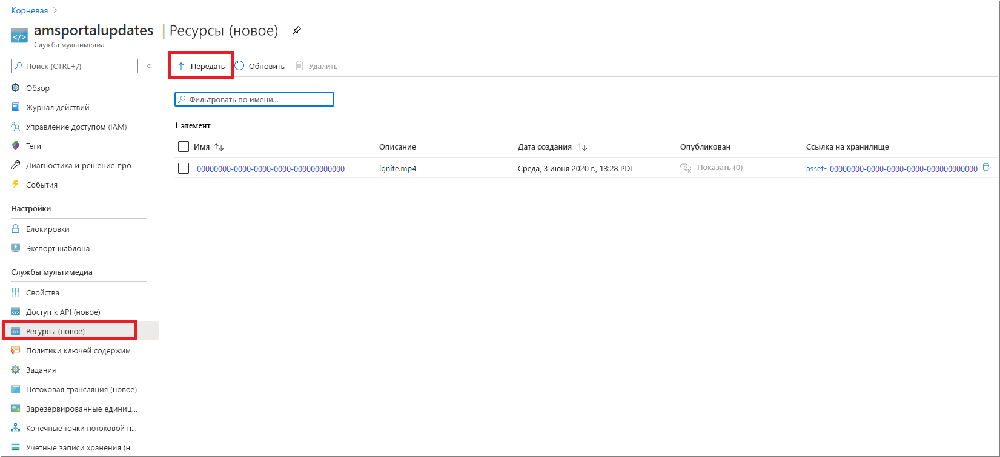
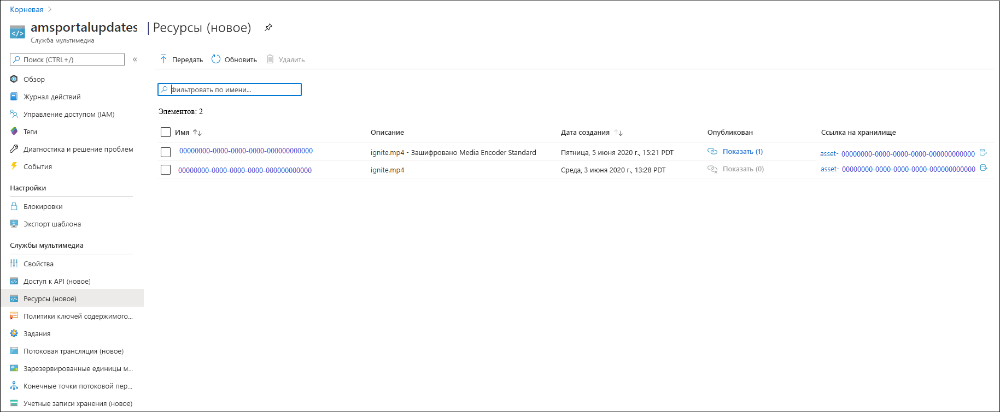
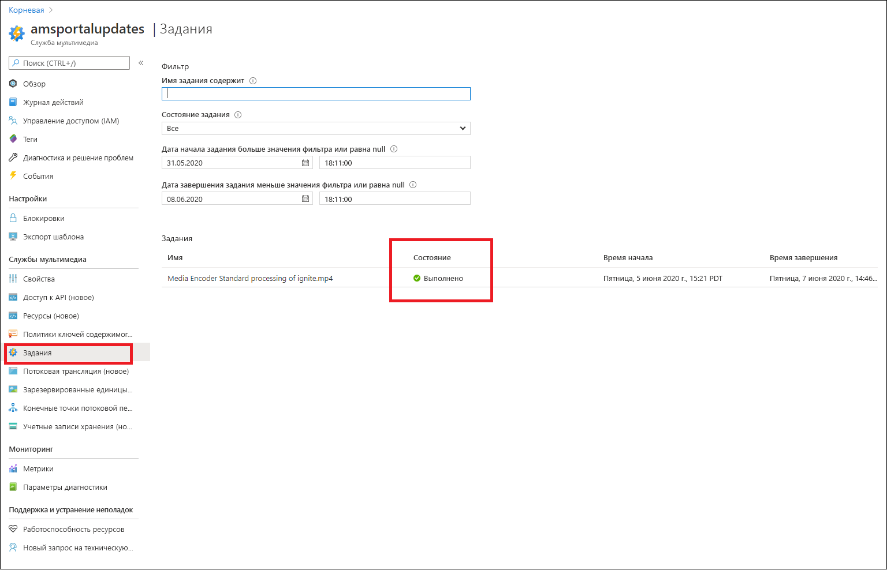
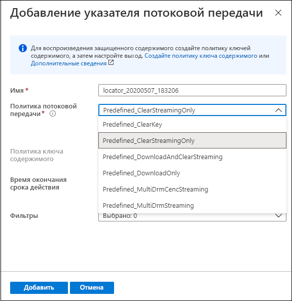
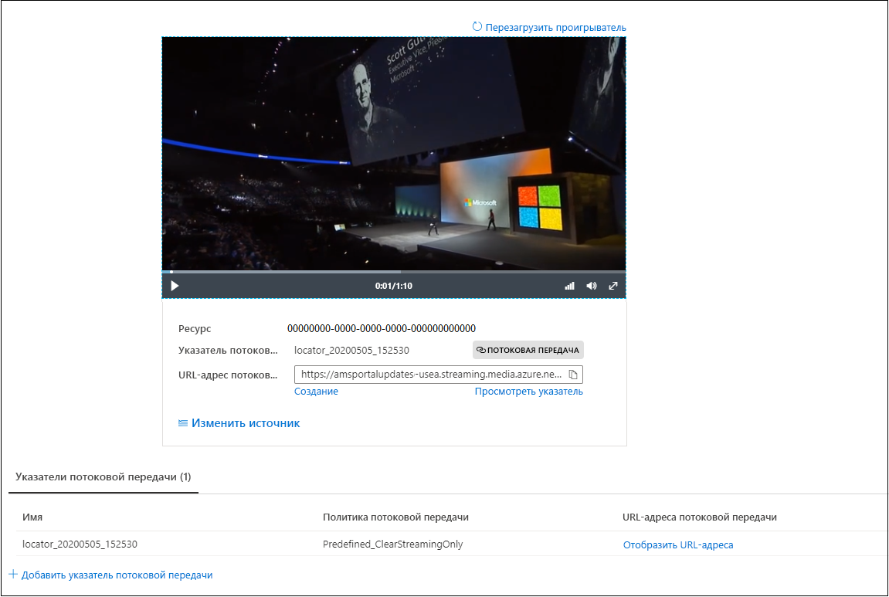

# Краткое руководство. Отправка, кодирование и потоковая передача содержимого с помощью портала

[!INCLUDE [media services api v3 logo](./includes/v3-hr.md)]

В этом кратком руководстве показано, как использовать портал Azure для отправки, кодирования и выполнения потоковой передачи содержимого с помощью Служб мультимедиа Azure.

> [!NOTE]
> Обязательно ознакомьтесь с разделом об [ограничениях портала Azure для Служб мультимедиа версии 3](frequently-asked-questions.md#what-are-the-azure-portal-limitations-for-media-services-v3).
  
## Обзор

* Чтобы начать шифрование, кодирование, анализ, потоковую передачу мультимедийного содержимого и управление им в Azure, необходимо создать учетную запись Служб мультимедиа и отправить файлы мультимедиа высокого качества в **ресурс**. 
    
    > [!NOTE]
    > Если ваше видео ранее было отправлено в учетную запись Служб мультимедиа с помощью API Служб мультимедиа версии 3 или если содержимое было создано на основе выходных данных потоковой передачи, на портале Azure не будут отображаться кнопки **Кодировать**, **Анализировать** или **Зашифровать**. Для выполнения этих задач используйте API Служб мультимедиа версии 3.

    Ознакомьтесь со следующими сведениями: 

  * [Передача в облако и хранение](storage-account-concept.md)
  * [Концепция ресурсов](assets-concept.md)
* После отправки в ресурс (входной ресурс) файл мультимедиа высокого качества можно обработать (закодировать или проанализировать). Обработанное содержимое переходит в другой ресурс (выходной ресурс). 
    * [Закодируйте](encoding-concept.md) отправленный файл в формат, пригодный для воспроизведения в разных браузерах и на различных устройствах.
    * [Проанализируйте](analyzing-video-audio-files-concept.md) отправленный файл. 

        В настоящее время с помощью портала Azure можно выполнять следующие действия: создавать файлы скрытых субтитров TTML и WebVTT. С помощью файлов этих форматов аудио- и видеофайлы можно сделать доступными для людей с нарушениями слуха. Кроме того, вы можете извлечь из содержимого ключевые слова.

        Для извлечения аналитических сведений из видео- и аудиофайлов используйте предустановки Служб мультимедиа версии 3 (как описано на странице [Руководство. Анализ видео с помощью Служб мультимедиа версии 3](analyze-videos-tutorial-with-api.md)).  Если вам нужны более подробные аналитические сведения, используйте непосредственно [Индексатор видео](../video-indexer/index.yml).    
* После обработки вы сможете передать мультимедийное содержимое в проигрыватели клиентов. Чтобы сделать видеозаписи в выходном ресурсе доступными для воспроизведения в клиентах, создайте **указатель потоковой передачи**. При создании **указателя потоковой передачи** необходимо указать **политику потоковой передачи**. **Политики потоковой передачи** позволяют определять протоколы потоковой передачи и параметры шифрования (при наличии) для **указателей потоковой передачи**.
    
    Обзор.

    * [Указатели потоковой передачи](streaming-locators-concept.md)
    * [Политики потоковой передачи](streaming-policy-concept.md)
    * [Упаковка и доставка](dynamic-packaging-overview.md)
    * [Фильтры](filters-concept.md)
* Вы можете защитить содержимое, зашифровав его с помощью AES (AES-128) или (и) любой из трех основных систем DRM: Microsoft PlayReady, Google Widevine и Apple FairPlay. На странице [Шифрование содержимого с помощью портала Azure](encrypt-content-quickstart.md) показано, как настроить защиту содержимого.
        
## Предварительные требования

[!INCLUDE [quickstarts-free-trial-note](../../../includes/quickstarts-free-trial-note.md)]

[Создание учетной записи Служб мультимедиа](create-account-howto.md#use-the-azure-portal)

## Передать

1. Войдите на [портал Azure](https://portal.azure.com/).
1. Найдите учетную запись Служб мультимедиа и выберите ее.
1. Выберите **Assets (new)** (Ресурсы (новое)).
1. Нажмите кнопку **Отправить** в верхней части окна. 
1. Перетащите или выберите файл, который необходимо отправить.

Перейдя в окно ресурсов, вы увидите, что в список добавлен новый ресурс:

## Кодирование

1. Выберите **Assets (new)** (Ресурсы (новое)).
1. Выберите новый ресурс (добавленный на последнем шаге).
1. Щелкните **Кодировать** в верхней части окна.

    После нажатия этой кнопки запустится задание кодирования. После успешного выполнения будет создан выходной ресурс, содержащий закодированное содержимое.

Перейдя в окно ресурсов, вы увидите, что в список добавлен выходной ресурс:

## Мониторинг хода выполнения задания

Чтобы просмотреть состояние задания, перейдите в раздел **Задания**. Для задания обычно последовательно устанавливаются следующие состояния: "Запланировано", "В очереди", "Обработка", "Завершено" (конечное состояние). Если в задании будет обнаружена ошибка, вы получите состояние "Ошибка".

## Публикация и выполнение потоковой передачи

Чтобы опубликовать ресурс, нужно добавить в него указатель потоковой передачи.

### Указатель потоковой передачи 

1. В разделе **Указатель потоковой передачи** нажмите кнопку **+ Добавить указатель потоковой передачи**.
    Это действие запускает публикацию ресурса и создание URL-адресов потоковой передачи.

    > [!NOTE]
    > Если вам необходимо зашифровать поток, создайте политику ключа содержимого и задайте ее в указателе потоковой передачи. Дополнительные сведения см. на странице [Шифрование содержимого с помощью портала Azure](encrypt-content-quickstart.md).
1. В окне **Добавление указателя потоковой передачи** выберите одну из предопределенных политик потоковой передачи. Дополнительные сведения см. на странице [Политики потоковой передачи](streaming-policy-concept.md)

    

После публикации ресурса вы можете выполнить его потоковую передачу непосредственно на портале. 

Или скопируйте URL-адрес потоковой передачи и используйте его в клиентском проигрывателе.

> [!NOTE]
> Убедитесь, что [конечная точка потоковой передачи](streaming-endpoint-concept.md) запущена. При первом создании учетной записи Службы мультимедиа будет создана конечная точка потоковой передачи по умолчанию, которая находится в остановленном состоянии. Ее необходимо запустить, прежде чем выполнять потоковую передачу содержимого. Плата взимается, только когда конечная точка потоковой передачи используется.

## Очистка ресурсов

Если вы планируете поработать и с другими краткими руководствами, созданные ресурсы следует сохранить. В противном случае зайдите на портал Azure, откройте список групп ресурсов, выберите группу, в которой работали с этим кратким руководством, и удалите все ресурсы.

## Дальнейшие действия

[Шифрование содержимого с помощью портала](encrypt-content-quickstart.md)
