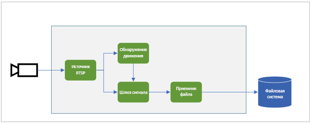
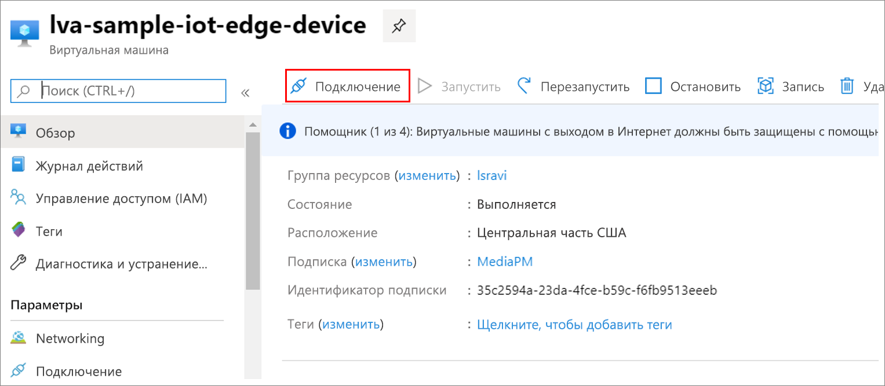

# <a name="quickstart-detect-motion-record-video-on-edge-devices"></a>Краткое руководство. Запись видео на пограничные устройства при обнаружении движения
 
В этом кратком руководстве описано, как использовать Аналитику видеотрансляции в IoT Edge для анализа видеопотока, поступающего с (имитированной ) IP-камеры, определять наличие движений и записывать видеоролики MP4 в локальную файловую систему на пограничном устройстве. В нем используется имитация видеотрансляции и виртуальная машина Azure в качестве устройства IoT Edge. В основе этой статьи лежит пример кода, написанного на языке C#.

Перед изучением этой статьи ознакомитесь с [этим](detect-motion-emit-events-quickstart.md) кратким руководством. 

## <a name="prerequisites"></a>Предварительные требования

* Учетная запись Azure с активной подпиской. [Создайте учетную запись](https://azure.microsoft.com/free/?WT.mc_id=A261C142F) бесплатно.
* [Visual Studio Code](https://code.visualstudio.com/) на вашем компьютере со следующими расширениями:
    * [Средства Интернета вещей Azure](https://marketplace.visualstudio.com/items?itemName=vsciot-vscode.azure-iot-tools)
    * [C#](https://marketplace.visualstudio.com/items?itemName=ms-dotnettools.csharp)
* Пакет [.NET Core 3.1 SDK](https://dotnet.microsoft.com/download/dotnet-core/3.1), установленный в системе
* Если вы ранее не выполняли инструкции из [этого](detect-motion-emit-events-quickstart.md) краткого руководства, выполните указанные ниже шаги.
     * [Настройка ресурсов Azure](detect-motion-emit-events-quickstart.md#set-up-azure-resources)
     * [Настройка среды разработки](detect-motion-emit-events-quickstart.md#set-up-your-development-environment)
     * [Создание и развертывание манифеста развертывания IoT Edge](detect-motion-emit-events-quickstart.md#generate-and-deploy-the-iot-edge-deployment-manifest)
     * [Подготовка к мониторингу событий](detect-motion-emit-events-quickstart.md#prepare-for-monitoring-events)

> [!TIP]
> Во время установки расширения Azure IoT Tools может появится запрос на установку Docker. Вы можете проигнорировать его.

## <a name="review-the-sample-video"></a>Просмотр примера видео
В рамках описанных выше действий по настройке ресурсов Azure (короткое) видео с изображением стоянки автомашин будет скопировано на виртуальную машину Linux в Azure, используемую в качестве устройства IoT Edge. Этот видеофайл будет использован для имитации прямой трансляции во время работы с этим руководством.

Можно использовать приложение, например [проигрыватель VLC](https://www.videolan.org/vlc/): запустите его, нажмите клавиши Control+N и вставьте [эту](https://lvamedia.blob.core.windows.net/public/lots_015.mkv) ссылку на видео с изображением стоянки автомашин, чтобы начать воспроизведение. Примерно на 5-секундной отметке белый автомобиль движется по стоянке.

Выполняя указанные ниже действия, вы будете использовать Аналитику видеотрансляции в IoT Edge для обнаружения движения автомобиля и записи видеоролика, начиная с 5-секундной отметки.

## <a name="overview"></a>Обзор



На схеме выше показан порядок передачи сигналов в этом кратком руководстве. Модуль Edge (подробные сведения [здесь](https://github.com/Azure/live-video-analytics/tree/master/utilities/rtspsim-live555)) имитирует IP-камеру, на которой размещен сервер RTSP. Узел [источника RTSP](media-graph-concept.md#rtsp-source) получает видеосигнал с этого сервера и отправляет видеокадры на узел [обработчика обнаружения движения](media-graph-concept.md#motion-detection-processor). Источник RTSP отправляет эти же видеокадры на узел [обработчика сигнального шлюза](media-graph-concept.md#signal-gate-processor), который остается закрытым до тех пор, пока не сработает триггер события.

Когда обработчик обнаружения движения определяет наличие движения в видео, он отправляет событие на узел обработчика сигнального шлюза, активируя его. Шлюз открывается и остается открытым в течение заданного времени, отправляя видеокадры на узел [приемника файлов](media-graph-concept.md#file-sink). Этот узел приемника записывает видео в формате MP4 в локальную файловую систему пограничного устройства в заданное расположение.

В этом кратком руководстве вы выполните указанные ниже задачи.

1. Создание и развертывание графа мультимедиа
1. Интерпретация результатов
1. Очистка ресурсов

## <a name="examine-and-edit-the-sample-files"></a>Изучение и изменение образцов файлов
В ходе выполнения предварительных требований вы загрузили пример кода в папку. Запустите Visual Studio Code и откройте эту папку.

1. В Visual Studio Code перейдите в папку src/edge. Здесь находится созданный вами файл .env, а также несколько файлов шаблона развертывания.
    * Шаблон развертывания — это манифест развертывания для пограничного устройства, где используются некоторые значения заполнителя. В файле .env указаны значения таких переменных.
1. Теперь перейдите в папку src/cloud-to-device-console-app. Здесь мы найдем файл appsettings.json, который вы создали, и еще несколько файлов:
    * c2d-console-app.csproj — файл проекта Visual Studio Code;
    * operations.json — файл со списком различных операций, которые необходимо выполнить программе;
    * Program.cs — образец кода программы, который выполняет следующие действия:

        * загружает параметры приложения;
        * вызывает прямые методы, представляемые модулем Аналитики видеотрансляции в IoT Edge (с помощью модуля можно анализировать потоки видеотрансляции, вызывая его [прямые методы](direct-methods.md)); 
        * приостанавливает выполнение, позволяя вам проанализировать выходные данные программы в окне терминала и сгенерированные модулем события в окне выходных данных;
        * вызывает прямые методы для очистки ресурсов.   

1. Внесите следующие изменения в файл operations.json
    * Измените ссылку на топологию графа: `"topologyUrl" : "https://raw.githubusercontent.com/Azure/live-video-analytics/master/MediaGraph/topologies/evr-motion-files/topology.json"`
    * В разделе GraphInstanceSet измените имя топологии графа, чтобы оно совпадало со значением в приведенной выше ссылке `"topologyName" : "EVRToFilesOnMotionDetection"`
    * Также измените URL-адрес RTSP, чтобы он указывал на нужный видеофайл `"value": "rtsp://rtspsim:554/media/lots_015.mkv"`
    * В разделе GraphTopologyDelete измените имя `"name": "EVRToFilesOnMotionDetection"`

## <a name="review---check-status-of-the-modules"></a>Проверка — проверка состояния модулей
Во время выполнения действия [Создание и развертывание манифеста развертывания IoT Edge](detect-motion-emit-events-quickstart.md#generate-and-deploy-the-iot-edge-deployment-manifest) в Visual Studio Code при развертывании узла lva-sample-device в Центре Интернета вещей AZURE (в левом нижнем углу), вы увидите следующие развернутые модули:

    1. Модуль Аналитики видеотрансляции с именем lvaEdge
    1. Модуль с именем rtspsim, имитирующий сервер RTSP и выступающий в качестве источника сигнала видеопотока

        


## <a name="review---prepare-for-monitoring-events"></a>Проверка — подготовка к мониторингу событий
Убедитесь, что вы выполнили действия по [подготовке к мониторингу событий](detect-motion-emit-events-quickstart.md#prepare-for-monitoring-events).


## <a name="run-the-sample-program"></a>Запуск примера программы

1. Запустите сеанс отладки (нажмите клавишу F5). В окне терминала начнут появляться сообщения.
1. Файл operations.json начнет выполнение операций с вызова прямых методов GraphTopologyList и GraphInstanceList. Если вы очистили ресурсы после выполнения действий, описанных в предыдущих кратких руководствах, будут возвращены пустые списки, а затем выполнение будет приостановлено, пока вы не нажмете клавишу ВВОД.
```
--------------------------------------------------------------------------
Executing operation GraphTopologyList
-----------------------  Request: GraphTopologyList  --------------------------------------------------
{
  "@apiVersion": "1.0"
}
---------------  Response: GraphTopologyList - Status: 200  ---------------
{
  "value": []
}
--------------------------------------------------------------------------
Executing operation WaitForInput
Press Enter to continue
```
1. После нажатия клавиши ВВОД в окне терминала будет вызвана следующая серия прямых методов
     * Вызов GraphTopologySet с использованием приведенной выше топологии topologyUrl
     * Вызов GraphInstanceSet с использованием приведенного ниже кода body
     ```
     {
       "@apiVersion": "1.0",
       "name": "Sample-Graph",
       "properties": {
         "topologyName": "EVRToFilesOnMotionDetection",
         "description": "Sample graph description",
         "parameters": [
           {
             "name": "rtspUrl",
             "value": "rtsp://rtspsim:554/media/lots_015.mkv"
           },
           {
             "name": "rtspUserName",
             "value": "testuser"
           },
           {
             "name": "rtspPassword",
             "value": "testpassword"
           }
         ]
       }
     }
     ```
     * Вызов GraphInstanceActivate для запуска экземпляра графа и видеопотока
     * Второй вызов GraphInstanceList для демонстрации того факта, что экземпляр графа находится в состоянии выполнения
1. Вывод данных в окне терминала будет приостановлен с предложением нажать клавишу ВВОД для продолжения. Не нажимайте ВВОД на этом этапе. Прокрутите экран вверх, чтобы увидеть полезные данные ответов JSON на вызванные нами прямые методы.
1. Если теперь переключиться в окно выходных данных в Visual Studio Code, мы увидим сообщения, отправляемые в Центр Интернета вещей модулем Аналитики видеотрансляции в IoT Edge.
     * Эти сообщения рассматриваются в следующем разделе.
1. Граф мультимедиа продолжит работать и выводить результаты: симулятор RTSP будет продолжать циклическое воспроизведение исходного видео. Чтобы остановить граф мультимедиа, вернитесь в окно терминала и нажмите клавишу ВВОД. Следующая серия вызовов производится для очистки ресурсов
     * Вызов GraphInstanceDeactivate для деактивации экземпляра графа
     * Вызов GraphInstanceDelete для удаления экземпляра
     * Вызов GraphTopologyDelete для удаления топологии
     * Окончательный вызов GraphTopologyList, чтобы продемонстрировать, что список пуст

## <a name="interpret-results"></a>Интерпретация результатов 
При запуске графа мультимедиа результаты из узла обработчика детектора движения отправляются через узел приемника Центра Интернета вещей в Центр Интернета вещей. Эти сообщения, отображаемые в окне вывода данных Visual Studio Code, содержат разделы body (текст) и applicationProperties (свойства приложения). Чтобы понять назначение этих разделов, ознакомьтесь с [этой](https://docs.microsoft.com/azure/iot-hub/iot-hub-devguide-messages-construct) статьей.

В приведенных ниже сообщениях свойства приложений и содержимое раздела body определяются модулем Аналитики видеотрансляции.

## <a name="mediasession-established-event"></a>Событие MediaSession Established

После создания экземпляра графа мультимедиа узел источника RTSP пытается подключиться к серверу TRSP, работающему в контейнере rtspsim-live555. В случае успеха на печать выводится это событие:

```
[IoTHubMonitor] [05:37:21 AM] Message received from [lva-sample-device/lvaEdge]:
{  
"body": {
"sdp": "SDP:\nv=0\r\no=- 1586450538111534 1 IN IP4 xxx.xxx.xxx.xxx\r\ns=Matroska video+audio+(optional)subtitles, streamed by the LIVE555 Media Server\r\ni=media/camera-300s.mkv\r\nt=0 0\r\na=tool:LIVE555 Streaming Media v2020.03.06\r\na=type:broadcast\r\na=control:*\r\na=range:npt=0-300.000\r\na=x-qt-text-nam:Matroska video+audio+(optional)subtitles, streamed by the LIVE555 Media Server\r\na=x-qt-text-inf:media/camera-300s.mkv\r\nm=video 0 RTP/AVP 96\r\nc=IN IP4 0.0.0.0\r\nb=AS:500\r\na=rtpmap:96 H264/90000\r\na=fmtp:96 packetization-mode=1;profile-level-id=4D0029;sprop-parameter-sets={SPS}\r\na=control:track1\r\n"  
},  
"applicationProperties": {  
    "dataVersion": "1.0",  
    "topic": "/subscriptions/{subscriptionID}/resourceGroups/{name}/providers/microsoft.media/mediaservices/hubname",  
    "subject": "/graphInstances/Sample-Graph-1/sources/rtspSource",  
    "eventType": "Microsoft.Media.MediaGraph.Diagnostics.MediaSessionEstablished",  
    "eventTime": "2020-05-21T05:37:21.398Z",
    }  
}
```

* Сообщение представляет собой диагностическое событие MediaSessionEstablished: оно говорит о том, что узлу источника RTSP (параметру subject) удалось установить подключение к симулятору RTSP и начать прием потока данных (эмулируемого).
* Параметр субъекта subject в разделе свойств приложения applicationProperties обозначает узел в топологии графа, сгенерировавший сообщение. В этом случае сообщение исходит от узла источника RTSP.
* Параметр типа события eventType в разделе applicationProperties указывает, что событие является диагностическим.
* Параметр времени события eventTime указывает время события.
* Раздел body содержит информацию о диагностическом событии: в этом случае это данные [SDP](https://en.wikipedia.org/wiki/Session_Description_Protocol).


## <a name="recording-started-event"></a>Событие "Запись начата".

Как описано [здесь](#overview), при обнаружении движения активируется узел обработчика сигнального шлюза, а узел приемника файлов в графе мультимедиа начинает записывать файл MP4. Узел приемника файлов отправляет операционное событие. В качестве типа устанавливается motion, чтобы показать, что событие создано обработчиком обнаружения движения. Параметр eventTime указывает время, когда возникло событие (в формате UTC). Ниже приведен пример:

```
[IoTHubMonitor] [05:37:27 AM] Message received from [lva-sample-device/lvaEdge]:
{
  "body": {
    "outputType": "filePath",
    "outputLocation": "/var/media/sampleFilesFromEVR-filesinkOutput-20200521T053726Z.mp4"
  },
  "applicationProperties": {
    "topic": "/subscriptions/{subscriptionID}/resourceGroups/{name}/providers/microsoft.media/mediaservices/hubname",  
    "subject": "/graphInstances/Sample-Graph-1/sinks/fileSink",
    "eventType": "Microsoft.Media.Graph.Operational.RecordingStarted",
    "eventTime": "2020-05-21T05:37:27.713Z",
    "dataVersion": "1.0"
  }
}
```

* Параметр субъекта subject в разделе свойств приложения applicationProperties обозначает узел в графе мультимедиа, сгенерировавший сообщение. В этом случае сообщение исходит от узла приемника файлов.
* Параметр типа события eventType в разделе applicationProperties указывает, что событие является операционным.
* Параметр времени события eventTime указывает время события. Обратите внимание, что с момента MediaSessionEstablished и запуска видеопотока проходит 5–6 секунд. Это соответствует отметке 5–6 секунд, когда [автомобиль начал двигаться](#review-the-sample-video) по стоянке.
* Параметр body содержит данные об операционном событии, в этом случае — данные outputType и outputLocation.
* Параметр outputType указывает, что эта информация относится к пути файла
* Параметр outputLocation предоставляет информацию о расположении файла MP4 в модуле Edge.

## <a name="recording-stopped-and-available-events"></a>События "Запись остановлена" и "Запись доступна"

Если вы посмотрите на свойства узла обработчика сигнального шлюза в [топологии графа](https://github.com/Azure/live-video-analytics/blob/master/MediaGraph/topologies/evr-motion-files/topology.json), вы увидите, что для параметра "время активации" установлено значение 5 секунд. Таким образом, примерно через 5 секунд после возникновения события начала записи RecordingStarted произойдут следующие события:
* событие остановки записи RecordingStopped, указывающее, что запись остановлена;
* событие доступности записи RecordingAvailable, указывающее, что теперь файл MP4 можно использовать для просмотра.

Эти два события обычно происходят одно за другим, с разницей в несколько секунд.

### <a name="playing-back-the-mp4-clip"></a>Воспроизведение клипа MP4

1. MP4-файлы записываются в каталог на пограничном устройстве, указанном в файле .env с помощью этого ключа — OUTPUT_VIDEO_FOLDER_ON_DEVICE. Если оставить значение по умолчанию, результаты должны находиться в каталоге /home/lvaadmin/samples/output/
1. Перейдите к группе ресурсов, найдите виртуальную машину и подключитесь с помощью Бастиона.

    
 
    
1. Войдя в систему (используя учетные данные, созданные на [этом](detect-motion-emit-events-quickstart.md#set-up-azure-resources) шаге), в командной строке перейдите в соответствующий каталог (по умолчанию: /home/lvaadmin/samples/output), где должны отобразиться файлы MP4. Вы можете скопировать файлы с помощью функции [SCP](https://docs.microsoft.com/azure/virtual-machines/linux/copy-files-to-linux-vm-using-scp) на локальный компьютер и воспроизвести их с помощью [проигрывателя VLC](https://www.videolan.org/vlc/) или любого другого проигрывателя MP4.

    

## <a name="clean-up-resources"></a>Очистка ресурсов

Если вы планируете поработать и с другими краткими руководствами, созданные ресурсы следует сохранить. В противном случае зайдите на портал Azure, откройте список групп ресурсов, выберите группу, в которой работали с этим кратким руководством, и удалите все ресурсы.

## <a name="next-steps"></a>Дальнейшие действия

* Выполните действия из краткого руководства [Запуск Аналитики видеотрансляции с помощью собственной модели](use-your-model-quickstart.md), в котором описано, как применять ИИ к сигналам видеотрансляции.
* Ознакомьтесь с дополнительными задачами для опытных пользователей.

    * Вместо симулятора RTSP используйте [IP-камеру](https://en.wikipedia.org/wiki/IP_camera) с поддержкой RTSP. Подобрать RTSP-совместимую IP-камеру можно на странице [продуктов, соответствующих спецификации ONVIF](https://en.wikipedia.org/wiki/IP_camera): ищите устройства, совместимые с профилем G, S или T.
    * Используйте устройство AMD64 или X64 на базе Linux (вместо виртуальной машины Linux в Azure). Устройство должно находиться в той же сети, что и IP-камера. Вы можете сначала воспользоваться инструкциями по [установке среды выполнения Azure IoT Edge на Linux](https://docs.microsoft.com/azure/iot-edge/how-to-install-iot-edge-linux), а затем — инструкциями из краткого руководства [Развертывание первого модуля IoT Edge на виртуальном устройстве Linux](https://docs.microsoft.com/azure/iot-edge/quickstart-linux), чтобы зарегистрировать устройство в Центре Интернета вещей Azure.
