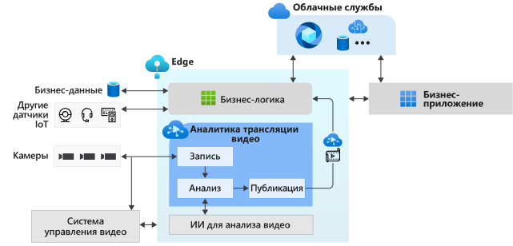

# Что такое аналитика видеотрансляций в Azure IoT Edge? (предварительная версия)

Аналитика видеотрансляций в IoT Edge предоставляет платформу для создания интеллектуальных видеоприложений, использующих как пограничные, так и облачные вычисления. С помощью этой платформы вы можете сканировать, записывать и анализировать видеотрансляции, а также публиковать результаты (видео и видеоаналитику) в службах Azure (в облаке и (или) в пограничной зоне). Эта платформа позволяет повысить эффективность ваших решений для Интернета вещей за счет анализа видео. Функцию аналитики видеотрансляции в IoT Edge можно использовать вместе с другими модулями Azure IoT Edge, например Azure Stream Analytics в IoT Edge, Cognitive Services в IoT Edge, и облачными службами Azure, например службами мультимедиа Azure, концентратором событий, Cognitive Services и другими. Так вы сможете создавать многофункциональные гибридные приложения, использующие как пограничные, так и облачные вычисления.

Аналитика видеотрансляции в IoT Edge — это расширяемая платформа, к которой можно подключить различные модули аналитики видео с помощью пограничных вычислений, например контейнеры Cognitive Services, созданные вами пользовательские модули пограничных вычислений на основе моделей машинного обучения с открытым кодом или пользовательские модели, обучаемые на ваших данных. Подключив модули, вы сможете анализировать видеотрансляции, и вам не потребуется создавать и поддерживать конвейер видеотрансляций.

## Ускорение разработки решений для Интернета вещей 

Решения IoT, объединяющие видеоаналитику с сигналами от других датчиков IoT и бизнес-данными, помогают полностью или хотя бы частично автоматизировать бизнес-решения, что приводит к повышению эффективности. Аналитика видеотрансляций в IoT Edge позволяет гораздо быстрее создавать такие решения. Вы можете сосредоточиться на создании модулей видеоаналитики и логики, предназначенных для вашего бизнеса, а о работе конвейера видео и управлении им позаботится сама платформа.

Благодаря возможностям аналитики видеотрансляций в IoT Edge вы можете продолжать использовать свои [камеры видеонаблюдения](https://en.wikipedia.org/wiki/Closed-circuit_television_camera) с существующими [системами управления видео (VMS)](https://en.wikipedia.org/wiki/Video_management_system) и независимо от этого создавать приложения видеоаналитики. Аналитику видеотрансляций в IoT Edge можно использовать вместе с пакетами SDK и наборами средств для компьютерного зрения, чтобы создавать высокотехнологичные решения IoT. Использование аналитики представлено на схеме ниже.

## Поддерживаемые среды

Поддерживаются среды Linux AMD64 и x64.

## Начало работы

Ознакомьтесь со следующими статьями, описывающими основные понятия, а затем следуйте инструкциям в кратком руководстве по обнаружению движения в видеотрансляции.

### Основные понятия

* [Граф мультимедиа](media-graph-concept.md)
* [Запись видео](video-recording-concept.md)
* [Воспроизведение видео](video-playback-concept.md)
* [Непрерывная запись видео](continuous-video-recording-concept.md)
* [Запись видео на основе событий](event-based-video-recording-concept.md)
* [Аналитика видеотрансляции без записи видео](analyze-live-video-concept.md)

## Дальнейшие действия

* Выполните инструкции по [ запуску аналитики видеотрансляций с помощью собственной модели](use-your-model-quickstart.md), чтобы узнать, как можно обнаруживать движение в видеотрансляции.
* Повторите [термины](terminology.md)
* Просмотрите [материалы с открытым кодом для аналитики видеотрансляций](https://github.com/Azure/live-video-analytics)

