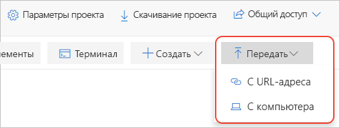

# Краткое руководство. Перенос локальной записной книжки Jupyter в предварительную версию службы "Записные книжки Azure"

В этом кратком руководстве вы перенесете записную книжку Jupyter с локального компьютера или другого доступного URL-адреса файла в Записные книжки Azure. 

Записные книжки Jupyter на вашем компьютере, доступны только текущему пользователю. Вы можете предоставить общий доступ к файлам, но у получателей есть свои локальные копии записной книжки, и в них сложно внести свои изменения. Даже если вы храните записные книжки в общем сетевом репозитории, таком как GitHub, у каждого участника совместной работы должна быть локальная установка записной книжки Jupyter, настроенная как ваша.

После переноса локальных записных книжек или записных книжек, расположенных в репозитории, вы сможете сразу же поделиться ими с участниками совместной работы, которым для просмотра и запуска ваших записных книжек нужен только браузер. Они также могут вносить изменения, если выполняют вход в Записные книжки Azure.

## Предварительные требования

- [Записная книжка Jupyter](https://jupyter-notebook.readthedocs.io) на локальном компьютере или в другом доступном URL-адресе файла. 

## Создание проекта в Записных книжках Azure

В этом кратком руководстве описан перенос записной книжки с локального компьютера или другого доступного URL-адреса файла. Чтобы перенести записные книжки из репозитория GitHub, см. статью [Quickstart: Clone a notebook](quickstart-clone-jupyter-notebook.md) (Краткое руководство по клонированию записной книжки).

[!INCLUDE [notebooks-status](../../includes/notebooks-status.md)]

1. Перейдите в службу [Записные книжки Azure](https://notebooks.azure.com) и выполните вход. (Дополнительные сведения см. в кратком руководстве по [входу в Записные книжки Azure](quickstart-sign-in-azure-notebooks.md).)

1. Вверху на общедоступной странице профиля щелкните **Мои проекты**:

    

1. На странице **Мои проекты** щелкните **Создать проект** (клавиша n). Если окно браузера слишком узкое, кнопка может отображаться в виде **+** :

    

1. В появившемся всплывающем окне **Создание проекта** введите соответствующие значения для записной книжки, которую вы переносите, в поля **Имя проекта** и **Идентификатор проекта**, снимите флажки напротив вариантов **Public project** (Открытый проект) и **Create a README.md** (Создать файл README.md), а затем выберите **Создать**.

## Передача локальной записной книжки

1. На странице проекта выберите **Отправить** (отображается как стрелка вверх, только если окно браузера небольшое), затем выберите 1. В появившемся всплывающем окне выберите **С компьютера**, если записная книжка находится в локальной файловой системе, или **From URL** (С URL-адреса), если записная книжка находится в сети:

    

   Напоминаем, если записная книжка находится в репозитории GitHub, следуйте инструкциям в статье [Краткое руководство. Клонирование записной книжки в службе "Записные книжки Azure" (предварительная версия)](quickstart-clone-jupyter-notebook.md).

   - Если вы используете параметр **С компьютера**, перетащите файлы *.ipynb* в поле всплывающего окна или щелкните **Выбрать файлы**, а затем найдите и выберите файлы, которые нужно импортировать. Затем нажмите кнопку **Отправить**. Переданные файлы получают то же имя, что и у локальных файлов Вам не нужно отправлять содержимое папок *.ipynb_checkpoints*.

     

   - Если вы используете параметр **From URL** (С URL-адреса), введите адрес источника в поле **URL-адрес файла** и имя файла, чтобы назначить его записной книжке проекта в поле **Имя файла**. Затем нажмите кнопку **Отправить**. Если у вас несколько файлов с разными URL-адресами, используйте команду **Добавить файл**, чтобы проверить первый введенный URL-адрес. После этого во всплывающем окне появятся новые поля для других файлов.

     

1. Откройте и запустите только что переданную записную книжку, чтобы проверить ее содержимое и операцию. Когда все будет готово, последовательно выберите **Файл** > **Halt and close** (Остановить и закрыть), чтобы закрыть записную книжку.

1. Чтобы предоставить ссылку на отправленную записную книжку, щелкните правой кнопкой мыши файл в проекте и выберите **Копировать ссылку** (сочетание клавиш: y). Затем вставьте эту ссылку в соответствующее сообщение. Кроме того, можно совместно использовать проект целиком с помощью элемента управления **Общий доступ** на странице проекта.

1. Чтобы изменить файлы, не являющиеся записными книжками, щелкните правой кнопкой мыши файл в проекте и выберите **Edit file** (Изменить файл) (сочетание клавиш: I). Действие по умолчанию, **Запустить** (сочетание клавиш: r), позволяет только просматривать содержимое файла без редактирования

## Дальнейшие действия

> [!div class="nextstepaction"]
> [Руководство. Создание и запуск записной книжки Jupyter Notebook для линейной регрессии](tutorial-create-run-jupyter-notebook.md)
