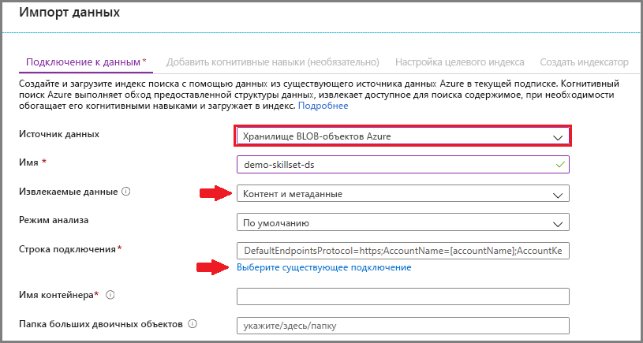
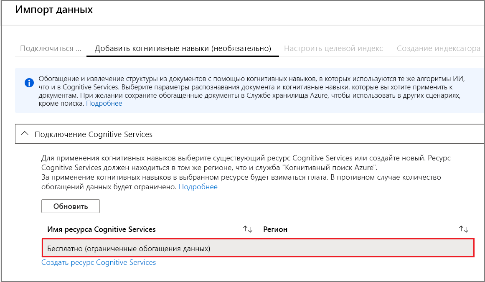
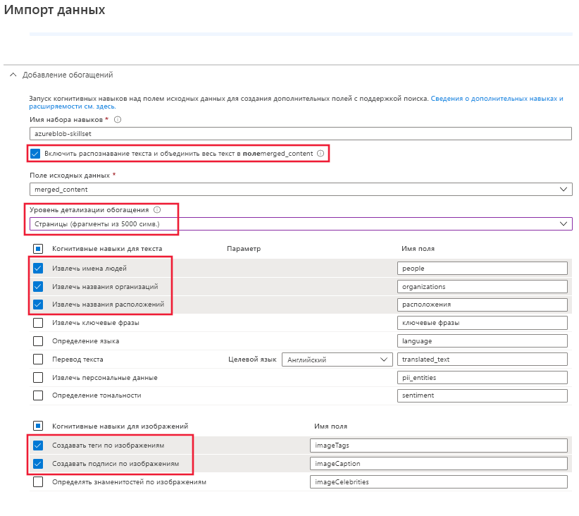
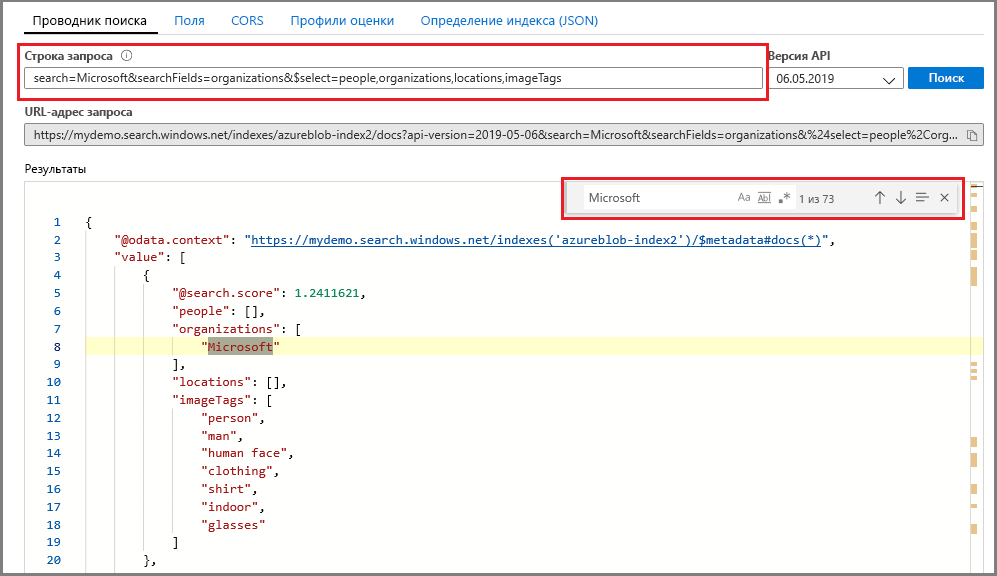

# Краткое руководство. Создание конвейера обогащения ИИ с помощью когнитивных навыков в Поиске Azure

Служба "Поиск Azure" интегрируется с [Cognitive Services](https://azure.microsoft.com/services/cognitive-services/), добавляя навыки извлечения данных, обработки естественного языка и изображений в конвейер индексирования службы "Поиск Azure" и упрощая поиск содержимого, по которому не выполняется обычный поиск или которое не структурировано. 

Некоторые ресурсы Cognitive Services, такие как [OCR](cognitive-search-skill-ocr.md), [распознавание языка](cognitive-search-skill-language-detection.md), [распознавание сущностей](cognitive-search-skill-entity-recognition.md) и др., можно подключить к процессу индексирования. Алгоритмы искусственного интеллекта Cognitive Services используются для поиска шаблонов, компонентов и характеристики в исходных данных и возвращают структуры и текстовое содержимое, которые пригодны для применения в решениях полнотекстового поиска на базе Поиска Azure.

В этом кратком руководстве вы создадите простейший конвейер обогащения на [портале Azure](https://portal.azure.com), не написав ни одной строки кода.

> [!div class="checklist"]
> * Начните работу с выборкой данных в хранилище BLOB-объектов Azure.
> * Настройте мастер [**импорта данных**](search-import-data-portal.md) для когнитивного индексирования и обогащения данных. 
> * Запустите мастер (навык сущности обнаруживает людей, расположение и организации).
> * Примените [**проводник поиска**](search-explorer.md) для запроса по обогащенным данным.

В рамках этого краткого руководства используется бесплатная служба, но количество бесплатных транзакций ограничено 20 документами в день. Если вы хотите использовать это краткое руководство чаще одного раза в день, применяйте набор файлов меньшего размера, чтобы его было запускать соответствующее количество раз.

> [!NOTE]
> По мере расширения области путем увеличения частоты обработки и добавления большего количества документов или дополнительных алгоритмов ИИ, вам нужно будет [присоединить оплачиваемый ресурс Cognitive Services](cognitive-search-attach-cognitive-services.md). Плата взимается при вызове API в Cognitive Services и извлечении изображений при открытии документов в службе "Поиск Azure". За извлечение текста из документов плата не взимается.
>
> Плата за выполнение встроенных навыков взимается в рамках существующей [модели оплаты Cognitive Services по мере использования](https://azure.microsoft.com/pricing/details/cognitive-services/). Плата за извлечение изображений указана на [странице с ценами на Поиск Azure](https://go.microsoft.com/fwlink/?linkid=2042400).

Если у вас еще нет подписки Azure, [создайте бесплатную учетную запись Azure](https://azure.microsoft.com/free/?WT.mc_id=A261C142F), прежде чем начинать работу.

## Предварительные требования

[Создайте службу "Поиск Azure"](search-create-service-portal.md) или [найдите существующую службу](https://ms.portal.azure.com/#blade/HubsExtension/BrowseResourceBlade/resourceType/Microsoft.Search%2FsearchServices) в рамках текущей подписки. Вы можете использовать бесплатную службу для выполнения инструкций, описанных в этом кратком руководстве.

[Cognitive Services](https://azure.microsoft.com/services/cognitive-services/) предоставляет функции искусственного интеллекта. В данном кратком руководстве описаны шаги по добавлению этих ресурсов как встроенных при указании конвейера. Заранее настраивать учетные записи необязательно.

Службы Azure должны предоставлять входные данные в конвейер индексирования. Для отчетов можно использовать любой источник данных, поддерживаемый [индексаторами Поиска Azure](search-indexer-overview.md). В этом кратком руководстве в качестве контейнера для исходных файлов данных используется [хранилище BLOB-объектов Azure](https://azure.microsoft.com/services/storage/blobs/). 

### Настройка службы BLOB-объектов Azure и загрузка примера данных

1. [Скачайте пример данных](https://1drv.ms/f/s!As7Oy81M_gVPa-LCb5lC_3hbS-4), который состоит из небольшого набора файлов различных типов. 

1. [Зарегистрируйтесь в хранилище BLOB-объектов Azure](https://docs.microsoft.com/azure/storage/common/storage-quickstart-create-account?tabs=azure-portal), создайте учетную запись хранения, откройте страницы служб BLOB-объектов и создайте контейнер.  Создайте учетную запись хранения в том регионе, где находится служба "Поиск Azure".

1. В созданном контейнере щелкните **Отправить**, чтобы отправить примеры файлов, которые вы скачали на предыдущем шаге.

   

## Создание конвейера обогащения

Вернитесь на страницу информационной панели Поиска Azure и щелкните **Импорт данных** на панели команд, чтобы настроить когнитивное обогащение за четыре шага.

  

### Шаг 1. Создание источника данных

В разделе **Подключение к данным** выберите **Хранилище BLOB-объектов**, затем выберите учетную запись и созданный контейнер. Присвойте источнику данных имя, а для остальных параметров используйте значения по умолчанию. 

  

Перейдите к следующей странице.

  

### Шаг 2. Добавление когнитивных навыков

Затем добавьте шаги обогащения в конвейер индексирования. Если у вас нет ресурса Cognitive Services, вы можете зарегистрироваться на получение бесплатной версии, которая предоставляет до 20 транзакций ежедневно. Пример данных состоит из 14 файлов, а значит после выполнения этого мастера дневная квота будет почти полностью использована.

1. Разверните узел **Подключение Cognitive Services**, чтобы просмотреть варианты ресурсов для API-интерфейсов Cognitive Services. Для целей этого руководства можно использовать **Бесплатный** ресурс.

   

2. Разверните узел **Добавление обогащений** и выберите навыки, которые выполняют обработку естественного языка. Для этого краткого руководства выберите распознавание людей, организаций и расположений.

   

   Портал предоставляет встроенные навыки для распознавания и анализа текста. На портале набор навыков работает над одним полем источника. Это может показаться маленькой целью, но для больших двоичных объектов Azure поле `content` содержит большую часть документа такого объекта (например, документа Word или набора слайдов PowerPoint). Таким образом это поле является идеальными входными данными, так как здесь присутствует все содержимое большого двоичного объекта.

3. Перейдите к следующей странице.

   

> [!NOTE]
> Навыки обработки естественного языка работают с текстовым содержимым в примере набора данных. Так как мы не выбрали распознавание текста, JPEG и PNG-файлы из тестового набора данных не будут обрабатываться при выполнении этого краткого руководства. 

### Шаг 3. Настройка индекса

Как правило, мастер правильно определяет индекс по умолчанию. На этом шаге вы можете просмотреть созданную схему и изменить любые параметры, если потребуется. Ниже представлен индекс по умолчанию, созданный для демонстрационного набора BLOB-объектов.

В этом кратком руководстве мастер устанавливает разумные значения по умолчанию: 

+ Для этого типа источника данных имя по умолчанию — *azureblob-index*. 

+ Поля по умолчанию основаны на поле исходных данных (`content`), а также полях выходных данных (`people`, `organizations` и `locations`), созданных когнитивным конвейером. Типы данных по умолчанию выводятся из метаданных и выборки данных.

+ Ключ по умолчанию *metadata_storage_path* (это поле содержит уникальные значения).

+ Атрибутами по умолчанию для этих полей являются **Доступный для получения** и **Доступный для поиска**. **Доступность для поиска** означает, что по этому полю можно выполнять поиск. **Доступность для получения** означает, что его можно возвращать в результатах. Мастер предполагает, что вы хотите, чтобы эти поля были доступны для получения и поиска, потому что вы создали их с помощью набора навыков.

  

Обратите внимание на зачеркивание и вопросительный знак в атрибуте **Доступный для получения** в поле `content`. Для документов с большим количеством текста в поле `content` содержится основная часть файла, которая может достигать тысячи строк. Если необходимо передать содержимое файла в код клиента, убедитесь, что атрибут **Доступный для получения** остается выбранным. В противном случае рассмотрите возможность очистки этого атрибута в `content`, если извлеченные элементы (`people`, `organizations` и `locations`) достаточны для ваших целей.

Маркировка поля как **Доступный для получения** не означает, что поле *должно* присутствовать в результатах поиска. Вы можете точно контролировать состав результатов поиска с помощью параметра запроса **$select**, чтобы указать, какие поля включать. Для полей с большим количеством текста, например `content`, параметр **$select** — это решение для предоставления управляемых результатов поиска пользователям вашего приложения, обеспечивая при этом доступ клиентского кода ко всем необходимым данным с помощью атрибута **Доступный для получения**.
  
Перейдите к следующей странице.

  

### Шаг 4. Настройка индексатора

Индексатор — это ресурс высокого уровня, управляющий процессом индексации. Он задает имя источника данных, целевой индекс и частоту выполнения. Конечным результатом мастера **импорта данных** всегда является индексатор, выполняемый несколько раз.

На странице **Индексатор** вы можете подтвердить имя по умолчанию и применить функцию планирования **Запустить один раз**, чтобы выполнить его немедленно. 

  

Щелкните **Отправить**, чтобы создать и немедленно запустить индексатор.

## Мониторинга индексирования

Действия по обогащению выполняются дольше, чем обычное текстовое индексирование. Мастер откроет на странице обзорной информации список индексатора, что позволяет отслеживать ход выполнения. Вы также можете самостоятельно открыть страницу обзорной информации и щелкнуть **Индексаторы**.

Вы увидите предупреждение, поскольку в списке есть файлы изображений JPG и PNG, но мы не добавили в конвейер навык распознавания текста. Также вы увидите уведомления об усечении. Поиск Azure на уровень "бесплатный" извлекает не более 32 000 символов.

  

Индексирование и обогащение может занять время, поэтому для ранних исследований рекомендуется использовать маленькие наборы данных. 

## Запросы в обозревателе поиска

После создания индекса можно отправлять запросы, возвращающие документы в индекс. Используйте **обозреватель поиска** на портале, чтобы выполнять запросы и просматривать результаты. 

1. На странице панели мониторинга службы поиска щелкните **Обозреватель поиска** в командной строке.

1. В верхней части окна щелкните **Изменить индекс**, чтобы выбрать созданный индекс.

1. Введите строку поиска для запроса по индексу, например `search=Microsoft&searchFields=organizations`.

Результаты возвращаются в формате JSON, который может быть подробным и трудным для чтения, особенно в больших документах, исходящих из больших двоичных объектов Azure. Если вы не можете легко проверить результаты, используйте сочетание клавиш CTRL+F для поиска в документах. Для этого запроса вы можете найти в документе JSON определенные термины. 

Сочетание клавиш CTRL+F также позволяет определить, сколько документов предоставлено в результирующем наборе. Для больших двоичных объектов Azure портал выбирает metadata_storage_path в качестве ключа, так как каждое значение в этом документе уникально. С помощью сочетания клавиш CTRL+F найдите metadata_storage_path, чтобы узнать количество документов. 

  

## Общие выводы

Итак, вы завершили первое упражнение по обогащенному индексированию. В этом кратком руководстве представлены важные понятия и шаги мастера, чтобы пользователь мог быстро создавать прототипы решений когнитивного поиска с помощью собственных данных.

Некоторые ключевые понятия, с которыми, как мы надеемся, вы разобрались, включают зависимость от источников данных Azure. Обогащение на основе когнитивного поиска привязано к индексаторам, а индексаторы — к Azure и соответствующим источникам. Несмотря на то что краткое руководство использует хранилище BLOB-объектов Azure, можно использовать и другие источники данных Azure. Дополнительные сведения см. в статье [Индексаторы в службе поиска Azure](search-indexer-overview.md).

Другим важным понятием является выполнение навыков в отношении полей входных данных. На портале необходимо выбрать одно поле входных данных для всех навыков. В коде входными данными могут быть другие поля или выходные данные вышестоящих навыков.

 Входные данные для навыка сопоставляются с полем выходных данных индекса. На внутреннем уровне портал настраивает [заметки](cognitive-search-concept-annotations-syntax.md) и определяет [набор навыков](cognitive-search-defining-skillset.md), устанавливая порядок операций и общий поток действий. Эти шаги скрыты на портале, но эти понятия становятся важными при написании кода.

Наконец, вы узнали, что для просмотра результатов необходимо запросить индекс. В результате служба "Поиск Azure" предоставляет доступный для поиска индекс, который можно запрашивать с помощью [простого](https://docs.microsoft.com/rest/api/searchservice/simple-query-syntax-in-azure-search) или [полностью расширенного синтаксиса запроса](https://docs.microsoft.com/rest/api/searchservice/lucene-query-syntax-in-azure-search). Индекс, который содержит обогащенные поля, не отличается от других. Если вы хотите включить стандартные или [настраиваемые анализаторы](search-analyzers.md), [профили оценки](https://docs.microsoft.com/rest/api/searchservice/add-scoring-profiles-to-a-search-index), [синонимы](search-synonyms.md), [фильтры аспектов](search-filters-facets.md), географический поиск или любую другую функцию службы "Поиск Azure", вы можете это сделать.

## Очистка

Если вы работаете в своей подписке, по окончании проекта рекомендуем решить, нужны ли вам созданные ресурсы. Работающие ресурсы могут означать лишние затраты. Можно удалить отдельные ресурсы или удалить группу ресурсов, что позволит удалить весь набор ресурсов.

Просматривать ресурсы и управлять ими можно на портале с помощью ссылок **Все ресурсы** или **Группы ресурсов** на панели навигации слева.

При работе с бесплатной версией службы помните о том, что вам доступно максимум три индекса, индексатора и источника данных. Вы можете удалить отдельные элементы на портале, чтобы не превысить лимит. 

## Дополнительная информация

В зависимости от того, как вы подготовили ресурс Cognitive Services, вы можете поэкспериментировать с индексированием и обогащением, повторно запустив мастер с разными навыками и полями источника данных. Чтобы повторить шаги, удалите индекс и индексатор, а затем повторно создайте индексатор с новым сочетанием выбранных элементов.

+ В разделе **Обзор** > **Индексы** выберите созданный индекс, а затем щелкните **Удалить**.

+ В разделе **Обзор** дважды щелкните элемент **Индексаторы**. Найдите созданный индексатор и удалите его.

Кроме того, этот пример данных и созданные службы можно использовать повторно, чтобы узнать, как выполнять эти же задания программно в следующем руководстве. 

> [!div class="nextstepaction"]
> [Руководство. REST API когнитивного поиска](cognitive-search-tutorial-blob.md)
