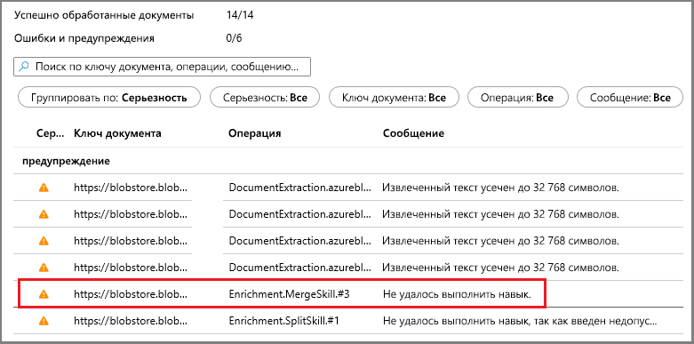
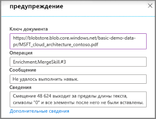

# Краткое руководство. Создание набора навыков Когнитивного поиска на портале Azure

Набор навыков — это функция искусственного интеллекта, которая извлекает информацию и структуру из больших неструктурированных текстовых или графических файлов, а также обеспечивает индексирование и поиск для запросов полнотекстового поиска в Когнитивном поиске Azure. 

В этом кратком руководстве вы объедините службы и данные в облаке Azure, чтобы создать набор навыков. Когда все будет готово, запустите мастер **Импорт данных** на портале, чтобы импортировать все вместе. Конечным результатом является индекс с возможностью поиска, заполненный данными, созданными при обработке ИИ, которые можно запросить на портале ([обозреватель поиска](search-explorer.md)).

Если у вас еще нет подписки Azure, [создайте бесплатную учетную запись](https://azure.microsoft.com/free/?WT.mc_id=A261C142F), прежде чем начинать работу.

## Создание служб и загрузка данных

В этом кратком руководстве используется Когнитивный поиск Azure, [хранилище BLOB-объектов Azure](https://docs.microsoft.com/azure/storage/blobs/) и [Azure Cognitive Services](https://azure.microsoft.com/services/cognitive-services/) для искусственного интеллекта. 

Так как рабочая нагрузка мала, Cognitive Services работает в фоновом режиме, чтобы обеспечить бесплатную обработку до 20 транзакций. Для такого небольшого набора данных можно пропустить создание или присоединение ресурса Cognitive Services.

1. [Скачайте пример данных](https://1drv.ms/f/s!As7Oy81M_gVPa-LCb5lC_3hbS-4), который состоит из небольшого набора файлов различных типов. Распакуйте файлы.

1. [Создайте учетную запись хранения Azure](https://docs.microsoft.com/azure/storage/common/storage-quickstart-create-account?tabs=azure-portal) или [найдите имеющуюся учетную запись](https://ms.portal.azure.com/#blade/HubsExtension/BrowseResourceBlade/resourceType/Microsoft.Storage%2storageAccounts/). 

   Выберите регион, в котором размещается Когнитивный поиск Azure, чтобы не оплачивать трафик. 
   
   Выберите тип учетной записи StorageV2 (общего назначения версии 2), если хотите испытать функцию хранилища знаний позже, в рамках другого пошагового руководства. В противном случае выберите любой тип.

1. Откройте страницы служб BLOB-объектов и создайте контейнер. Вы можете использовать общий уровень доступа по умолчанию. 

1. В контейнере щелкните **Отправить**, чтобы отправить примеры файлов, скачанные на первом шаге. Обратите внимание, что имеется широкий спектр типов содержимого, включая изображения и файлы приложений, которые не поддерживают полнотекстовый поиск в собственных форматах.

   

1. [Создайте службу "Когнитивный поиск Azure"](search-create-service-portal.md) или [найдите имеющуюся службу](https://ms.portal.azure.com/#blade/HubsExtension/BrowseResourceBlade/resourceType/Microsoft.Search%2FsearchServices). Вы можете использовать бесплатную службу для выполнения инструкций, описанных в этом кратком руководстве.

Теперь можно перейти к мастеру импорта данных.

## Запуск мастера импорта данных

На странице обзора службы поиска щелкните **Импорт данных** на панели команд, чтобы настроить когнитивное обогащение за четыре шага.

  

### Шаг 1. Создание источника данных

1. В разделе **Подключение к данным** выберите **Хранилище BLOB-объектов Azure**, затем выберите учетную запись хранения и созданный контейнер. Присвойте источнику данных имя, а для остальных параметров используйте значения по умолчанию. 

   

    Перейдите к следующей странице.

### Шаг 2. Добавление когнитивных навыков

Настройте обогащение с помощью ИИ, которое выполняет распознавание текста, анализ изображений и обработку естественного языка. 

1. В этом кратком руководстве мы используем ресурс Cognitive Services уровня **Бесплатный**. Демонстрационные данные состоят из 14 файлов, поэтому для этого краткого руководства достаточно бесплатного набора из 20 транзакций на Cognitive Services. 

   

1. Разверните элемент **Добавить обогащения** и выберите четыре значения. 

   Включите распознавание текста, чтобы добавить навыки анализа изображений на страницу мастера.

   Для параметра "Гранулярность" задайте значение "Страницы", чтобы разбить текст на фрагменты меньшего размера. Некоторые навыки работы с текстом имеют ограничение в 5 КБ на входные данные.

   Выберите навыки распознавания сущностей (людей, организаций и расположений) и анализа изображений.

   

   Перейдите к следующей странице.

### Шаг 3. Настройка индекса

Индекс хранит содержимое, доступное для поиска, а **мастер импорта данных** обычно создает схему, выполнив выборку источника данных. На этом шаге проверьте созданную схему и, возможно, измените некоторые параметры. Ниже приведена схема по умолчанию, созданная для демонстрационного набора данных больших двоичных объектов.

В этом кратком руководстве мастер устанавливает разумные значения по умолчанию:  

+ Поля по умолчанию создаются для свойств существующих больших двоичных объектов и дополняются полями для выходных данных обогащения (например, `people`, `organizations`, `locations`). Типы данных выводятся по метаданным и на основе выборки данных.

+ Ключ документа по умолчанию — *metadata_storage_path* (выбран, так как поле содержит уникальные значения).

+ По умолчанию устанавливаются атрибуты **Доступный для получения** и **Доступный для поиска**. **С возможностью поиска** разрешает полнотекстовый поиск по этому полю. **Доступный для поиска** означает, что значения поля можно возвращать в результатах. Мастер предполагает, что вы хотите, чтобы эти поля были доступны для получения и поиска, потому что вы создали их с помощью набора навыков.

  

Обратите внимание на зачеркивание и вопросительный знак в атрибуте **Доступный для получения** в поле `content`. Для документов с большим количеством текста в поле `content` содержится основная часть файла, которая может достигать тысячи строк. Это поле плохо подходит для результатов поиска и его следует исключить из нашего примера. 

Но если вам потребуется передавать содержимое файла в код клиента, оставьте атрибут **Доступный для получения** выбранным. В противном случае, если извлеченных элементов (`people`, `organizations` и `locations`) достаточно для ваших целей, можно убрать этот атрибут для `content`.

Маркировка поля как **Доступный для получения** не означает, что поле *должно* присутствовать в результатах поиска. Вы можете точно контролировать состав результатов поиска с помощью параметра запроса **$select**, чтобы указать, какие поля включать. Для полей с большим количеством текста, например `content`, параметр **$select** — это решение для предоставления управляемых результатов поиска пользователям вашего приложения, обеспечивая при этом доступ клиентского кода ко всем необходимым данным с помощью атрибута **Доступный для получения**.
  
Перейдите к следующей странице.

### Шаг 4. Настройка индексатора

Индексатор — это ресурс высокого уровня, управляющий процессом индексации. Он задает имя источника данных, целевой индекс и частоту выполнения. Мастер **импорта данных** создает несколько объектов и всегда индексатор, выполняемый несколько раз.

1. На странице **Индексатор** вы можете подтвердить имя по умолчанию и щелкнуть функцию планирования **Однократно**, чтобы выполнить его немедленно. 

   

1. Щелкните **Отправить**, чтобы создать и немедленно запустить индексатор.

## Состояние монитора

Индексирование с использованием когнитивных навыков занимает больше времени, чем обычное индексирование на основе текста, особенно при распознавании текста и анализе изображений. Чтобы отслеживать ход выполнения, перейдите на страницу обзора и щелкните **Индексатор** посредине страницы.

  

Наличие предупреждений можно считать нормальным, учитывая широкое разнообразие типов содержимого. Некоторые типы содержимого недопустимы для некоторых навыков, а на низких уровнях регулярно нарушаются [ограничения индексатора](search-limits-quotas-capacity.md#indexer-limits). Например, уведомления об усечении до 32 000 символов означают, что достигнут предел возможностей индексатора на уровне "Бесплатный". Если вы запустите этот пример на более высоком уровне, многие предупреждения об усечении исчезнут.

Чтобы проверить наличие предупреждений и ошибок, щелкните состояние предупреждения в списке индексаторов, чтобы открыть страницу "Журнал выполнения".

На этой странице снова щелкните состояние предупреждения, чтобы просмотреть список предупреждений, аналогичный представленному ниже. 

  

Чтобы отобразить подробные сведения, щелкните любую строку состояния. Это предупреждение сообщает, что слияние остановлено из-за достижения максимального порогового значения (для особенно большого документа PDF).

  

## Запросы в обозревателе поиска

После создания индекса можно выполнять запросы для получения данных. Для этого используйте **проводник поиска** на портале. 

1. На странице панели мониторинга службы поиска щелкните **Обозреватель поиска** в командной строке.

1. В верхней части окна щелкните **Изменить индекс**, чтобы выбрать созданный индекс.

1. Введите строку поиска для запроса по индексу, например `search=Microsoft&$select=people,organizations,locations,imageTags`.

Результаты возвращаются в формате JSON, который будет слишком подробным и трудным для чтения, особенно в больших документах, созданным для больших двоичных объектов Azure. Вот несколько советов по поиску с помощью этого средства:

+ добавьте `$select`, чтобы выбрать поля для включения в результаты поиска; 
+ сочетание клавиш CTRL+F позволяет найти определенные свойства или термины в документе JSON;

в строках запроса учитывается регистр, поэтому при получении сообщения "неизвестное поле" проверьте правильность написания и регистр в значениях **Fields** (поля) **Index Definition (JSON)** (определение индекса). 

  

## Общие выводы

Вы создали свой первый набор навыков и узнали о важных понятиях, полезных для создания более сложного решения поиска с помощью собственных данных.

Некоторые ключевые понятия, с которыми, как мы надеемся, вы разобрались, включают зависимость от источников данных Azure. Набор навыков привязан к индексатору, а индексаторы зависят от Azure и источника. Несмотря на то что краткое руководство использует хранилище BLOB-объектов Azure, можно использовать и другие источники данных Azure. Дополнительные сведения см. в статье [Indexers in Azure Search](search-indexer-overview.md) (Индексаторы в службе "Поиск Azure"). 

Еще один важный фактор — навыки учитывают типы содержимого, а значит в среде с разнородным содержимым некоторые входные данные будут пропущены. Кроме того, крупные файлы и (или) значения полей могут привести к превышению лимитов на используемом уровне службы. В таких случаях появление предупреждений считается нормальным. 

Выходные данные направляются в индекс поиска. Существует сопоставление между парами "имя — значение", созданными во время индексирования, и отдельными полями в индексе. На внутреннем уровне портал настраивает [заметки](cognitive-search-concept-annotations-syntax.md) и определяет [набор навыков](cognitive-search-defining-skillset.md), устанавливая порядок операций и общий поток действий. Эти шаги скрыты на портале, но эти понятия становятся важными при написании кода.

Наконец, вы узнали, что можно проверять содержимое путем запроса индекса. В результате служба "Когнитивный поиск Azure" предоставляет доступный для поиска индекс, который можно запрашивать с помощью [простого](https://docs.microsoft.com/rest/api/searchservice/simple-query-syntax-in-azure-search) или [полностью расширенного синтаксиса запроса](https://docs.microsoft.com/rest/api/searchservice/lucene-query-syntax-in-azure-search). Индекс, который содержит обогащенные поля, не отличается от других. Если вы хотите включить стандартные или [настраиваемые анализаторы](search-analyzers.md), [профили оценки](https://docs.microsoft.com/rest/api/searchservice/add-scoring-profiles-to-a-search-index), [синонимы](search-synonyms.md), [фильтры аспектов](search-filters-facets.md), географический поиск или любую другую функцию службы "Когнитивный поиск Azure", вы можете это сделать.

## Очистка ресурсов

Если вы работаете в своей подписке, по окончании проекта рекомендуем решить, нужны ли вам созданные ресурсы. Работающие ресурсы могут означать лишние затраты. Можно удалить отдельные ресурсы или удалить группу ресурсов, что позволит удалить весь набор ресурсов.

Просматривать ресурсы и управлять ими можно на портале с помощью ссылок **Все ресурсы** или **Группы ресурсов** на панели навигации слева.

При работе с бесплатной версией службы помните о том, что вам доступно максимум три индекса, индексатора и источника данных. Вы можете удалить отдельные элементы на портале, чтобы не превысить лимит. 

## Дальнейшие действия

Вы можете создавать наборы навыков, используя портал, .NET SDK или REST API. Чтобы получить дополнительные знания, попробуйте использовать REST API с Postman и другими демонстрационными данными.

> [!div class="nextstepaction"]
> [Руководство. Извлечение текста и структуры из больших двоичных объектов JSON с помощью REST API](cognitive-search-tutorial-blob.md)

> [!Tip]
> Если вы хотите повторить это упражнение или попробовать другое пошаговое руководство по обогащению ИИ, удалите индексатор на портале. При удалении индексатора счетчик бесплатных ежедневных транзакций сбрасывается обратно на нулевое значение для обработки Cognitive Services.