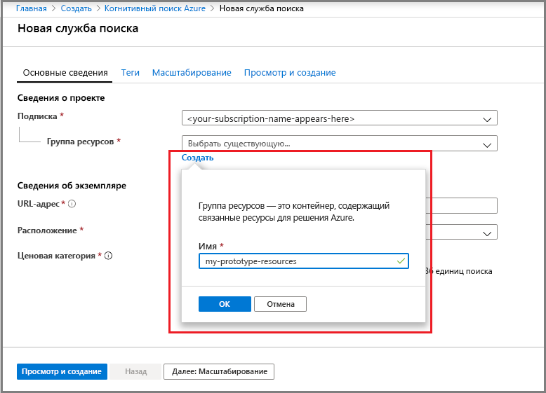
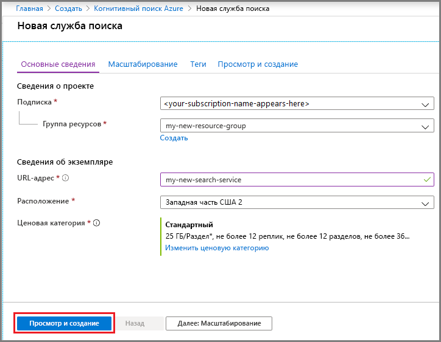
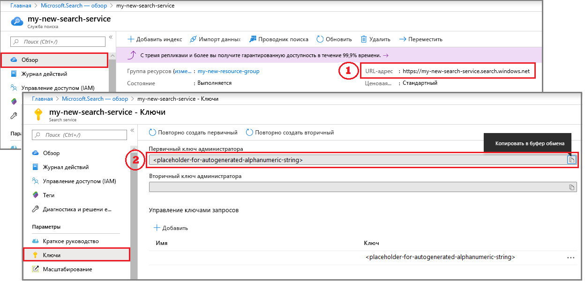

# Краткое руководство. Создание службы "Когнитивный поиск Azure" на портале

Когнитивный поиск Azure — это автономный ресурс, используемый для добавления поиска в пользовательские приложения. Когнитивный поиск Azure легко интегрируется с другими службами Azure, приложениями на сетевых серверах или с программным обеспечением, работающим на других облачных платформах.

В этой статье вы узнаете, как создать ресурс на [портале Azure](https://portal.azure.com/).

Предпочитаете использовать PowerShell? Используйте [шаблон службы](https://azure.microsoft.com/resources/templates/101-azure-search-create/) Azure Resource Manager. Сведения для начала работы см. в статье [Manage your Azure Search service with PowerShell](search-manage-powershell.md) (Управление службой "Когнитивный поиск Azure" с помощью PowerShell).

## Подписка (бесплатная или платная)

[Откройте бесплатную учетную запись Azure](https://azure.microsoft.com/pricing/free-trial/?WT.mc_id=A261C142F) и используйте бесплатные кредиты, чтобы опробовать платные службы Azure. После того, как кредиты будут израсходованы, сохраните свою учетную запись. Вы сможете использовать ее для работы с бесплатными службами Azure, такими как веб-сайты. С вашей кредитной карты не будет взиматься плата, если вы явно не измените параметры и не попросите снимать плату.

Кроме того, вы можете [активировать преимущества подписчика MSDN](https://azure.microsoft.com/pricing/member-offers/msdn-benefits-details/?WT.mc_id=A261C142F). Подписка MSDN каждый месяц приносит вам кредиты, которыми можно оплачивать использование платных служб Azure. 

## Как найти Когнитивный поиск Azure

1. Войдите на [портал Azure](https://portal.azure.com/).
2. Щелкните знак плюса ("+ Создать ресурс") в левом верхнем углу.
3. Используйте панель поиска, чтобы найти Когнитивный поиск Azure, или перейдите к ресурсу, выбрав **Веб** > **Azure Cognitive Search** (Когнитивный поиск Azure).

## Выберите подписку.

Если у вас есть несколько подписок, выберите ту, которую будете использовать.

## Настройка группы ресурсов

Группа ресурсов — это контейнер, содержащий связанные ресурсы для решения Azure. Он необходим для службы поиска. Это также полезно для управления ресурсами, включая затраты. Группа ресурсов может включать одну или несколько служб, используемых совместно. Например, если вы используете Когнитивный поиск Azure для индексирования базы данных Azure Cosmos DB, можно разместить обе службы в одной группу ресурсов для удобства управления. 

Если вы не объединяете ресурсы в одну группу или если существующие группы ресурсов заполнены ресурсами, используемыми в несвязанных решениях, создайте новую группу ресурсов только для своего ресурса Когнитивный поиск Azure. 

Со временем вы можете контролировать текущие и запланированные затраты, а также просматривать расходы по отдельным ресурсам. На следующем снимке экрана показан тип сведений о затратах, которые можно увидеть при объединении нескольких ресурсов в одну группу.

> [!TIP]
> Группы ресурсов упрощают очистку, поскольку при удалении группы также удаляются все службы внутри нее. Если проект прототипа использует нескольких служб, то, поместив их все в одну группу ресурсов, можно упростить очистку после завершения этого проекта.

## Присвоение имени службе

В разделе сведений об экземпляре введите имя службы в поле **URL-адрес**. Это имя является частью URL-адреса конечной точки, к которой отправляются вызовы API: `https://your-service-name.search.windows.net`. Например, если вы хотите, чтобы конечная точка была `https://myservice.search.windows.net`, вы должны ввести `myservice`.

Требования к имени службы:

* имя должно быть уникальным в пределах пространства имен search.windows.net;
* длина имени — от 2 до 60 знаков;
* имя должно содержать строчные буквы, цифры или дефисы ("-");
* имя не должно содержать дефис ("-") в первых двух и последней позициях;
* нельзя использовать несколько последовательных дефисов ("--") в любой позиции.

> [!TIP]
> Если вы считаете, что будете использовать несколько служб, мы рекомендуем использовать соглашение об именовании, по которому в имя службы добавляется название региона или расположения. Службы в одном регионе могут обмениваться данными без дополнительной оплаты. Таким образом, если Когнитивный поиск Azure находится в регионе "западная часть США", где у вас есть и другие службы, имя вида `mysearchservice-westus` позволит вам не открывать лишний раз страницу свойств при выборе ресурсов для объединения или присоединения.

## Выбор расположения

Являясь службой Azure, Когнитивный поиск Azure может размещаться в центрах обработки данных по всему миру. Список поддерживаемых регионов можно найти на [странице с ценами](https://azure.microsoft.com/pricing/details/search/). 

Вы можете снизить или полностью исключить расходы на передачу данных, выбрав одинаковое расположение для нескольких служб. Например, если вы индексируете данные, предоставляемые другой службой Azure (служба хранилища Azure, Azure Cosmos DB или База данных SQL Azure), размещение Когнитивного поиска Azure в одном с ними регионе позволит избежать начисления платы за передачу данных (так как в пределах одного региона не взимается плата за исходящий трафик).

Если вы используете обогащение с помощью ИИ, создайте службу поиска в том же регионе, что и Cognitive Services. *Совместное размещение Когнитивного поиска Azure и Cognitive Services в одном регионе является обязательным условием для обогащения ИИ*.

> [!Note]
> Центральная Индия сейчас недоступна для новых служб. Для служб, уже развернутых в Центральной Индии, вы можете увеличить масштаб без ограничений, и поддержка этих служб в данном регионе предоставляется в полном объеме. Ограничение на этот регион является временным и ограничивается только новыми услугами. Эта заметка будет удалена, когда это ограничение не будет применяться.

## Выбор ценовой категории (номер SKU)

[Служба "Когнитивный поиск Azure" сейчас предлагается в нескольких ценовых категориях](https://azure.microsoft.com/pricing/details/search/): "Бесплатный", "Базовый" и "Стандартный". Каждая категория отличается собственным [объемом и ограничениями](search-limits-quotas-capacity.md). Подробные сведения см. в статье [Выбор SKU или ценовой категории для службы поиска Azure](search-sku-tier.md).

Ценовые категории "Базовый" и "Стандартный" чаще всего используются для рабочих нагрузок, но большинство клиентов начинает работу с уровня службы "Бесплатный". Основные различия между уровнями: размер секции и скорость, а также ограничения на количество объектов, которые можно создать.

Но не забывайте, что после создания службы ценовую категорию изменить нельзя. Если потребуется повысить или понизить категорию, нужно будет повторно создать службу.

## Создание службы

Когда вы предоставите необходимые входные данные, переходите к созданию службы. 

Служба развертывается в течение нескольких минут. Ход выполнения можно отслеживать с помощью уведомлений Azure. Рассмотрите возможность закрепления службы на панели мониторинга для быстрого доступа в будущем.

## Получение ключа и конечной точки URL-адреса

Если вы не используете портал, для программного доступа к новой службе необходимо указать конечную точку URL-адреса и API-ключ аутентификации.

1. Найдите и скопируйте конечную точку URL-адреса в правой части страницы **Обзор**.

2. На странице **Ключи** скопируйте любой из ключей администратора (они равноценны). API-ключи администратора необходимы для создания, обновления и удаления объектов в службе. Ключи запроса, напротив, предоставляют доступ для чтения к содержимому индекса.

   

Конечная точка и ключ не нужны для задач портала. Портал уже связан с вашим ресурсом службы "Когнитивный поиск Azure" с правами администратора. Для изучения пошагового руководства портала, начните с [краткого руководства. Создание индекса службы "Когнитивный поиск Azure" на портале](search-get-started-portal.md).

## Выполните масштабирование службы

Подготовив службу, вы можете выполнить ее масштабирование в соответствии со своими потребностями. Выбрав уровень "Стандартный" для службы "Когнитивный поиск Azure", вы сможете масштабировать свою службу в двух измерениях: репликах и секциях. Если вы выбрали уровень "Базовый", то сможете добавлять только реплики. Если подготовлена бесплатная служба, масштабирование будет недоступно.

***Секции*** позволяют службе хранить данные и осуществлять поиск в большем количестве документов.

***Реплики*** дают службе возможность справляться с повышенной нагрузкой запросов поиска.

Добавление ресурсов увеличивает ваш ежемесячный счет. [Калькулятор цен](https://azure.microsoft.com/pricing/calculator/) поможет вам понять, как выставляются счета при добавлении ресурсов. Помните, что вы можете выбирать число ресурсов на основе нагрузки. Например, вы можете сначала увеличить число ресурсов для создания полного начального индекса, а затем уменьшить его до уровня, который больше подходит для добавочного индексирования.

> [!Important]
> У службы должно быть [2 реплики для выполнения соглашения об уровне обслуживания только для чтения и 3 реплики для выполнения соглашения об уровне обслуживания чтения и записи](https://azure.microsoft.com/support/legal/sla/search/v1_0/).

1. Перейдите к странице своей службы поиска на портале Azure.
2. В области навигации слева щелкните **Параметры** > **Масштаб**.
3. Используйте ползунок, чтобы добавить ресурсы любого типа.

> [!Note]
> Хранение на уровне раздела и скорость увеличивается на более высоких уровнях. Дополнительные сведения см. в разделе [Service limits in Azure Search](search-limits-quotas-capacity.md) (Ограничения службы поиска Azure).

## Когда следует добавлять вторую службу

Большинство пользователей использует только одну службу, подготовленную на уровне, который обеспечивает [правильный баланс ресурсов](search-sku-tier.md). В одной службе может размещаться несколько индексов с учетом [максимального ограничения выбранного уровня](search-capacity-planning.md), при этом все индексы изолированы друг от друга. В Когнитивном поиске Azure запросы могут направляться только в один индекс, сводя к минимуму вероятность случайного или преднамеренного получения данных из других индексов в той же службе.

Несмотря на то, что большинство пользователей использует только одну службу, избыточность служб может потребоваться, если в эксплуатационных целях необходимо обеспечить следующее:

* Аварийное восстановление (сбой центра обработки данных). Когнитивный поиск Azure не обеспечивает немедленную отработку отказа в случае сбоя. Рекомендации и инструкции см. в статье [Администрирование службы поиска Azure на портале Azure](search-manage.md).
* Изучая мультитенантную модель, мы определили, что использование дополнительных служб обеспечивает оптимальную архитектуру. Дополнительные сведения см. в статье [Шаблоны разработки для мультитенантных приложений SaaS и Поиска Azure](search-modeling-multitenant-saas-applications.md).
* Для глобально развернутых приложений может потребоваться наличие экземпляра Когнитивного поиска Azure в нескольких регионах, чтобы минимизировать задержку международного трафика приложения.

> [!NOTE]
> В Когнитивном поиске Azure невозможно разделить индексирование и операции запросов, то есть вы не сможете создать несколько служб для разделенных рабочих нагрузок. Индекс всегда запрашивается в службе, в которой он был создан (невозможно создать индекс в одной службе и скопировать его на другую).

Для обеспечения высокого уровня доступности вторая служба не является обязательной. Высокая доступность для запросов достигается за счет использования двух или более реплик в одной службе. Обновление реплик выполняется последовательно, то есть при развертывании обновления службы должна работать по крайней мере одна реплика. Дополнительные сведения об обеспечении бесперебойной работы см. в [Соглашении об уровне обслуживания](https://azure.microsoft.com/support/legal/sla/search/v1_0/).

## Дальнейшие действия

После подготовки службы вы можете продолжить создание своего первого индекса на портале.

> [!div class="nextstepaction"]
> [Краткое руководство. по созданию индекса службы "Когнитивный поиск Azure" на портале](search-get-started-portal.md)
