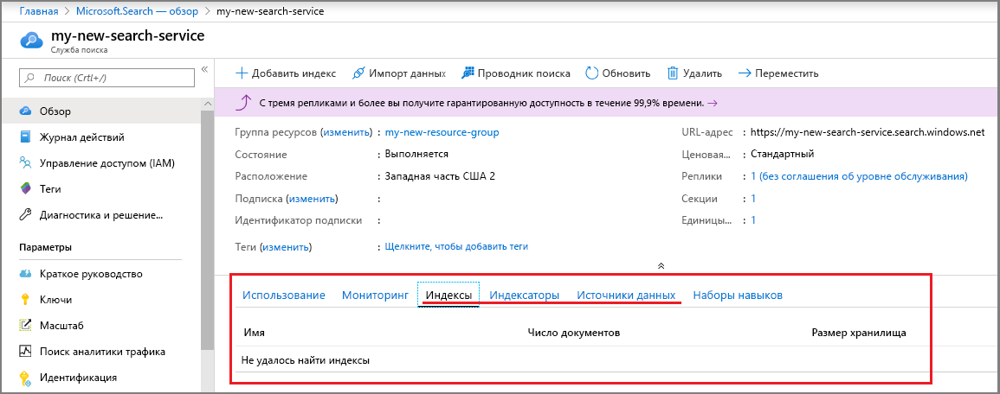
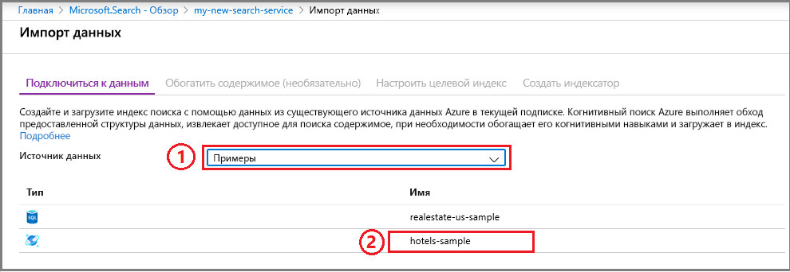
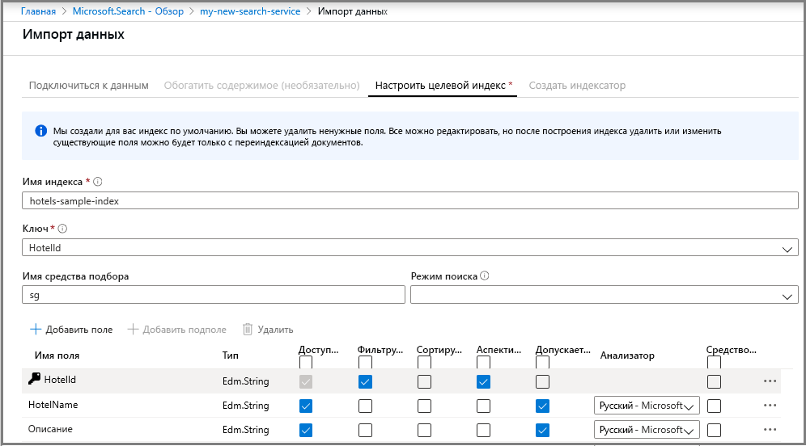
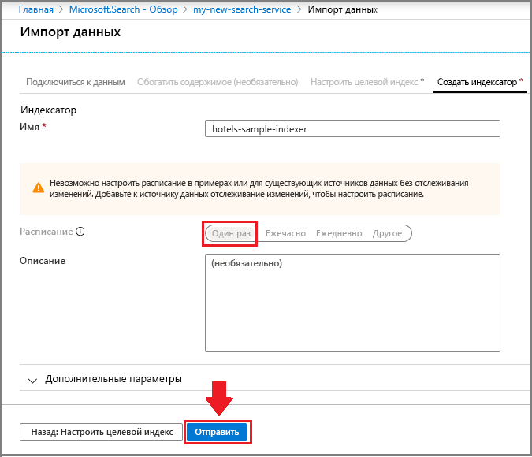
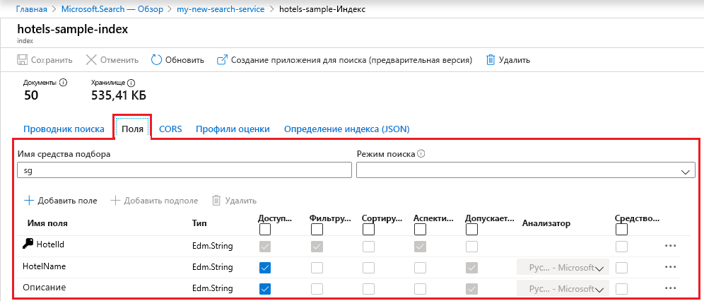

# Краткое руководство. Создание индекса службы "Когнитивный поиск Azure" на портале Azure
> [!div class="op_single_selector"]
> * [Портал](search-get-started-portal.md)
> * [C#](search-get-started-dotnet.md)
> * [Java](search-get-started-java.md)
> * [Node.js](search-get-started-nodejs.md)
> * [PowerShell](search-get-started-powershell.md)
> * [Postman](search-get-started-postman.md)
> * [Python](search-get-started-python.md)

С помощью мастера **импорта данных** и средств **проводника поиска** портала можно быстро освоить основные понятия и создавать интересные запросы к индексу за считаные минуты.

Если этих инструментов вам недостаточно, попробуйте применить [программирование службы "Когнитивный поиск Azure" в приложении .NET с помощью кода](search-howto-dotnet-sdk.md) или [Postman для выполнения вызовов REST API](search-get-started-postman.md). 

Если у вас еще нет подписки Azure, [создайте бесплатную учетную запись Azure](https://azure.microsoft.com/free/?WT.mc_id=A261C142F), прежде чем начинать работу. 

## Предварительные требования

[Создайте службу "Когнитивный поиск Azure"](search-create-service-portal.md) или [найдите имеющуюся службу](https://ms.portal.azure.com/#blade/HubsExtension/BrowseResourceBlade/resourceType/Microsoft.Search%2FsearchServices) в рамках текущей подписки. Вы можете использовать бесплатную службу для выполнения инструкций, описанных в этом кратком руководстве. 

### Проверка доступного пространства

Многие пользователи предпочитают начать работу с бесплатной службой. В бесплатной версии можно использовать только три индекса, три источника данных и три индексатора. Перед началом работы убедитесь, что у вас достаточно места для дополнительных элементов. В этом руководстве каждый объект создается один раз.

Разделы на информационной панели службы содержат сведения о количестве имеющихся индексов, индексаторов и источников данных. 

##  Создание индекса и загрузка данных

Поисковые запросы выполняют итерацию по [*индексу*](search-what-is-an-index.md), содержащему доступные для поиска данные, метаданные и дополнительные конструкции, которые оптимизируют определенные способы поиска.

В этом руководстве мы используем встроенный пример набора данных. [*Индексатор*](search-indexer-overview.md) сможет просканировать его с помощью мастера [**импорта данных**](search-import-data-portal.md). Индексатор — это нацеленный на конкретный источник поисковый модуль, который может считывать метаданные и содержимое из источников данных, поддерживаемых Azure. Как правило, индексаторы используются программным способом, но на портале они доступны через мастер **импорта данных**. 

### Шаг 1. Запуск мастера импорта данных и создание источника данных

1. На панели мониторинга службы "Когнитивный поиск Azure" выберите **Импорт данных** на панели команд, чтобы создать и заполнить индекс для поиска.

   

2. В окне мастера щелкните **Connect to your data** (Подключиться к данным)  > **Примеры** > **hotels-sample**. Это встроенный источник данных. Чтобы создать собственный источник данных, вам нужно будет ввести для него имя, тип и сведения о подключении. После создания он становится существующим источником данных, который можно повторно использовать в других операциях импорта.

   

3. Перейдите к следующей странице.

### Шаг 2. Пропуск страницы Enrich content (Обогащение содержимого)

Мастер поддерживает создание [конвейера обогащения с помощью ИИ](cognitive-search-concept-intro.md), что позволяет внедрить в индексирование алгоритмы искусственного интеллекта Cognitive Services. 

Пропустите пока этот шаг и переходите сразу к **настройке целевого индекса**.

   

> [!TIP]
> Можно пошагово выполнить пример индексирования ИИ из [краткого руководства](cognitive-search-quickstart-blob.md) или [руководства](cognitive-search-tutorial-blob.md).

### Шаг 3. Настройка индекса

Создание индекса обычно выполняется с использованием кода и еще до загрузки данных. Но, как мы видим в примере для этого руководства, мастер может создать простой индекс для любого поддерживаемого источника данных. Для индекса необходимо указать как минимум имя и коллекцию полей, а одно поле следует отметить как ключ документа, однозначно определяющий его. Кроме того, вы можете указать анализаторы языка или средства подбора, если вам нужно автоматическое завершение или предложение запросов.

Поля имеют типы данных и атрибуты. Флажки в верхней части — это *атрибуты индекса*, которые определяют, как используется поле.

* **Доступный для получения** означает, что поле будет показано в списке результатов поиска. Вы можете снять этот флажок напротив отдельных полей, чтобы исключить их из результатов поиска (например, если такие поля используются только в выражениях фильтра).
* **Ключ** служит уникальным идентификатором документа. Он поддерживает только строковые значения и является обязательным.
* Атрибуты **Фильтруемый**, **Сортируемый** и **Аспектируемый** определяют, может ли поле использоваться для фильтра, сортировки или аспектной навигации.
* **Доступный для поиска** включает поле в полнотекстовый поиск. Строки доступны для поиска. Поиск по числовым и логическим полям часто исключается.

Этот выбор не влияет на требования к хранилищу. Например, атрибут **Доступный для получения** для нескольких полей хранилища не повышает требования к хранилищу.

По умолчанию мастер сканирует источник данных на наличие уникального идентификатора, который будет использоваться в качестве основы для ключевого поля. *Строки* помечаются как **доступные для получения** и **для поиска**, а *целые числа* — как **доступные для получения**, **фильтруемые**, **сортируемые** и **аспектируемые**.

1. Примите значения по умолчанию. 

   При повторном запуске мастера с использованием существующего источника данных hotels в индексе не будут заданы атрибуты по умолчанию. Вам потребуется вручную выбрать атрибуты для следующего импорта. 

   

2. Перейдите к следующей странице.

### Шаг 4. Настройка индексатора

В мастере **импорта данных** щелкните **Индексатор** > **Имя** и введите имя индексатора.

Этот объект определяет исполняемый процесс. Вы можете задать повторяющееся расписание, но пока сохраните выбранный по умолчанию вариант, который однократно и немедленно запускает индексатор.

Щелкните **Отправить**, чтобы создать и немедленно запустить индексатор.

  

## Отслеживание хода выполнения

Мастер откроет страницу со списком индексаторов, где вы сможете отслеживать ход выполнения. Вы также можете самостоятельно открыть страницу обзорной информации и щелкнуть **Индексаторы**.

Обновление страницы на портале может занять несколько минут, а затем вы увидите в списке только что созданный индексатор с состоянием, указывающим на выполнение или завершение, а также количество проиндексированных документов.

   

## Просмотр индекса

На основной странице службы содержатся ссылки на ресурсы, созданные в службе "Когнитивный поиск Azure".  Для просмотра индекса, который вы только что создали, щелкните **Индексы** в списке ссылок. 

Дождитесь обновления страницы портала. Через несколько минут вы увидите индекс с количеством документов и размером хранилища.

   

В этом списке можно щелкнуть индекс *hotels-sample*, который вы только что создали, чтобы просмотреть схему индекса. и при необходимости добавить новые поля. 

На вкладке **Поля** отображается схема индекса. Прокрутите до нижней части списка, чтобы добавить новое поле. В большинстве случаев существующие поля нельзя изменить. Существующие поля имеют физическое представление в службе "Когнитивный поиск Azure". Поэтому они не изменяются даже в коде. Чтобы существенным образом изменить существующее поле, создайте новый индекс и уделите старый.

   

Другие конструкции, такие как профили оценки и параметры CORS, можно добавить в любое время.

Чтобы четко понять, что можно и нельзя изменить во время проектирования индекса, рекомендуем просмотреть параметры определения индекса. Если параметры закрашены серым, это означает, что их значения не можно изменить или удалить. 

##  Создание запроса с помощью обозревателя поиска

У вас уже должен быть индекс службы поиска, который можно запрашивать, используя встроенный в страницу запроса [**проводник поиска**](search-explorer.md). Это поле для поиска, с помощью которого можно проверить произвольные строки запроса.

**Обозреватель поиска** используется только для обработки [запросов REST API](https://docs.microsoft.com/rest/api/searchservice/search-documents). Но он также поддерживает [простой синтаксис запросов](https://docs.microsoft.com/rest/api/searchservice/simple-query-syntax-in-azure-search) и [средство полного синтаксического анализа запросов Lucene](https://docs.microsoft.com/rest/api/searchservice/lucene-query-syntax-in-azure-search), а также все параметры поиска, доступные в операциях [REST API поиска документов](https://docs.microsoft.com/rest/api/searchservice/search-documents#bkmk_examples).

> [!TIP]
> В [обзорном видео о службе "Когнитивный поиск Azure"](https://channel9.msdn.com/Events/Connect/2016/138) следующие действия демонстрируются начиная с 6:08.
>

1. Щелкните **Проводник поиска** на панели команд.

   

2. В раскрывающемся списке **Индекс** выберите *hotels-sample-index*. Щелкните раскрывающийся список **Версия API**, чтобы просмотреть доступные REST API. Для приведенных ниже запросов используйте общедоступную версию (2019-05-06).

   

3. В строке поиска введите приведенные ниже строки запроса и нажмите кнопку **Поиск**.

   

## Примеры запросов

Вы можете ввести термины и фразы, как в обычном поиске Bing или Google, или полностью определенное выражение запрос. Будут возвращены результаты в виде подробных документов JSON.

### Простой запрос с N лучшими результатами

#### Пример (строковый запрос): `search=spa`

* С помощью параметра **search** вводится ключевое слово для полнотекстового поиска. В нашем случае будут возвращены данные об отелях, содержащие слово *spa* в любом доступном для поиска поле в документе.

* **Обозреватель поиска** возвращает результаты в подробном JSON-файле, который трудно читать, если документы имеют высокую плотность структуры. Это сделано намеренно. Видимость всего документа важна при разработке, особенно во время тестирования. Для удобства работы пользователя необходимо написать код, который [обрабатывает результаты поиска](search-pagination-page-layout.md) для вывода важных элементов.

* Документы содержат все поля, помеченные как доступные для получения в индексе. Чтобы просмотреть атрибуты индекса на портале, в списке **Индексы** щелкните *hotels-sample*.

#### Пример (параметризованный запрос): `search=spa&$count=true&$top=10`

* Символ **&** используется для добавления параметров поиска, которые можно указать в любом порядке.

* Параметр **$count=true** возвращает общее число всех возвращенных документов. Это значение отображается в верхней части результатов поиска. Запросы фильтра можно проверять, наблюдая за изменениями результатов, возвращаемых параметром **$count=true**. Меньшее количество означает, что фильтр работает.

* Параметр **$top=10** возвращает 10 документов с самой высокой оценкой. По умолчанию служба "Когнитивный поиск Azure" возвращает первые 50 лучших соответствий. Увеличить или уменьшить это число можно с помощью параметра **$top**.

###  Фильтрация запроса

Фильтры включаются в запросы поиска при добавлении параметра **$filter**. 

#### Пример (отфильтрованный): `search=beach&$filter=Rating gt 4`

* Параметр **$filter** возвращает результаты, соответствующие указанным условиям. В данном случае это отели с числом звезд больше 4.

* Синтаксис фильтра — это конструкция OData. Дополнительные сведения см. в статье [OData Expression Syntax for Azure Search](https://docs.microsoft.com/rest/api/searchservice/odata-expression-syntax-for-azure-search) (Синтаксис выражений OData для службы поиска Azure).

###  Аспектирование запроса

Фильтры аспектов включаются в запросы поиска. Параметр аспекта можно использовать для возврата суммарного количества документов, которые соответствуют указанному значению аспекта.

#### Пример (аспектированный с сокращением объема): `search=*&facet=Category&$top=2`

* **search=** * является пустым полем поиска. Пустые поля поиска выполняют поиск по всему. Одна из причин отправки пустого запроса — отфильтровать или аспектировать полный набор документов. Например, вы хотите, чтобы структура фасетной навигации состояла из всех отелей в индексе.
* Параметр **facet** возвращает структуру навигации, которую можно передать в элемент управления пользовательского интерфейса. Он возвращает категории и количество. В этом случае категории основаны на поле с именем *Категория*. Служба "Когнитивный поиск Azure" не поддерживает агрегирование, но приблизительный результат можно получить с помощью параметра `facet`, который возвращает количество документов в каждой категории.

* Параметр **$top=2** возвращает два документа и демонстрирует, что `top` можно использовать для уменьшения или увеличения количества результатов.

#### Пример (аспект на основе числового значения): `search=spa&facet=Rating`

* Этот запрос задает аспект по числу звезд у отеля для поиска по запросу *spa*. Термин *Rating* (Число звезд) можно указать в качестве аспекта, так как это поле помечено как доступное для получения, фильтрации и аспектирования в индексе, а содержащиеся в нем значения (числовые, от 1 до 5) пригодны для упорядочивания списков по группам.

* Аспектировать можно только фильтруемые поля. В результатах могут быть возвращены только поля, доступные для получения.

* В поле *Rating* отображаются числа с плавающей запятой двойной точности, а группирование выполняется по точному значению. Дополнительные сведения о группировании по интервалу (например, "3 звезды", "4 звезды" и т. д.) см. в статье о том, [как реализовать фасетную навигацию в службе "Когнитивный поиск Azure"](https://docs.microsoft.com/azure/search/search-faceted-navigation#filter-based-on-a-range).

###  Выделение результатов поиска

Выделение совпадений — это форматирование совпадений, найденных в конкретном поле, по ключевому слову. Если условие поиска глубоко скрыто в описании, выделение совпадений позволяет легче его найти.

#### Пример (маркер): `search=beach&highlight=Description`

* В этом примере отформатированное слово *beach* (пляж) легче найти в поле описания.

#### Пример (лингвистический анализ): `search=beaches&highlight=Description`

* При полнотекстовом поиске распознаются основные варианты формы слова. В этом случае в результатах поиска слово "beach" выделяется для отелей, содержащих это слово в доступных для поиска полях, в результатах поиска по ключевому слову "beaches". Различные формы одно и того же слова могут отображаться в результатах за счет лингвистического анализа. 

* Когнитивный поиск Azure поддерживает 56 анализаторов от Lucene и корпорации Майкрософт. По умолчанию служба "Когнитивный поиск Azure" использует стандартный анализатор Lucene.

###  Поиск нечетких соответствий

При обычном запросе поисковые запросы с ошибками, например *seatle* при поиске "Seattle" (Сиэтл), по умолчанию не обнаруживают соответствий. Следующий пример не дал результатов.

#### Пример (термин с ошибками, необработанный): `search=seatle`

Для обработки ошибок можно использовать поиск нечетких соответствий. Поиск нечетких соответствий включен при использовании расширенного синтаксиса запросов Lucene, для чего необходимо выполнить два действия: задать в запросе **queryType=full** и добавить в строку поиска **~** .

#### Пример (термин с ошибками, обработанный): `search=seatle~&queryType=full`

Теперь этот пример возвращает документы, содержащие совпадения по слову "Seattle".

Если параметр **queryType** не задан, используется простое средство синтаксического анализа запросов по умолчанию. Это средство работает быстрее, но если вам требуется поиск нечетких соответствий, регулярные выражения, поиск с учетом расположения или расширение типов запросов, вам понадобится средство полного синтаксического анализа.

Поиск нечетких соответствий и поиск с использованием подстановочных знаков влияют на выходные данные поиска. Лингвистический анализ не выполняется для этих форматов запроса. Перед применением поиска нечетких соответствий и поиска с использованием подстановочных знаков просмотрите статью о том, [как работает полнотекстовый поиск в службе "Когнитивный поиск Azure"](search-lucene-query-architecture.md#stage-2-lexical-analysis) и найдите раздел об исключениях лексического анализа.

Дополнительные сведения о сценариях запроса при использовании средства полного синтаксического анализа запросов см. в статье [Lucene query syntax in Azure Cognitive Search](https://docs.microsoft.com/rest/api/searchservice/lucene-query-syntax-in-azure-search) (Синтаксис запросов Lucene в службе "Когнитивный поиск Azure").

###  Пробное использование геопространственного поиска

Для поддержки геопространственного поиска нужно задать [тип данных edm.GeographyPoint](https://docs.microsoft.com/rest/api/searchservice/supported-data-types) для поля, содержащего координаты. Геопространственный поиск — это тип фильтра, описанный в статье [OData Expression Syntax for Azure Search](https://docs.microsoft.com/rest/api/searchservice/odata-expression-syntax-for-azure-search) (Синтаксис выражений OData для службы поиска Azure).

#### Пример (фильтры географических координат): `search=*&$count=true&$filter=geo.distance(Location,geography'POINT(-122.12 47.67)') le 5`

Пример запроса фильтрует все результаты по данным о положении и выводит те, которые находятся на расстоянии менее 5 километров от заданной точки (по координатам широты и долготы). Если добавить параметр **$count**, можно увидеть, сколько результатов возвращается при изменении расстояния или координат.

Геопространственный поиск полезен в том случае, когда в приложении поиска есть функция поиска соседних объектов или используется навигация по карте. Однако это не полнотекстовой поиск. Если нужно выполнить поиск для определенного города или страны/региона, помимо координат добавьте поля, содержащие названия города или страны/региона.

## Общие выводы

В этом учебнике вы получили краткие сведения об использовании службы "Когнитивный поиск Azure" на портале Azure.

Вы узнали, как создавать индекс поиска с помощью мастера **импорта данных**. Вы узнали об [индексаторах](search-indexer-overview.md), а также о базовом рабочем процессе проектирования индекса, включая [поддерживаемые изменения в опубликованном индексе](https://docs.microsoft.com/rest/api/searchservice/update-index).

Используя **обозреватель поиска** на портале Azure, вы узнали о синтаксисе простых запросов путем применения практических примеров, демонстрирующих основные возможности, такие как фильтры, выделение совпадений, поиск нечетких соответствий и геопространственный поиск.

Вы также узнали, как найти на портале индексы, индексаторы и источники данных. Таким образом вы сможете использовать портал для быстрой проверки определений или коллекций полей любого нового источника данных с минимальными усилиями.

## Очистка ресурсов

Если вы работаете в своей подписке, по окончании проекта рекомендуем решить, нужны ли вам созданные ресурсы. Работающие ресурсы могут означать лишние затраты. Можно удалить отдельные ресурсы или удалить группу ресурсов, что позволит удалить весь набор ресурсов.

Просматривать ресурсы и управлять ими можно на портале с помощью ссылок **Все ресурсы** или **Группы ресурсов** на панели навигации слева.

При работе с бесплатной версией службы помните о том, что вам доступно максимум три индекса, индексатора и источника данных. Вы можете удалить отдельные элементы на портале, чтобы не превысить лимит. 

## Дополнительная информация

Несмотря на то что портал полезен для первоначального изучения и выполнения небольших задач, ознакомление с API на ранней стадии поможет вам понять концепции и рабочие процессы на более глубоком уровне:

> [!div class="nextstepaction"]
> [Создание индекса службы поиска Azure с помощью пакета SDK для .NET](https://docs.microsoft.com/azure/search/search-create-index-dotnet)