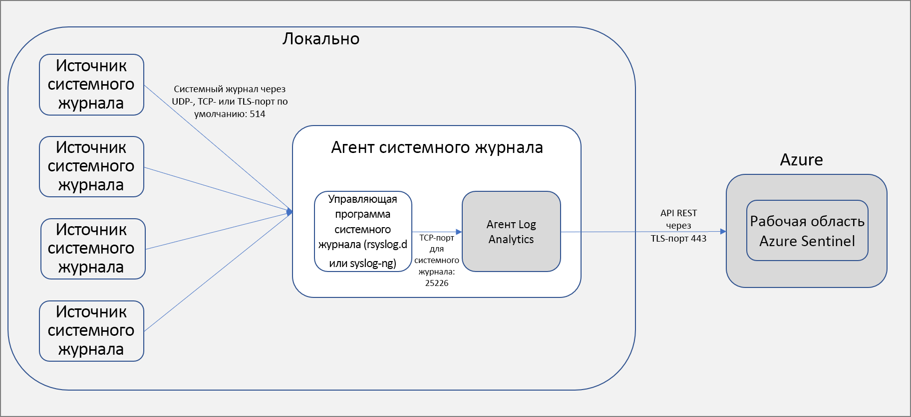

# Подключение Zscaler Internet Access к Azure Sentinel

> [!IMPORTANT]
> Соединитель данных Zscaler в Azure Sentinel сейчас находится в общедоступной предварительной версии.
> Эта функция предоставляется без соглашения об уровне обслуживания и не рекомендуется для рабочих нагрузок. Некоторые функции могут не поддерживаться или их возможности могут быть ограничены. Дополнительные сведения см. в статье [Дополнительные условия использования предварительных выпусков Microsoft Azure](https://azure.microsoft.com/support/legal/preview-supplemental-terms/).

В этой статье объясняется, как подключить устройство Zscaler Internet Access к Azure Sentinel. Соединитель данных Zscaler позволяет легко подключать журналы Zscalerного доступа к Интернету (Зиа) с помощью Sentinel Azure, просматривать панели мониторинга, создавать пользовательские оповещения и улучшать исследование. Использование Zscaler в Azure Sentinel предоставит вам более подробные сведения об использовании Интернета в вашей организации и улучшит возможности ее работы. 

## Принцип работы

Необходимо развернуть агент на выделенном компьютере Linux (виртуальную машину или локально) для поддержки взаимодействия между Zscaler Internet Access и Azure Sentinel. На следующей схеме описывается настройка в событии виртуальной машины Linux в Azure.

 

Кроме того, эта установка будет существовать, если вы используете виртуальную машину в другом облаке или на локальном компьютере. 

 

## Вопросы безопасности

Обязательно настройте безопасность компьютера в соответствии с политикой безопасности вашей организации. Например, можно настроить сеть для согласования с политикой безопасности корпоративной сети и изменить порты и протоколы в управляющей программе в соответствии с вашими требованиями. Для улучшения конфигурации безопасности компьютера можно использовать следующие инструкции:  [безопасная виртуальная машина в Azure](../virtual-machines/linux/security-policy.md), рекомендации [по сетевой безопасности](../security/fundamentals/network-best-practices.md).

Чтобы использовать TLS-связь между решением безопасности и компьютером syslog, необходимо настроить управляющую программу syslog (rsyslog или syslog-ng) для взаимодействия в TLS: [шифрование трафика syslog с помощью TLS — rsyslog](https://www.rsyslog.com/doc/v8-stable/tutorials/tls_cert_summary.html), [Шифрование сообщений журнала с помощью TLS — syslog-ng](https://support.oneidentity.com/technical-documents/syslog-ng-open-source-edition/3.22/administration-guide/60#TOPIC-1209298).

 
## предварительным требованиям
Убедитесь, что компьютер Linux, используемый в качестве прокси-сервера, работает под управлением одной из следующих операционных систем:

- 64-разрядная
  - CentOS 6 и 7
  - Amazon Linux 2017.09
  - Oracle Linux 6 и 7
  - Red Hat Enterprise Linux Server 6 и 7
  - Debian GNU/Linux 8 и 9
  - Ubuntu Linux 14.04 LTS, 16.04 LTS и 18.04 LTS
  - SUSE Linux Enterprise Server 12
- 32-битная
   - CentOS 6
   - Oracle Linux 6
   - Red Hat Enterprise Linux Server 6
   - Debian GNU/Linux 8 и 9
   - Ubuntu Linux 14.04 LTS и 16.04 LTS
 
 - Версии управляющей программы
   - Syslog-ng: 2,1-3.22.1
   - Rsyslog: V8
  
 - Поддерживаемые документы RFC системного журнала
   - Syslog RFC 3164
   - Syslog RFC 5424
 
Убедитесь, что компьютер соответствует следующим требованиям: 
- Разрешения
    - Необходимо иметь повышенные разрешения (sudo) на компьютере. 
- Требования к программному обеспечению
    - Убедитесь, что на вашем компьютере установлен Python.
## Шаг 1. Развертывание агента

На этом шаге необходимо выбрать компьютер Linux, который будет использоваться в качестве прокси-сервера между Sentinel Azure и решением безопасности. Вам потребуется запустить сценарий на прокси-компьютере, который:
- Устанавливает агент Log Analytics и настраивает его по мере необходимости для прослушивания сообщений Syslog через порт 514 через TCP и отправляет сообщения CEF в рабочую область "Sentinel" Azure.
- Настраивает управляющую программу syslog для пересылки CEF сообщений агенту Log Analytics с помощью порта 25226.
- Устанавливает агент системного журнала для получения данных и их безопасного отправку в Log Analytics, где они анализируются и расширяются.
 
 
1. На портале Sentinel Azure щелкните **Data Connectors (соединители данных** ), выберите **Zscaler** , а затем **откройте страницу соединителя**. 

1. В разделе **Установка и настройка агента syslog**выберите тип компьютера: Azure, другое облако или локально. 
   > [!NOTE]
   > Так как скрипт на следующем шаге устанавливает агент Log Analytics и подключает компьютер к рабочей области Sentinel Azure, убедитесь, что этот компьютер не подключен к какой-либо другой рабочей области.
1. Необходимо иметь повышенные разрешения (sudo) на компьютере. Убедитесь, что на компьютере установлен Python, выполнив следующую команду: `python –version`

1. Выполните следующий сценарий на прокси-компьютере.
   `sudo wget https://raw.githubusercontent.com/Azure/Azure-Sentinel/master/DataConnectors/CEF/cef_installer.py&&sudo python cef_installer.py [WorkspaceID] [Workspace Primary Key]`
1. Во время выполнения скрипта убедитесь, что не получены сообщения об ошибках и предупреждения.

## Шаг 2. Настройка Zscaler для отправки сообщений CEF

1. На устройстве Zscaler необходимо задать эти значения, чтобы устройство отправляло необходимые журналы в нужном формате в агент syslog-агента Azure на основе агента Log Analytics. Вы можете изменить эти параметры на своем устройстве при условии, что они также будут изменены в управляющей программе syslog в агенте Sentinel Azure.
    - Протокол = TCP
    - Порт = 514
    - Format = CEF
    - IP-адрес. не забудьте отправить сообщения CEF по IP-адресу виртуальной машины, выделенной для этой цели.
 Дополнительные сведения см. в разделе [Zscaler и Azure Sentinel Deployment Guide](https://aka.ms/ZscalerCEFInstructions).
 
   > [!NOTE]
   > Это решение поддерживает syslog RFC 3164 или RFC 5424.

1. Чтобы использовать соответствующую схему в Log Analytics для событий CEF, выполните поиск по запросу `CommonSecurityLog`.

## Шаг 3. Проверка подключения

1. Откройте Log Analytics, чтобы убедиться, что журналы получены с помощью схемы CommonSecurityLog.  Если журналы начнут появляться в Log Analytics, это может занять до 20 минут. 

1. Перед запуском скрипта рекомендуется отправить сообщения из решения безопасности, чтобы убедиться, что они перенаправлены на настроенный вами прокси-сервер syslog. 
1. Необходимо иметь повышенные разрешения (sudo) на компьютере. Убедитесь, что на компьютере установлен Python, выполнив следующую команду: `python –version`
1. Выполните следующий сценарий, чтобы проверить подключение между агентом, Sentinel Azure и решением по обеспечению безопасности. Он проверяет правильность настройки перенаправления управляющей программы, прослушивает правильные порты и не блокирует обмен данными между управляющей программой и агентом Log Analytics. Сценарий также отправляет фиктивные сообщения "Тесткоммоневентформат" для проверки сквозного подключения.  
 `sudo wget https://raw.githubusercontent.com/Azure/Azure-Sentinel/master/DataConnectors/CEF/cef_troubleshoot.py&&sudo python cef_troubleshoot.py [WorkspaceID]`

## Дополнительная информация
В этом документе вы узнали, как подключить Zscaler Internet Access к Azure Sentinel. Ознакомьтесь с дополнительными сведениями об Azure Sentinel в соответствующих статьях.
- Узнайте, как [получить представление о данных и потенциальных угрозах](quickstart-get-visibility.md).
- Приступая [к обнаружению угроз с помощью Azure Sentinel](tutorial-detect-threats.md).

