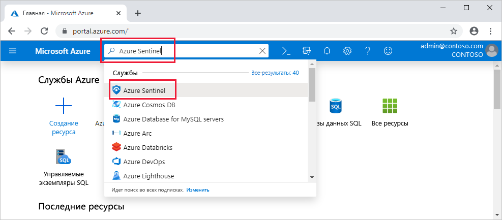

# Предварительная версия встроенного Sentinel Azure

> [!IMPORTANT]
> Сейчас Azure Sentinel предоставляется в общедоступной предварительной версии.
> Эта предварительная версия предоставляется без соглашения об уровне обслуживания и не рекомендована для использования рабочей среде. Некоторые функции могут не поддерживаться или их возможности могут быть ограничены. Дополнительные сведения см. в статье [Дополнительные условия использования предварительных выпусков Microsoft Azure](https://azure.microsoft.com/support/legal/preview-supplemental-terms/).

В этом кратком руководстве вы узнаете, как встроенный Sentinel Azure. 

Для встроенного Sentinel Azure необходимо сначала включить Azure Sentinel, а затем подключитесь к источникам данных. Azure Sentinel поставляется с несколько соединителей для Microsoft solutions, доступной в поле и обеспечивая интеграцию в режиме реального времени, включая решения для защиты от угроз Майкрософт, Microsoft 365 источников, включая Office 365, Azure AD, Azure ATP, и Microsoft Cloud App Security и многое другое. Кроме того, доступны встроенные соединители для более широкой экосистемы безопасности для решений сторонних разработчиков. Можно также использовать общий формат событий Syslog или REST API для подключения к источникам данных с Azure Sentinel.  

После подключения к источникам данных, выберите из коллекции, которой представлено квалифицированное созданный панелей мониторинга, область аналитики на основе ваших данных. Эти панели мониторинга можно легко настроить с вашими потребностями.

## Глобальные предварительные требования

- Активная подписка Azure, если у вас нет, создайте [бесплатную учетную запись](https://azure.microsoft.com/free/?WT.mc_id=A261C142F) перед началом работы.

- Рабочая область log Analytics. Узнайте, как [создать рабочую область Log Analytics](../log-analytics/log-analytics-quick-create-workspace.md)

-  Чтобы включить Azure Sentinel, необходимо разрешения участника для подписки, в котором находится рабочей области Azure Sentinel. 
- Чтобы использовать Azure Sentinel, необходимо иметь разрешения участника или читателя в группе ресурсов, к которой принадлежит рабочей области
- Для подключения определенных источников данных может потребоваться дополнительные разрешения
 
## Включение Azure Sentinel 

1. Перейдите на портал Azure.
2. Убедитесь, что выбрана подписка, в котором создается Azure Sentinel. 
3. Поиск Azure Sentinel. 
   

1. Щелкните **+Добавить**.
1. Выберите рабочую область, которую вы хотите использовать, или создайте новую. Azure Sentinel можно запускать на более чем одной рабочей области, но данные изолирован на одной рабочей области.

   

   >[!NOTE] 
   > - **Расположение рабочей области** очень важно понимать, что все данные, осуществляется потоковая передача на Azure Sentinel хранятся в рабочей области, вы выбрали географическое расположение.  
   > - Рабочие области по умолчанию, созданные с помощью центра безопасности Azure не будет отображаться в списке. Azure Sentinel нельзя установить на них.
   > - Azure Sentinel можно запустить в рабочих областях, которые развертываются в любом из следующих регионов:  Юго-Восточная Австралия, Центральная Канада, центральная Индия, восточная часть США, восточная часть США 2 (euap) (Канария), Восточная Япония, Юго-Восточная Азия, соединенное Королевство Южная, Западная Европа, Западная часть США 2.

6. Нажмите кнопку **добавить Azure Sentinel**.
  

## Подключение источников данных

Azure Sentinel создает подключение к службам и приложениям, подключении к службе и пересылки событий и журналов для Azure Sentinel. Для компьютеров и виртуальных машин можно установить агент, Azure Sentinel, который собирает журналы и пересылает их в Azure Sentinel. Для брандмауэров и прокси-серверы Azure Sentinel использует сервера системного журнала Linux. Агент установлен на нем, и из которого агент собирает файлы журнала и пересылает их в Azure Sentinel. 
 
1. Нажмите кнопку **сбора данных**.
2. Имеется элемент для каждого источника данных, вы можете подключаться. 
Например, щелкните **Azure Active Directory**. При подключении этого источника данных, потоковую передачу всех журналов из Azure AD в Azure Sentinel. Можно выбрать тип создаваемого wan для получения - журналов журналы входа и/или журналы аудита.  
Внизу Azure Sentinel предоставляет рекомендации, какие панели мониторинга вы должны установить для каждого соединителя, вы можете немедленно получить интересные insights ваших данных.   Следуйте инструкциям по установке или [см. в руководстве соответствующего подключения](connect-data-sources.md) Дополнительные сведения. Сведения о соединителях данных см. в разделе [подключения Microsoft services](connect-data-sources.md).

После подключения источников данных данных начинает потоковую передачу в Azure Sentinel и вы сможете приступить к работе с. Вы можете просмотреть журналы в [встроенным панелям](quickstart-get-visibility.md) и начните создавать запросы в Log Analytics для [исследовать данные](tutorial-investigate-cases.md).

## Дальнейшие действия
В этом документе вы узнали о подключении к Azure Sentinel источников данных. Ознакомьтесь с дополнительными сведениями об Azure Sentinel в соответствующих статьях.
- Узнайте, как [получить представление о данных и потенциальные угрозы](quickstart-get-visibility.md).
- Начало работы [обнаружение угроз с помощью Azure Sentinel](tutorial-detect-threats.md).
- Stream данные из [общего формата ошибок устройств](connect-common-event-format.md) в Azure Sentinel.
