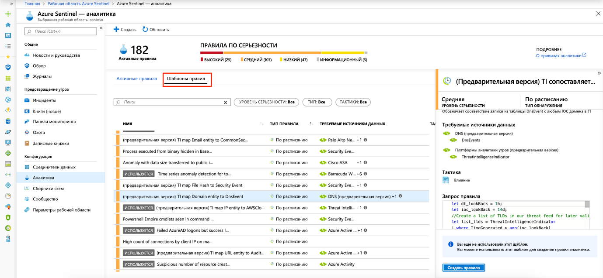

# Учебник. Обнаружение встроенных угроз

> [!IMPORTANT]
> В настоящее время предоставляется общедоступная Предварительная версия обнаружения угроз.
> Эта функция предоставляется без соглашения об уровне обслуживания и не рекомендуется для рабочих нагрузок.
> Дополнительные сведения см. в статье [Дополнительные условия использования предварительных выпусков Microsoft Azure](https://azure.microsoft.com/support/legal/preview-supplemental-terms/).

После [подключения источников](quickstart-onboard.md) данных к Sentinel Azure вы будете получать уведомления о подозрительных событиях. Чтобы сделать это, Azure Sentinel предоставляет готовые встроенные шаблоны. Эти шаблоны были разработаны группой экспертов по безопасности и аналитикам корпорации Майкрософт на основе известных угроз, общих направлений атак и цепочек эскалации действий. После включения этих шаблонов они будут автоматически искать любое действие, которое выглядит подозрительным в вашей среде. Многие шаблоны можно настроить для поиска или фильтрации действий в соответствии с вашими потребностями. Предупреждения, созданные этими шаблонами, будут создавать инциденты, которые можно назначить и исследовать в вашей среде.

Этот учебник поможет обнаружить угрозы с помощью Azure Sentinel:

> [!div class="checklist"]
> * Использование готовых обнаружений
> * Автоматизация реагирования на угрозы

## О готовых функциях обнаружения

Чтобы просмотреть все готовые обнаружения, перейдите к **аналитике** , а затем к **шаблонам правил**. На этой вкладке содержатся все встроенные правила Azure Sentinel.

   

Доступны следующие типы шаблонов:

- **Безопасность Майкрософт** . шаблоны безопасности Майкрософт автоматически создают инциденты Azure Sentinel на основе оповещений, созданных в других решениях безопасности Майкрософт в режиме реального времени. Правила безопасности Майкрософт можно использовать в качестве шаблона для создания новых правил с аналогичной логикой. Дополнительные сведения о правилах безопасности см. [в разделе Автоматическое создание инцидентов на основе оповещений системы безопасности Майкрософт](create-incidents-from-alerts.md).
- Технология **Fusion,** основанная на технологии Fusion, при расширенном обнаружении многоступенчатыхных атак в Azure Sentinel использует масштабируемые алгоритмы машинного обучения, которые могут сопоставлять множество оповещений и событий низкого качества между несколькими продуктами в соответствии с высокой степенью точности и действия. возникш. По умолчанию Fusion включена. Поскольку логика скрыта, ее нельзя использовать в качестве шаблона для создания более чем одного правила.
- **Аналитика поведения машинного обучения** . Эти шаблоны основываются на собственных алгоритмах машинного обучения Майкрософт, поэтому вы не можете видеть внутреннюю логику того, как они работают и когда они выполняются. Поскольку логика скрыта, ее нельзя использовать в качестве шаблона для создания более чем одного правила.
-   **Запланированные** — запланированные аналитические правила представляют собой запланированные запросы, написанные экспертами Майкрософт по безопасности. Вы видите логику запроса и вносите в нее изменения. Запланированные правила можно использовать в качестве шаблона для создания новых правил с аналогичной логикой.

## Использование готовых обнаружений

1. Чтобы использовать встроенный шаблон, щелкните **создать правило** , чтобы создать новое активное правило на основе этого шаблона. Каждая запись содержит список обязательных источников данных, которые автоматически проверяются, и это может привести к отключению **правила создания** .
  
   
 
1. Откроется мастер создания правил на основе выбранного шаблона. Все данные автоматически заполнены, а для **запланированных правил** или **правил безопасности Майкрософт**можно настроить логику для лучшего соответствия организации или создать дополнительные правила на основе встроенного шаблона. После выполнения действий в мастере создания правил и завершения создания правила на основе шаблона новое правило появится на вкладке **активные правила** .

Дополнительные сведения о полях в мастере см. в разделе [учебник. Создание настраиваемых правил аналитики для обнаружения подозрительных угроз](tutorial-detect-threats-custom.md).

## Следующие шаги
В этом руководстве вы узнали, как приступить к обнаружению угроз с помощью Sentinel Azure. 

Чтобы узнать, как автоматизировать реагирование на угрозы, [Настройте автоматические ответы на угрозы в Azure Sentinel](tutorial-respond-threats-playbook.md).

