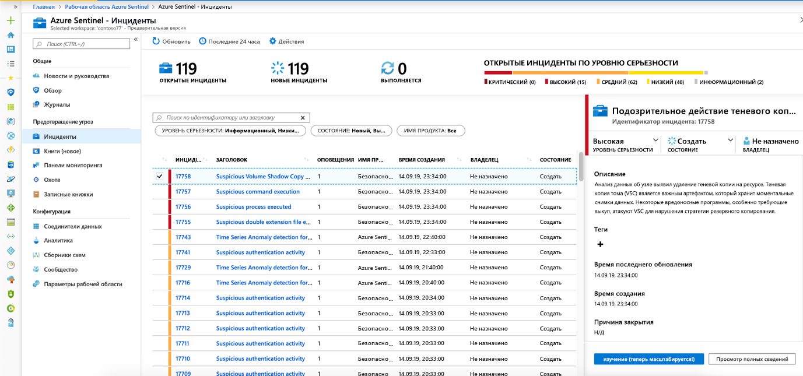
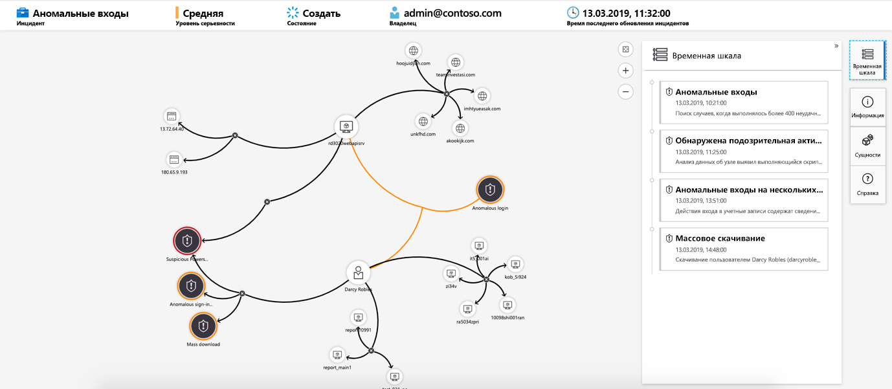

# Учебник: Расследовать инциденты с Azure Sentinel

> [!IMPORTANT]
> График расследования в настоящее время находится в открытом предварительном просмотре.
> Эта функция предоставляется без соглашения об уровне обслуживания, и она не рекомендуется для производственных нагрузок.
> Дополнительные сведения см. в статье [Дополнительные условия использования предварительных выпусков Microsoft Azure](https://azure.microsoft.com/support/legal/preview-supplemental-terms/).

Этот учебник поможет вам расследовать инциденты с Azure Sentinel. После подключения источников данных к Azure Sentinel необходимо получить уведомление о подозрительном случае. Чтобы это можно было сделать, Azure Sentinel позволяет создавать расширенные правила оповещения, которые генерируют инциденты, которые можно назначать и исследовать.

В этой статье рассматриваются следующие вопросы:
> [!div class="checklist"]
> * Изучение инцидентов
> * Используйте график исследования
> * Реагирование на угрозы

Инцидент может включать несколько предупреждений. Это совокупность всех соответствующих доказательств для конкретного расследования. Инцидент создается на основе аналитических правил, созданных на странице **Analytics.** Свойства, связанные с оповещениями, такие как серьезность и состояние, устанавливаются на уровне инцидента. После того, как вы сообщите Azure Sentinel, какие угрозы вы ищете и как их найти, вы сможете отслеживать обнаруженные угрозы, расследуя инциденты.

## Предварительные требования
Вы сможете расследовать инцидент только в том случае, если вы использовали поля отображения сущности при настройке аналитического правила. График расследования требует, чтобы исходный инцидент включает сущности.

## Изучение инцидентов

1. Выберите **Инциденты**. Страница **«Инциденты»** позволяет узнать, сколько инцидентов, сколько открытых, сколько вы установили в **процессе**и сколько закрыты. Для каждого инцидента можно увидеть время его возникновения и состояние инцидента. Посмотрите на серьезность, чтобы решить, какие инциденты обрабатывать в первую очередь.

    

1. Можно фильтровать инциденты по мере необходимости, например, по статусу или тяжести.

1. Чтобы начать расследование, выберите конкретный инцидент. Справа вы можете увидеть подробную информацию об инциденте, включая его серьезность, резюме числа вовлеченных организаций, необработанные события, которые вызвали этот инцидент, и уникальный идентификатор инцидента.

1. Чтобы просмотреть более подробную информацию о предупреждениях и объектах инцидента, выберите **Полную информацию** на странице инцидента и просмотрите соответствующие вкладки, которые суммируют информацию об инциденте. Во вкладке **Оповещения** просмотрите само оповещение. Вы можете увидеть всю соответствующую информацию о оповещении - запрос, который вызвал оповещение, количество результатов, возвращенных за запрос, и возможность запуска игровых книг на оповещениях. Чтобы углубиться еще дальше в инцидент, выберите количество **событий.** Это открывает запрос, который генерировал результаты и события, которые вызвали оповещение в журнале Analytics. Во вкладке **"Сущности"** можно увидеть все объекты, которые были отображены в рамках определения правила оповещения.

    

1. Если вы активно расследуете инцидент, рекомендуется установить статус инцидента **до** тех пор, пока вы не закроете его.

1. Инциденты могут быть назначены конкретному пользователю. Для каждого инцидента можно назначить владельца, установив поле **владельца инцидента.** Все инциденты начинаются как неназначенные. Вы также можете добавить комментарии, чтобы другие аналитики могли понять, что вы исследовали и каковы ваши проблемы вокруг инцидента.

    

1. Выберите **«Расследование»** для просмотра карты расследования.

## Используйте график исследования для глубокого погружения

График расследования позволяет аналитикам задавать правильные вопросы для каждого расследования. График исследования поможет вам понять область охвата и определить причину потенциальной угрозы безопасности, сопоставляя соответствующие данные с любым вовлеченным объектом. Вы можете погрузиться глубже и исследовать любую сущность, представленную на графике, выбрав ее и выбрав между различными вариантами расширения.  
  
График исследования предоставляет вам:

- **Визуальный контекст из необработанных данных**: В реальном, визуальном графике отображается отношения сущности, автоматически извлеченные из исходных данных. Это позволяет легко видеть соединения в различных источниках данных.

- **Полное обнаружение сферы исследования**: Расширьте область расследования, используя встроенные запросы разведки, чтобы вывести на поверхность весь объем нарушения.

- **Встроенные шаги исследования**: Используйте предопределенные варианты исследования, чтобы убедиться, что вы задаете правильные вопросы перед лицом угрозы.

Для использования графика исследования:

1. Выберите инцидент, а затем выберите **Расследование.** Это приведет вас к графику расследования. График предоставляет иллюстративную карту сущностей, непосредственно подключенных к оповещению, и каждого ресурса, подключенного дальше.

   > [!IMPORTANT] 
   > Вы сможете расследовать инцидент только в том случае, если вы использовали поля отображения сущности при настройке аналитического правила. График расследования требует, чтобы исходный инцидент включает сущности.

   

1. Выберите сущность, чтобы открыть панель **Сущности,** чтобы вы могли просмотреть информацию об этом объекте.

    
  
1. Расширьте свое расследование, зависая над каждой организацией, чтобы раскрыть список вопросов, которые были разработаны нашими экспертами по безопасности и аналитиками по типу сущности для углубления вашего расследования. Мы называем эти **запросы разведки**вариантов .

    

   Например, на компьютере можно запросить соответствующие оповещения. При выборе запроса исследования полученные право добавляются обратно в график. В этом примере выбор **связанных оповещений** возвращал следующие оповещения в график:

    

1. Для каждого запроса исследования можно выбрать опцию для открытия необработанных результатов событий и запрос, используемый в журнале Analytics, выбрав **События.\>**

1. Для того, чтобы понять инцидент, график дает вам параллельную временную шкалу.

    

1. Нависните над временной шкалой, чтобы увидеть, какие вещи на графике произошли в какой момент времени.

    

## Дальнейшие действия
В этом уроке вы узнали, как начать расследование инцидентов с помощью Azure Sentinel. Продолжить учебник о [том, как реагировать на угрозы с помощью автоматизированных playbooks](tutorial-respond-threats-playbook.md).
> [!div class="nextstepaction"]
> [Реагируйте на угрозы](tutorial-respond-threats-playbook.md) автоматизации ответов на угрозы.

