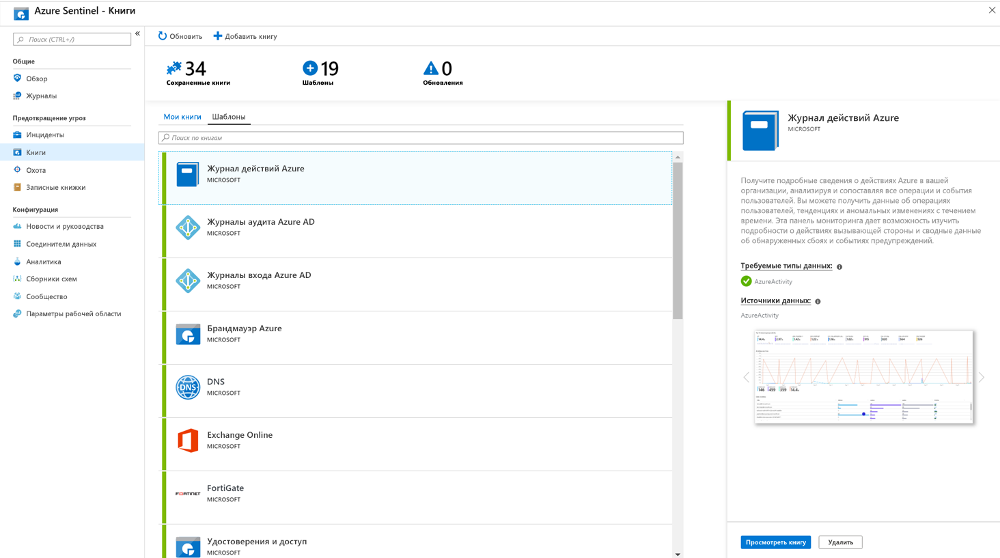

# Руководство по Визуализация и мониторинг данных

После [подключения ваших источников данных](quickstart-onboard.md) к Azure Sentinel вы сможете визуализировать и отслеживать данные, подключая к Azure Sentinel книги Azure Monitor, что позволяет гибко создавать пользовательские панели мониторинга. Поскольку книги в Azure Sentinel отображаются иначе, вам будет полезно изучить статью о [создании интерактивных отчетов с помощью книг Azure Monitor](../azure-monitor/platform/workbooks-overview.md). Azure Sentinel позволяет создавать пользовательские книги для данных, а также встроенные шаблоны книг, позволяющие быстро получать ценные сведения по данным сразу после подключения к источнику данных.

Этот учебник поможет вам визуализировать данные в Azure Sentinel.
> [!div class="checklist"]
> * Использование встроенных книг
> * Создание новых книг

## Предварительные требования

- У вас должна быть по меньшей мере роль читателя (а лучше участника) в группе ресурсов рабочего пространства Azure Sentinel.

> [!NOTE]
> Книги, которые вы видите в Azure Sentinel, сохраняются в группе ресурсов в рабочем пространстве Azure Sentinel и помечаются тегом с именем этого рабочего пространства.

## Использование встроенных книг

1. Перейдите в раздел **Книги** и выберите элемент **Шаблоны**, чтобы просмотреть полный список встроенных книг Azure Sentinel. Чтобы было проще понять, какие из них относятся к подключенным типам данных, в поле **Требуемые типы данных** для каждой книги отображается тип данных и зеленая галочка, если вы уже передаете нужные данные в Azure Sentinel.
  
1. Щелкните **Просмотреть книгу**, чтобы увидеть шаблон, заполненный данными.
  
1. Чтобы изменить книгу, щелкните **Сохранить** и выберите расположение, в котором вы хотите сохранить JSON файл этого шаблона. 

   > [!NOTE]
   > Это действие создает ресурс Azure на основе выбранного шаблона и сохраняет JSON-файл шаблона, но не сами данные.

1. Щелкните **Просмотреть книгу**. Теперь в верхней части экрана нажмите кнопку **Изменить**. Это позволяет изменить книгу и настроить ее в соответствии с вашими потребностями. Дополнительные сведения о настройке книги см. в статье о [создании интерактивных отчетов с помощью книг Azure Monitor](../azure-monitor/platform/workbooks-overview.md).

1. После внесения изменений сохраните книгу. 

1. Ее также можно клонировать, выполнив следующие действия: Выберите **Изменить**, а затем **Сохранить как**, и укажите другое имя для сохранения в той же подписке и группе ресурсов. Эти книги отображаются на вкладке **Мои книги**.

## Создание новой книги

1. Чтобы создать новую книгу с нуля, выберите **Книги**, а затем **Добавить книгу**.
  

1. Чтобы изменить книгу, щелкните **Изменить** и добавьте нужные строки, запросы и (или) параметры. Дополнительные сведения о настройке книги см. в статье о [создании интерактивных отчетов с помощью книг Azure Monitor](../azure-monitor/platform/workbooks-overview.md). 

1. При создании запроса задайте для параметра **Источник данных** значение **Журналы**, для параметра **Тип ресурса** укажите **Анализ журналов** и выберите нужные рабочие пространства. 

1. После создания книги сохраните ее, указав правильные подписку и группу ресурсов для рабочего пространства Azure Sentinel.

1. Если вы хотите, чтобы другие пользователи в организации могли использовать эту книгу, в разделе **Сохранить в** выберите **Общие отчеты**. Если книга должна быть доступна только вам, выберите **Мои отчеты**.

1. Для переключения между книгами, размещенными в рабочем пространстве, последовательно выберите **Открыть**  в верхней области любой книги. Справа откроется окно, где вы можете выбрать нужную книгу.

   

## Удаление книг

Вы можете удалить книги, созданные на основе шаблона Sentinel Azure. 

Чтобы удалить настроенную книгу, на странице "Книги" выберите книгу для удаления и щелкните **Удалить**. Это действие удаляет сохраненную книгу.

> [!NOTE]
> При этом удаляется не только ресурс, но и все внесенные в шаблон изменения. Исходный шаблон останется доступным.

## Дальнейшие действия

В этом учебнике вы узнали, как просматривать данные в Azure Sentinel.

Сведения об автоматизации реагирования на угрозы см. в статье [Настройка автоматического реагирования на угрозы в Azure Sentinel](tutorial-respond-threats-playbook.md).
