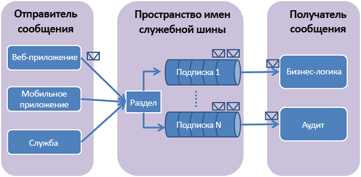

# Краткое руководство. Создание раздела служебной шины и подписок на него с помощью портала Azure
В этом кратком руководстве с помощью портала Azure вы создадите раздел служебной шины, а затем создадите подписки на этот раздел. 

## Что такое разделы и подписки служебной шины?
Разделы и подписки служебной шины поддерживают модель обмена сообщениями " *публикация и подписка* ". При использовании разделов и подписок компоненты распределенного приложения не взаимодействуют между собой напрямую, а обмениваются сообщениями через раздел, который выступает в качестве посредника.

В отличие от очередей служебной шины, где каждое сообщение обрабатывается одним потребителем, разделы и подписки предоставляют вид связи одного со многими с помощью шаблона публикации/подписки. Можно зарегистрировать несколько подписок на раздел. Когда сообщение отправляется в раздел, оно затем может обрабатываться независимо каждой подпиской. Раздел подписки напоминает виртуальную очередь, которая получает копии сообщений, отправленных в раздел. Вы можете зарегистрировать правила фильтрации для раздела на основе подписки, которые позволят указать, какие сообщения и от каких подписок могут быть получены разделом.

Разделы и подписки служебной шины обеспечивают возможность масштабирования для обработки большого количества сообщений для большого количества пользователей и приложений.

[!INCLUDE [service-bus-create-namespace-portal](../../includes/service-bus-create-namespace-portal.md)]

[!INCLUDE [service-bus-create-topics-three-subscriptions-portal](../../includes/service-bus-create-topics-three-subscriptions-portal.md)]

> [!NOTE]
> Вы можете управлять ресурсами служебной шины с помощью [обозревателя служебной шины](https://github.com/paolosalvatori/ServiceBusExplorer/). Обозреватель служебной шины позволяет без труда подключаться к пространству имен служебной шины и управлять сущностями обмена сообщениями. Средство предоставляет дополнительные возможности, например функции импорта и экспорта или возможность проверять разделы, очереди, подписки, службы ретрансляции, центры уведомлений и концентраторы событий. 

## Дополнительная информация
Чтобы узнать, как отправлять сообщения в раздел и получать эти сообщения с помощью подписки, ознакомьтесь с приведенной ниже статьей (выберите язык программирования в оглавлении). 

> [!div class="nextstepaction"]
> [Шаблон "публикация/подписка" для обмена сообщениями](service-bus-dotnet-how-to-use-topics-subscriptions.md)
