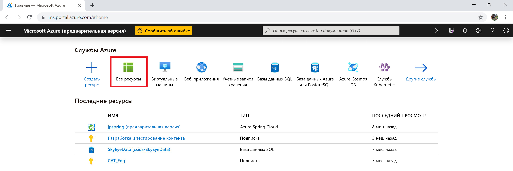
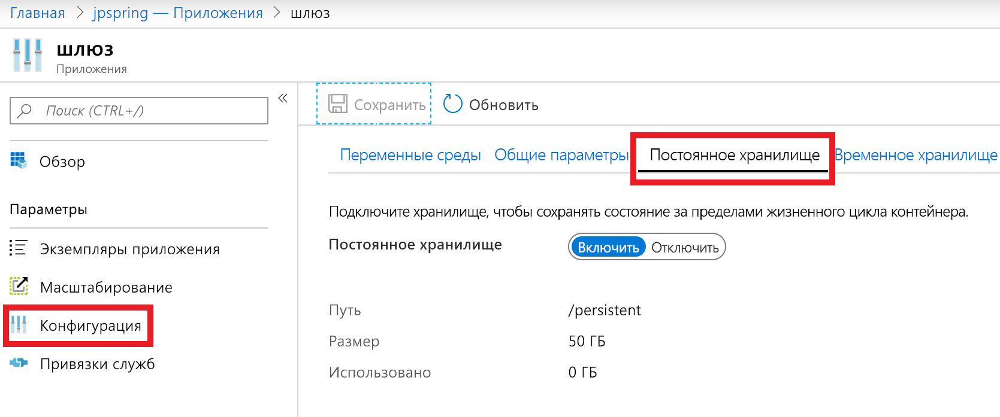

# <a name="use-persistent-storage-in-azure-spring-cloud"></a>Использование постоянного хранилища в Azure Spring Cloud

Облако Azure Spring Cloud предоставляет два типа хранилища для приложения: постоянное и временное.

По умолчанию облако Azure Spring предоставляет временное хранилище для каждого экземпляра приложения. Временное хранилище ограничено 5 ГБ на экземпляр с траекторией крепления по умолчанию /tmp.

> [!WARNING]
> При перезапуске экземпляра приложения связанное временное хранилище навсегда удаляется.

Постоянное хранение — это контейнер для совместного файла, управляемый Azure и выделенный в нее. Данные, хранящиеся в постоянном хранилище, передаются во всех экземплярах приложения. В экземпляре Cloud Spring Может быть не более 10 приложений с постоянным включенным хранилищем. Каждому приложению выделяется 50 ГБ постоянного хранилища. Путь крепления по умолчанию для постоянного хранения /постоянный.

> [!WARNING]
> Если отключить постоянное хранилище приложений, все эти хранилища будут перемещены, и все сохраненные данные будут потеряны.

## <a name="use-the-azure-portal-to-enable-persistent-storage"></a>Используйте портал Azure для обеспечения постоянного хранения

1. На **главной** странице портала Azure выберите **все ресурсы.**

    >

1. Выберите ресурс Azure Spring Cloud, который нуждается в постоянном хранении. В этом примере выбранное приложение называется **upspring**.

    > 

1. Под заголовком **«Настройки»** выберите **приложения.**

1. Службы облачных технологий Azure Spring отображаются в таблице.  Выберите службу, в которую вы хотите добавить постоянное хранилище. В этом примере выбрана служба **шлюза.**

    > 

1. На странице конфигурации службы выберите **Конфигурацию**

1. Выберите вкладку **«Стойкое хранилище»** и выберите **Enable.**

    > 

После включения постоянного хранилища его размер и траектория отображаются на странице конфигурации.

## <a name="use-the-azure-cli-to-modify-persistent-storage"></a>Используйте Azure CLI для изменения постоянного хранилища

При необходимости установите расширение Spring Cloud для Azure CLI:

```azurecli
az extension add --name spring-cloud
```
Другие операции:

* Для создания приложения с постоянным включенным хранилищем:

    ```azurecli
    az spring-cloud app create -n <app> -g <resource-group> -s <service-name> --enable-persistent-storage true
    ```

* Для обеспечения постоянного хранения для существующего приложения:

    ```azurecli
    az spring-cloud app update -n <app> -g <resource-group> -s <service-name> --enable-persistent-storage true
    ```

* Чтобы отключить постоянное хранилище в существующем приложении:

    ```azurecli
    az spring-cloud app update -n <app> -g <resource-group> -s <service-name> --enable-persistent-storage false
    ```

    > [!WARNING]
    > Если отключить постоянное хранилище приложений, все эти хранилища будут перемещены, а все сохраненные данные навсегда потеряны.

## <a name="next-steps"></a>Дальнейшие действия

* Узнайте о [квотах на применение и обслуживание.](spring-cloud-quotas.md)
* Узнайте, как [масштабировать приложение вручную.](spring-cloud-tutorial-scale-manual.md)
