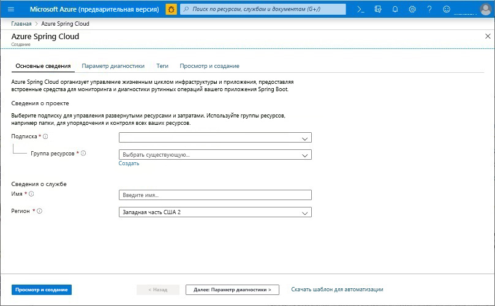
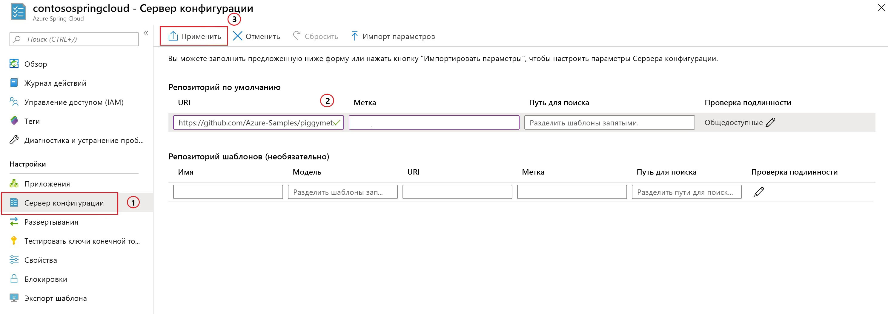

# <a name="quickstart-launch-an-azure-spring-cloud-app-using-the-maven-plug-in"></a>Краткое руководство. Запуск приложения Azure Spring Cloud с помощью подключаемого модуля Maven

С помощью подключаемого модуля Maven для Azure Spring Cloud можно легко создавать и обновлять приложения Azure Spring Cloud. Предварительно определив конфигурацию, можно развернуть приложения в имеющейся службе Azure Spring Cloud. В этой статье на примере приложения PiggyMetrics вы изучите эту функцию.

Из этого руководства вы узнаете, как выполнить следующие задачи:

> [!div class="checklist"]
> * подготовка экземпляра службы к работе;
> * настройка сервера конфигурации для экземпляра;
> * локальное клонирование и выполнение сборки приложения для микрослужб;
> * развертывание каждой микрослужбы;
> * назначение общедоступной конечной точки для приложения.

>[!Note]
> Сейчас предоставляется общедоступная предварительная версия Azure Spring Cloud. Предложения общедоступной предварительной версии позволяют клиентам экспериментировать с новыми функциями до официального выпуска.  Общедоступные предварительные версии функций и служб не предназначены для использования в рабочей среде.  Чтобы получить дополнительные сведения о поддержке на этапе использования предварительных версий, ознакомьтесь с разделом [Вопросы и ответы](https://azure.microsoft.com/support/faq/) или оформите [запрос на поддержку](https://docs.microsoft.com/azure/azure-portal/supportability/how-to-create-azure-support-request).


>[!TIP]
> Azure Cloud Shell — это бесплатная интерактивная оболочка, с помощью которой можно выполнять команды, описанные в этой статье. Она содержит предварительно установленные общие инструменты Azure вместе с новейшими версиями Git, комплект разработчика Java (JDK), Maven и Azure CLI. Если вы вошли в подписку Azure, запустите [Azure Cloud Shell](https://shell.azure.com). Дополнительные сведения см. в [обзоре Azure Cloud Shell](../cloud-shell/overview.md).

Для работы с этим кратким руководством сделайте следующее:

1. [Установка Git](https://git-scm.com/).
2. [Установите JDK версии 8](https://docs.microsoft.com/java/azure/jdk/?view=azure-java-stable).
3. [Установите Maven 3.0 или более поздней версии](https://maven.apache.org/download.cgi).
4. [Подпишитесь на бесплатную версию Azure](https://azure.microsoft.com/free/).

## <a name="provision-a-service-instance-on-the-azure-portal"></a>Подготовка экземпляра службы к работе на портале Azure

1. В веб-браузере откройте [эту ссылку на Azure Spring Cloud на портале Azure](https://ms.portal.azure.com/#create/Microsoft.AppPlatform) и войдите со своей учетной записью.

1. Укажите **сведения о проекте** для примера приложения, как показано ниже.

    1. Выберите **подписку**, с которой будет связано приложение.
    1. Выберите или создайте группу ресурсов для приложения. Рекомендуется создать новую группу ресурсов.  В примере ниже показана новая группа ресурсов `myspringservice`.
    1. Укажите имя новой службы Azure Spring Cloud.  Его длина должна быть от 4 до 32 знаков. Имя может содержать только строчные буквы, цифры и дефисы. Первым символом в имени службы должна быть буква, а последним — буква или цифра.  Служба в приведенном ниже примере называется `contosospringcloud`.
    1. Выберите расположение приложения из предложенного списка.  В нашем примере это `East US`.
    1. Выберите **Просмотр и создание**, чтобы просмотреть сводку по новой службе.  Если все выглядит правильно, выберите **Создать**.

    > [!div class="mx-imgBorder"]
    > 

Развертывание службы занимает около 5 минут. После развертывания службы выберите **Перейти к ресурсу**. Отобразится страница **Обзор** для экземпляра службы.

> [!div class="nextstepaction"]
> [У меня есть проблема](https://www.research.net/r/javae2e?tutorial=asc-maven-quickstart&step=provision)

## <a name="set-up-your-configuration-server"></a>Настройка сервера конфигурации

1. На странице **Обзор** службы выберите **Config Server** (Сервер конфигурации).
1. В разделе **Репозиторий по умолчанию** задайте для параметра **URI** значение **https://github.com/Azure-Samples/piggymetrics** , для параметра **Метки** значение **config** и щелкните **Применить**, чтобы сохранить изменения.

    > [!div class="mx-imgBorder"]
    > 

> [!div class="nextstepaction"]
> [У меня есть проблема](https://www.research.net/r/javae2e?tutorial=asc-maven-quickstart&step=config-server)

## <a name="clone-and-build-the-sample-application-repository"></a>Клонирование и сборка репозитория примера приложения

1. Запустите [Azure Cloud Shell](https://shell.azure.com).

1. Клонируйте репозиторий Git, выполнив следующую команду:

    ```azurecli
    git clone https://github.com/Azure-Samples/PiggyMetrics
    ```
  
1. Перейдите в каталог и создайте проект, выполнив следующую команду:

    ```azurecli
    cd piggymetrics
    mvn clean package -DskipTests
    ```

## <a name="generate-configurations-and-deploy-to-the-azure-spring-cloud"></a>Создание и развертывание конфигураций в Azure Spring Cloud

1. Создайте конфигурации, выполнив приведенную ниже команду в корневой папке PiggyMetrics, содержащей родительский файл POM.

    ```azurecli
    mvn com.microsoft.azure:azure-spring-cloud-maven-plugin:1.0.0:config
    ```

    а. Выберите модули `gateway`, `auth-service` и `account-service`.

    b. Выберите свою подписку и кластер служб Azure Spring Cloud.

    c. В списке предоставленных проектов введите номер, соответствующий `gateway`, чтобы предоставить общий доступ.
    
    d. Подтвердите конфигурацию.

1. Теперь файл POM содержит зависимости и конфигурации подключаемого модуля. Разверните приложения с помощью следующей команды.

   ```azurecli
   mvn azure-spring-cloud:deploy
   ```

1. После завершения развертывания доступ к PiggyMetrics можно будет получить с помощью URL-адреса, который указан в выходных данных предыдущей команды.

> [!div class="nextstepaction"]
> [У меня есть проблема](https://www.research.net/r/javae2e?tutorial=asc-maven-quickstart&step=deploy)

## <a name="next-steps"></a>Дальнейшие действия

В рамках этого краткого руководства вы развернули приложение Spring Cloud из репозитория Maven. Дополнительные сведения об Azure Spring Cloud см. в учебнике по подготовке приложения к развертыванию.

> [!div class="nextstepaction"]
> [Подготовка приложения Azure Spring Cloud к развертыванию](spring-cloud-tutorial-prepare-app-deployment.md)
> [Дополнительные сведения о подключаемых модулях Maven для Azure](https://github.com/microsoft/azure-maven-plugin)

Дополнительные примеры доступны на GitHub: [Примеры для Azure Spring Cloud](https://github.com/Azure-Samples/Azure-Spring-Cloud-Samples/tree/master/service-binding-cosmosdb-sql).
