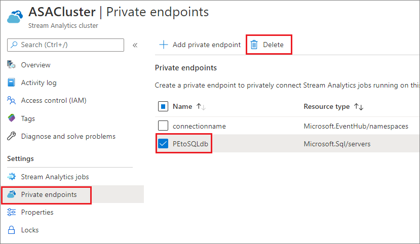

# Создание и удаление частных конечных точек в кластере Azure Stream Analytics

Вы можете подключить задания Azure Stream Analytics, выполняемые в кластере, к входным и выходным ресурсам, расположенным за брандмауэром или виртуальной сетью Azure. Для начала создайте в кластере Stream Analytics частную конечную точку для ресурса, такого как концентратор событий Azure или База данных SQL Azure. Затем подтвердите подключение к частной конечной точке из входных или выходных ресурсов.

После подтверждения подключения любое задание, выполняемое в кластере Stream Analytics, сможет получить доступ к ресурсу через эту частную конечную точку. В этой статье показано, как создавать и удалять частные конечные точки в кластере Stream Analytics.

## Создание частной конечной точки кластера Stream Analytics

В этом разделе вы узнаете, как создать частную конечную точку в кластере Stream Analytics.

1. Найдите и выберите нужный кластер Stream Analytics на портале Azure.

1. В разделе **Параметры** выберите **Частные конечные точки** .

1. Выберите действие **Добавить частную конечную точку** и введите следующие сведения о ресурсе, к которому вы намерены реализовать защищенный доступ через частную конечную точку.

   |Параметр|Значение|
   |---|---|
   |Имя|Введите любое имя для частной конечной точки. Если это имя используется, создайте уникальное имя.|
   |Метод подключения|Выберите **Подключиться к ресурсу Azure в моем каталоге** .  Для защищенного подключения через частную конечную точку вы можете выбрать любой из своих ресурсов или даже ресурс другого пользователя, если он предоставил вам идентификатор или псевдоним этого ресурса.|
   |Подписка|Выберите свою подписку.|
   |Тип ресурса|Выберите [тип ресурса, соответствующий нужному ресурсу](../private-link/private-endpoint-overview.md#private-link-resource).|
   |Ресурс|Выберите тот ресурс, к которому вы будете подключаться через частную конечную точку.|
   |Целевой подресурс|Это тип подресурса для выбранного выше ресурса, к которому получит доступ эта частная конечная точка.|

   

1. Подтвердите подключение из целевого ресурса. Например, если на предыдущем шаге создана частная конечная точка для экземпляра Базы данных SQL Azure, следует перейти к этому экземпляру Базы данных SQL и найти ожидающее утверждения подключение. Возможно, запрос на подключение отобразится лишь через несколько минут.

    

1. Теперь вернитесь к кластеру Stream Analytics и проследите, как состояние меняется с **Ожидание утверждения клиента** на **Ожидание настройки DNS** , а через несколько минут — на **Настройка завершена** .

## Удаление частной конечной точки кластера Stream Analytics

1. Найдите и выберите нужный кластер Stream Analytics на портале Azure.

1. В разделе **Параметры** выберите **Частные конечные точки** .

1. Выберите частную конечную точку, которую вы хотите удалить, и щелкните **Удалить** .

   

## Следующие шаги

Теперь у вас есть предоставление об управлении частными конечными точками в кластере Azure Stream Analytics. Далее вы можете узнать, как масштабировать кластеры и запускать в них задания:

* [Масштабирование кластера Azure Stream Analytics](scale-cluster.md)
* [Управление заданиями Stream Analytics в кластере Stream Analytics](manage-jobs-cluster.md)
