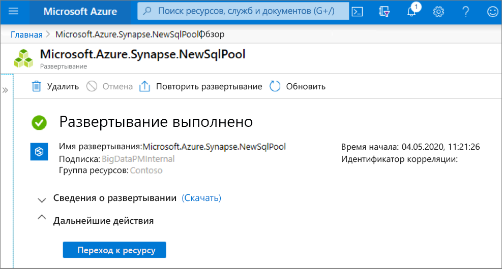

# Краткое руководство. Создание выделенного пула SQL с помощью портала Azure

Azure Synapse Analytics предлагает различные механизмы аналитики, упрощающие прием, преобразование, моделирование и анализ данных. Выделенный пул SQL предусматривает возможности вычисления и хранения на основе T-SQL. После создания выделенного пула SQL в рабочей области Synapse данные можно загружать, моделировать, обрабатывать и доставлять для быстрого получения аналитических сведений.

В этом кратком руководстве вы узнаете, как создать выделенный пул SQL в рабочей области Synapse с помощью портала Azure.

Если у вас еще нет подписки Azure, [создайте бесплатную учетную запись, прежде чем начинать работу](https://azure.microsoft.com/free/).

## Предварительные требования

- Подписка Azure — [создайте бесплатную учетную запись](https://azure.microsoft.com/free/).
- [Рабочая область Synapse](./quickstart-create-workspace.md)

## Вход на портал Azure

Войдите на [портал Azure](https://portal.azure.com/)

## Переход в рабочую область Synapse

1. Перейдите к рабочей области Synapse, в которой будет создан выделенный пул SQL, введя имя службы (или непосредственно имя ресурса) в строке поиска.
. 
1. В списке рабочих областей введите имя (или часть имени) рабочей области, которую нужно открыть. В нашем примере будет использоваться рабочая область с именем **contosoanalytics**.

## Создание выделенного пула SQL

1. В рабочей области Synapse, в которой необходимо создать выделенный пул SQL, на верхней панели щелкните команду **New dedicated SQL pool** (Создать выделенный пул SQL).

2. Введите следующие сведения на вкладке **Основные сведения**:

    | Параметр | Рекомендуемое значение | Описание |
    | :------ | :-------------- | :---------- |
    | **Имя выделенного пула SQL** | Любое допустимое имя | Имя выделенного пула SQL. |
    | **Уровень производительности** | DW100c | Задайте минимальный размер, чтобы сократить затраты по работе в рамках этого краткого руководства. |

  
    

    > [!IMPORTANT]
    > Обратите внимание, что для имен, которые могут использовать выделенные пулы SQL, существуют определенные ограничения. Имена не могут содержать специальные символы, их должно быть не более 15. Имена также не должны содержать зарезервированных слов и должны быть уникальными в рабочей области.

3. По завершении выберите **Next: Дополнительные параметры**.
4. Выберите **Никакие**, чтобы подготовить к работе выделенный пул SQL без данных. Примите параметры сортировки по умолчанию.

    Если вы хотите восстановить выделенный пул SQL из точки восстановления, выберите **Восстановить точку**. Дополнительные сведения о выполнении восстановления см. в статье [Руководство. Восстановление существующего выделенного пула SQL](backuprestore/restore-sql-pool.md).

5. Выберите **Review + create** (Просмотреть и создать).
6. Убедитесь, что подробные сведения на основе ранее введенных данных указаны правильно. Нажмите кнопку **создания**.

7. На этом этапе запустится поток подготовки ресурсов.
 

8. После завершения подготовки в рабочей области будет показана новая запись для созданного выделенного пула SQL.
 

После создания выделенный пул SQL становится доступным в рабочей области для загрузки данных, обработки потоков, чтения из озера и т. д.

## Очистка ресурсов

Чтобы удалить выделенный пул SQL из рабочей области, выполните действия ниже.
> [!WARNING]
> Удаление выделенного пула SQL приведет к удалению аналитического модуля и данных, хранящихся в базе данных удаленного выделенного пула SQL, из рабочей области. Вы больше не сможете подключиться к выделенному пулу SQL, а все запросы, конвейеры и записные книжки, которые считывают данные из этого выделенного пула SQL или записывают их туда, перестанут работать.

Чтобы удалить выделенный пул SQL, выполните следующие действия:

1. Перейдите в колонку "Пулы SQL" в колонке рабочей области.
1. Выберите выделенный пул SQL для удаления (в этом случае — **contosowdw**).
1. После выбора щелкните **Удалить**.
1. Подтвердите удаление и нажмите кнопку **Удалить** 
1. После успешного завершения процесса выделенный пул SQL больше не будет указываться в ресурсах рабочей области.

## Дальнейшие действия

- См. [Краткое руководство. Создание бессерверного пула Apache Spark в Azure Synapse Analytics с помощью веб-инструментов](quickstart-apache-spark-notebook.md).
- См. [Краткое руководство. Создание бессерверного пула Apache Spark с помощью портала Azure](quickstart-create-apache-spark-pool-portal.md).
