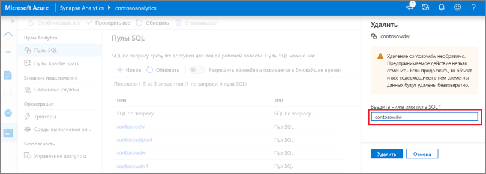

# Краткое руководство. Создание пула SQL Synapse (предварительная версия) с помощью Synapse Studio

Azure Synapse Analytics предлагает различные механизмы аналитики, упрощающие прием, преобразование, моделирование и анализ данных. Пул SQL предусматривает возможности вычисления и хранения на основе T-SQL. После создания пула SQL в рабочей области Synapse данные можно загружать, моделировать, обрабатывать и доставлять для быстрого получения аналитических сведений.

В этом кратком руководстве показано, как создать пул SQL в рабочей области Synapse с помощью Synapse Studio.

Если у вас еще нет подписки Azure, [создайте бесплатную учетную запись, прежде чем начинать работу](https://azure.microsoft.com/free/).

## Предварительные требования

- Подписка Azure — [создайте бесплатную учетную запись](https://azure.microsoft.com/free/).
- [Рабочая область Synapse](quickstart-create-workspace.md)

## Вход на портал Azure

Войдите на [портал Azure](https://portal.azure.com/)

## Переход в рабочую область Synapse

1. Перейдите к рабочей области Synapse, в которой будет создан пул SQL, введя имя службы (или непосредственно имя ресурса) в строке поиска.

1. В списке рабочих областей введите имя (или часть имени) рабочей области, которую нужно открыть. В нашем примере будет использоваться рабочая область с именем **contosoanalytics**.

## Запуск Synapse Studio

1. В сводке по рабочей области щелкните **Запуск Synapse Studio**, чтобы открыть расположение, в котором будет создан пул SQL. В строке поиска введите имя службы или непосредственно ресурса.

## Создание пула SQL в Synapse Studio

1. На домашней странице Synapse Studio перейдите в **центр управления**, щелкнув в области навигации слева значок **Управление**.

1. В Центре управления перейдите к разделу **Пулы SQL**, чтобы просмотреть текущий список пулов SQL, доступных в рабочей области.

1. Выберите команду **+ Создать**. Отобразится мастер создания нового пула SQL. 

1. Введите следующие сведения на вкладке **Основные сведения**:

    | Параметр | Рекомендуемое значение | Описание |
    | :------ | :-------------- | :---------- |
    | **Имя пула SQL** | contosoedw | Это имя пула SQL. |
    | **Уровень производительности** | DW100c | Задайте минимальный размер, чтобы сократить затраты по работе в рамках этого краткого руководства. |

    
    > [!IMPORTANT]
    > Обратите внимание, что для имен, которые могут использовать пулы SQL, существуют определенные ограничения. Имена не могут содержать специальные символы, их должно быть не более 15. Имена также не должны содержать зарезервированных слов и должны быть уникальными в рабочей области.

4. На следующей вкладке **Дополнительные параметры** выберите **Нет**, чтобы подготовить пул SQL без данных. Оставьте параметры сортировки по умолчанию.

1. Мы не будем добавлять теги сейчас, поэтому выберите **Далее: Отзыв и создание**.

1. На вкладке **Просмотр и создание** убедитесь, что подробные сведения на основе ранее введенных данных указаны правильно, и нажмите кнопку **Создать**. 

1. На этом этапе запустится поток подготовки ресурсов.

1. После завершения подготовки в рабочей области будет показана новая запись для созданного пула SQL.
 

1. Созданный пул SQL станет доступным в рабочей области для загрузки данных, обработки потоков, чтения из озера и т. д.

## Очистка пулов SQL с помощью Synapse Studio    

Чтобы удалить пул SQL из рабочей области с помощью Synapse Studio, сделайте следующее.
> [!WARNING]
> При удалении пула SQL аналитический модуль будет удален из рабочей области. Вы больше не сможете подключиться к пулу, а все запросы, конвейеры и скрипты, использующие этот пул SQL, не будут работать.

Если вы хотите удалить пул SQL, сделайте следующее.

1. Перейдите к разделу "Пулы SQL" в Центре управления Synapse Studio.
1. Щелкните многоточие в удаляемом пуле SQL (в нашем примере **contosoedw**), чтобы отобразить команды для пула SQL. 
1. Нажмите кнопку **Удалить**
1. Подтвердите удаление и нажмите кнопку **Удалить**.
 
1. После успешного завершения процесса пул SQL больше не будет указываться в ресурсах рабочей области.

## Дальнейшие действия 
- См. [Краткое руководство. Создание записной книжки Apache Spark](quickstart-apache-spark-notebook.md).
- См. [Краткое руководство. Создание пула SQL Synapse с помощью портала Azure](quickstart-create-sql-pool-portal.md).