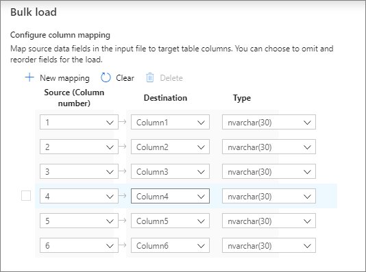

# Массовая загрузка в Synapse SQL

Загружать данные никогда не было так просто, как с помощью мастера массовой загрузки в Synapse Studio. Этот мастер поможет вам создать скрипт T-SQL с использованием [инструкции COPY](https://docs.microsoft.com/sql/t-sql/statements/copy-into-transact-sql?view=azure-sqldw-latest) для массовой загрузки данных. 

## Точки входа в мастер массовой загрузки

Теперь вы можете без усилий выполнять массовую загрузку данных с использованием пулов SQL, щелкнув правой кнопкой мыши в следующих областях Synapse Studio.

- Файл или папка в учетной записи хранения Azure, присоединенной к рабочей области. 

## Предварительные требования

- Этот мастер создает инструкцию COPY, которая использует сквозной доступ через AAD для аутентификации. У [пользователя AAD должны быть разрешения на доступ](https://docs.microsoft.com/azure/synapse-analytics/sql-data-warehouse/quickstart-bulk-load-copy-tsql-examples#d-azure-active-directory-authentication-aad) к рабочей области по меньшей мере с ролью RBAC участника данных BLOB-объектов хранилища в учетной записи ADLS 2-го поколения.

- У вас должны быть [разрешения на использование инструкции COPY](https://docs.microsoft.com/sql/t-sql/statements/copy-into-transact-sql?view=azure-sqldw-latest#permissions) и разрешения на создание таблиц, если для загрузки будет создаваться новая таблица.

- У соответствующей службы, связанной с учетной записью ADLS 2-го поколения, **должны быть разрешения на доступ к файлу**/**папке** для загрузки. Например, если для связанной службы используется механизм аутентификации "Управляемое удостоверение", у управляемого удостоверения рабочей области должна быть по меньшей мере роль читателя для BLOB-объектов хранилища в учетной записи хранения.

- Если в рабочей области включена виртуальная сеть, убедитесь, что для интегрированной среды выполнения, связанной с соответствующими службами учетной записи ADLS 2-го поколения для определения исходных данных и файлов ошибок, включена интерактивная разработка. Интерактивная разработка требуется для автоматического обнаружения схемы, а также просмотра содержимого исходного файла и учетных записей хранения ADLS 2-го поколения в мастере.

### Шаги

1. Выберите учетную запись хранения и файл или папку, из которых вы загружаете данные, на панели в месте хранения исходных данных. 

2. Выберите параметры формата файла, включая учетную запись хранения для записи отклоненных строк (файл ошибок). Сейчас поддерживаются только CSV-файлы и файлы Parquet.

    

3. Щелкнув "Предварительный просмотр данных", вы увидите, как инструкция COPY будет анализировать файл. Это поможет вам настроить параметры формата файла. Щелкайте "Предварительный просмотр данных" при каждом изменении параметров формата файла, чтобы увидеть, как инструкция COPY анализирует файл с обновленными параметрами.  

4. Выберите пул SQL, который вы используете для загрузки, и укажите, куда загружать данные: в существующую или новую таблицу. 

5. Щелкните "Настроить сопоставление столбцов", чтобы проверить правильность сопоставления. Для новых таблиц очень важно настроить сопоставление столбцов, так как это позволяет обновлять типы данных для целевого столбца. 

6. Щелкните "Открыть скрипт" и вы получите скрипт T-SQL с инструкцией COPY для загрузки данных из озера данных. 

## Дальнейшие действия

- См. сведения о возможностях [инструкции COPY](https://docs.microsoft.com/sql/t-sql/statements/copy-into-transact-sql?view=azure-sqldw-latest#syntax).
- См. сведения о [загрузке данных](https://docs.microsoft.com/azure/synapse-analytics/sql-data-warehouse/design-elt-data-loading#what-is-elt).
