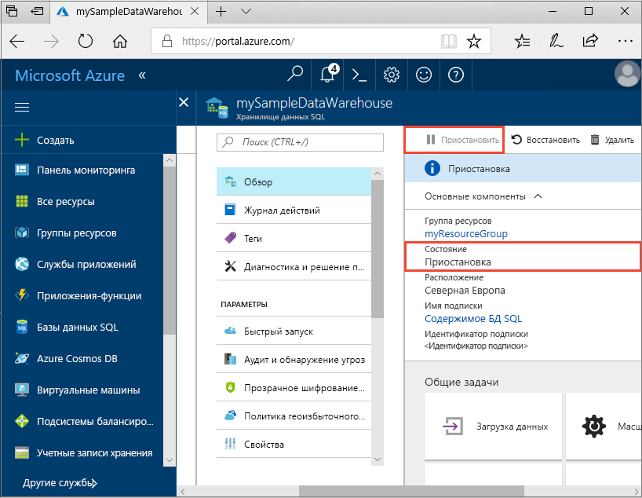
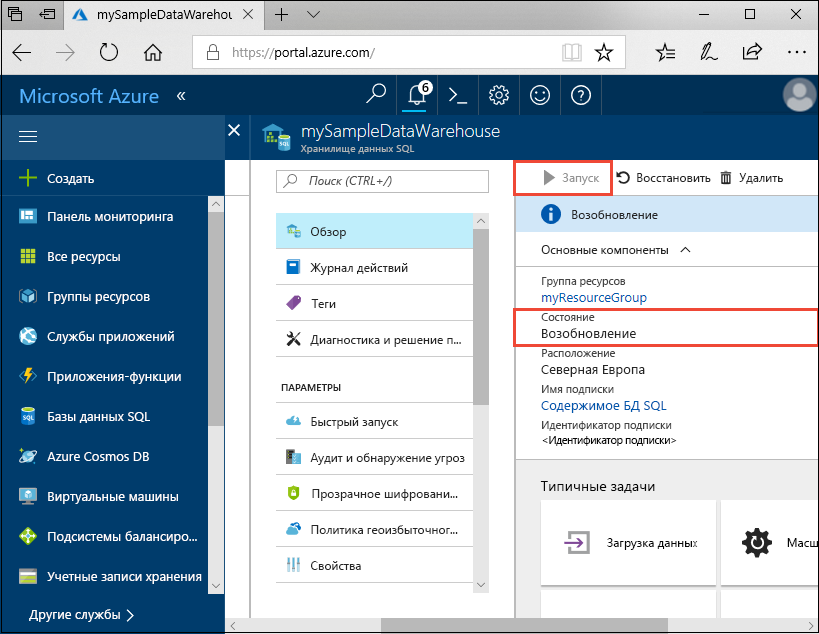

# Краткое руководство. Приостановка и возобновление вычислений в пуле SQL Synapse с помощью портала Azure

Для приостановки и возобновления работы вычислительных ресурсов пула SQL Synapse (хранилища данных) можно использовать портал Azure. Если у вас еще нет подписки Azure, создайте [бесплатную](https://azure.microsoft.com/free/) учетную запись Azure, прежде чем начинать работу.

## Вход на портал Azure

Войдите на [портал Azure](https://portal.azure.com/).

## Перед началом

Используйте инструкции из статьи [Краткое руководство. Создание хранилища данных SQL Azure на портале Azure и выполнение запроса к нему](create-data-warehouse-portal.md), чтобы создать хранилище данных **mySampleDataWarehouse**. 

## Приостановка работы вычислительных ресурсов

Для сокращения затрат можно приостанавливать и возобновлять работу вычислительных ресурсов по требованию. Например, если база данных не будет использоваться ночью и по выходным, ее работу можно приостанавливать на это время и возобновлять днем. 
>[!NOTE]
>Когда база данных приостановлена, оплата за вычислительные ресурсы не взимается. Тем не менее плата за хранение по-прежнему будет взиматься. 

Чтобы приостановить работу пула SQL, сделайте следующее.

1. Войдите на [портал Azure](https://portal.azure.com/).
2. На портале Azure в области навигации слева выберите раздел **Azure Synapse Analytics (ранее — Хранилище данных SQL)** .
2. Выберите **mySampleDataWarehouse** на странице **Azure Synapse Analytics (ранее — Хранилище данных SQL)** , чтобы открыть пул SQL. 
3. На странице **mySampleDataWarehouse** обратите внимание на то, что параметр **Состояние** имеет значение **В сети**.

    

4. Чтобы приостановить вычисления для пула, нажмите кнопку **Пауза**. 
5. Отобразится запрос подтверждения операции. Нажмите кнопку **Да**.
6. Подождите несколько секунд, и вы увидите, что значение параметра **Состояние** изменилось на **Приостановка**.

    

7. После завершения операции приостановки пул пребывает в состоянии **Приостановлен** и доступен переключатель **Возобновить**.
8. Теперь вычислительные ресурсы для пула SQL пребывают вне сети. Вы не будете платить за вычисления, пока работа службы не будет возобновлена.

    

## Возобновление работы вычислительных ресурсов

Чтобы возобновить работу пула SQL, сделайте следующее.

1. На портале Azure в области слева щелкните **Azure Synapse Analytics (ранее — Хранилище данных SQL)** .
2. Выберите **mySampleDataWarehouse** на странице **Azure Synapse Analytics (ранее — Хранилище данных SQL)** , чтобы открыть страницу пула SQL. 
3. На странице **mySampleDataWarehouse** обратите внимание на то, что параметр **Состояние** имеет значение **Приостановлено**.

    

4. Чтобы возобновить вычисления для пула SQL, нажмите кнопку **Возобновить**. 
5. Отобразится запрос подтверждения запуска. Нажмите кнопку **Да**.
6. Обратите внимание на то, что значение параметра **Состояние** изменилось на **Возобновление**.

    

7. После возвращения в сеть пул SQL пребывает в состоянии **В сети** и доступен переключатель **Пауза**.
8. Вычислительные ресурсы для пула SQL теперь находятся в сети, и вы можете использовать службу. Плата за вычисления будет взиматься.

    

## Очистка ресурсов

Плата взимается за единицы хранилища данных и данные, хранящиеся в пуле SQL. Плата за вычислительные ресурсы и ресурсы хранилища взимается отдельно. 

- Если вы хотите сохранить данные в хранилище, приостановите вычисления.
- Если вы хотите исключить будущие расходы, то можете удалить пул SQL. 

Выполните следующие действия, чтобы очистить ресурсы по необходимости.

1. Войдите на [портал Azure](https://portal.azure.com) и щелкните пул SQL.

    

1. Чтобы приостановить работу вычислительных ресурсов, нажмите кнопку **Приостановить**. 

2. Чтобы удалить пул SQL во избежание дальнейших платежей за вычисления или хранение, нажмите кнопку **Удалить**.

3. Чтобы удалить созданный вами сервер SQL Server, щелкните **sqlpoolservername.database.windows.net**, а затем нажмите кнопку **Удалить**.  

   > [!CAUTION]
   > Будьте внимательны, так как удаление сервера приведет к удалению всех баз данных, назначенных этому серверу.

5. Чтобы удалить группу ресурсов, щелкните **myResourceGroup**, а затем нажмите кнопку **Удалить группу ресурсов**.

## Дальнейшие действия

Вы приостановили и возобновили вычисления для пула SQL. Перейдите к следующей статье, чтобы узнать больше о том, как [загрузить данные в пул SQL](load-data-from-azure-blob-storage-using-polybase.md). Дополнительные сведения об управлении возможностями вычислений см. в статье [Управление вычислениями](sql-data-warehouse-manage-compute-overview.md). 

