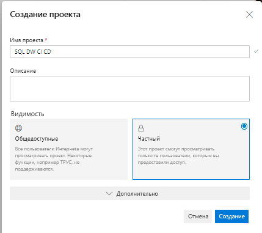
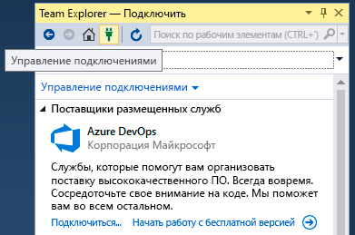
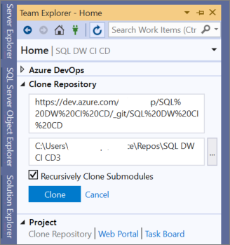
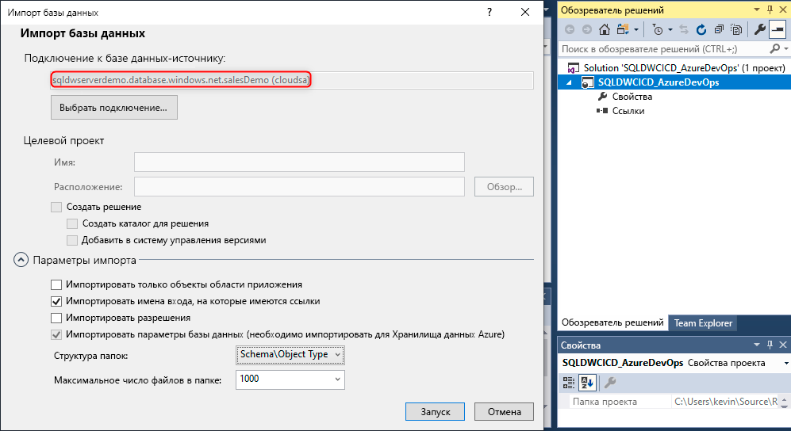
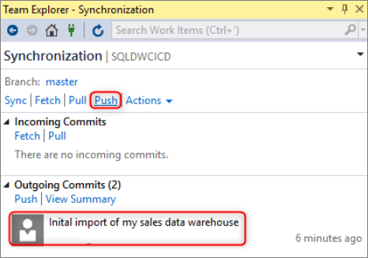
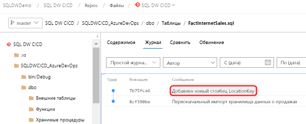

# Интеграция системы управления версиями для выделенного пула SQL в Azure Synapse Analytics

Из этого руководства вы узнаете, как интегрировать проект базы данных SQL Server Data Tools (SSDT) с системой управления версиями.  Интеграция системы управления версиями — это первый шаг в создании конвейера непрерывной интеграции и развертывания с помощью ресурса выделенного пула SQL в Azure Synapse Analytics.

## Перед началом

- Зарегистрируйтесь в [организации Azure DevOps](https://azure.microsoft.com/services/devops/).
- Выполните инструкции из руководства по [созданию и подключению](create-data-warehouse-portal.md).
- [Установите Visual Studio 2019](https://visualstudio.microsoft.com/vs/older-downloads/).

## Настройка и подключение к Azure DevOps

1. В организации Azure DevOps создайте проект, в котором будет размещаться проект базы данных SSDT через репозиторий Azure Repos.

   

2. Откройте Visual Studio и подключитесь к организации Azure DevOps и к проекту, созданному на шаге 1, выбрав **Управление подключениями**.

   

3. Подключитесь к проекту, выбрав **Управление подключениями**, а затем **Подключиться к проекту**.
 
    

4. Найдите проект, созданный на шаге 1, и щелкните **Подключиться**.
 
    

3. Клонируйте репозиторий Azure DevOps из проекта на локальный компьютер.

   

Дополнительные сведения о подключении проектов с помощью Visual Studio см. в статье [Подключение к проектам в Team Explorer](https://docs.microsoft.com/visualstudio/ide/connect-team-project?view=vs-2019). Инструкции по клонированию репозитория с помощью Visual Studio см. в статье [Клонирование существующего репозитория Git](https://docs.microsoft.com/azure/devops/repos/git/clone?view=azure-devops&tabs=visual-studio). 

## Создание и подключение проекта

1. В Visual Studio создайте проект базы данных SQL Server с каталогом и локальным репозиторием Git в **локальном клонированном репозитории**.

     

2. Щелкните правой кнопкой мыши пустой проект SQL и импортируйте хранилище данных в проект базы данных.

     

3. В Team Explorer в Visual Studio зафиксируйте все изменения в локальном репозитории Git.

     

4. Теперь, когда изменения локально зафиксированы в клонированном репозитории, синхронизируйте и отправьте изменения в репозиторий Azure Repos в проекте Azure DevOps.

   ")

     

## Проверка

1. Убедитесь, что изменения были отправлены в репозиторий Azure Repos, обновив столбец таблицы в проекте базы данных из Visual Studio SQL Server Data Tools (SSDT).

   

2. Зафиксируйте и отправьте изменения из локального репозитория в свой репозиторий Azure Repos.

   

3. Убедитесь, что изменение было отправлено в репозиторий Azure Repos.

   

4. (**Необязательно**) Используйте расширение "Сравнение схем" и обновите изменения в целевом выделенном пуле SQL с помощью SSDT, чтобы определения объектов в репозитории в Azure Repos и локальном репозитории отражали изменения в выделенном пуле SQL.

## Дальнейшие действия

- [Разработка для выделенного пула SQL](sql-data-warehouse-overview-develop.md)
