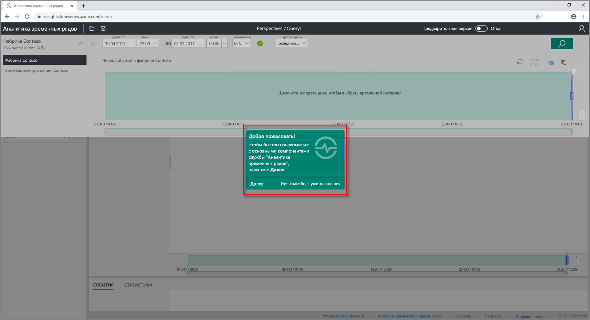
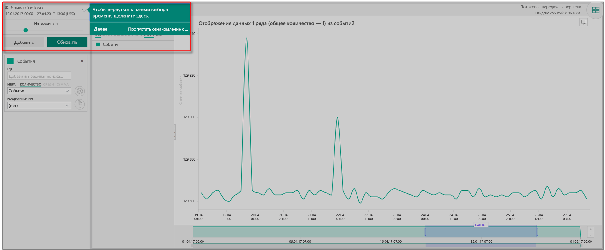
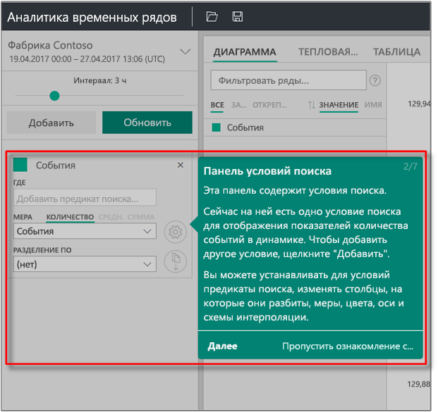
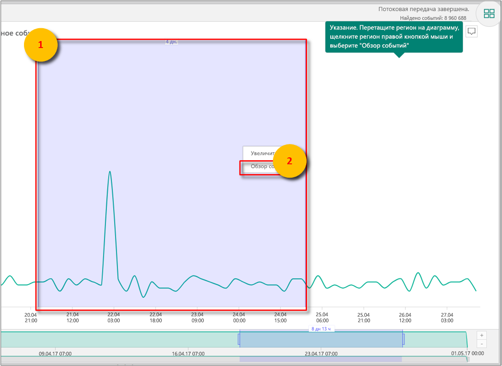
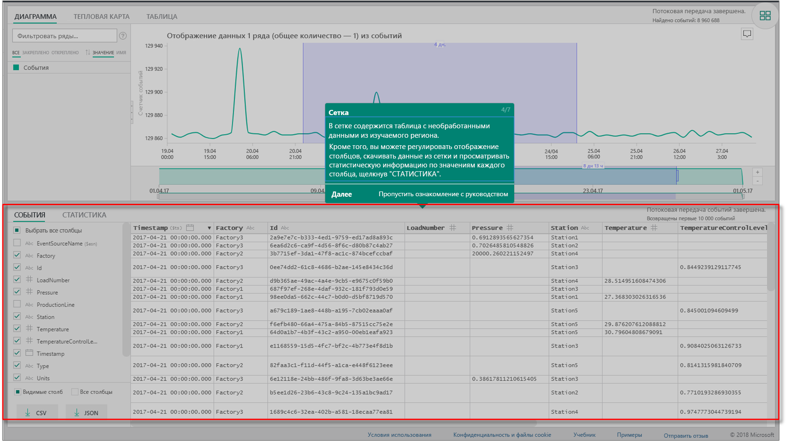
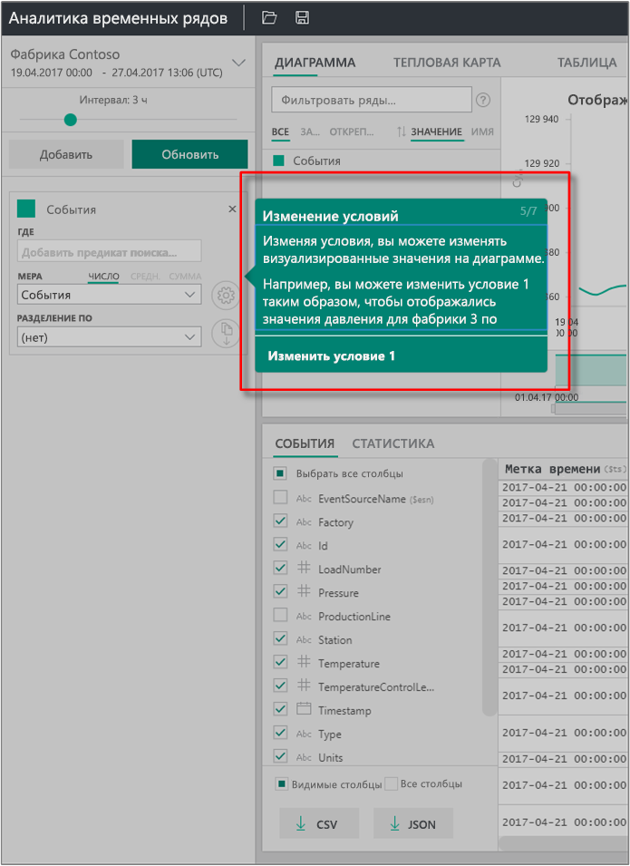
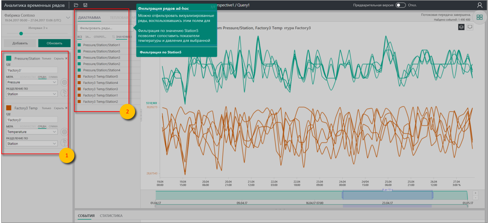

# Краткое руководство. Знакомство со службой "Аналитика временных рядов Azure"

Это краткое руководство по обозревателю Аналитики временных рядов Azure поможет приступить к работе с Аналитикой временных рядов в бесплатной демонстрационной среде. С его помощью вы узнаете, как использовать веб-браузер для визуализации больших объемов данных Интернета вещей, и ознакомитесь с текущими ключевыми возможностями общедоступной версии.

"Аналитика временных рядов Azure" — это полностью управляемая служба аналитики, хранения и визуализации, которая упрощает одновременный просмотр и анализ миллиардов событий Интернета вещей. Она обеспечивает глобальное представление данных, позволяя быстро проверить решение Интернета вещей и избежать дорогостоящих простоев в работе критически важных устройств. Используя Аналитику временных рядов Azure, вы можете обнаруживать скрытые тенденции, выявлять аномалии и выполнять анализ первопричин почти в реальном времени.

Аналитику временных рядов Azure можно добавить в существующее приложение, используя ее мощные интерфейсы [REST API](./time-series-insights-update-tsq.md) и [клиентский пакет SDK](https://github.com/microsoft/tsiclient). Это расширит ваши возможности разработки. С помощью интерфейсов API можно хранить, запрашивать и использовать данные временных рядов в выбранном вами клиентском приложении. Кроме того, для добавления компонентов пользовательского интерфейса в существующее приложение можно использовать клиентский пакет SDK.

В этом кратком руководстве по обозревателю Аналитики временных рядов рассмотрены возможности общедоступной версии.

> [!IMPORTANT]
> Создайте [бесплатную учетную запись Azure](https://azure.microsoft.com/free/?ref=microsoft.com&utm_source=microsoft.com&utm_medium=docs&utm_campaign=visualstudio), если у вас ее еще нет.

## Подготовка демонстрационной среды

1. В браузере перейдите к [общедоступной демонстрационной версии](https://insights.timeseries.azure.com/demo).

1. Если появится соответствующий запрос, войдите в обозреватель Аналитики временных рядов, используя данные своей учетной записи Azure.

1. Откроется страница краткого обзора Аналитики временных рядов. Нажмите кнопку **Далее**, чтобы начать изучение краткого обзора.

   

## Изучение демонстрационной среды

1. Откроется **панель выбора времени**. На этой панели можно выбрать интервал времени для визуализации.

   

1. Выберите интервал времени и перетащите его в область. Затем щелкните **Найти**.

   

   Служба "Аналитика временных рядов" отображает визуализацию диаграммы для указанного интервала времени. На графике можно выполнять различные действия. Например, можно фильтровать, закреплять, сортировать и распределять элементы.

   Чтобы вернуться к **панели выбора времени**, щелкните стрелку вниз, как показано ниже.

   

1. Нажмите кнопку **Добавить** на **панели условий**, чтобы добавить новое условие поиска.

   

1. В диаграмме можно выбрать область, щелкнуть ее правой кнопкой мыши и выбрать **Explore Events** (Исследовать события).

   

   Отобразится сетка необработанных данных по исследуемой области.

   

## Выбор и фильтрация данных

1. Измените условия, чтобы изменить значения на диаграмме. Добавьте еще одно условие для перекрестной корреляции значений разных типов.

   

1. Оставьте поле **Фильтровать ряды** пустым, чтобы просмотреть все выбранные условия поиска, или введите условие фильтра в поле **Фильтровать ряды** для импровизированной фильтрации рядов.

   

   Для начала введите **Station5**, чтобы выполнить перекрестную корреляцию температуры и давления для соответствующей станции.

После завершения работы с кратким руководством можно поэкспериментировать с примером набора данных, создавая различные визуализации.

## Очистка ресурсов

После завершения работы с учебником удалите созданные ресурсы:

1. На [портале Azure](https://portal.azure.com) в меню слева щелкните **Все ресурсы** и найдите группу ресурсов службы "Аналитика временных рядов Azure".
1. Удалите всю группу ресурсов (и все содержащиеся в ней ресурсы), выбрав **Удалить**, или каждый ресурс по отдельности.

## Дополнительная информация

Теперь вы готовы создать собственную среду Аналитики временных рядов:
> [!div class="nextstepaction"]
> [Планирование среды службы "Аналитика временных рядов"](time-series-insights-environment-planning.md)
