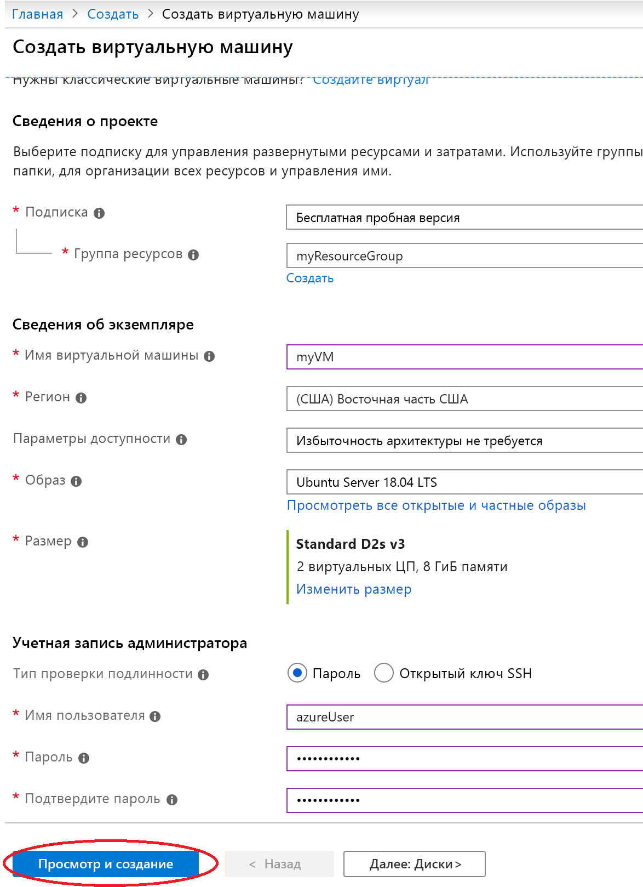

# Краткое руководство. Создание и шифрование виртуальной машины на портале Azure

Виртуальные машины Azure можно создать на портале Azure. Портал Azure — это пользовательский интерфейс на основе веб-браузера, который позволяет создавать виртуальные машины и связанные с ними ресурсы. В этом кратком руководстве вы будете использовать портал Azure для развертывания виртуальной машины Linux под управлением Ubuntu 18.04 LTS, создания хранилища ключей для хранения ключей шифрования, а также для шифрования этой виртуальной машины.

Если у вас еще нет подписки Azure, [создайте бесплатную учетную запись Azure](https://azure.microsoft.com/free/?WT.mc_id=A261C142F), прежде чем начинать работу.

## Вход в Azure

Войдите на [портале Azure](https://portal.azure.com).

## Создайте хранилище ключей.

1. Выберите параметр **Создать ресурс** в верхнем левом углу окна портала Azure.
1. В поле поиска введите **Key Vault**.
1. В списке результатов выберите **Key Vault**.
1. В разделе Key Vault выберите **Create** (Создать).
1. На экране **Create Key Vault** (Создать хранилище ключей) выберите уникальное имя для нового хранилища ключей.

    > [!Important]
    > Каждый Key Vault должен иметь уникальное имя. В следующем примере показан процесс создания Key Vault с именем *myADEKV*. Назовите свое хранилище ключей иначе.

1. Выберите **подписку**.
1.  Для параметра **Группа ресурсов** выберите **Создать**. Во всплывающем элементе введите *myResourceGroup* в качестве имени группы ресурсов и нажмите кнопку **ОК**. 

    

1. В раскрывающемся меню **Расположение** выберите **Восточная часть США**.
1. Для других параметров оставьте значения по умолчанию.
1. Выберите пункт "Политики доступа", чтобы перейти на новый экран.
1. Установите флажок рядом с пунктом "Включить доступ к шифрованию дисков Azure для шифрования томов".

    

1. В нижней части экрана политик доступа щелкните "Проверить и создать".
1. После просмотра нажмите кнопку "Создать".

## Создание виртуальной машины

1. Щелкните **Создать ресурс** в верхнем левом углу окна портала Azure.

1. На странице "Создать" в разделе "Популярные" выберите **Ubuntu Server 18.04 LTS**.
1. На вкладке **Basics** (Основные) в разделе **Project Details** (Сведения о проекте) убедитесь, что выбрана правильная подписка.
1. Для **Группы ресурсов** выберите группу ресурсов, созданную при создании хранилища ключей выше (например, **myResourceGroup**)
1. В поле **Virtual Machine Name** (Имя виртуальной машины) введите *MyVM* и выберите 
1. Для параметра **регион** выберите тот же регион, который использовался при создании хранилища ключей выше (например, **Восточная часть США**).
1. Убедитесь, что для параметра **Размер** выбрано значение *Standard D2s v3*.
1. В разделе **Учетная запись администратора** выберите **Пароль**. Введите имя пользователя и пароль.
    
1. Выберите вкладку "Управление" и убедитесь, что у вас есть учетная запись хранения для диагностики. Если у вас нет учетных записей хранения, выберите "Создать", укажите имя новой учетной записи и нажмите кнопку "ОК". 
1. Щелкните "Проверить и создать".
1. На странице **Создание виртуальной машины** отображаются сведения о создаваемой виртуальной машине. Когда вы будете готовы, нажмите **Создать**.

Развертывание виртуальной машины может занять несколько минут. После завершения развертывания перейдите к следующему разделу.

## Шифрование виртуальной машины

1. Когда развертывание ВМ будет завершено, выберите **Перейти к ресурсу**.
1. На боковой панели слева выберите **Диски**.
1. На экране "Диски" выберите **Шифрование**. 

    

1. На экране шифрования в разделе **Disks to Encrypt** (Шифруемые диски) выберите **OS and data disks** (ОС и диски данных).
1. В разделе **Encryption Settings** (Настройки шифрования) щелкните "Выберите хранилище ключей и ключ для шифрования".
1. На боковой панели справа в качестве значения для параметра **Хранилище ключей** выберите имя хранилища ключей, созданное ранее, и щелкните **Выбрать**.

    
1. В верхней части экрана шифрования нажмите кнопку "Сохранить". После этого откроется всплывающее окно с предупреждением о том, что виртуальная машина будет перезагружена. Щелкните **Да**.

## Очистка ресурсов

Если группа ресурсов, виртуальная машина и все связанные с ними ресурсы вам больше не требуются, их можно удалить. Для этого выберите группу ресурсов для виртуальной машины, выберите действие "Удалить" и подтвердите имя удаляемой группы ресурсов.

## Дополнительная информация

В этом кратком руководстве вы создали хранилище ключей для ключей шифрования, создали виртуальную машину и включили шифрование для этой виртуальной машины.  

> [!div class="nextstepaction"]
> [Общие сведения о шифровании дисков Azure](disk-encryption-overview.md)
