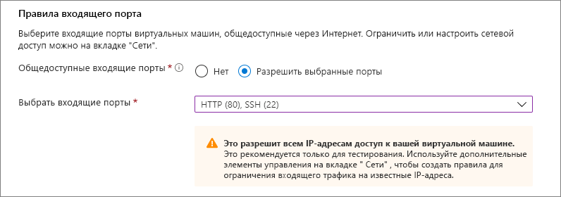

# <a name="quickstart-create-a-linux-virtual-machine-in-the-azure-portal"></a>Краткое руководство. Создание виртуальной машины Linux на портале Azure

Виртуальные машины Azure можно создать на портале Azure. Портал Azure — это браузерный пользовательский интерфейс, который позволяет создавать ресурсы Azure. В этом кратком руководстве показано, как использовать портал Azure для создания виртуальной машины Linux под управлением Ubuntu 18.04 LTS. Чтобы проверить работу виртуальной машины, вы также подключитесь к ней по протоколу SSH и установите веб-сервер NGINX.

Если у вас еще нет подписки Azure, [создайте бесплатную учетную запись](https://azure.microsoft.com/free/?WT.mc_id=A261C142F), прежде чем начинать работу.

## <a name="create-ssh-key-pair"></a>Создание пары ключей SSH

Для работы с этим кратким руководством вам понадобится пара ключей SSH. Если у вас уже есть эта пара, можно перейти к следующему шагу.

Откройте оболочку bash и выполните команду [ssh-keygen](https://www.ssh.com/ssh/keygen/), чтобы создать пару ключей SSH. Если на вашем локальном компьютере отсутствует оболочка bash, вы можете воспользоваться [Azure Cloud Shell](https://shell.azure.com/bash).


1. Войдите на [портал Azure](https://portal.azure.com).
1. В меню в верхней части страницы щелкните значок `>_`, чтобы открыть Cloud Shell.
1. Убедитесь, что в верхнем левом углу CloudShell указано **Bash**. Если там указано PowerShell, в раскрывающемся списке выберите **Bash** и щелкните **Подтвердить**, чтобы перейти к оболочке Bash.
1. Введите `ssh-keygen -t rsa -b 2048`, чтобы создать ключ SSH. 
1. Вам будет предложено ввести файл, в котором необходимо сохранить пару ключей. Просто нажмите клавишу **ВВОД**, чтобы сохранить ключи в расположении по умолчанию, указанном в квадратных скобках. 
1. Вам будет предложено ввести парольную фразу. Вы можете ввести парольную фразу для ключа SSH или нажать клавишу **ВВОД**, чтобы продолжить без использования парольной фразы.
1. Команда `ssh-keygen` создает открытый и закрытый ключи с именем по умолчанию `id_rsa` в `~/.ssh directory`. Команда возвращает полный путь к открытому ключу. Укажите путь к открытому ключу, чтобы отобразить его содержимое с помощью команды `cat`, введя `cat ~/.ssh/id_rsa.pub`.
1. Скопируйте выходные данные этой команды и сохраните их где-нибудь для дальнейшего использования в этой статье. Это открытый ключ, который понадобится при настройке учетной записи администратора для входа в виртуальную машину.

## <a name="sign-in-to-azure"></a>Вход в Azure

Войдите на [портал Azure](https://portal.azure.com), если вы еще этого не сделали.

## <a name="create-virtual-machine"></a>Создание виртуальной машины

1. В поле поиска введите **виртуальные машины**.
1. В разделе **Службы** выберите **Виртуальные машины**.
1. На странице **Виртуальные машины** выберите **Добавить**. Откроется страница **Создание виртуальной машины**.
1. На вкладке **Основные сведения** в разделе **Сведения о проекте** убедитесь, что выбрана правильная подписка, и при необходимости щелкните **Создать** для группы ресурсов. Введите имя *myResourceGroup*. 

    

1. В разделе **Подробности об экземпляре** введите *myVM* в поле **Имя виртуальной машины**, выберите *Восточная часть США* в поле **Регион** и выберите *Ubuntu 18.04 LTS* в поле **Образ**. Оставьте другие значения по умолчанию.

    

1. В разделе **Учетная запись администратора** выберите **Открытый ключ SSH**, введите имя пользователя и вставьте открытый ключ. Удалите из открытого ключа все начальные или конечные пробелы.

    

1. В разделе **Правила входящего порта** > **Общедоступные входящие порты**, щелкните **Разрешить выбранные порты**, а затем выберите **SSH (22)** и **HTTP (80)** из раскрывающегося списка. 

    

1. Оставьте остальные значения по умолчанию и нажмите кнопку **Просмотр и создание**, расположенную в нижней части страницы.

1. На странице **Создание виртуальной машины** отображаются сведения о создаваемой виртуальной машине. Когда вы будете готовы, нажмите **Создать**.

Развертывание виртуальной машины может занять несколько минут. После завершения развертывания перейдите к следующему разделу.

    
## <a name="connect-to-virtual-machine"></a>Подключение к виртуальной машине

Создайте SSH-подключение к виртуальной машине.

1. Нажмите кнопку **Подключиться** на странице обзора виртуальной машины. 

    

2. На странице **Подключение к виртуальной машине** сохраните значения по умолчанию, чтобы использовать подключение по IP-адресу через порт 22. В поле **Вход с использованием локальной учетной записи ВМ** представлена команда для подключения. Нажмите кнопку, чтобы скопировать эту команду. Ниже представлен пример команды подключения по SSH:

    ```bash
    ssh azureuser@10.111.12.123
    ```

3. В той же оболочке Bash, в которой вы создали пару ключей SSH (вы можете повторно открыть Cloud Shell, снова выбрав `>_` или перейдя по ссылке `https://shell.azure.com/bash`), вставьте команду подключения в оболочку, чтобы создать сеанс SSH.

## <a name="install-web-server"></a>Установка веб-сервера

Чтобы проверить работу виртуальной машины, установите веб-сервер NGINX. Из сеанса SSH обновите источники пакетов, а затем установите последнюю версию пакета NGINX.

```bash
sudo apt-get -y update
sudo apt-get -y install nginx
```

После этого введите `exit`, чтобы выйти из сеанса SSH.


## <a name="view-the-web-server-in-action"></a>Проверка работы веб-сервера

Страницу приветствия NGINX по умолчанию можно просмотреть в любом веб-браузере. Введите общедоступный IP-адрес виртуальной машины в качестве веб-адреса. Общедоступный IP-адрес можно найти на странице общих сведений о виртуальной машине. Также он является частью строки подключения SSH, использованной ранее.


## <a name="clean-up-resources"></a>Очистка ресурсов

Если группа ресурсов, виртуальная машина и все связанные с ними ресурсы вам больше не требуются, их можно удалить. Для этого выберите группу ресурсов для виртуальной машины, выберите действие **Удалить** и подтвердите имя удаляемой группы ресурсов.

## <a name="next-steps"></a>Дальнейшие действия

При работе с этим кратким руководство вы развернули простую виртуальную машину, создали группу безопасности сети и правило для нее, а также установили простой веб-сервер. Дополнительные сведения о виртуальных машинах Azure см. в руководстве для виртуальных машин Linux.

> [!div class="nextstepaction"]
> [Создание виртуальных машин Linux и управление ими с помощью Azure CLI](./tutorial-manage-vm.md)
