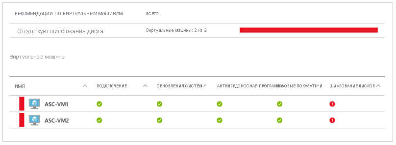

# Лазурное шифрование дисков для Windows VMs 

Шифрование дисков Azure помогает защитить данные согласно корпоративным обязательствам по обеспечению безопасности и соответствия. Он использует функцию [Bitlocker](https://en.wikipedia.org/wiki/BitLocker) Windows для обеспечения громкости шифрования для ОС и дисков данных виртуальных машин Azure (VMs), и интегрирован с [Azure Key Vault,](../../key-vault/index.yml) чтобы помочь вам управлять и управлять ключами шифрования диска и секретами. 

Если вы используете [Центр безопасности Azure,](../../security-center/index.yml)вы будете предупреждены, если у вас есть vMs, которые не зашифрованы. Вы получите оповещение высокого уровня серьезности вместе c рекомендацией о шифровании таких виртуальных машин.

> [!WARNING]
> - Если ранее для шифрования VM использовалось шифрование Azure Disk с Azure AD, необходимо продолжить использование этой опции для шифрования VM. Подробнее о [шифровании azure Disk с помощью Azure AD (предыдущий релиз).](disk-encryption-overview-aad.md) 
> - Выполнение некоторых приведенных рекомендаций может привести к более интенсивному использованию данных, сети или вычислительных ресурсов, а следовательно к дополнительным затратам на лицензии или подписки. Необходима действующая подписка Azure, которая позволяет создавать ресурсы Azure в поддерживаемых регионах.

Вы можете узнать основы шифрования Azure Disk для Windows всего за несколько минут с [помощью Create и шифрования Windows VM с помощью быстрого запуска Azure CLI](disk-encryption-cli-quickstart.md) или [создания и шифрования Windows VM с помощью quickstart Azure Powershell.](disk-encryption-powershell-quickstart.md)

## Поддерживаемые ВМ и операционные системы

### Поддерживаемые виртуальные машины

Windows VMs доступны в [диапазоне размеров.](sizes-general.md) Шифрование azure Disk недоступно на [виртуальных взламных](https://azure.microsoft.com/pricing/details/virtual-machines/series/)устройствах серии A или на виртуальных машинах с памятью менее 2 ГБ.

Шифрование Azure Disk также доступно для vMs с премиум-хранилищем.

Лазурный диск шифрование не доступно на [поколение 2 VMs](generation-2.md#generation-1-vs-generation-2-capabilities)) и [Lsv2-серии VMs](../lsv2-series.md)). Для получения дополнительных [Azure Disk Encryption: Unsupported scenarios](disk-encryption-windows.md#unsupported-scenarios)исключений см.

### Поддерживаемые операционные системы

- Клиент Windows: Windows 8 и позже.
- Windows Server: Windows Server 2008 R2 и позже.  
 
> [!NOTE]
> Windows Server 2008 R2 требует установки системы .NET 4.5 для шифрования; установить его из Windows Update с дополнительным обновлением Microsoft .NET Framework 4.5.2 для Windows Server 2008 R2 x64-систем[(KB2901983](https://www.catalog.update.microsoft.com/Search.aspx?q=KB2901983)).  
>  
> Windows Server 2012 R2 Core и Windows Server 2016 Core требуют установки компонента bdehdcfg на VM для шифрования.

## Требования к сети
Для включения шифрования azure Disk им. М. должны соответствовать следующим требованиям конфигурации конечных точек сети:
  - Чтобы получить токен для подключения к хранилищу ключей, Windows VM должна быть в \[\]состоянии подключиться к точке предварительного отлавливки Active Directory Azure, login.microsoftonline.com.
  - Чтобы написать ключи шифрования в хранилище ключей, Windows VM должна быть в состоянии подключиться к конечной точке хранилища ключей.
  - VM Windows должен быть в состоянии подключиться к конечной точке хранения Azure, в ней размещается репозиторий расширения Azure и учетная запись хранения Azure, в мещах которого размещаются файлы VHD.
  -  Если ваша политика безопасности ограничивает доступ к Интернету с виртуальных машин Azure, можно разрешить указанный выше универсальный код ресурса (URI) и настроить определенное правило, чтобы разрешить исходящие подключения к данным IP-адресам. Дополнительные сведения см. в статье [Доступ к Azure Key Vault из-за брандмауэра](../../key-vault/key-vault-access-behind-firewall.md).    

## Требования к групповой политике

Лазурное шифрование диска использует внешний протектор ключов BitLocker для Windows VMs. Если виртуальные машины присоединены к домену, не применяйте групповые политики, требующие использования предохранителей TPM. Для получения информации о групповой политике для "Разрешить BitLocker без совместимого TPM", см [BitLocker группы политики Справка](/windows/security/information-protection/bitlocker/bitlocker-group-policy-settings#bkmk-unlockpol1).

Политика BitLocker в отношении домена, объединяемого виртуальными машинами с пользовательской групповой политикой, должна включать в себя следующие настройки: [Настройка пользовательского хранилища информации о восстановлении BitLocker -> Разрешить 256-битный ключ восстановления.](/windows/security/information-protection/bitlocker/bitlocker-group-policy-settings) Шифрование дисков Azure завершится ошибкой, если параметры настраиваемой групповой политики для BitLocker несовместимы. На компьютерах без соответствующего параметра политики может потребоваться применить новую политику, принудительно обновить ее (gpupdate.exe /force) и перезагрузить компьютер.

Шифрование azure Disk выйдет из строя, если политика группы доменов блокирует алгоритм AES-CBC, который используется BitLocker.

## Требования к хранению ключей шифрования  

Шифрование azure Disk требует, чтобы Убежище azure Key Vault контролировало и управляло ключами и секретами шифрования дисков. Хранилище ключей и вс-м ввода м ввода-возах должны находиться в одном и том же регионе Azure и подписке.

Для получения подробной информации [см. Создание и настройка хранилища ключей для шифрования azure Disk.](disk-encryption-key-vault.md)

## Терминология
В следующей таблице определены некоторые общие термины, используемые в документации по шифрованию дисков Azure:

| Терминология | Определение |
| --- | --- |
| Azure Key Vault | Key Vault представляет собой службу управления криптографическими ключами. Она основана на аппаратных модулях безопасности, соответствующих Федеральному стандарту обработки информации (FIPS). Эти стандарты позволяют надежно хранить криптографические ключи и конфиденциальные данные. Для получения дополнительной информации ознакомьтесь с документацией [Azure Key Vault](https://azure.microsoft.com/services/key-vault/) и [созданием и настройкой хранилища ключей для шифрования azure Disk.](disk-encryption-key-vault.md) |
| Azure CLI | [Azure CLI](/cli/azure/install-azure-cli) оптимизирован для администрирования ресурсов Azure и управления ими из командной строки.|
| BitLocker |[BitLocker](https://technet.microsoft.com/library/hh831713.aspx) — это признанная в отрасли технология шифрования громкости Windows, которая используется для включения шифрования дисков на Windows VMs. |
| Ключ шифрования (KEK) | Асимметричный ключ (RSA 2048), который можно использовать для защиты или обертывания секрета. Вы можете использовать защищенный HSM ключ или ключ с программной защитой. Для получения дополнительной информации ознакомьтесь с документацией [Azure Key Vault](https://azure.microsoft.com/services/key-vault/) и [созданием и настройкой хранилища ключей для шифрования azure Disk.](disk-encryption-key-vault.md) |
| Командлеты PowerShell | Дополнительные сведения см. в статье [Общие сведения об Azure PowerShell](/powershell/azure/overview). |

## Дальнейшие действия

- [Быстрый запуск - Создание и шифрование Windows VM с Azure CLI](disk-encryption-cli-quickstart.md)
- [Быстрый запуск - Создание и шифрование Windows VM с Azure Powershell](disk-encryption-powershell-quickstart.md)
- [Сценарии шифрования дисков Azure для виртуальных машин Windows](disk-encryption-windows.md)
- [Предпосылки для шифрования дисков Azure](https://github.com/ejarvi/ade-cli-getting-started)
- [Предпосылки для шифрования дисков Azure](https://github.com/Azure/azure-powershell/tree/master/src/Compute/Compute/Extension/AzureDiskEncryption/Scripts)
- [Создание и настройка хранилища ключей для шифрования дисков Azure](disk-encryption-key-vault.md)

