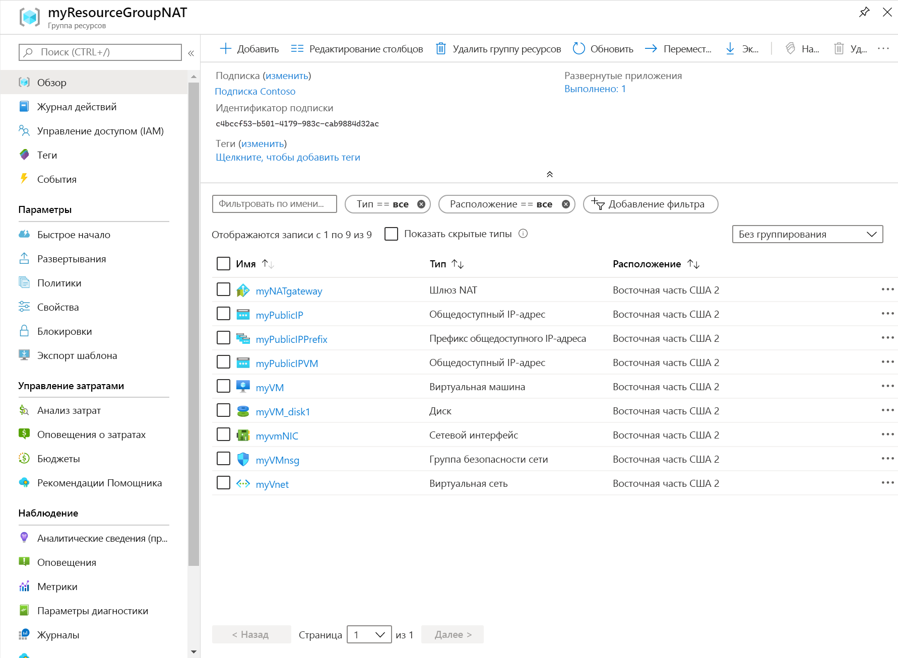

# <a name="quickstart-create-a-nat-gateway---resource-manager-template"></a>Краткое руководство. Создание шлюза NAT с помощью шаблона Resource Manager

Вы можете начать работу с преобразованием сетевых адресов (NAT) виртуальной сети с помощью шаблона Azure Resource Manager.  Этот шаблон развертывает виртуальную сеть, ресурс шлюза NAT и виртуальную машину Ubuntu. Виртуальная машина Ubuntu развертывается в подсети, связанной с ресурсом шлюза NAT.

[!INCLUDE [About Azure Resource Manager](../../includes/resource-manager-quickstart-introduction.md)]

Если у вас еще нет подписки Azure, [создайте бесплатную учетную запись](https://azure.microsoft.com/free/?WT.mc_id=A261C142F), прежде чем начинать работу.

## <a name="create-a-nat-gateway-and-supporting-resources"></a>Создание шлюза NAT и вспомогательных ресурсов

Этот шаблон настроен для создания: 

* Виртуальная сеть 
* ресурса шлюза NAT;
* виртуальной машины Ubuntu.

Виртуальная машина Ubuntu развертывается в подсети, связанной с ресурсом шлюза NAT.

### <a name="review-the-template"></a>Изучение шаблона

Шаблон, используемый в этом кратком руководстве, взят из [шаблонов быстрого запуска Azure](https://raw.githubusercontent.com/Azure/azure-quickstart-templates/master/101-nat-gateway-1-vm/azuredeploy.json).

:::code language="json" source="~/quickstart-templates/101-nat-gateway-1-vm/azuredeploy.json" range="1-335" highlight="256-282":::

В шаблоне определено девять ресурсов Azure.

**Microsoft.Network**

* **[Microsoft.Network/natGateways](https://docs.microsoft.com/azure/templates/microsoft.network/natgateways)** . Создает ресурс шлюза NAT.

* **[Microsoft.Network/networkSecurityGroups](https://docs.microsoft.com/azure/templates/microsoft.network/networksecuritygroups)** . Создает группу безопасности сети.

    * **[Microsoft.Network/networkSecurityGroups/securityRules](https://docs.microsoft.com/azure/templates/microsoft.network/networksecuritygroups/securityrules)** . Создает правило безопасности.

* **[Microsoft.Network/publicIPAddresses](https://docs.microsoft.com/azure/templates/microsoft.network/publicipaddresses)** . Создает общедоступный IP-адрес.

* **[Microsoft.Network/publicIPPrefixes](https://docs.microsoft.com/azure/templates/microsoft.network/publicipprefixes)** . Создает префикс общедоступного IP-адреса.

* **[Microsoft.Network/virtualNetworks](https://docs.microsoft.com/azure/templates/microsoft.network/virtualnetworks)** . Создает виртуальную сеть.

    * **[Microsoft.Network/virtualNetworks/subnets](https://docs.microsoft.com/azure/templates/microsoft.network/virtualnetworks/subnets)** . Создает подсеть виртуальной сети.

* **[Microsoft.Network/networkinterfaces](https://docs.microsoft.com/azure/templates/microsoft.network/networkinterfaces)** . Создает сетевой интерфейс.

**Microsoft.Compute**

* **[Microsoft.Compute/virtualMachines](https://docs.microsoft.com/azure/templates/Microsoft.Compute/virtualMachines)** : Создает виртуальную машину.

### <a name="deploy-the-template"></a>Развертывание шаблона

**Azure CLI**

```azurecli-interactive
read -p "Enter the location (i.e. westcentralus): " location
resourceGroupName="myResourceGroupNAT"
templateUri="https://raw.githubusercontent.com/Azure/azure-quickstart-templates/master/101-nat-gateway-1-vm/azuredeploy.json" 

az group create \
--name $resourceGroupName \
--location $location

az group deployment create \
--resource-group $resourceGroupName \
--template-uri  $templateUri
```

**Azure PowerShell**

```azurepowershell-interactive
$location = Read-Host -Prompt "Enter the location (i.e. westcentralus)"
$templateUri = "https://raw.githubusercontent.com/Azure/azure-quickstart-templates/master/101-nat-gateway-1-vm/azuredeploy.json"

$resourceGroupName = "myResourceGroupNAT"

New-AzResourceGroup -Name $resourceGroupName -Location $location
New-AzResourceGroupDeployment -ResourceGroupName $resourceGroupName -TemplateUri $templateUri
```

**Портал Azure**

[](https://portal.azure.com/#create/Microsoft.Template/uri/https%3A%2F%2Fraw.githubusercontent.com%2FAzure%2Fazure-quickstart-templates%2Fmaster%2F101-nat-gateway-1-vm%2Fazuredeploy.json)

## <a name="review-deployed-resources"></a>Просмотр развернутых ресурсов

1. Войдите на [портал Azure](https://portal.azure.com).

2. В области слева выберите **Группы ресурсов**.

3. Выберите группу ресурсов, созданную при работе с предыдущим разделом. Имя группы ресурсов по умолчанию — **myResourceGroupNAT**.

4. Убедитесь, что в группе ресурсов созданы следующие ресурсы:

    

## <a name="clean-up-resources"></a>Очистка ресурсов

**Azure CLI**

Вы можете удалить ненужную группу ресурсов и все содержащиеся в ней ресурсы, выполнив команду [az group delete](/cli/azure/group#az-group-delete).

```azurecli-interactive 
  az group delete \
    --name myResourceGroupNAT
```

**Azure PowerShell**

Вы можете удалить группу ресурсов и все ресурсы в ней, если они больше не нужны, выполнив команду [Remove-AzResourceGroup](https://docs.microsoft.com/powershell/module/az.resources/remove-azresourcegroup?view=latest).

```azurepowershell-interactive 
Remove-AzResourceGroup -Name myResourceGroupNAT
```

**Портал Azure**

Удалите ставшие ненужными группу ресурсов, шлюз NAT и все связанные ресурсы. Выберите группу ресурсов **myResourceGroupNAT**, которая содержит шлюз NAT, а затем выберите **Удалить**.

## <a name="next-steps"></a>Дальнейшие действия

В этом кратком руководстве вы узнали, как создать:

* ресурс шлюза NAT;
* Виртуальная сеть
* виртуальную машину Ubuntu.

Виртуальная машина Ubuntu развертывается в подсети виртуальной сети, связанной со шлюзом NAT. 

Дополнительные сведения о NAT виртуальной сети и Azure Resource Manager см. в следующих статьях.

* [Обзор NAT виртуальной сети](nat-overview.md)
* Сведения о [ресурсе Шлюза NAT](nat-gateway-resource.md)
* Сведения об [Azure Resource Manager](../azure-resource-manager/management/overview.md)
