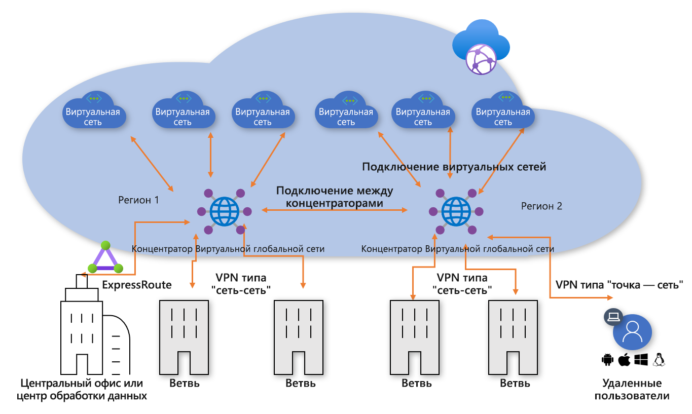
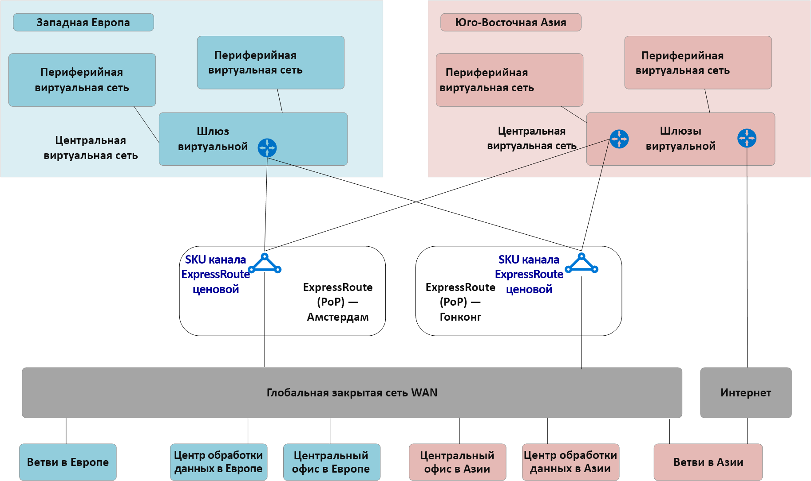
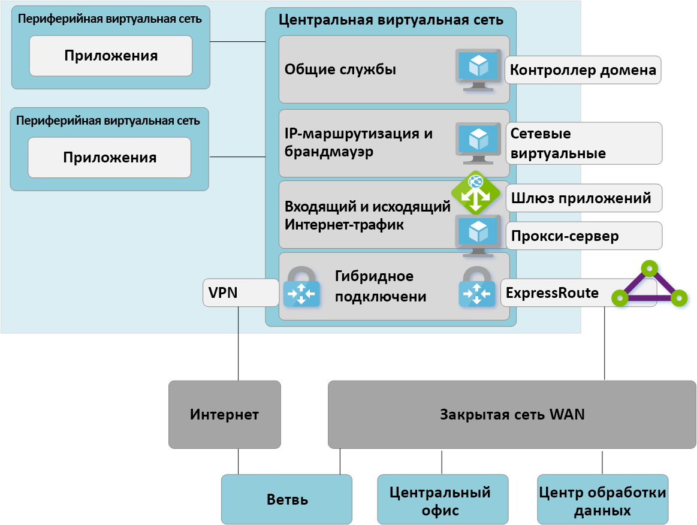
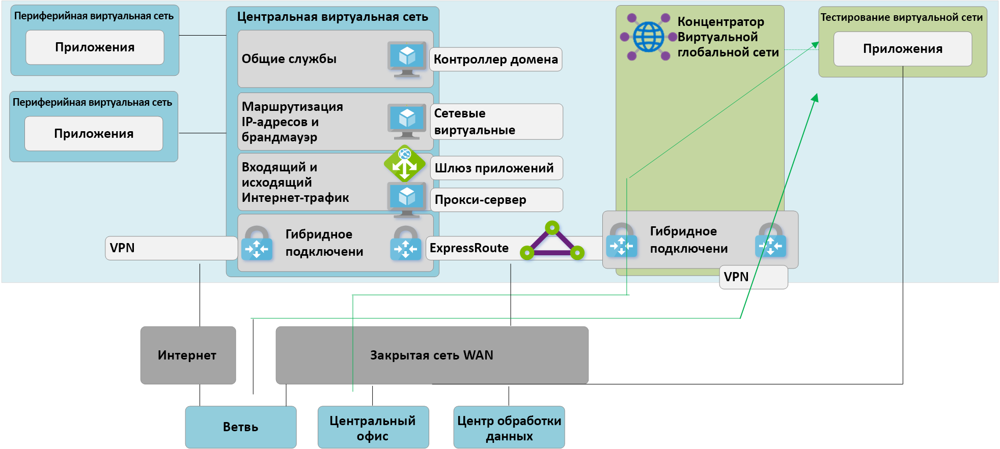
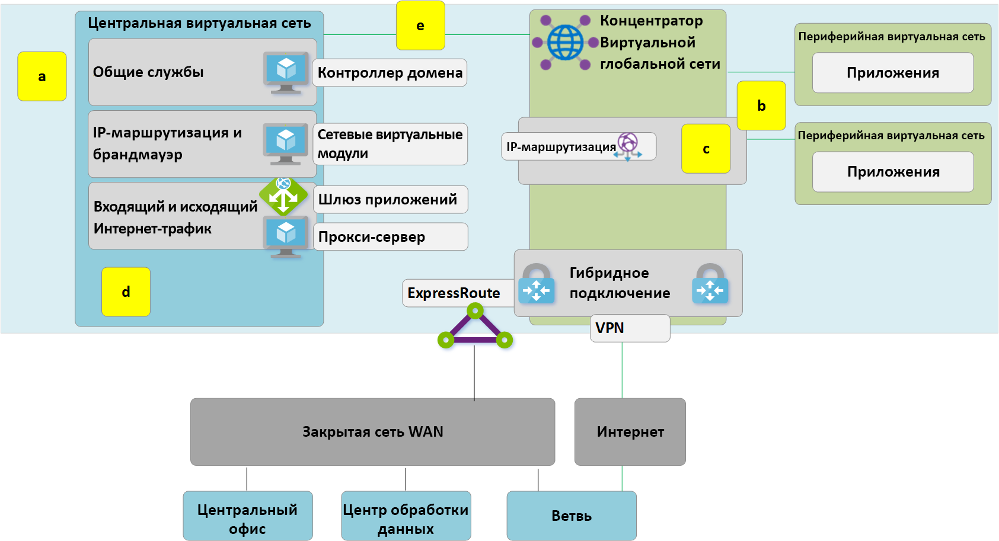
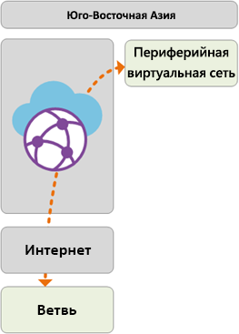
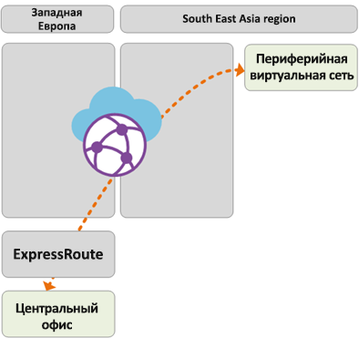
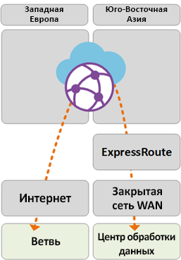
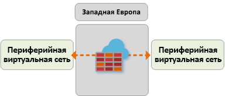

# Переход на Виртуальную глобальную сеть Azure

Azure Virtual WAN позволяет компаниям упростить глобальное подключение, чтобы извлечь выгоду из масштаба глобальной сети Майкрософт. В этой статье представлены технические сведения для компаний, которые хотят перейти от существующей топологии концентратора и говорил, управляемой клиентами, к дизайну, который использует управляемые Корпорацией Майкрософт виртуальные wan концентраторы.

Для получения информации о преимуществах, которые Azure Virtual WAN предоставляет предприятиям, использующим облачную современную глобальную сеть предприятий, [см. Глобальную архитектуру транзитных сетей и Virtual WAN.](virtual-wan-global-transit-network-architecture.md)

**Рисунок: Azure Виртуальный WAN**

Модель подключения концентратора и подключений Azure Virtual Datacenter (VDC) была принята тысячами наших клиентов для использования поведения маршрутизаторов маршрутизаторов Azure Network по умолчанию для создания простых и масштабируемых облачных сетей. Azure Virtual WAN опирается на эти концепции и вводит новые возможности, которые позволяют глобальной сети подключения topologies, а не только между местами и Azure, но и позволяет клиентам использовать масштабы сети Microsoft, чтобы увеличить их существующих глобальных сетей.

В этой статье показано, как перенести существующую гибридную среду в Virtual WAN.

## Сценарий

Contoso является глобальной финансовой организацией с офисами в Европе и Азии. Эта компания планирует переместить существующие приложения из локального центра обработки данных в Azure. Специалисты компании создали базовую архитектуру на основе виртуальных ЦОД, в том числе региональные виртуальные сети, управляемые клиентом, для гибридных подключений. В рамках перехода к облачным технологиям, сетевой группе было поручено обеспечить оптимизацию их подключения для продвижения бизнеса вперед.

Ниже приведена цифра высокого уровня существующей глобальной сети, включая подключение к нескольким регионам Azure.

топологии сети**Рисунок: Contoso существующих топологии сети**

Из существующей топологии сети могут быть понятны следующие моменты.

- Во многих регионах используется звездообразная топология, которая включает каналы ExpressRoute Premium для подключения к единой частной глобальной сети.

- Некоторые из этих сайтов также имеют VPN-туннели непосредственно в Azure для доступа к приложениям, размещенным в облаке Майкрософт.

## Требования

Группе разработчиков сети была поставлена задача реализовать модель глобальной сети, которая может поддерживать миграцию Contoso в облако и должна оптимизироваться в отношении затрат, масштабирования и производительности. В целом должны соблюдаться следующие требования.

- Обеспечить как штаб-квартиру, так и филиалы с оптимизированным доступом к размещенным в облаке приложениям.
- Удалите зависимость от существующих центров обработки данных (DC) для прекращения VPN, сохраняя при этом следующие пути подключения:
  - **Отделы связи branch-to-VNet**: Офисы, подключенные к VPN, должны иметь доступ к приложениям, мигрированным в облако в локальном регионе Azure.
  - **Офисы,** подключенные к VPN, должны иметь доступ к приложениям, мигрированным в облако в удаленном регионе Azure.
  - **Филиал-к-филиал**: Региональные VPN подключенные офисы должны быть в состоянии общаться друг с другом и ExpressRoute подключены H '/ DC сайтов.
  - **Филиал-к- Концентратор -к- концентратор -к- филиал**: Глобально разделенные VPN подключенные офисы должны быть в состоянии общаться друг с другом и любые ExpressRoute подключены H '/ DC сайтов.
  - **Branch-to-Internet**: Подключенные сайты должны иметь возможность общаться с Интернетом. Этот трафик должен быть отфильтрован и зарегистрирован.
  - **VNet-to-VNet**: Виртуальные сети в одном регионе должны иметь возможность общаться друг с другом.
  - **VNet-концентратор -к- концентратор-к-VNet**: Говорил виртуальных сетей в различных регионах должны быть в состоянии общаться друг с другом.
- Предоставьте пользователям роуминга Contoso (ноутбук и телефон) доступ к ресурсам компании, а не в корпоративной сети.

## Архитектура Azure Virtual WAN

Следующая цифра показывает высокоуровневое представление обновленной топологии цели с помощью Azure Virtual WAN для удовлетворения требований, описанных в предыдущем разделе.

WAN**Рисунок: Azure Виртуальная архитектура WAN**

Сводка.

- Штаб-квартира в Европе сохраняет подключение ExpressRoute, а локальные ЦОД в Европе полностью перенесены Azure и теперь выведены из эксплуатации.
- ЦОД в Азии и штаб-квартира остаются подключенными к частной глобальной сети. В настоящее время Azure Virtual WAN используется для расширения локальной сети перевозчиков и обеспечения глобальной связи.
- Виртуальные концентраторы Azure WAN, развернутые как в регионах Западной Европы, так и в юго-восточной Азии, для обеспечения концентратора связи для подключенных к ExpressRoute и VPN устройств.
- Концентраторы также поддерживают терминирование VPN для пользователей в сторонних сетях с несколькими типами клиентов, используя подключение OpenVPN к глобальной облачной сети. Это позволяет получать доступ не только к приложениям, перенесенным в Azure, но и к другим ресурсам, которые остаются в локальной среде.
- Подключение к Интернету для ресурсов в виртуальной сети, предоставляемый виртуальной глобальной сетью Azure.

Подключение к Интернету для удаленных сайтов, предоставляемое Виртуальной глобальной сетью Azure. Локальная коммутация Интернет-подключений поддерживается партнерской интеграцией для оптимизации доступа к SaaS-службам, таким как Office 365.

## Переход на Виртуальную глобальную сеть

В этом разделе показаны различные шаги для перехода в Azure Virtual WAN.

### Шаг 1: VDC концентратор-и-говорил одного региона

Просмотрите архитектуру. На следующем рисунке показана одна топология региона для Contoso до развертывания Azure Virtual WAN:

единого региона**Рисунок 1: Центр-и-спич vDC одного региона**

В соответствии с подходом Virtual Data Center (VDC) виртуальная сеть концентратора, управляемого клиентами, содержит несколько функциональных блоков:

- Общие службы (любая общая функция, требуемая несколькими спицы). Пример: Contoso использует контроллеры доменов Windows Server на виртуальных машинах Infrastructure-as-a-service (IaaS).
- Службы брандмауэра IP-адресации/маршрутизации предоставляются сторонним сетевым виртуальным модулем, что обеспечивает IP-маршрутизацию между сегментами уровня 3.
- Входящие и исходящие службы Интернета, включая шлюз приложений Azure для входящих HTTPS-запросов и сторонние прокси-службы, работающие на виртуальных машинах для фильтрованного исходящего доступа к Интернет-ресурсам.
- Виртуальный сетевой шлюз ExpressRoute и VPN для подключения к сетевым сетям.

### Шаг 2: Развертывание виртуальных узлов WAN

Развертывание виртуального концентратора WAN в каждом регионе. Настройка виртуального концентратора WAN с VPN Gateway и ExpressRoute Gateway, как описано в следующих статьях:

- [Руководство. Создание подключения "сеть — сеть" с помощью Виртуальной глобальной сети Azure](virtual-wan-site-to-site-portal.md)
- [Учебник: Создание ассоциации ExpressRoute с помощью Azure Virtual WAN](virtual-wan-expressroute-portal.md)

> [!NOTE]
> Azure Virtual WAN должен использовать Стандартный SKU для включения некоторых путей движения, показанных в этой статье.

узлов WAN**Рисунок 2: VDC концентратор-и-говорил для виртуальной миграции WAN**

### Шаг 3: Подключите удаленные сайты (ExpressRoute и VPN) к виртуальному WAN

Подключите виртуальный концентратор WAN к существующим схемам ExpressRoute и установите VPN от сайта через Интернет для любых удаленных ветвей.

> [!NOTE]
> Для подключения к виртуальному концентратору глобальной сети необходимо обновить каналы Express Route до типа SKU "Премиум".

к виртуальному WAN**Рисунок 3: VDC концентратор и говорил с виртуальной миграции WAN**

На этом этапе на территории сети начнется получать маршруты, отражающие пространство IP-адреса, отведенное виртуальному центру vNet, управляемому WAN. Удаленные филиалы, подключенные через VPN, на этом этапе увидят два пути к существующим приложениям в сегментах виртуальных сетей. Эти устройства должны быть настроены так, чтобы по-прежнему использовать туннель с концентратором виртуального ЦОД, чтобы обеспечить симметричную маршрутизацию на этапе перехода.

### Шаг 4: Тест гибридное подключение через виртуальный WAN

Перед использованием управляемого виртуального wan-концентратора для производственного подключения мы рекомендуем настроить тестовую виртуальную сеть и виртуальное соединение WAN VNet. Прежде чем продолжить, убедитесь, что подключения к этой тестовой среде работают через подключения ExpressRoute и VPN типа "сеть — сеть".

подключение через виртуальный WAN**Рисунок 4: VDC концентратор и говорил виртуальной миграции WAN**

### Шаг 5: Переход подключения к виртуальному концентратору WAN

виртуальному концентратору WAN**Рисунок 5: VDC концентратор и говорил с виртуальной миграцией WAN**

**a**. Удалите существующие пиринговые соединения из виртуальных сетей Spoke в старый концентратор VDC. Доступ к приложениям в сегментах виртуальных сетей невозможен, пока не будут выполнены шаги а–в.

**b**. Подключите виртуальные сети к виртуальному концентратору WAN через соединения VNet.

**c**. Удалите все определяемые пользователем маршруты (UDR), которые ранее использовались в сегментах виртуальных сетей для связи между сегментами. Этот путь теперь активируется динамической маршрутизацией, доступной в концентраторе виртуальной глобальной сети.

**d**. Существующие шлюзы ExpressRoute и VPN в концентраторе виртуального ЦОД отключены, чтобы иметь возможность перейти к следующему шагу.

**e**. Подключите старый концентратор виртуального ЦОД (виртуальную сеть концентратора) к концентратору виртуальной глобальной сети через новое подключение к виртуальной сети.

### Шаг 6: Старый концентратор становится общими службами говорил

Итак, мы перестроили сеть Azure, чтобы сделать концентратор виртуальной глобальной сети центральной точкой в новой топологии.

**Рисунок 6: VDC концентратор и говорил виртуальной миграции WAN**

Поскольку виртуальный wan hub является управляемой структурой и не позволяет развертывать пользовательские ресурсы, такие как виртуальные машины, общий блок служб теперь существует как виртуальная сеть и хостов функций, таких как интернет-вход через Azure Application Gateway или сети виртуализированного устройства. Трафик между средой общих служб и серверными виртуальными машинами теперь передается в концентратор, управляемый виртуальной глобальной сетью.

### Шаг 7: Оптимизация предпосылок для полного использования Virtual WAN

На этом этапе компания Contoso в основном выполнила перенос бизнес-приложений в облако Майкрософт, за счет чего в локальном контроллере домена осталось лишь несколько устаревших приложений.

подключения, чтобы в полной мере использовать Виртуальный WAN**Рисунок 7: VDC концентратор и говорил с виртуальной миграции WAN**

Чтобы использовать все функции виртуальной глобальной сети Azure, компания Contoso решила вывести из эксплуатации устаревшее локальные VPN-подключения. Все филиалы, которые продолжают получать доступ к сетям штаб-квартиры или ЦОД, могут использовать глобальную сеть Майкрософт с помощью встроенной транзитной маршрутизации виртуальной глобальной сети Azure.

> [!NOTE]
> ExpressRoute Global Reach — это альтернативный вариант для клиентов, желающих использовать магистральную сеть Майкрософт для дополнения своих существующих частных сетей.

## Архитектура и пути движения в конце штата

движения:**Двойной регион Виртуальный WAN**

В этом разделе рассматривается то, как эта топология соответствует исходным требованиям, на примере нескольких последовательностей трафика.

### Путь 1

Путь 1 показывает транспортный поток от s2S VPN подключенной ветки в Азии до Azure VNet в регионе юго-восточной Азии.

Трафик направляется следующим образом:

- Азиатский филиал соединен через устойчивые туннели S2S BGP с поддержкой в юго-восточной Азии Виртуальный WAN хаб.

- Азиатский виртуальный концентратор глобальной сети направляет трафик локально в подключенную виртуальную сеть.

### Путь 2

Путь 2 показывает транспортный поток от ExpressRoute, подключенного к европейскому штаб-квартире с Azure VNet в регионе юго-восточной Азии.

Трафик направляется следующим образом:

- Европейская штаб-квартира соединена через премиум-схему ExpressRoute в Западно-Европейский виртуальный WAN-концентратор.

- Подключение "концентратор виртуальной глобальной сети — концентратор" обеспечивает передачу трафика в виртуальную сеть, подключенную в удаленном регионе.

### Путь 3

Путь 3 показывает транспортный поток из Азии на территории DC подключен к частным WAN к европейской S2S подключен филиала.

Трафик направляется следующим образом:

- ЦОД в Азии подключен к локальной частной службе глобальной сети.

- Схема ExpressRoute локально завершается в частном WAN, соединяется с виртуальным концентратором WAN в юго-восточной Азии.

- Виртуальная глобальная связь WAN для концентратора обеспечивает транзит трафика.

### Путь 4

Путь 4 показывает транспортный поток из Azure VNet в регионе юго-восточной Азии в Azure VNet в регионе Западной Европы.

Трафик направляется следующим образом:

- Глобальное подключение виртуальной сети типа "концентратор — концентратор" поддерживает встроенную функцию транзита для всех подключенных виртуальных сетей Azure без дополнительной настройки.

### Путь 5

Путь 5 показывает поток трафика от пользователей роуминга VPN (P2S) к Azure VNet в регионе Западной Европы.

Трафик направляется следующим образом:

- Пользователи ноутбуков и мобильных устройств используют клиент OpenVPN для прозрачного подключения к шлюзу P2S VPN в Западной Европе.

- Виртуальный концентратор глобальной сети в Западной Европе направляет трафик локально в подключенную виртуальную сеть.

## Управление политиками и безопасностью с помощью брандмауэра Azure

Contoso уже подтвердил связь между всеми ветвями и VNets в соответствии с требованиями, рассмотренными ранее в этой статье. Чтобы удовлетворить свои требования по контролю безопасности и изоляции сети, они должны продолжать отделять и регистрировать трафик через сеть концентратора. Ранее эта функция выполнялась сетевым виртуальным прибором (NVA). Contoso также хочет вывести из эксплуатации существующие прокси-сервисы и использовать местные службы Azure для исходящего фильтрации Интернета.

помощью диаграммы брандмауэра Azure:**Azure Firewall в виртуальном WAN (Защищенный виртуальный концентратор)**

Необходимы следующие шаги высокого уровня для внедрения брандмауэра Azure в виртуальные концентраторы WAN для обеспечения единой точки управления политикой. Для получения дополнительной информации об этом процессе и [Azure Firewall Manager](../firewall-manager/index.yml)концепции безопасных виртуальных концентраторов см.

1. Создание политики Брандмауэра Azure
2. Сопоставьте политику брандмауэра с концентратором виртуальной глобальной сети Azure. Этот шаг позволяет существующему виртуальному концентратору WAN функционировать как защищенный виртуальный концентратор и развертывает необходимые ресурсы Azure Firewall.

> [!NOTE]
> Если брандмауэр Azure развертывается в стандартном виртуальном концентраторе WAN (SKU : Standard): политики V2V, B2V, V2I и B2I FW применяются только при трафике, поступающем из VNets и Филиалов, подключенных к конкретному узлу, где развернут Azure FW (Защищенный концентратор). Трафик, происходящий из удаленных VNets и филиалов, которые подключены к другим виртуальным wan концентратов в том же виртуальном WAN, не будет "брандстен", даже если удаленные ветви и VNet взаимосвязаны через виртуальный концентратор WAN к концентрированным ссылкам. Поддержка кросс-концентрирования брандмауэров приведена в дорожной карте Azure Virtual WAN и Firewall Manager.

Следующие пути показывают пути подключения, включенные с помощью защищенных Azure виртуальных концентраторов:

### Путь 6

Путь 6 показывает безопасный транспортный поток между VNets в пределах одного региона.

Трафик направляется следующим образом:

- Виртуальные сети, подключенные к одному и тому же защищенному виртуальному концентратору, теперь направляют трафик через брандмауэр Azure.

- Брандмауэр Azure может применять политики к этому трафику.

### Путь 7

Путь 7 показывает поток трафика из Azure VNet в Интернет или стороннюю службу безопасности.

Трафик направляется следующим образом:

- Виртуальные сети, подключенные к защищенному виртуальному концентратору, могут передавать трафик в общедоступные места назначения в Интернете, используя безопасный концентратор в качестве центральной точки доступа к Интернету.

- Этот трафик можно отфильтровать локально с помощью правил Azure Firewall F'DN или отправить в стороннюю службу безопасности для проверки.

### Путь 8

Путь 8 показывает поток трафика от филиала к Интернету или сторонней службы безопасности.

Трафик направляется следующим образом:

- Филиалы, подключенные к Безопасному Виртуальному Концентратору, могут отправлять трафик в общественные места в Интернете, используя безопасный концентратор в качестве центральной точки доступа в Интернет.

- Этот трафик можно отфильтровать локально с помощью правил Azure Firewall F'DN или отправить в стороннюю службу безопасности для проверки.

 

## Дальнейшие действия

Дополнительные сведения о [виртуальной глобальной сети Azure](virtual-wan-about.md)
