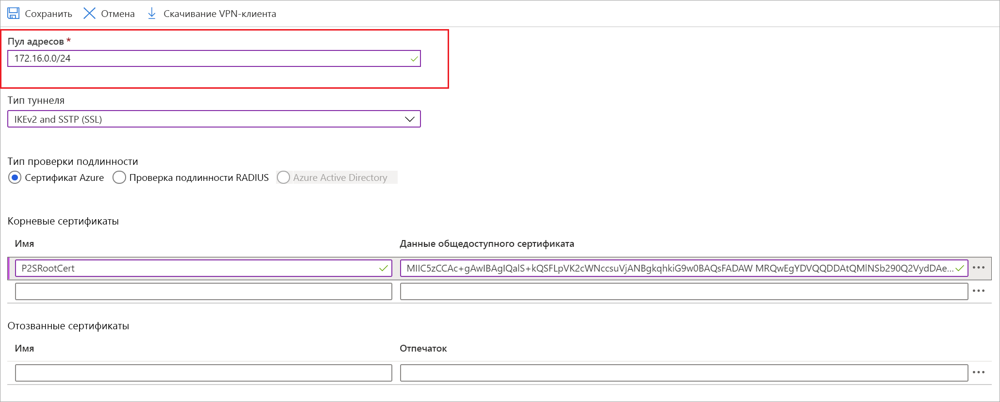
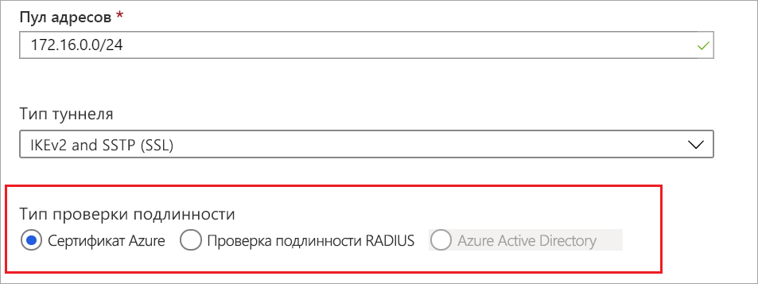
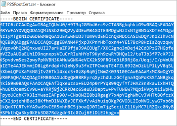
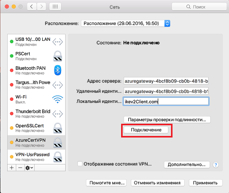

# <a name="configure-a-point-to-site-vpn-connection-to-a-vnet-using-native-azure-certificate-authentication-azure-portal"></a>Настройка VPN-подключения типа "точка — сеть" к виртуальной сети с помощью собственной аутентификации Azure Certificate: портал Azure

Эта статья поможет вам установить безопасное подключение отдельных клиентов под управлением Windows, Mac OS X или Linux к виртуальной сети Azure. VPN-подключения типа "точка — сеть" (P2S) эффективны для подключения к виртуальной сети из удаленного расположения, например, если вы дома или на конференции. Вы также можете использовать подключение "точка — сеть" вместо VPN-подключения "сеть — сеть" при наличии небольшого количества клиентов, которым требуется подключение к виртуальной сети. Для подключения типа "точка — сеть" не требуется VPN-устройство или общедоступный IP-адрес. Подключение "точка — сеть" — это VPN-подключение по протоколу SSTP (Secure Socket Tunneling Protocol) или IKEv2. См. дополнительные сведения о [VPN-подключениях "точка — сеть"](point-to-site-about.md).


## <a name="architecture"></a>Architecture

Для собственной аутентификации Azure на основе сертификата при подключениях "точка — сеть" необходимы следующие компоненты, которые можно настроить в этом руководстве:

* VPN-шлюз с маршрутизацией на основе маршрутов.
* Открытый ключ (CER-файл) для корневого сертификата, импортированный в Azure. Сразу после передачи сертификат считается доверенным сертификатом и используется для проверки подлинности.
* Сертификат клиента, созданный на основе корневого сертификата. Сертификат клиента, установленный на каждом клиентском компьютере, который будет подключен к виртуальной сети. Этот сертификат используется для проверки подлинности клиента.
* Конфигурация VPN-клиента. Файлы конфигурации VPN-клиента содержат информацию, необходимую для подключения клиента к виртуальной сети. Эти файлы позволяют настроить существующий VPN-клиент, предоставляемый в операционной системе. Перед подключением каждый клиент нужно настроить, используя параметры в файлах конфигурации.

#### <a name="example-values"></a><a name="example"></a>Примеры значений

Следующие значения можно использовать для создания тестовой среды или для лучшего понимания примеров в этой статье.

* **Имя виртуальной сети:** VNet1
* **Адресное пространство:** 10.1.0.0/16<br>В этом примере мы используем только одно адресное пространство, но для виртуальной сети можно настроить несколько.
* **Имя подсети:** Интерфейса
* **Диапазон адресов подсети:** 10.1.0.0/24.
* **Подписка**. Если у вас есть несколько подписок, убедитесь, что используется правильная.
* **Группа ресурсов:** TestRG1
* **Расположение:** Восточная часть США
* **GatewaySubnet:** 10.1.255.0/27<br>
* **Имя шлюза виртуальной сети:** VNet1GW
* **Тип шлюза:** ЧЕРЕЗ
* **Тип VPN:** На основе маршрутов
* **Имя общедоступного IP-адреса:** VNet1GWpip
* **Тип подключения:** "точка — сеть"
* **Пул адресов клиента:** 172.16.201.0/24<br>VPN-клиенты, подключающиеся к виртуальной сети с помощью этого подключения типа "точка — сеть", получают IP-адреса из пула адресов клиента.

## <a name="1-create-a-virtual-network"></a><a name="createvnet"></a>1. Создание виртуальной сети

Прежде чем начать, убедитесь в том, что у вас есть подписка Azure. Если у вас еще нет подписки Azure, вы можете активировать преимущества для [подписчиков MSDN](https://azure.microsoft.com/pricing/member-offers/msdn-benefits-details) или зарегистрироваться для использования [бесплатной учетной записи](https://azure.microsoft.com/pricing/free-trial).
[!INCLUDE [Basic Point-to-Site VNet](../../includes/vpn-gateway-basic-vnet-rm-portal-include.md)]

## <a name="2-create-a-virtual-network-gateway"></a><a name="creategw"></a>2. Создание шлюза виртуальной сети

На этом шаге вы создадите шлюз для своей виртуальной сети. Создание шлюза часто занимает 45 минут и более, в зависимости от выбранного SKU шлюза.

>[!NOTE]
>Базовый номер SKU шлюза не поддерживает проверку подлинности IKEv2 или RADIUS. Если вы планируете подключение клиентов Mac к виртуальной сети, не используйте SKU "базовый".
>

[!INCLUDE [About gateway subnets](../../includes/vpn-gateway-about-gwsubnet-portal-include.md)]

[!INCLUDE [Create a gateway](../../includes/vpn-gateway-add-gw-rm-portal-include.md)]

## <a name="3-generate-certificates"></a><a name="generatecert"></a>3. Создание сертификатов

Сертификаты используются в Azure для проверки подлинности клиентов, подключающихся к виртуальной сети с помощью подключения "точка — сеть". После получения корневого сертификата необходимо [отправить](#uploadfile) сведения об открытом ключе в Azure. После этого действия корневой сертификат считается "доверенным" в Azure для подключения к виртуальной сети через подключение типа "точка — сеть". Необходимо также создать сертификат клиента на основе доверенного корневого сертификата, а затем установить их на каждом клиентском компьютере. Сертификат клиента используется для проверки подлинности клиента, когда он инициирует подключение к виртуальной сети. 

### <a name="1-obtain-the-cer-file-for-the-root-certificate"></a><a name="getcer"></a>1. получите CER файл для корневого сертификата.

[!INCLUDE [root-certificate](../../includes/vpn-gateway-p2s-rootcert-include.md)]

### <a name="2-generate-a-client-certificate"></a><a name="generateclientcert"></a>2. Создание сертификата клиента

[!INCLUDE [generate-client-cert](../../includes/vpn-gateway-p2s-clientcert-include.md)]

## <a name="4-add-the-client-address-pool"></a><a name="addresspool"></a>4. Добавление пула адресов клиента

Пул адресов клиента представляет собой диапазон частных IP-адресов, указанных вами. Клиенты, которые подключаются через подключение типа "точка — сеть", динамически получают IP-адреса из этого диапазона. Используйте диапазон частных IP-адресов, не пересекающихся с локальным расположением, из которого будет выполняться подключение, или виртуальной сетью, к которой вы хотите подключиться. Если вы настроили несколько протоколов и SSTP является одним из протоколов, настроенный пул адресов разбивается между настроенными протоколами одинаково.

1. После создания шлюза виртуальной сети перейдите к разделу **Параметры** на странице шлюза виртуальной сети. В разделе **Параметры** выберите Конфигурация " **точка — сеть**". Щелкните **настроить сейчас** , чтобы открыть страницу Конфигурация.

   
2. На странице **Конфигурация "точка — сеть** " можно настроить различные параметры. Если на этой странице не отображается тип туннеля или тип проверки подлинности, то шлюз использует номер SKU "базовый". SKU "Базовый" не поддерживает проверку подлинности IKEv2 и RADIUS. Если вы хотите использовать эти параметры, необходимо удалить и повторно создать шлюз, используя другой SKU шлюза.

   [](./media/vpn-gateway-howto-point-to-site-resource-manager-portal/certificate-settings-expanded.png#lightbox)
3. В поле **пул адресов** добавьте диапазон частных IP-адресов, который вы хотите использовать. VPN-клиенты динамически получают IP-адрес из указанного вами диапазона. Минимальная маска подсети — 29 бит для активных и пассивных и 28-битных конфигураций для активной/активной конфигурации.
4. Перейдите к следующему разделу, чтобы настроить тип туннеля.

## <a name="5-configure-tunnel-type"></a><a name="tunneltype"></a>5. Настройка типа туннеля

Вы можете выбрать тип туннеля. Параметры туннеля: Опенвпн, SSTP и IKEv2.

* Для подключения клиент strongSwan в Android и Linux и собственный VPN-клиент IKEv2 в iOS и OSX используют только туннель IKEv2.
* Клиенты Windows пытаются сначала использовать IKEv2, а если это не подключается, они будут возвращаться к SSTP.
* Клиент Опенвпн можно использовать для подключения к типу туннеля Опенвпн.


## <a name="6-configure-authentication-type"></a><a name="authenticationtype"></a>6. Настройка типа проверки подлинности

В качестве **типа проверки подлинности**выберите **сертификат Azure**.

  

## <a name="7-upload-the-root-certificate-public-certificate-data"></a><a name="uploadfile"></a>7. Отправка данных открытого сертификата корневого сертификата

Всего вы можете отправить до 20 дополнительных доверенных корневых сертификатов. После отправки общедоступных данных сертификата Azure сможет использовать их для проверки подлинности клиентов, на которых установлен клиентский сертификат, созданный из доверенного корневого сертификата. Отправьте сведения об открытом ключе корневого сертификата в Azure.

1. Сертификаты добавляются на страницу **Point-to-site configuration** (Конфигурация "точка — сеть") в колонку **Корневой сертификат**.
2. Корневой сертификат необходимо экспортировать в виде CER-файла X.509 в кодировке Base64. Это позволит открыть сертификат в текстовом редакторе.
3. Откройте сертификат в текстовом редакторе, например в блокноте. При копировании данных сертификата обязательно скопируйте текст как одну непрерывную строку без символов возврата каретки и перевода строки. Может потребоваться изменить параметры представления в текстовом редакторе, чтобы показать символы или показать все знаки и просмотреть символы возврата каретки и перевода строки. Скопируйте только указанный ниже раздел как одну непрерывную строку.

   
4. Вставьте данные сертификата в поле **Данные общедоступного сертификата**. Присвойте сертификату **имя** и нажмите кнопку **сохранить**. Вы можете добавить до 20 доверенных корневых сертификатов.

   
5. Выберите **сохранить** в верхней части страницы, чтобы сохранить все параметры конфигурации.

   

## <a name="8-install-an-exported-client-certificate"></a><a name="installclientcert"></a>8. Установка экспортированного сертификата клиента

Если вы хотите создать подключение типа "точка — сеть" на клиентском компьютере, отличном от того, который использовался для создания сертификатов клиентов, необходимо установить сертификат клиента. При установке сертификата клиента потребуется пароль, созданный при экспорте сертификата клиента.

Убедитесь, что сертификат клиента был экспортирован как PFX-файл вместе со всей цепочкой сертификатов (это значение по умолчанию). В противном случае данные корневого сертификата будут отсутствовать на клиентском компьютере и клиент не сможет пройти проверку должным образом.

Дополнительные сведения см. в руководстве по [установке сертификата клиента](point-to-site-how-to-vpn-client-install-azure-cert.md).

## <a name="9-generate-and-install-the-vpn-client-configuration-package"></a><a name="clientconfig"></a>9. Создание и установка пакета конфигурации VPN-клиента

Файлы конфигурации VPN-клиента содержат параметры для настройки устройств, которые подключаются к виртуальной сети с использованием подключения "точка — сеть". Дополнительные сведения см. в инструкциях по [созданию и установке файлов конфигурации VPN-клиента для собственной аутентификации Azure на основе сертификата при подключениях "точка — сеть"](point-to-site-vpn-client-configuration-azure-cert.md).

## <a name="10-connect-to-azure"></a><a name="connect"></a>10. подключение к Azure

### <a name="to-connect-from-a-windows-vpn-client"></a>Подключение из VPN-клиента для Windows

>[!NOTE]
>Вам потребуются права администратора для клиентского компьютера Windows, с которого устанавливается подключение.
>
>

1. Чтобы подключиться к виртуальной сети, откройте VPN-подключения на клиентском компьютере и найдите созданное VPN-подключение. Его имя совпадает с названием вашей виртуальной сети. Выберите **Подключиться**. Может появиться всплывающее сообщение об использовании сертификата. Выберите **продолжить** , чтобы использовать повышенные привилегии.

2. На странице состояния **подключения** щелкните **Подключить**. При отображении экрана **Выбор сертификата** убедитесь, что отображается именно тот сертификат клиента, который предполагается использовать для соединения. Если это не так, используйте стрелку раскрывающегося списка, чтобы выбрать правильный сертификат, а затем нажмите кнопку **ОК**.

   
3. Теперь подключение установлено.

   

#### <a name="troubleshoot-windows-p2s-connections"></a>Устранение неполадок с подключением Windows типа "точка — сеть"

[!INCLUDE [verifies client certificates](../../includes/vpn-gateway-certificates-verify-client-cert-include.md)]

### <a name="to-connect-from-a-mac-vpn-client"></a>Подключение из VPN-клиента для Mac

В диалоговом окне сеть найдите профиль клиента, который вы хотите использовать, укажите параметры из [файл vpnsettings. XML](point-to-site-vpn-client-configuration-azure-cert.md#installmac)и нажмите кнопку **подключить**.

Ознакомьтесь с подробными инструкциями в разделе [Установка Mac (OS X)](https://docs.microsoft.com/azure/vpn-gateway/point-to-site-vpn-client-configuration-azure-cert#installmac). Если у вас возникают неполадки подключения, убедитесь, что шлюз виртуальной сети не использует SKU "Базовый". SKU "Базовый" не поддерживается для клиентов Mac.

  

## <a name="to-verify-your-connection"></a><a name="verify"></a>Проверка подключения

Эти инструкции применимы к клиентам Windows.

1. Чтобы проверить, активно ли VPN-подключение, откройте окно командной строки от имени администратора и выполните команду *ipconfig/all*.
2. Просмотрите результаты. Обратите внимание, что полученный вами IP-адрес — это один из адресов в пуле адресов VPN-клиента подключения "точка–cеть", указанном в конфигурации. Вы должны увидеть результат, аналогичный приведенному ниже.

   ```
   PPP adapter VNet1:
      Connection-specific DNS Suffix .:
      Description.....................: VNet1
      Physical Address................:
      DHCP Enabled....................: No
      Autoconfiguration Enabled.......: Yes
      IPv4 Address....................: 172.16.201.3(Preferred)
      Subnet Mask.....................: 255.255.255.255
      Default Gateway.................:
      NetBIOS over Tcpip..............: Enabled
   ```

## <a name="to-connect-to-a-virtual-machine"></a><a name="connectVM"></a>Подключение к виртуальной машине

Эти инструкции применимы к клиентам Windows.

[!INCLUDE [Connect to a VM](../../includes/vpn-gateway-connect-vm-p2s-include.md)]

## <a name="to-add-or-remove-trusted-root-certificates"></a><a name="add"></a>Добавление и удаление доверенного корневого сертификата

Вы можете добавлять доверенные корневые сертификаты в Azure, а также удалять их из Azure. При удалении корневого сертификата клиенты, использующие сертификат, созданный из этого корневого сертификата, не смогут пройти проверку подлинности и поэтому не смогут подключиться. Чтобы клиенты могли проходить аутентификацию и подключаться, необходимо установить новый сертификат клиента, созданный на основе корневого сертификата, который является доверенным для Azure (то есть он передан в Azure).

### <a name="to-add-a-trusted-root-certificate"></a>Добавление доверенного корневого сертификата

В Azure можно добавить до 20 CER-файлов доверенных корневых сертификатов. Дополнительные сведения см. в разделе [Отправка доверенного корневого сертификата](#uploadfile) в этой статье.

### <a name="to-remove-a-trusted-root-certificate"></a>Удаление доверенного корневого сертификата

1. Чтобы удалить доверенный корневой сертификат, перейдите на страницу **Point-to-site configuration** (Конфигурация "точка — сеть") вашего шлюза виртуальной сети.
2. В разделе страницы**Root certificate** (Корневой сертификат) найдите сертификат, который требуется удалить.
3. Нажмите кнопку с многоточием рядом с сертификатом и выберите Удалить.

## <a name="to-revoke-a-client-certificate"></a><a name="revokeclient"></a>Отзыв сертификата клиента

Можно отозвать сертификаты клиента. Список отзыва сертификатов позволяет выборочно запрещать подключение типа "точка-сеть" на основе отдельных сертификатов клиента. Эта процедура отличается от удаления доверенного корневого сертификата. При удалении доверенного корневого сертификата (CER-файл) из Azure будет запрещен доступ для всех сертификатов клиента, созданных на основе отозванного корневого сертификата или подписанных им. Отзыв сертификата клиента, а не корневого сертификата, позволяет по-прежнему использовать другие сертификаты, созданные на основе корневого сертификата, для проверки подлинности.

Обычно корневой сертификат используется для управления доступом на уровнях группы или организации, а отозванный сертификат клиента — для точного контроля доступа для отдельных пользователей.

### <a name="revoke-a-client-certificate"></a>Отзыв сертификата клиента

Вы можете отозвать сертификат клиента, добавив отпечаток в список отзыва.

1. Получите отпечаток сертификата клиента. Дополнительные сведения см. в разделе [Получение отпечатка сертификата](https://msdn.microsoft.com/library/ms734695.aspx).
2. Скопируйте данные в текстовый редактор и удалите все пробелы, чтобы предоставить отпечаток в виде непрерывной строки.
3. Перейдите к странице шлюза виртуальной сети **Point-to-site-configuration** (Конфигурация "точка — сеть"). Это та же колонка, которая использовалась для [отправки доверенного корневого сертификата](#uploadfile).
4. В разделе **Отозванные сертификаты** введите понятное имя сертификата (это не должно быть общее имя).
5. Скопируйте и вставьте строку отпечатка в поле **Отпечаток**.
6. Отпечаток будет проверен и автоматически добавлен в список отзыва. На экране появится сообщение о том, что список обновляется. 
7. После применения изменений сертификат больше не будет использоваться для подключения. Клиенты, пытающиеся подключиться с помощью этого сертификата, получат сообщение, что он недействителен.

## <a name="point-to-site-faq"></a><a name="faq"></a>Часто задаваемые вопросы о подключениях типа "точка — сеть"

[!INCLUDE [Point-to-Site FAQ](../../includes/vpn-gateway-faq-p2s-azurecert-include.md)]

## <a name="next-steps"></a>Дальнейшие шаги
Установив подключение, можно добавить виртуальные машины в виртуальные сети. Дополнительные сведения о виртуальных машинах см. [здесь](https://docs.microsoft.com/azure/). Дополнительные сведения о сетях и виртуальных машинах см. в статье [Azure и Linux: обзор сетей виртуальных машин](../virtual-machines/linux/azure-vm-network-overview.md).

Дополнительные сведения см. в руководстве по [устранению неполадок подключения типа "точка — сеть" в Azure](vpn-gateway-troubleshoot-vpn-point-to-site-connection-problems.md).
