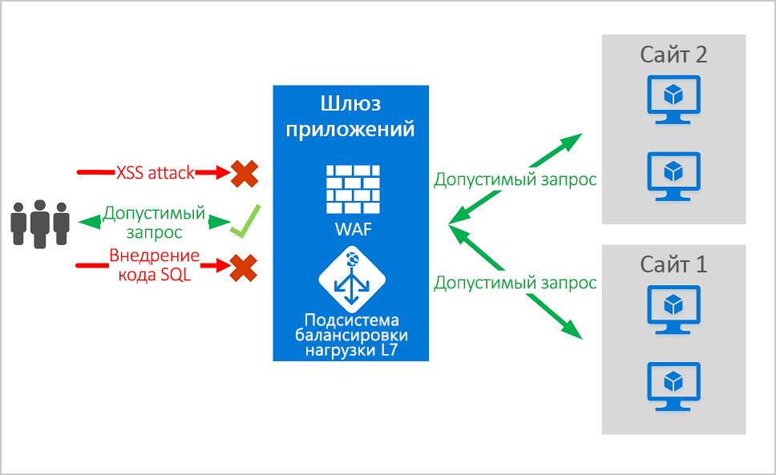
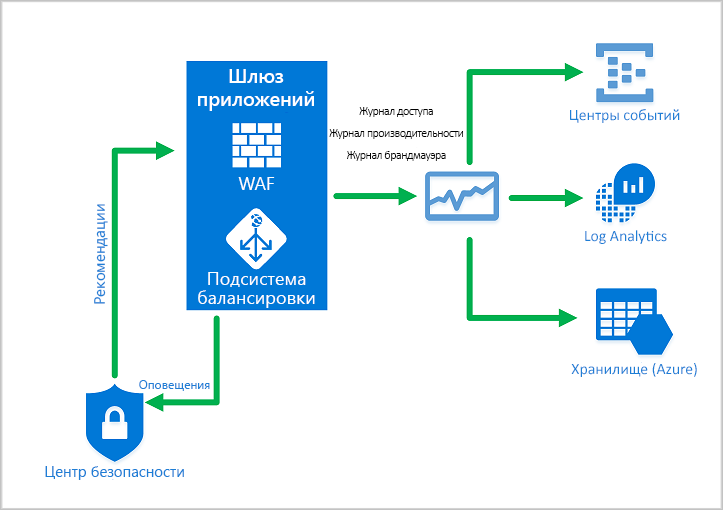
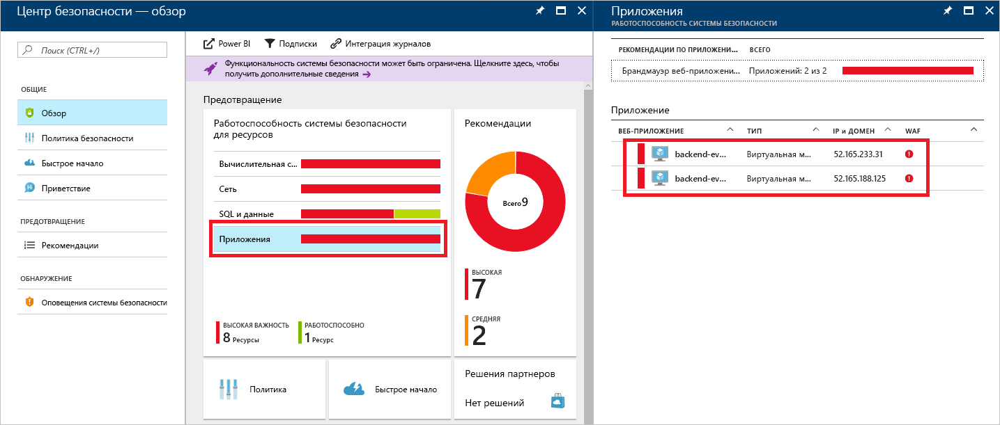
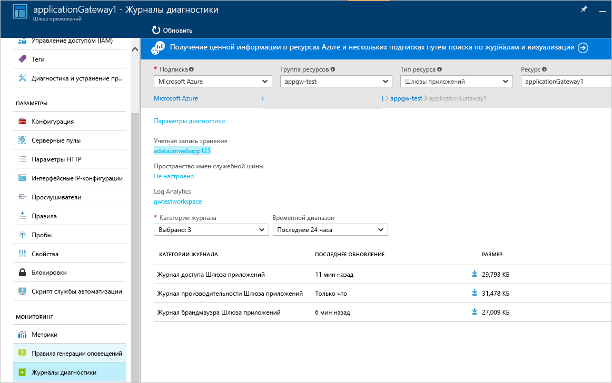

# <a name="azure-web-application-firewall-on-azure-application-gateway"></a>Подробные сведения о брандмауэре веб-приложения Azure в Шлюзе приложений Azure

Брандмауэр веб-приложения (WAF) Azure в Шлюзе веб-приложений Azure обеспечивает централизованную защиту веб-приложений от распространенных эксплойтов и уязвимостей. Веб-приложения все чаще подвергаются вредоносным атакам, использующим общеизвестные уязвимости. Наиболее распространенными атаками являются внедрение SQL и использование межсайтовых скриптов.

Брандмауэр веб-приложения в Шлюзе приложений основан на [основном наборе правил](https://www.owasp.org/index.php/Category:OWASP_ModSecurity_Core_Rule_Set_Project) версий 3.1, 3.0 или 2.2.9 из OWASP (открытого проекта безопасности веб-приложений). WAF автоматически обновляется, чтобы применять защиту от новых уязвимостей, и для этого не требуется дополнительных настроек. 

Все перечисленные ниже функции WAF определяются в политике WAF. Вы можете создать несколько политик и связать их со Шлюзом приложений, отдельными прослушивателями или правилами маршрутизации на основе пути в Шлюзе приложений. Это позволяет применять отдельные политики для каждого сайта, расположенного за Шлюзом приложений, если это потребуется. Дополнительные сведения о политиках WAF см. в статье [о создании политик WAF](create-waf-policy-ag.md).

   > [!NOTE]
   > Политики WAF для отдельных сайтов и отдельных URI предоставляются в общедоступной предварительной версии. Это означает, что на них распространяются дополнительные условия использования корпорации Майкрософт. Дополнительные сведения см. в статье [Дополнительные условия использования предварительных выпусков Microsoft Azure](https://azure.microsoft.com/support/legal/preview-supplemental-terms/).



Шлюз приложений функционирует как контроллер доставки приложений. Он предоставляет функции точки подключения SSL, сходства сеансов на основе файлов cookie, распределения нагрузки по методу циклического перебора, маршрутизации на основе содержимого, размещения нескольких веб-сайтов и улучшения безопасности.

Для улучшения безопасности Шлюз приложений предоставляет управление политиками SSL и поддержку сквозного режима SSL-подключений. Безопасность приложений усиливается интеграцией WAF со Шлюзом приложений. Такое сочетание позволяет защитить веб-приложения от распространенных уязвимостей. Также вы получите простое в настройке централизованное расположение для функций управления.

## <a name="benefits"></a>Преимущества

В этом разделе описываются основные преимущества, которые предоставляет WAF в Шлюзе приложений.

### <a name="protection"></a>Защита

* Защита веб-приложений от сетевых уязвимостей и атак без изменений кода серверной части.

* Одновременная защита нескольких веб-приложений. Один экземпляр Шлюза приложений может содержать до 40 веб-сайтов, защищенных брандмауэром веб-приложения.

* Создание настраиваемых политик WAF для нескольких сайтов под защитой одного WAF 

* Защита веб-приложений от вредоносных ботов с помощью набора правил репутации IP-адресов (предварительная версия)

### <a name="monitoring"></a>Мониторинг

* Отслеживайте атаки на веб-приложения с помощью журнала WAF в реальном времени. Этот журнал интегрирован с [Azure Monitor](../../azure-monitor/overview.md), что позволяет отслеживать оповещения WAF и тенденции.

* WAF в Шлюзе приложений интегрируется с Центром безопасности Azure. Центр безопасности предоставляет централизованное представление о состоянии безопасности для всех ресурсов в Azure.

### <a name="customization"></a>Настройка

* Настройте правила и группы правил WAF в соответствии с требованиями приложения, чтобы уменьшить число ложноположительных результатов.

* Свяжите политику WAF с каждым сайтом, защищенным WAF, чтобы использовать индивидуальные конфигурации для сайтов.

* Создайте настраиваемые правила в соответствии с потребностями приложения.

## <a name="features"></a>Функции

- Защита от внедрения кода SQL
- Защита от межсайтовых сценариев.
- Защита от других распространенных сетевых атак, в том числе от внедрения команд, несанкционированных HTTP-запросов, разделения HTTP-запросов и включения удаленного файла.
- Защита от нарушений протокола HTTP.
- Защита от аномалий протокола HTTP, например отсутствия агента пользователя узла и заголовков accept.
- Защита от программ-обходчиков и сканеров.
- Обнаружение распространенных неправильных конфигураций приложений (например, Apache и IIS).
- Настраиваемые ограничения размера запроса с нижней и верхней границами.
- Списки исключений позволяют исключать некоторые атрибуты запроса из проверки WAF. Распространенный пример — добавленные токены Active Directory, которые используются для проверки подлинности или полей пароля.
- Создайте настраиваемые правила в соответствии с конкретными потребностями приложения.
- Примените географическую фильтрацию трафика, чтобы разрешать или запрещать доступ к приложениям из определенных стран. (предварительная версия)
- Защитите веб-приложения от ботов с помощью набора правил для предотвращения использования ботов. (предварительная версия)

## <a name="waf-policy"></a>Политика WAF

Чтобы включить брандмауэр веб-приложения в Шлюзе приложений, необходимо создать политику WAF. Именно политика определяет все управляемые правила, пользовательские правила, исключения и другие настройки, например ограничения на передачу файлов. 

### <a name="core-rule-sets"></a>Основные наборы правил

Шлюз приложений поддерживает три стандарта для набора правил: CRS 3.1, CRS 3.0 и CRS 2.2.9. Эти правила защищают веб-приложения от вредоносных действий.

Дополнительные сведения см. в статье о [правилах и группах правил CRS для брандмауэра веб-приложения](application-gateway-crs-rulegroups-rules.md).

### <a name="custom-rules"></a>Настраиваемые правила

Кроме того, Шлюз приложений поддерживает пользовательские правила. С помощью пользовательские правил вы можете создать собственные правила, которые оцениваются для каждого запроса, проходящего через WAF. Эти правила имеют более высокий приоритет, чем любые правила из управляемых наборов правил. Если выполняется указанный набор условий, применяется соответствующее действие (разрешение или блокировка). 

Дополнительные сведения см. в статье [о пользовательских правилах для Шлюза приложений](custom-waf-rules-overview.md).

### <a name="bot-mitigation-preview"></a>Защита от ботов (предварительная версия)

Вы можете включить управляемый набор правил защиты от ботов, чтобы WAF блокировал или сохранял в журнал запросы от известных вредоносных IP-адресов параллельно с работой управляемого набора правил. Эти IP-адреса передаются из канала Microsoft Threat Intelligence. Intelligent Security Graph поддерживает Microsoft Threat Intelligence и используется во множестве служб, включая Центр безопасности Azure.

> [!NOTE]
> Сейчас набор правил защиты от ботов предоставляется в общедоступной предварительной версии и поддерживается соглашением об уровне обслуживания для предварительной версии. Некоторые функции могут не поддерживаться или их возможности могут быть ограничены. См. [дополнительные условия использования для предварительных версий Microsoft Azure](https://azure.microsoft.com/support/legal/preview-supplemental-terms/).

Если включена защита от ботов, входящие запросы с известных IP-адресов вредоносных ботов регистрируются в журнале брандмауэра. Дополнительные сведения об этом см. ниже. Доступ к журналам WAF можно получить через учетную запись хранения, концентратор событий или Log Analytics. 

### <a name="waf-modes"></a>Режимы WAF

WAF Шлюза приложений можно настроить для работы в следующих двух режимах.

* **Режим обнаружения**. Отслеживает и регистрирует все оповещения об угрозах. Ведение журнала диагностики для Шлюза приложений можно включить в разделе **Диагностика**. Кроме того, нужно убедиться, что выбран и включен параметр ведения журнала WAF. Брандмауэр веб-приложения не блокирует входящие запросы, когда он работает в режиме обнаружения.
* **Режим предотвращения**. Блокирует вторжения и атаки, обнаруженные правилами. Злоумышленник получает сообщение "403 unauthorized access" (несанкционированный доступ) и такое подключение прерывается. В режиме предотвращения подобные атаки также заносятся в журналы WAF.

> [!NOTE]
> После развертывания WAF в рабочей среде мы рекомендуем на непродолжительный период запускать его в режиме обнаружения. Это позволит получить [журналы брандмауэра](../../application-gateway/application-gateway-diagnostics.md#firewall-log) и скорректировать исключения и (или) [пользовательские правила](./custom-waf-rules-overview.md) до перехода в режим предотвращения. Так вы снизите вероятность случайной блокировки трафика.

### <a name="anomaly-scoring-mode"></a>Режим оценки аномалий

OWASP использует два режима для принятия решений о блокировке трафика: традиционный режим и режим оценки аномалий.

В традиционном режиме трафик, который соответствует любому правилу, оценивается независимо от других совпадений с правилами. Это очень простой для понимания режим. Но его полезность ограничивается отсутствием сведений о том, скольким правилам соответствует каждый запрос. Для устранения этой проблемы добавлен режим оценки аномалий. Он используется по умолчанию в OWASP 3.*x*.

В режиме оценки аномалий трафик, соответствующий любому правилу, не блокируется сразу, если брандмауэр работает в режиме предотвращения. Для каждого правила определен уровень серьезности: *Критический*, *Ошибка*, *Предупреждение* или *Уведомление*. Это значение серьезности влияет на числовое значение "Оценка аномалии", которое присваивается каждому запросу. Например, при каждом совпадении с правилом уровня *Предупреждение* эта оценка повышается на 3. А при совпадении с правилом уровня *Критический* добавляется значение 5.

|Уровень серьезности  |Значение  |
|---------|---------|
|критические ошибки.     |5|
|Ошибка        |4\.|
|Предупреждение      |3|
|Уведомление       |2|

Чтобы оценка аномалии привела к блокировке трафика, она должна достигнуть порогового значения 5. Это означает, что достаточно одного совпадения с правилом уровня *Критический*, чтобы WAF на Шлюзе приложений заблокировал запрос в режиме предотвращения. Но одно совпадение с правилом уровня *Предупреждение* увеличивает оценку аномалии только на 3, и этого недостаточно для блокировки трафика.

> [!NOTE]
> Если трафик соответствует любому правилу WAF, в журнал заносится действие Blocked (Заблокировано). Но реальный трафик блокируется только в том случае, если оценка аномалии достигнет значения 5 или выше.  

### <a name="waf-monitoring"></a>Мониторинг WAF

Важно наблюдение за работоспособностью шлюза приложений. Мониторинг работоспособности WAF и приложений, которые он защищает, обеспечивается интеграцией с Azure Monitor, центром безопасности Azure и журналами Azure Monitor.



#### <a name="azure-monitor"></a>Azure Monitor

Журналы Шлюза приложений интегрированы с [Azure Monitor](../../azure-monitor/overview.md). Это позволяет отслеживать диагностические сведения, включая журналы и оповещения WAF. Вы можете применить эту возможность на вкладке **Диагностика** для ресурса Шлюза приложений на портале или напрямую через службу Azure Monitor. Дополнительные сведения см. в статье о [диагностике для Шлюза приложений](../../application-gateway/application-gateway-diagnostics.md).

#### <a name="azure-security-center"></a>Центр безопасности Azure

[Центр безопасности](../../security-center/security-center-intro.md) позволяет предотвращать, обнаруживать угрозы и реагировать на них. Он обеспечивает более высокую осведомленность о безопасности ресурсов Azure и контроль над ними. Шлюз приложений [интегрируется с Центром безопасности](../../application-gateway/application-gateway-integration-security-center.md). Центр безопасности проверяет среду для обнаружения незащищенных веб-приложений. Он может передать в WAF в Шлюзе приложений рекомендации по защите обнаруженных уязвимых ресурсов. Брандмауэры создаются непосредственно в Центре безопасности. Эти экземпляры WAF интегрируются с Центром безопасности. Они отправляют оповещения и сведения о работоспособности в Центр безопасности для создания отчетов.



#### <a name="azure-sentinel"></a>Azure Sentinel

Microsoft Azure Sentinel — это масштабируемое ориентированное на облако решение для управления информационной безопасностью и событиями безопасности (SIEM), а также для автоматического ответа с помощью оркестрации операций защиты. Azure Sentinel обеспечивает интеллектуальные средства для анализа данных безопасности и аналитику угроз по всему предприятию, предоставляя единое решение для обнаружения предупреждений, видимости угроз, упреждающего поиска и реагирования на угрозы.

С помощью встроенной книги событий брандмауэра Azure WAF вы можете получить общие сведения о событиях безопасности для WAF. В книге сохраняются события, примененные правила и блокировки, а также все данные, которые записываются в журналы брандмауэра. Дополнительные сведения о ведении журналов см. ниже. 


#### <a name="logging"></a>Ведение журналов

WAF в Шлюзе приложений предоставляет подробные отчеты о каждой из обнаруженных угроз. Функция ведения журналов интегрирована с журналами агента "Диагностика Azure". Оповещения сохраняются в формате JSON. Эти журналы можно интегрировать с [журналами Azure Monitor](../../azure-monitor/insights/azure-networking-analytics.md).



```json
{
  "resourceId": "/SUBSCRIPTIONS/{subscriptionId}/RESOURCEGROUPS/{resourceGroupId}/PROVIDERS/MICROSOFT.NETWORK/APPLICATIONGATEWAYS/{appGatewayName}",
  "operationName": "ApplicationGatewayFirewall",
  "time": "2017-03-20T15:52:09.1494499Z",
  "category": "ApplicationGatewayFirewallLog",
  "properties": {
    {
      "instanceId": "ApplicationGatewayRole_IN_0",
      "clientIp": "52.161.109.145",
      "clientPort": "0",
      "requestUri": "/",
      "ruleSetType": "OWASP",
      "ruleSetVersion": "3.0",
      "ruleId": "920350",
      "ruleGroup": "920-PROTOCOL-ENFORCEMENT",
      "message": "Host header is a numeric IP address",
      "action": "Matched",
      "site": "Global",
      "details": {
        "message": "Warning. Pattern match \"^[\\\\d.:]+$\" at REQUEST_HEADERS:Host ....",
        "data": "127.0.0.1",
        "file": "rules/REQUEST-920-PROTOCOL-ENFORCEMENT.conf",
        "line": "791"
      },
      "hostname": "127.0.0.1",
      "transactionId": "16861477007022634343"
      "policyId": "/subscriptions/1496a758-b2ff-43ef-b738-8e9eb5161a86/resourceGroups/drewRG/providers/Microsoft.Network/ApplicationGatewayWebApplicationFirewallPolicies/globalWafPolicy",
      "policyScope": "Global",
      "policyScopeName": " Global "
    }
  }
} 

```

## <a name="application-gateway-waf-sku-pricing"></a>Цена на SKU для WAF шлюза приложений

Модели ценообразования для ценовых категорий SKU WAF_v1 и WAF_v2 имеют ряд отличий. Дополнительные сведения см. на странице [о ценах на Шлюз приложений](https://azure.microsoft.com/pricing/details/application-gateway/). 

## <a name="next-steps"></a>Дополнительная информация

- Начните работу с [создания политики WAF](create-waf-policy-ag.md).
- Дополнительные сведения об [управляемых правилах WAF](application-gateway-crs-rulegroups-rules.md).
- Дополнительные сведения о [настраиваемых правилах](custom-waf-rules-overview.md).
- Дополнительные сведения см. в статье [Брандмауэр веб-приложения в Azure Front Door](../afds/afds-overview.md)

