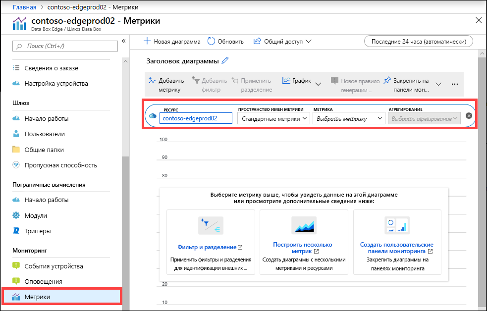
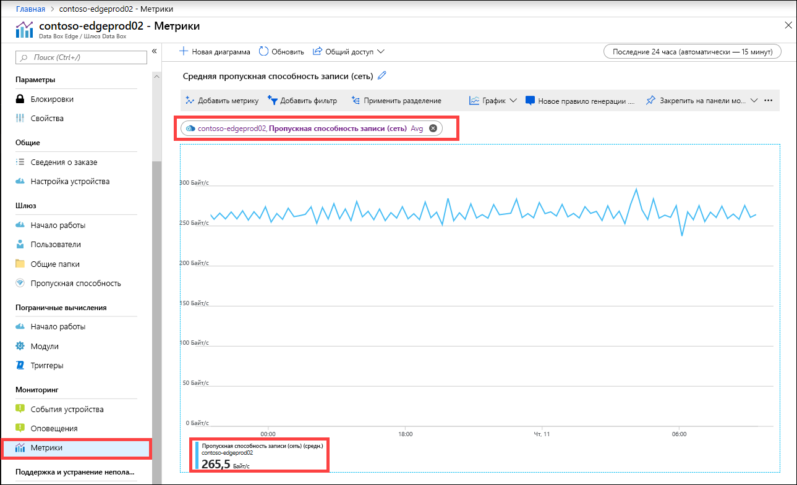
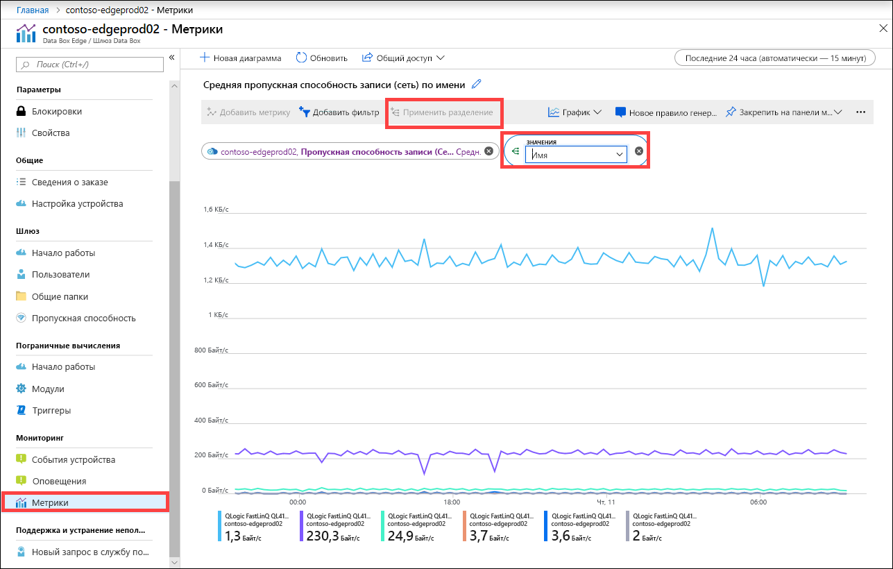

Кроме того, вы можете просматривать метрики для мониторинга производительности устройства и при необходимости устранять с их помощью неполадки.

Чтобы создать схему по выбранным метрикам устройства, выполните следующие действия на портале Azure:

1. На портале Azure откройте раздел **Мониторинг > Метрики** для нужного ресурса и щелкните **Добавить метрику**.

    

2. Ресурс указывается автоматически.  

    

    Чтобы указать другой ресурс, выберите его. В колонке **Выберите ресурс** выберите подписку, группу ресурсов, тип ресурса и конкретный ресурс, для которого вам нужно отобразить метрики, затем щелкните **Применить**.

    

3. В раскрывающемся списке выберите метрику для мониторинга устройства. Полный список этих метрик см. в разделе [Метрики вашего устройства](#metrics-on-your-device).

4. При выборе метрики из раскрывающегося списка вы можете дополнительно определить функцию статистической обработки. Статистическое выражение вычисляется по фактическому значению за указанный промежуток времени. В качестве статистического выражения можно выбрать среднее, минимальное или максимальное значение. Для поля "Статистическое выражение" выберите значение Avg, Max или Min.

    

5. Если к выбранной метрике относятся несколько экземпляров, можно разделить их. Выберите **Применить разделение** и выберите значение, по которому его нужно выполнить.

    

6. Теперь, если вам потребуется открыть распределение только для нескольких экземпляров, данные можно отфильтровать. Например, предположим, что вас интересует пропускная способность сети только для двух подключенных сетевых интерфейсов на вашем устройстве. Вы можете отфильтровать эти интерфейсы. Выберите **Добавить фильтр** и укажите имя сетевого интерфейса, который будете фильтровать.

    

7. Вы можете закрепить диаграмму на панели мониторинга для быстрого доступа к ней.

    

8. Чтобы экспортировать данные диаграммы в электронную таблицу Excel или получить ссылку, которая позволяет предоставить диаграмму другим пользователям, выберите элемент общего доступа на панели команд.

    
