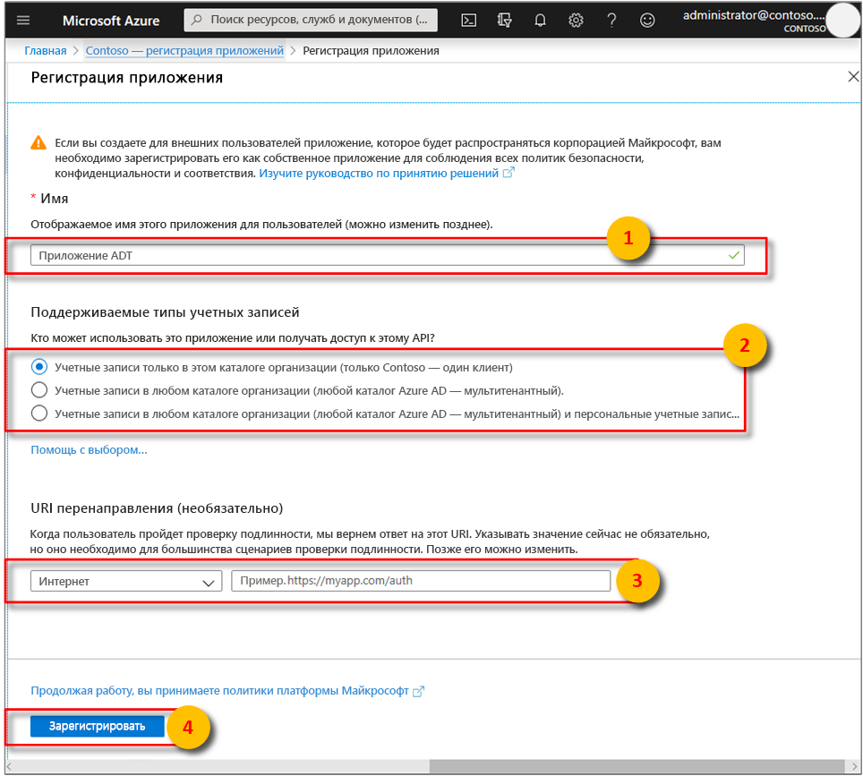
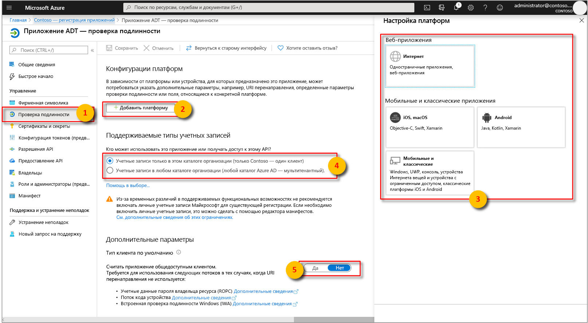
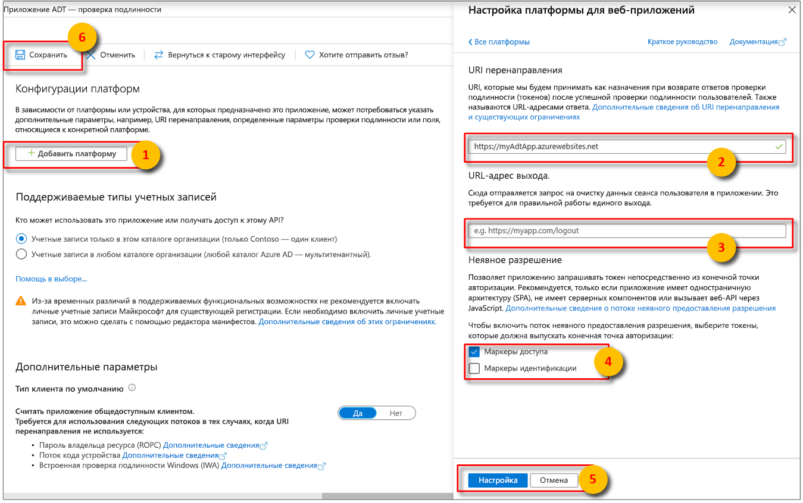

>[!NOTE]
>В этом разделе приводятся инструкции по [регистрации приложения Azure AD](https://docs.microsoft.com/azure/active-directory/develop/quickstart-register-app).

1. На [портале Azure](https://portal.azure.com) выберите **Azure Active Directory** в развертываемом меню слева, а затем откройте область **Регистрация приложений**. 

    

1. Нажмите кнопку **+ Новая регистрация**.

    

1. Задайте понятное имя для этой регистрации приложения в поле **Имя**. 

    1. Введите **в текстовое поле в разделе**URI перенаправления (необязательно)`https://microsoft.com`.     

    1. Проверьте, какие учетные записи и клиенты поддерживаются приложением Azure Active Directory.

    1. Выберите **Зарегистрировать**.

    

1. В колонке **Аутентификация** указаны важные параметры конфигурации аутентификации. 

    1. Добавьте **URI перенаправления** и настройте **Маркеры доступа**, выбрав **+ Add a platform** (+ Добавить платформу).

    1. Выберите **Да**, чтобы указать, что приложение является **общедоступным клиентом**.

    1. Проверьте, какие учетные записи и клиенты поддерживаются приложением Azure Active Directory.

    

1. Выбрав нужную платформу, настройте **URI перенаправления** и **Маркеры доступа** на боковой панели справа от пользовательского интерфейса.

    1. **URI перенаправления** должны соответствовать адресу, указанному в запросе аутентификации.

        * Для приложений, размещенных в локальной среде разработки, выберите **Public client (mobile & desktop)** (Общедоступный клиент (мобильный и классический)). Не забудьте задать для **общедоступного клиента** значение **Да**.
        * Для одностраничных приложений, размещенных в Службе приложений Azure, выберите **Интернет**.

    1. Определите, подходит ли **URL-адрес выхода**.

    1. Включите поток неявного предоставления разрешения, проверив **маркеры доступа** или **токены идентификатора**.
                
    

    Щелкните **Настроить**, а затем **Сохранить**.

1.  Откройте область **Обзор** зарегистрированного приложения и скопируйте значения следующих сущностей во временный файл. Эти значения будут использоваться для настройки примера приложения в следующих разделах.

    - **Application (client) ID** (Идентификатор приложения (клиент))
    - **Идентификатор каталога (клиент)**

    

1. Откройте область **Разрешения API** для регистрации приложения. Нажмите кнопку **+ Add a permission** (+ Добавить разрешение). В области **Запрос разрешений API** щелкните вкладку **Интерфейсы API, используемые моей организацией**, а затем выполните поиск по одному из следующих запросов:
    
    1. `Azure Digital Twins`. Выберите API **Azure Digital Twins**.

        

    1. Кроме того, можно выполнить поиск `Azure Smart Spaces Service`. Выберите API **Azure Smart Spaces Service**.

        

    > [!IMPORTANT]
    > Имя и идентификатор API Azure AD, которые будут отображаться, зависят от вашего клиента:
    > * Для тестовых клиентов и учетных записей клиентов следует искать `Azure Digital Twins`.
    > * Для других учетных записей Майкрософт следует искать `Azure Smart Spaces Service`.

1. Выбранный API появится как **Azure Digital Twins** в той же области **Запрос разрешений API**. Выберите параметр **Чтение** из раскрывающегося списка, а затем установите флажок **Read.Write**. Нажмите кнопку **Add permissions** (Добавить разрешения).

    

1. В зависимости от параметров вашей организации вам может потребоваться предпринять дополнительные шаги для предоставления доступа администратора к этому API. Для получения дополнительной информации обратитесь к администратору. Как только доступ администратора будет утвержден, в столбце **Admin Consent Required** (Требуется согласие администратора) в области **Разрешения API** будут отображаться ваши разрешения. 

    

    Проверьте, отображается ли **Azure Digital Twins**.
