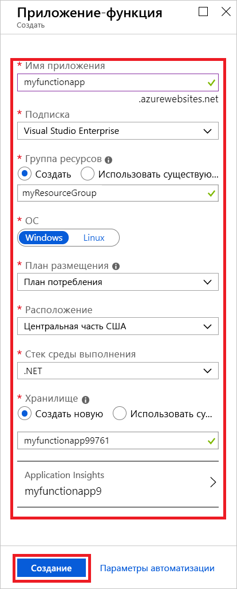

1. Нажмите кнопку **Создать ресурс** в верхнем левом углу портала Azure, а затем выберите **Вычисления** > **Приложение-функция**.

    

2. Используйте настройки приложения-функции, указанные в таблице под рисунком.

    

    | Параметр      | Рекомендуемое значение  | ОПИСАНИЕ                                        |
    | ------------ |  ------- | -------------------------------------------------- |
    | **Имя приложения** | Глобально уникальное имя | Имя, которое идентифицирует ваше новое приложение-функцию. Допустимые символы: `a-z`, `0-9` и `-`.  | 
    | **Подписка** | Ваша подписка | Подписка, в которой создано приложение-функция. | 
    | **[Группа ресурсов](../articles/azure-resource-manager/resource-group-overview.md)** |  myResourceGroup | Имя новой группы ресурсов, в которой создается приложение-функция. |
    | **ОС** | Windows | Бессерверное размещение в Linux доступно в предварительной версии. Дополнительные сведения см. [в этой обзорной статье](https://aka.ms/funclinux).|
    | **[План размещения](../articles/azure-functions/functions-scale.md)** | План потребления | План размещения, который определяет выделение ресурсов в приложении-функции. В **плане потребления** по умолчанию ресурсы добавляются динамически в соответствии с потребностями функций. При таком [бессерверном](https://azure.microsoft.com/overview/serverless-computing/) размещении вы платите только за время выполнения функций. Когда выполняется план службы приложений необходимо управлять [масштабированием приложения-функции](../articles/azure-functions/functions-scale.md).  |
    | **Местоположение.** | Западная Европа | Выберите ближайший [регион](https://azure.microsoft.com/regions/) или регион рядом с другими службами, к которому получают доступ ваши функции. |
    | **Стек среды выполнения** | Предпочитаемый язык | Выберите среду выполнения, которая поддерживает нужный функциональный язык программирования. Выберите **.NET** для функций C# и F#. |
    | **[Хранилище](../articles/storage/common/storage-quickstart-create-account.md)** |  Глобально уникальное имя |  Создайте учетную запись хранения для использования приложением-функцией. Имя учетной записи хранения должно содержать от 3 до 24 символов и состоять только из цифр и строчных букв. Можно также использовать существующую учетную запись при условии, что она соответствует [требованиям учетной записи хранилища](../articles/azure-functions/functions-scale.md#storage-account-requirements). |
    | **[Application Insights](../articles/azure-functions/functions-monitoring.md)** | значение по умолчанию | Создает ресурс Application Insights с таким же *именем приложения* в ближайшем поддерживаемом регионе. Развернув этот параметр, можно задать **новое имя ресурса** или выбрать другое **расположение** в [географическом регионе Azure](https://azure.microsoft.com/global-infrastructure/geographies/), где будут хранится данные. |

3. Выберите **Создать**, чтобы подготовить и развернуть приложение-функцию.

4. Выберите значок уведомления в правом верхнем углу портала. Вы должны увидеть сообщение **Развертывание выполнено**.

    

5. Выберите **Перейти к ресурсу** для просмотра нового приложения-функции. Можно также установить флажок **Закрепить на панели мониторинга**. Это упростит возвращение к этому ресурсу приложения-функции из панели мониторинга.
